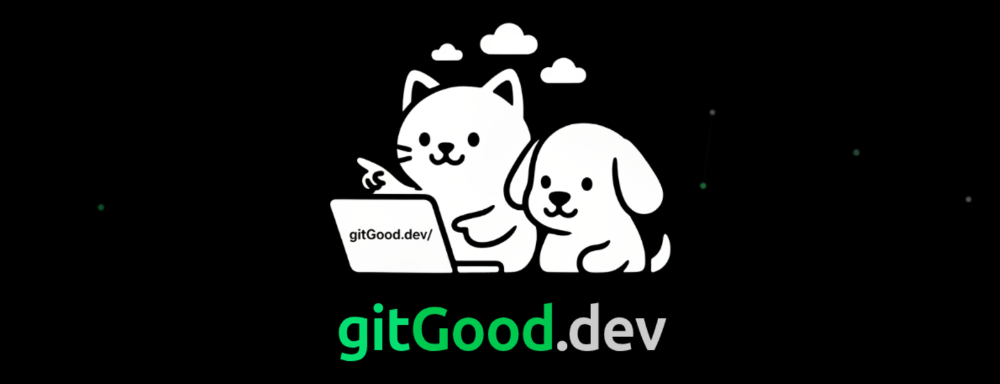

<!-- markdown="1" lets the documentation site render the markdown inside this
     centered block. GitHub ignores the attribute, so rendering there is unchanged. -->
<div align="center" markdown="1">

<a href="https://noblerworks.com/"></a>

### Built by [Patrick Wiloak](https://patrickwiloak.com) at [Nobler Works](https://noblerworks.com/)

We build custom software and products at Nobler Works. Open source projects and training like this one are our way of giving back - we're nothing without the community that supports us.<br>
If you need custom software built, [get in touch](https://noblerworks.com/).

[](https://noblerworks.com/)
[](https://x.com/Nobler_Works)
[](https://www.youtube.com/@NoblerWorks)
[](https://www.tiktok.com/@noblerworks)
[](https://www.threads.com/@noblerworks)

---

<a href="https://gitgood.dev"></a>

### 🚀 Like what you see? We built a whole platform for this.

**[gitGood.dev](https://gitgood.dev) is our flagship tech training platform - train for the role, not just the interview.**

Built for **every kind of technologist**, across 21 role-targeted learning paths. This repo gives you the material. gitGood gives you the reps, and tells you whether you actually know it.

[](https://gitgood.dev)

**$5/month** or **$40/year** after the trial. Free tier needs no card: 20 practice questions, the free coding challenges, streaks, achievements, and the job board.

<details class="promo" markdown="1">
<summary>What's inside gitGood.dev</summary>

**Roles** - backend, frontend, full-stack and mobile development, SRE and DevOps, platform engineering, cloud and solutions architecture, security engineering, machine learning and AI engineering, data science, data analytics, data engineering, QA and SDET, engineering management, product management, TPM, and new grads breaking into tech.

**Cloud certification practice exams** - 13 banks and 608 original scenario-style questions (never brain dumps), with per-domain scoring and a timed exam simulator: AWS Cloud Practitioner CLF-C02, Solutions Architect Associate SAA-C03 and Developer Associate DVA-C02; Azure AZ-900, AZ-104, AZ-305 and AI-900; Google Cloud Digital Leader and Associate Cloud Engineer; Kubernetes CKA and CKAD; CompTIA Security+; HashiCorp Terraform Associate.

**Everything else** - 1,950+ practice questions across 34 categories · coding challenges with real sandboxed execution in JavaScript, Python and TypeScript · a 45-problem SQL playground · 32 system design walkthroughs including LLM inference and RAG · behavioral and STAR interview prep · curated interview packs for 39 companies · AI mock interviews · AI resume reviews · salary negotiation coaching · a live tech job-market pulse and job board.

</details>

</div>

---

# ☁️📊🤖🔒 Cloud, Data, AI, and Security - From Zero to Hero

> **The full modern stack: cloud, data, AI, and security. Concepts in plain English, hands-on builds, deep references, and the most comprehensive certification library on GitHub.**
>
> Whether you've never opened a terminal or you're chasing your fifth cert, start here.
>
> Patrick: Ex-AWS Solutions Architect | 10 Years in Tech | 60 Certifications & Accreditations | 18x Multi Cloud Certified
>
> 🎥 [@patrickwiloak](https://youtube.com/@patrickwiloak) | 💼 [LinkedIn](https://www.linkedin.com/in/patricklukewilson/)


---

> ### 🔎 Read this as a website: **[patrickwiloak.github.io/cloud-data-ai-security-zero-to-hero](https://patrickwiloak.github.io/cloud-data-ai-security-zero-to-hero/)**
>
> Every page in this repo is published as a searchable site with full-text search across all 3.0M words, dark mode, and mobile navigation. Browsing on GitHub works fine too - the site is generated from these same markdown files, so nothing is duplicated or out of date.

---

## 🏛️ The Four Pillars

| | Pillar | What it is | Start here |
|---|---|---|---|
| 🎓 | **Learn** | Plain-English concepts, beginner on-ramp, structured paths. No exam scaffolding. | [learn/](./learn/) |
| 🛠️ | **Build** | Hands-on projects, architecture patterns, CLI cheat sheets. Practitioner reference. | [resources/hands-on-projects/](./resources/hands-on-projects/) |
| 🎯 | **Certify** | 148 cert study guides across 27 providers, plus 3 self-directed study tracks. Fact sheets, practice plans, scenarios. | [STUDY-HUB.md](./STUDY-HUB.md) |
| 📚 | **Reference** | Cross-cloud service comparisons, career roadmaps, compliance and FinOps guides. | [resources/](./resources/) |

Cross-pillar **[topic index](./topics/)** ties Learn + Build + Reference + Certify together by subject (LLMs, IAM, networking, K8s, observability, security, databases).

---

## 🎯 I'm here to...

| Goal | Go to |
|------|-------|
| 🌅 Start from absolute zero (terminal, git, HTTP) | **[Day One](./learn/day-one/)** |
| 💡 Look up a concept (RAG, MCP, agents, VPC, K8s) | **[Concepts](./learn/concepts/)** |
| 🤖 Learn AI without an exam | **[AI from Scratch](./learn/ai-from-scratch.md)** |
| ☁️ Learn cloud without an exam | **[Cloud from Scratch](./learn/cloud-from-scratch.md)** |
| 🛠️ Build something hands-on (RAG, agents, 3-tier app) | **[15 hands-on projects](./resources/hands-on-projects/)** (with time estimates) |
| 📺 Learn from videos | **[Curated YouTube playlist](./learn/youtube.md)** |
| 🔍 Compare AWS vs Azure vs GCP for a service | **[Service comparisons](./resources/)** |
| 🎯 Pick the right certification | **[Study Hub decision tree](./STUDY-HUB.md#-decision-tree-find-your-cert)** |
| 🚀 Follow a career path | **[Roadmaps](#-certification-roadmaps)** |
| 📚 Browse all 148 cert guides | **[STUDY-HUB.md](./STUDY-HUB.md)** |

---

## 📰 What's new

See the **[CHANGELOG](./CHANGELOG.md)** for the rolling history. Recent batches:

- **2026-08-14** - The site now opens on a landing page of its own rather than on the repo README, and every counted claim in the README is under CI. The per-provider table was stale in 8 of 22 rows and missing 5 providers entirely, five days after the Tier 1 batch added them; the 17 numbers in the statistics block had nothing watching them either. Both are checked by `check-readme-counts.py` now.
- **2026-08-14** - The whole repo is now a searchable website: [patrickwiloak.github.io/cloud-data-ai-security-zero-to-hero](https://patrickwiloak.github.io/cloud-data-ai-security-zero-to-hero/). Full-text search across 3.0M words, dark mode, mobile nav, generated from these same markdown files. The strict build also caught and fixed an unclosed code fence that was swallowing part of a GCP note, plus 14 broken heading anchors.
- **2026-08-11** - Anthropic's official Claude certification program (launched March-July 2026) fully covered: new Claude Certified Associate - Foundations (CCAO-F) guide, existing guides retargeted to the real CCDV-F, CCAR-F, and CCAR-P exams with official domain blueprints, pricing, and Pearson VUE logistics. Anthropic promoted from study-track pseudo-provider to the 27th certification provider; repo now at 148 certs.
- **2026-07-29** - Gap-analysis pass: notes drafted for the last 10 outline-stage certs (CySA+, Network+, CCNP ENCOR, CISA, CISM, OSCP, PCNSA, Salesforce PD2, ServiceNow CSA, VMware VCP-DCV); generated cert index (`docs/certs.json`) driving the provider tables and 27 provider index pages; per-cert Anki flashcards; lab-to-cert map; freshness rotation; fixed 383 broken internal links and made internal link-checking a blocking CI gate.
- **2026-05-03** - Cloud + AI scope expansion: `learn/` pillar, AI concept pages, `topics/` cross-pillar index, AI service comparisons (vector DBs, GenAI platforms, agent frameworks, LLM observability), AI hands-on builds (RAG, MCP agents, vLLM, evals, LoRA), CI link/lint/structure checks, freshness ledger.
- **2026-04-27** - Provider expansion: AWS DEA-C01, Red Hat (RHCSA, OpenShift), Cisco CCNA, Azure DP-700/AZ-700/MS-900, Salesforce Admin/PD1.

---

## 🎯 What's Inside This Repository?

A complete cloud + AI learning resource. Whether you're starting fresh, building production systems, or chasing certifications:

- ✅ **[Day One on-ramp](./learn/day-one/)** - terminal, git, HTTP, servers
- ✅ **[46 concept pages](./learn/concepts/)** - LLMs, RAG, MCP, agents, tool use, multimodal, quantization, VPCs, K8s, IAM, observability, idempotency
- ✅ **[Cloud from Scratch](./learn/cloud-from-scratch.md)** + **[AI from Scratch](./learn/ai-from-scratch.md)** - structured 8-phase paths
- ✅ **148 certification study guides** across 27 providers, 12,000+ embedded vendor doc links
- ✅ **[13 cross-pillar topic indexes](./topics/)** - LLMs, AI/ML systems, AI security, IAM, networking, K8s, observability, security, databases, serverless, FinOps, platform engineering, SRE (find everything by topic, not provider)
- ✅ **16 cross-cloud service comparisons** (12 cloud + 4 AI: vector DBs, GenAI platforms, agent frameworks, LLM observability)
- ✅ **9 CLI cheat sheets** (AWS, Azure, GCP, kubectl, Terraform, Docker, Helm, GitHub CLI, multi-cloud)
- ✅ **17 architecture patterns** with multi-cloud implementations
- ✅ **15 hands-on projects** (10 cloud + 5 AI: RAG, MCP agents, vLLM, eval harness, LoRA fine-tune)
- ✅ **11 certification roadmaps** by career path
- ✅ **6 interview prep guides**
- ✅ **Compliance, migration, cost optimization, troubleshooting** deep-dives
- ✅ **[Freshness ledger](./docs/freshness.md)** - per-cert last-verified dates
- ✅ **Free tier guides** to minimize study costs

---

## 📚 Browse Certifications

Full per-provider breakdown lives in **[STUDY-HUB.md](./STUDY-HUB.md)**. Quick links:

<!-- BEGIN GENERATED: readme-provider-table - edit .github/scripts/build-provider-indexes.py, not this block -->

| Provider | Certs | Highlights |
|----------|------:|------------|
| ☁️ [AWS](./exams/aws/) | 18 | CLF-C02, SAA-C03, SAP-C02, DOP-C02, MLA-C01, **DEA-C01**, SCS-C02, AI Practitioner, GenAI Developer (AIP-C01), Quantum (QPC-C01); 4 retired specialties retained |
| ☁️ [Azure](./exams/azure/) | 26 | AZ-900/104/204/305/400/500/700, AI-102, DP-203/600/700, SC-100/200/300/401, PL-100/200/300, MS-900 |
| ☁️ [GCP](./exams/gcp/) | 12 | Cloud Engineer, Cloud Architect, Data Engineer, ML Engineer, DevOps, Security, GenAI |
| ☸️ [Kubernetes/CNCF](./exams/kubernetes/) | 12 | KCNA, KCSA, CKA, CKAD, CKS, plus Argo (CAPA), Cilium (CCA), GitOps (CGOA), Istio (ICA), OpenTelemetry (OTCA), Prometheus (PCA), Platform Engineering (CNPA) |
| 🟢 [NVIDIA](./exams/nvidia/) | 10 | AI Infra & Ops, GenAI/LLM, Multimodal, Agentic AI, Networking, OpenUSD |
| 🤖 [Anthropic Claude](./exams/anthropic/) | 4 | Associate (CCAO-F), Developer (CCDV-F), Architect Foundations (CCAR-F) + Professional (CCAR-P) |
| 🔧 [HashiCorp](./exams/hashicorp/) | 7 | Terraform Assoc + Pro, Vault, Consul, Packer, Boundary, Nomad |
| 🧱 [Databricks](./exams/databricks/) | 6 | Data Engineer (A/P), ML (A/P), GenAI Engineer, Lakehouse Admin |
| ❄️ [Snowflake](./exams/snowflake/) | 4 | SnowPro Core + 3 Advanced (Architect, Data Eng, Admin) |
| 🐙 [GitHub](./exams/github/) | 5 | Foundations, Actions, Administration, Advanced Security, Copilot |
| 🎩 [Red Hat](./exams/redhat/) | 2 | RHCSA (EX200), OpenShift Administrator (EX280) |
| 🌐 [Cisco](./exams/cisco/) | 2 | CCNA (200-301), CCNP Enterprise ENCOR (350-401) |
| ☁️ [Salesforce](./exams/salesforce/) | 3 | Administrator, Platform Developer I, Platform Developer II |
| 📊 [Confluent/Kafka](./exams/confluent/) | 2 | Certified Developer, Certified Administrator |
| 🍃 [MongoDB](./exams/mongodb/) | 3 | Associate Developer, DBA, Atlas Administrator |
| 💰 [FinOps Foundation](./exams/finops/) | 4 | Practitioner, Engineer, Analyst, Professional |
| 🔒 [CompTIA](./exams/comptia/) | 4 | Cloud+ (CV0-004), Security+ (SY0-701), Network+ (N10-009), CySA+ (CS0-003) |
| 🛡️ [ISC2](./exams/isc2/) | 3 | CISSP, CCSP, CC |
| 🛡️ [ISACA](./exams/isaca/) | 2 | CISA, CISM |
| ☁️ [Cloud Security Alliance](./exams/cloud-security-alliance/) | 1 | CCSK v5 |
| 🎯 [Offensive Security](./exams/offensive-security/) | 1 | OSCP (PEN-200) |
| 🔥 [Palo Alto Networks](./exams/palo-alto-networks/) | 1 | PCNSA |
| 🐧 [Linux Foundation](./exams/linux-foundation/) | 2 | LFCS, LFCA |
| ☁️ [Oracle Cloud (OCI)](./exams/oracle/) | 7 | OCI Foundations, Architect Assoc + Pro, Developer Assoc, Operations Assoc, AI Foundations, GenAI Professional |
| ☁️ [IBM Cloud](./exams/ibm/) | 5 | Advocate, Developer, Solution Architect, Security, SRE |
| 🧰 [ServiceNow](./exams/servicenow/) | 1 | Certified System Administrator |
| 🖥️ [VMware](./exams/vmware/) | 1 | VCP-DCV (2V0-21.23) |
| **Total** | **148** | across 27 providers, plus 3 self-directed study tracks |

Highlights are a sample, not the full list - the Certs column is the total. Open a provider for everything it covers.

<!-- END GENERATED: readme-provider-table -->

**[→ Full per-provider breakdown in STUDY-HUB.md](./STUDY-HUB.md#-certifications-by-provider)**

---

## 🗺️ Certification Roadmaps

Career-focused learning paths:

- **[☁️ Cloud Engineer](./resources/certification-roadmap-cloud-engineer.md)** | **[🏗️ Solutions Architect](./resources/certification-roadmap-solutions-architect.md)** | **[⚙️ DevOps/SRE](./resources/certification-roadmap-devops-sre.md)**
- **[📊 Data Engineer](./resources/certification-roadmap-data-engineer.md)** | **[🔒 Security Engineer](./resources/certification-roadmap-security-engineer.md)** | **[🌐 Multi-Cloud](./resources/certification-roadmap-multi-cloud.md)**
- **[☸️ Kubernetes Specialist](./resources/certification-roadmap-kubernetes-specialist.md)** | **[🛠️ Platform Engineer](./resources/certification-roadmap-platform-engineer.md)** | **[🤖 AI/ML Engineer](./resources/certification-roadmap-ai-ml-engineer.md)**
- **[💰 FinOps](./resources/certification-roadmap-finops.md)** | **[🗄️ Database Specialist](./resources/certification-roadmap-database-specialist.md)**

---

## 📚 Study Resources

### **Service Comparisons** (cross-cloud + AI)
**Cloud:** [Compute](./resources/service-comparison-compute.md) · [Storage](./resources/service-comparison-storage.md) · [Databases](./resources/service-comparison-databases.md) · [Networking](./resources/service-comparison-networking.md) · [AI/ML](./resources/service-comparison-ai-ml.md) · [Containers/K8s](./resources/service-comparison-containers-kubernetes.md) · [Security](./resources/service-comparison-security-tools.md) · [DevOps/CI/CD](./resources/service-comparison-devops-cicd.md) · [Observability](./resources/service-comparison-observability-monitoring.md) · [Serverless](./resources/service-comparison-serverless.md) · [Identity/IAM](./resources/service-comparison-identity-iam.md) · [Messaging](./resources/service-comparison-messaging-queues.md)

**AI:** [Vector databases](./resources/service-comparison-vector-databases.md) · [GenAI platforms](./resources/service-comparison-genai-platforms.md) · [Agent frameworks](./resources/service-comparison-agent-frameworks.md) · [LLM observability](./resources/service-comparison-llm-observability.md)

### **CLI Quick References**
[AWS](./resources/cli-cheat-sheet-aws.md) | [Azure](./resources/cli-cheat-sheet-azure.md) | [GCP](./resources/cli-cheat-sheet-gcp.md) | [Multi-cloud](./resources/cli-cheat-sheet-comparison.md) | [kubectl](./resources/cli-cheat-sheet-kubectl.md) | [Terraform](./resources/cli-cheat-sheet-terraform.md) | [Docker](./resources/cli-cheat-sheet-docker.md) | [Helm](./resources/cli-cheat-sheet-helm.md) | [GitHub CLI](./resources/cli-cheat-sheet-github-cli.md)

### **Architecture Patterns**
17 multi-cloud patterns: [3-Tier Web App](./resources/architecture-patterns/web-app-3-tier.md) · [Serverless API](./resources/architecture-patterns/serverless-api.md) · [Microservices](./resources/architecture-patterns/microservices-architecture.md) · [Event-Driven](./resources/architecture-patterns/event-driven-architecture.md) · [Data Pipeline/ETL](./resources/architecture-patterns/data-pipeline-etl.md) · [Disaster Recovery](./resources/architecture-patterns/disaster-recovery-patterns.md) · [Zero Trust](./resources/architecture-patterns/zero-trust-architecture.md) · [Data Mesh](./resources/architecture-patterns/data-mesh.md) · [Lakehouse](./resources/architecture-patterns/lakehouse-architecture.md) · [AI/ML Pipeline](./resources/architecture-patterns/ai-ml-pipeline.md) · [Multi-Region Active-Active](./resources/architecture-patterns/multi-region-active-active.md) · [CQRS/Event Sourcing](./resources/architecture-patterns/cqrs-event-sourcing.md) · [API Gateway](./resources/architecture-patterns/api-gateway-pattern.md) · [Strangler Fig](./resources/architecture-patterns/strangler-fig-migration.md) · [Cell-Based](./resources/architecture-patterns/cell-based-architecture.md) · [Chaos Engineering](./resources/architecture-patterns/chaos-engineering-patterns.md) · [Hybrid Cloud](./resources/architecture-patterns/hybrid-cloud-connectivity.md)

### **Hands-on Projects**
**Cloud:** [3-Tier App](./resources/hands-on-projects/deploy-3-tier-app.md) · [CI/CD Pipeline](./resources/hands-on-projects/build-ci-cd-pipeline.md) · [Monitoring Stack](./resources/hands-on-projects/setup-monitoring-stack.md) · [Zero Trust](./resources/hands-on-projects/implement-zero-trust.md) · [Data Pipeline](./resources/hands-on-projects/build-data-pipeline.md) · [Deploy ML Model](./resources/hands-on-projects/deploy-ml-model.md) · [K8s Cluster](./resources/hands-on-projects/kubernetes-cluster-setup.md) · [Terraform Infra](./resources/hands-on-projects/terraform-infrastructure.md) · [Serverless App](./resources/hands-on-projects/serverless-application.md) · [DR Drill](./resources/hands-on-projects/disaster-recovery-drill.md)

**AI:** [RAG pipeline](./resources/hands-on-projects/build-rag-pipeline.md) · [Claude agent with MCP](./resources/hands-on-projects/build-claude-agent-with-mcp.md) · [Run Llama on single GPU](./resources/hands-on-projects/run-llama-on-single-gpu.md) · [Eval harness](./resources/hands-on-projects/set-up-eval-harness.md) · [LoRA fine-tune](./resources/hands-on-projects/fine-tune-with-lora.md)

### **Deep Dive Guides**
- **Compliance:** [SOC 2](./resources/compliance-guides/soc2.md) | [HIPAA](./resources/compliance-guides/hipaa.md) | [PCI DSS](./resources/compliance-guides/pci-dss.md) | [GDPR](./resources/compliance-guides/gdpr.md) | [FedRAMP](./resources/compliance-guides/fedramp.md)
- **Migration:** [On-Prem to AWS](./resources/migration-guides/on-prem-to-aws.md) | [to Azure](./resources/migration-guides/on-prem-to-azure.md) | [to GCP](./resources/migration-guides/on-prem-to-gcp.md) | [Cloud-to-Cloud](./resources/migration-guides/cloud-to-cloud.md) | [Database](./resources/migration-guides/database-migration.md)
- **Well-Architected:** [AWS](./resources/well-architected/aws-well-architected.md) | [Azure](./resources/well-architected/azure-well-architected.md) | [GCP](./resources/well-architected/gcp-well-architected.md)
- **Cost Optimization:** [AWS](./resources/cost-optimization/aws-cost-optimization.md) | [Azure](./resources/cost-optimization/azure-cost-optimization.md) | [GCP](./resources/cost-optimization/gcp-cost-optimization.md) | [FinOps Principles](./resources/cost-optimization/finops-principles.md)
- **Troubleshooting:** [AWS](./resources/troubleshooting/aws-troubleshooting.md) | [Azure](./resources/troubleshooting/azure-troubleshooting.md) | [GCP](./resources/troubleshooting/gcp-troubleshooting.md) | [Kubernetes](./resources/troubleshooting/kubernetes-troubleshooting.md)
- **Networking:** [Hybrid Connectivity](./resources/networking-deep-dives/hybrid-connectivity.md) | [Multi-Cloud](./resources/networking-deep-dives/multi-cloud-networking.md) | [DNS Deep Dive](./resources/networking-deep-dives/dns-deep-dive.md) | [Load Balancing](./resources/networking-deep-dives/load-balancing-deep-dive.md)

### **Interview Prep**
[Solutions Architect](./resources/interview-prep/solutions-architect-interview.md) | [DevOps](./resources/interview-prep/devops-interview.md) | [Cloud Engineer](./resources/interview-prep/cloud-engineer-interview.md) | [Data Engineer](./resources/interview-prep/data-engineer-interview.md) | [Security Engineer](./resources/interview-prep/security-engineer-interview.md) | [SRE](./resources/interview-prep/sre-interview.md)

### **Decision Matrices** - score-driven product picks
[Vector database](./resources/decision-matrix-vector-database.md) | [IaC tool](./resources/decision-matrix-iac-tool.md) | [LLM serving](./resources/decision-matrix-llm-serving.md)

### **Postmortem Study Guides** - real public outages, mapped to exam domains
[AWS S3 us-east-1, 2017](./resources/postmortem-aws-s3-2017.md) | [Cloudflare regex, 2019](./resources/postmortem-cloudflare-regex-2019.md) | [GCP networking, 2019](./resources/postmortem-gcp-networking-2019.md)

### **Persona Playlists** - curated reading sequences
[AI engineer in 30 min](./resources/playlist-ai-engineer-30min.md) | [Cloud security in 1 hour](./resources/playlist-cloud-security-1hour.md) | [Data engineer in 1 hour](./resources/playlist-data-engineer-1hour.md) | [SRE in 1 hour](./resources/playlist-sre-1hour.md)

### **Practice & Strategy**
- [📝 Practice Question Banks](./resources/practice-questions/) - scenario questions with explained answers, one bank per certification (151 of 151)
- [🎯 Practice Resources Guide](./resources/practice-resources.md)
- [💰 Free Tier Guides](./resources/free-tier-guide.md)
- [📝 Study Tips & Strategies](./resources/study-strategies.md)
- [✅ Exam Day Checklist](./resources/exam-day-checklist.md)
- [📅 Freshness Ledger](./docs/freshness.md) - per-page last-verified dates
- [📖 Complete Study Guide (Blog)](https://patrickwiloak.com/blog/aws-certification-study-framework-how-to-prepare-pass-certifications)

---

## 🎓 Study Paths by Experience Level

### **Beginner (0-6 months cloud experience)**
1. Start with a **Fundamentals** cert: AWS Cloud Practitioner | Azure AZ-900 | GCP Cloud Digital Leader | Oracle OCI Foundations
2. Follow [Study Strategies](./resources/study-strategies.md)
3. Use [Free Tier](./resources/free-tier-guide.md) for hands-on practice

### **Intermediate (6-18 months experience)**
1. Pick an **Associate** cert: AWS SAA / DVA / SOA | Azure AZ-104 / AZ-204 | GCP Associate Cloud Engineer
2. Study 2-3 hours daily for 2-3 months
3. Complete 1000+ practice questions

### **Advanced (18+ months experience)**
1. Choose **Professional** or **Expert**: AWS SAP / DOP | Azure AZ-305 / AZ-400 | GCP PCA / Data Engineer
2. Focus on complex scenarios and design patterns
3. Build production-grade projects

---

## 📈 What Makes These Materials Special?

1. **Documentation-rich** - 12,000+ embedded vendor doc links, format `**[📖 Title](URL)** - description`
2. **Multi-cloud + AI-native** - 27 providers, cross-cloud comparisons, AI-side comparisons (vector DBs, GenAI platforms)
3. **Comprehensive + structured** - consistent format across all 148 certs (README → fact-sheet → notes → practice-plan → scenarios → strategy)
4. **Practical + hands-on** - 15 guided builds with inline code, free-tier guides
5. **Exam-focused** - exam tips, common scenarios, time management strategies

---

## 💰 Cost-Effective Study Strategy

| Item | Typical Cost |
|------|-------------:|
| All study materials in this repo | Free |
| Official documentation | Free |
| Free tier sandbox accounts | Free |
| Video course (optional) | $15-50 |
| Third-party practice tests (optional) | $15-30 |
| Exam fee (per cert) | $100-700 |

**[→ Detailed budget guide](./resources/budget-study-plan.md)**

---

## 🤝 Community

- **Reddit:** r/AWSCertifications, r/AZURE, r/googlecloud, r/kubernetes, r/cybersecurity
- **Discord:** Cloud certification study servers ([community-resources.md](./resources/community-resources.md))
- **LinkedIn:** Search for "[Cert name] Study Group"
- **GitHub:** Star this repo and watch for updates

---

## 📊 Repository Statistics

- **Certifications:** 148 (plus 3 self-directed study tracks)
- **Documentation links:** 12,000+
- **Providers:** 27
- **Concept pages:** 46 (cloud + AI primitives)
- **Service comparisons:** 16 (12 cloud + 4 AI)
- **CLI cheat sheets:** 9
- **Architecture patterns:** 17
- **Hands-on projects:** 15 (10 cloud + 5 AI)
- **Topic indexes:** 13 (cross-pillar)
- **Career roadmaps:** 11
- **Interview prep guides:** 6
- **Compliance guides:** 8
- **Migration guides:** 5

---

## 🗂️ Repository Structure

```
cloud-data-ai-security-zero-to-hero/
├── README.md (you are here)
├── STUDY-HUB.md (full per-provider navigation)
├── CHANGELOG.md
├── learn/                # plain-English learning content
│   ├── concepts/         # 46 bite-size concept pages
│   ├── day-one/          # absolute-beginner on-ramp
│   ├── ai-from-scratch.md
│   ├── cloud-from-scratch.md
│   └── glossary.md
├── exams/                # 148 certs across 27 providers, plus 3 study tracks
├── resources/            # comparisons, cheat sheets, roadmaps, guides, projects
├── topics/               # cross-pillar topic indexes
├── assets/diagrams/      # PNG diagrams, for the few too dense for inline Mermaid
└── docs/
    ├── ARCHITECTURE.md
    ├── certs.json        # generated cert index, source of truth for counts
    ├── freshness.md      # per-cert last-verified dates
    ├── improvement-roadmap.md
    └── tag-taxonomy.md   # controlled vocabulary for the optional tags: field
```

---

## 🎯 Quick Links

- [📚 Study Hub](./STUDY-HUB.md) - main navigation
- [🗂️ Topic indexes](./topics/) - browse by subject across pillars
- [🆕 What's new](./CHANGELOG.md)
- [📅 Freshness ledger](./docs/freshness.md)
- [🧪 Labs by certification](./resources/hands-on-projects/labs-by-cert.md) - which hands-on build backs which exam
- [🛠️ Improvement roadmap](./docs/improvement-roadmap.md) - known gaps and what is being done about them
- [📝 Contributing](./CONTRIBUTING.md)

---

## 📝 Contributing

Found a typo? Have a suggestion? Want to add content? See **[CONTRIBUTING.md](./CONTRIBUTING.md)** for submission rules, doc-link format, frontmatter convention, and the local validation scripts.

---

## ⚖️ Usage & Disclaimer

**Free to use for educational purposes with attribution.** All technical information is sourced from and linked to official cloud provider documentation (12,000+ embedded links throughout).

**Disclaimer:** This repository is an independent educational resource and is not affiliated with, endorsed by, or sponsored by AWS, Microsoft, Google, Oracle, IBM, or any other vendor referenced. All trademarks and cloud technologies are the property of their respective owners.

---

## 📄 License

**Written content: [CC BY 4.0](./LICENSE).** The guides, explanations, exam material and
documentation are free to share and adapt, including commercially, as long as you credit
this repository and link the license.

**Code samples: [MIT](./LICENSE-CODE).** The fenced code blocks throughout the content and
the scripts under `.github/scripts/` are MIT, so you can paste a snippet into your own project
without carrying an attribution obligation for ten lines of Terraform.

---

## 🌟 Star This Repo!

If these materials helped you pass a certification or advance your career, please **star this repository** ⭐ to help others discover these resources.

---

<div align="center" markdown="1">

### 🚀 Ready to Start?

**[Get Started with the Study Hub →](./STUDY-HUB.md)** · **[Browse Topics →](./topics/)** · **[Day One →](./learn/day-one/)**

---

**Good luck on your learning and certification journey!** 🎉

---

### 👨‍💻 About the Author

Created and maintained by **[Patrick Wiloak](https://patrickwiloak.com)**

**18x Multi Cloud Certified** | **60 Certifications & Accreditations** | **Prev @ AWS** | **12x AWS Certified** | **4x GCP** | **2x Azure**

🎥 **[YouTube: @patrickwiloak](https://youtube.com/@patrickwiloak)** - Cloud certification tips and tutorials
📝 **[Blog: Study Guide 2025](https://patrickwiloak.com/blog/aws-certification-study-framework-how-to-prepare-pass-certifications)** - Proven study strategies
💼 **[LinkedIn: Patrick Luke Wilson](https://www.linkedin.com/in/patricklukewilson/)** - Let's connect
🌐 **[Portfolio: patrickwiloak.com](https://patrickwiloak.com)**

If this repository helped you, please ⭐ star it and share with others.

</div>
