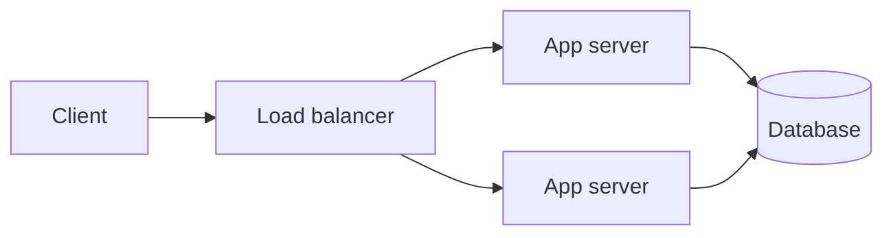

# Repository Architecture

This document explains the structure and conventions of the cloud certification study guides repository. Read it before contributing or making non-trivial changes.

---

## At a glance

This repo is a **markdown knowledge base** for cloud + AI learning - certifications, hands-on patterns, plain-English concepts, and a beginner on-ramp. There is no build step, no test suite, no deployment - it is a content repository served as Markdown via GitHub.

```
cloud-data-ai-security-zero-to-hero/
├── README.md           # Top-level overview + pillars + provider table
├── STUDY-HUB.md        # Navigation hub: decision tree, career tracks, full provider table
├── CLAUDE.md           # Project context for Claude Code / AI tools
├── CONTRIBUTING.md     # How to contribute (templates, doc-link format, PR checklist)
├── CHANGELOG.md        # User-visible / operationally-significant changes
├── .templates/         # Cross-cert resources hubs (resources-aws.md, resources-azure.md, resources-gcp.md)
├── assets/diagrams/    # PNG diagrams (draw.io exports), organized by topic subdir
├── docs/               # Repo docs: ARCHITECTURE.md, certs.json (generated index), freshness.md, tag-taxonomy.md, improvement-roadmap.md
├── exams/              # All certification study guides, organized by provider
├── learn/              # Plain-English learning content for non-cert students
│   ├── concepts/       # Bite-size topic pages (5-10 min reads): cloud + AI primitives
│   ├── day-one/        # Strict beginner on-ramp (terminal, git, HTTP, servers)
│   ├── ai-from-scratch.md
│   ├── cloud-from-scratch.md
│   ├── glossary.md
│   └── youtube.md
└── resources/          # Cross-cert resources (roadmaps, comparisons, CLI cheat sheets, etc.)
```

---

## `exams/` - cert study guides

### Directory structure

`exams/<provider>/<cert-slug>/` (or `exams/aws/<tier>/<cert-slug>/` for AWS, which uses an extra tier subdirectory).

#### Provider naming

Use the lowercase, hyphen-free provider name when possible:

- `aws`, `azure`, `gcp`, `kubernetes`, `nvidia`, `anthropic`, `hashicorp`, `databricks`, `snowflake`, `github`, `redhat`, `cisco`, `confluent`, `mongodb`, `finops`, `comptia`, `isc2`, `cloud-security-alliance`, `linux-foundation`, `oracle`, `ibm`

#### AWS tier subdirectories

AWS uses an extra layer because it has many tiers:

- `exams/aws/foundational/` - CLF-C02 (Cloud Practitioner), AIF-C01 (AI Practitioner)
- `exams/aws/associate/` - SAA-C03, DVA-C02, SOA-C03, MLA-C01, DEA-C01, SOA-C02 (retired but retained)
- `exams/aws/professional/` - SAP-C02, DOP-C02
- `exams/aws/specialty/` - SCS-C02, ANS-C01, PAS-C01, QPC-C01, MLS-C01 (retired), DAS-C01 (retired), DBS-C01 (retired)
- `exams/aws/shared/services/` - shared service references (compute, storage, network, etc.)

Other providers don't use tier subdirs - the cert dir sits directly under the provider dir.

### Files in a cert dir

Standard cert dir contents:

```
exams/<provider>/<cert>/
├── README.md           # 1-page overview, quick-links, exam summary
├── fact-sheet.md       # Dense reference: exam logistics, domains, services, doc links
├── practice-plan.md    # Week-by-week study schedule with checkboxes
├── notes/              # Numbered topic files: 01-foo.md, 02-bar.md, ...
│   ├── 01-topic-one.md
│   ├── 02-topic-two.md
│   └── ...
├── scenarios.md        # (Optional) Exam-style scenarios with explanations
├── strategy.md         # (Optional, recommended for Pro/Specialty) Exam-day approach
├── cram-1p.md          # (Optional) One-page cram sheet
└── cheat-sheets/       # (Optional) Decision trees, service comparisons
```

**Required (validator fails on missing):** README.md

**Recommended for all certs (validator warns on missing):** fact-sheet.md, practice-plan.md

**Recommended for senior-tier certs only (validator warns on missing):** scenarios.md, strategy.md

**Optional, used selectively (validator silent):** notes/, cram-1p.md, cheat-sheets/, labs/. **Generated (do not hand-edit):** flashcards.csv (from notes, by build-flashcards.py).

### Tier classification

`validate-cert-structure.sh` classifies each cert as `senior` or `junior` and adjusts its checks accordingly.

**Senior tier** (gets scenarios.md + strategy.md as recommended):
- Path contains `/professional/`, `/specialty/`, or `/expert/` (AWS, etc.)
- Curated cert basenames: GCP professional certs (cloud-architect, data-engineer, machine-learning-engineer, cloud-network/security/devops/database engineer, workspace-administrator), Azure expert/specialty (az-305, az-400, az-500, az-700, az-800, sc-100, sc-200), Kubernetes pro/specialty (cks, pca, ica), security senior certs (cissp, ccsp, cism, cisa, oscp), Cisco ccnp/ccie, HashiCorp/Databricks/Snowflake "professional"/"advanced" basenames, FinOps Certified Professional, VMware VCP, Anthropic claude-certified-architect-professional, CompTIA cysa-plus / pentest-plus / casp-plus.

**Junior tier** (everything else - foundational and associate-grade certs).

### Scaffold tiers

The repo has two informal tiers of cert guide depth:

- **Light scaffold**: README + fact-sheet + practice-plan + ~5 notes files. Used for Foundational and most Associate certs.
- **Full scaffold**: everything in light, plus scenarios.md + strategy.md, cram-1p.md (optional), cheat-sheets/, more detailed scenarios. Used for senior-tier certs (see classification above) and high-traffic Associates (AWS SAA-C03, Azure AZ-104, K8s CKA).

When scaffolding a new cert, the validator's tier classification is the default; override only with intent.

---

## `resources/` - cross-cert resources

### Subdirectories

```
resources/
├── architecture-patterns/      # Multi-cloud architecture write-ups (17 files)
├── compliance-guides/          # SOC 2, HIPAA, PCI DSS, GDPR, FedRAMP (5 files)
├── cost-optimization/          # Per-cloud cost optimization playbooks (4 files)
├── hands-on-projects/          # 15 guided builds + generated labs-by-cert.md index
├── interview-prep/             # Role-based interview prep (6 files)
├── migration-guides/           # On-prem and cloud-to-cloud migration (5 files)
├── networking-deep-dives/      # Hybrid, multi-cloud, DNS, load balancing (4 files)
├── practice-questions/         # Per-cert question banks (34 files + template)
├── troubleshooting/            # Per-platform troubleshooting (4 files)
└── well-architected/           # AWS / Azure / GCP frameworks (3 files)
```

### Top-level resource files

```
resources/
├── budget-study-plan.md
├── certification-roadmap-*.md          # 11 career-focused roadmaps
├── cli-cheat-sheet-*.md                # 9 CLI quick references
├── community-resources.md
├── exam-day-checklist.md
├── free-tier-guide.md
├── practice-resources.md
├── recommended-courses.md
├── service-comparison-*.md             # 12 cross-cloud comparisons
└── study-strategies.md
```

---

## `.templates/` - hub pages

Three centralized cloud-specific resource hubs referenced from many cert dirs:

- `.templates/resources-aws.md`
- `.templates/resources-azure.md`
- `.templates/resources-gcp.md`

Each consolidates official docs, lab platforms, practice exams, video courses, communities, and cost-optimization tips for that cloud. Cert READMEs link to these instead of duplicating content.

The `.templates/` dir is a hidden directory (leading dot) by convention - it's not user-facing study material but contains reusable building blocks.

---

## Docs and link conventions

### Documentation links

Use the standard format:

```markdown
**[📖 Link Text](URL)** - Optional short description
```

### Internal links

Use relative paths:

- Within a cert dir: `[fact-sheet](./fact-sheet.md)`
- To another cert: `[SAA-C03](../../associate/solutions-architect-saa-c03/)`
- To resources: `[Cloud Engineer Roadmap](../../../resources/certification-roadmap-cloud-engineer.md)`

Link audits run with a code-block-aware scanner. See `CONTRIBUTING.md` for the doc-link policy.

### Style conventions

- **No em dashes (-)** anywhere - house style
- **Avoid emojis in body text** - the repo uses a small set of section-marker emojis (☁️, 🔒, 📖, ⚠️, ℹ️, 🎯, 📚) but body content stays plain
- **Plain English, short sentences**
- **Cite, don't paraphrase** vendor docs - link them
- **No verbatim vendor exam questions** - legal and ethical violation

---

## Visual content standards

### Where diagrams go

- **Canonical: Mermaid** in fenced ` ```mermaid ` code blocks, written inline in the page that uses it. GitHub renders it natively. It stays editable in the markdown, diffs as text in review, needs no tooling to update, and never rots into a broken image link.
- **Exception: PNG** files under `assets/diagrams/<topic>/<slug>.png`, for diagrams too dense to read inline - large multi-region topologies, detailed multi-service reference architectures. Topic subdirs are created lazily: `cloud/`, `ai/`, `networking/`, `architecture/`, `security/`.

Reach for Mermaid first. Only fall back to PNG when the diagram genuinely does not read as inline text.

This reflects what the repo actually does: 89 pages use Mermaid today and no PNG has ever been added. The convention previously named PNG as canonical, which meant the documented standard had zero instances while the real one was undocumented.

### Authoring

For Mermaid, prefer `flowchart TB` / `flowchart LR` over the older `graph` syntax. Use `subgraph` blocks for grouped components (regions, AZs, tiers). Keep node labels short; put detail in the surrounding prose, not inside the boxes.

Mermaid renders in GitHub's light and dark themes, so do not hard-code colours that only work against one background. Default styling is preferred.

PNG diagrams, when justified, are created with the **draw.io MCP server**. Export at 2x resolution for retina screens and keep files under 200 KB.

### Embedding

**Mermaid**: a fenced code block tagged `mermaid`. Don't wrap it in HTML.

````markdown

````

Because a Mermaid diagram carries no alt text, give it a caption or a sentence of surrounding prose that states what it shows. Screen readers and anyone whose renderer does not support Mermaid rely on that text.

**PNG**: always include descriptive alt text, useful both when the image fails to render and for screen-reader users.

```markdown

```

### Where to add diagrams

Highest-ROI pages for diagrams:
- `learn/cloud-from-scratch.md`, `learn/ai-from-scratch.md` (foundational paths)
- `learn/concepts/` AI pages: transformer-architecture, RAG, agents
- `resources/architecture-patterns/` (every pattern benefits from a diagram)
- `resources/networking-deep-dives/` (network topologies)

Lower-ROI: cert fact-sheets, practice plans, study strategies. Don't force diagrams onto pages that read fine without them.

---

## Frontmatter convention

New pages and (opportunistically) refreshed pages should use YAML frontmatter for living-doc metadata:

```yaml
---
last-updated: 2026-05-03
applies-to: AWS console as of 2026-Q2          # optional
difficulty: beginner                           # optional: beginner | intermediate | advanced
reading-time: 10 min                           # optional
---
```

- `last-updated` is the only required field. Use ISO date format (`YYYY-MM-DD`).
- `applies-to` is for content tied to a specific console version, exam version, or product release that may drift.
- `difficulty` and `reading-time` help readers calibrate.

**Backfill is opportunistic, not blocking.** Don't open a PR that adds frontmatter to 1300 existing files at once. When you touch a file, add it.

The link audit script below is YAML-frontmatter safe (frontmatter contains no markdown link syntax).

---

## How retired certs are handled

When a vendor retires a cert:

1. The cert dir stays in the repo (don't delete - credential holders need the material)
2. Add a `RETIRED [DATE]` banner block to the top of `README.md` and `fact-sheet.md`
3. Link to the modern replacement
4. Update `README.md` and `STUDY-HUB.md` to mark the cert as retired in the provider listing
5. Update any roadmaps that recommended the retired cert
6. Add an entry to `CHANGELOG.md`

The canonical retired-banner pattern is in [exams/aws/specialty/data-analytics-das-c01/README.md](../exams/aws/specialty/data-analytics-das-c01/README.md).

---

## How aspirational / non-cert study tracks are handled

Some dirs in `exams/` cover topics that aren't tied to a specific certification (e.g., the Anthropic Prompt Engineering Specialist track, AWS Quantum before formal exam announcement, cross-cert GenAI study tracks). These get a clear disclaimer:

```markdown
> ℹ️ **Study track, not an official certification.** [Vendor] does not currently run a discrete certification for this material. Use this as a self-directed proficiency track.
```

The README and STUDY-HUB call these out as "study tracks" separately from certified exams in the provider tables.

---

## Counts and consistency

The README, STUDY-HUB, and CLAUDE.md all claim specific counts:

- 148 certifications
- 3 study tracks
- 27 providers

When you add or remove a cert, update **all three** docs to keep counts consistent. The provider table in STUDY-HUB is the canonical source - everything else should match it.

For verification:

```bash
# Count cert dirs (excluding study tracks):
find exams -mindepth 2 -maxdepth 4 -type d ! -name notes ! -name shared ! -name foundational ! -name associate ! -name professional ! -name specialty ! -name genai ! -name services ! -name cheat-sheets ! -name compute ! -name database ! -name networking ! -name storage ! -name security-identity | wc -l

# Or per-provider:
for d in exams/*/; do
    name=$(basename "$d")
    count=$(find "$d" -mindepth 1 -maxdepth 1 -type d ! -name notes | wc -l)
    echo "$name: $count"
done
```

---

## Link audit script

Run periodically to catch doc drift. The scanner is code-block aware (skips fenced blocks and inline backticks).

```bash
check_links() {
    local file="$1"
    local dir=$(dirname "$file")
    awk '/^```/ { in_block = !in_block; next } !in_block { gsub(/`[^`]*`/, ""); print }' "$file" \
        | grep -oE '\]\([^)]+\)' \
        | sed 's/^](//; s/)$//' \
        | while read link; do
            case "$link" in http://*|https://*|mailto:*|"#"*) continue ;; esac
            path="${link%%#*}"
            [ -z "$path" ] && continue
            if [[ "$path" = /* ]]; then target="${path#/}"; else target="$dir/$path"; fi
            target=$(realpath -m --relative-to=. "$target" 2>/dev/null)
            [ -e "$target" ] || echo "  $file -> $link"
        done
}
for f in $(find . -name "*.md" -not -path "./.git/*"); do check_links "$f"; done
```

The repo currently has **0 broken internal links** (as of 2026-04-27).

---

## When to update top-level docs

| Change | Update |
|---|---|
| Add a new cert | README provider table, STUDY-HUB provider table, CHANGELOG, relevant roadmap |
| Retire a cert | Banners on cert dir, README, STUDY-HUB, roadmaps, CHANGELOG |
| Add a new provider | All of the above plus README structure section |
| Rename a cert dir | Sweep `grep -rn "old-slug"` and update all references; CHANGELOG |
| Change repo conventions | Update CONTRIBUTING.md and this file |

---

## Where things live

| Looking for... | Find it in |
|---|---|
| Cert overview, exam logistics | `exams/<provider>/<cert>/README.md` |
| Deep service / domain reference | `exams/<provider>/<cert>/fact-sheet.md` |
| Study schedule | `exams/<provider>/<cert>/practice-plan.md` |
| Topic deep-dives | `exams/<provider>/<cert>/notes/NN-topic.md` |
| Practice questions | `resources/practice-questions/<provider>-<cert>.md` |
| Cross-cloud service comparisons | `resources/service-comparison-*.md` |
| Career path guidance | `resources/certification-roadmap-*.md` |
| Architecture patterns | `resources/architecture-patterns/*.md` |
| CLI quick reference | `resources/cli-cheat-sheet-*.md` |

---

## Anti-patterns to avoid

- **Don't create new content categories silently.** If you want a new top-level resource type, propose it in an issue first.
- **Don't reference files that don't exist.** Run the link audit before submitting a PR.
- **Don't duplicate cross-cloud content.** Use `service-comparison-*.md` for comparisons, not per-cert duplicates.
- **Don't leave retired certs unmarked.** A retired cert without a banner is misleading.
- **Don't bloat README/STUDY-HUB.** Both should stay scannable; depth lives in cert dirs and resource files.
- **Don't over-template.** Light-scaffold certs (READMe + fact-sheet + practice-plan + notes) are valuable; not every cert needs scenarios + strategy + cheat-sheets.

---

## Contact

See `CONTRIBUTING.md` for contribution workflow, PR checklist, and contact info.
