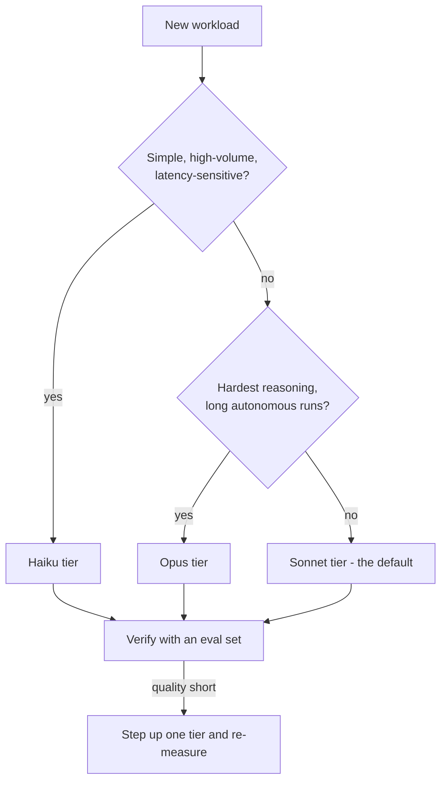

# 08 - Model Selection and Optimization

Domain 2 of CCDV-F (16.8%). This domain tests whether you can pick the right model for a workload and control what it costs. Almost every question reduces to a tradeoff: capability vs latency vs price.

---

## The Claude Model Family (mid-2026)

The current lineup is the Claude 5 family plus Haiku:

| Model | Tier | Strengths | Typical use |
|---|---|---|---|
| Claude Opus 5 | Most capable | Deep reasoning, long-horizon agentic work, hard coding tasks | Complex agents, difficult synthesis, code migration |
| Claude Sonnet 5 | Balanced | Near-Opus quality on coding and agentic work at lower cost | Default for most production applications |
| Claude Haiku 4.5 | Fastest, cheapest | Speed and throughput | Classification, routing, extraction, sub-agents |

Two facts matter more than any specific ID:

1. **Model lineups change.** Names, IDs, prices, and context windows shift over time. Check **[📖 Models overview](https://docs.anthropic.com/en/docs/about-claude/models)** - current model IDs, context windows, and pricing - before the exam and before shipping.
2. **Price scales with tier.** Opus costs several times Sonnet per token, and Sonnet several times Haiku. Output tokens cost roughly 5x input tokens on every tier. That ratio is why long responses and extended thinking dominate bills.

The Models API (`GET /v1/models`) lists what your key can call, so applications can discover capabilities at runtime instead of hardcoding assumptions.

---

## Choosing a Model

Work through three questions, in order:

### 1. Capability: what is the hardest thing the task requires?

- Multi-step reasoning, ambiguous requirements, long autonomous runs: Opus tier.
- General coding, summarization, tool-use loops, chat: Sonnet tier.
- Single-label classification, routing, entity extraction, reformatting: Haiku tier.

Start with the cheapest model that might work, measure quality with an eval set, and step up only when the eval says so. Guessing "we need the big model" without measuring is the anti-pattern the exam punishes.

### 2. Latency: who is waiting?

- Interactive UI with a human watching: smaller models respond faster, and streaming makes any model feel faster.
- Background jobs: latency barely matters; optimize for cost instead.
- Agent loops multiply latency by the number of steps. A 10-step loop on a slow model is a slow product.

### 3. Cost: what does a month of this traffic cost?

Estimate: requests per day x (input tokens x input price + output tokens x output price). Then apply the levers below. A workload that is unaffordable on Opus is often fine on Sonnet with a better prompt.

The decision flow, as most exam scenarios frame it:



The diagram reads: start from the workload shape, land on a tier, then let an eval set (not intuition) decide whether to move up.

---

## Context Window Tiers

- Current top-tier models offer very large context windows (hundreds of thousands to a million tokens); smaller models may offer less. Check the docs for current figures per model.
- A big window is not free: every input token is billed on every request, and a stateless API means you resend history each turn.
- Practical rule: the context window is a ceiling, not a target. Long conversations need history management (truncation, summarization, or compaction) or costs grow linearly with turn count.

---

## Token Counting

- `POST /v1/messages/count_tokens` takes the same body as a Messages request and returns `input_tokens`.
- Counts are model-specific: the same text can tokenize to different counts on different model generations. Count against the model you will call.
- Never use a third-party tokenizer (tiktoken and similar are built for other providers and materially undercount Claude tokens).
- Use counting for pre-flight cost estimates, context budgeting, and verifying that a document fits before sending it.

---

## Prompt Caching Economics

Caching is the single biggest cost lever for workloads with a shared prefix. Mechanics are in [notes/04](04-prompt-caching-and-batch-api.md); this section is the economics.

| Operation | Approximate cost vs base input |
|---|---|
| Cache write (5-minute TTL) | ~1.25x |
| Cache write (1-hour TTL) | ~2x |
| Cache read | ~0.1x |

- **Break-even:** with the 5-minute TTL, about two requests. With the 1-hour TTL, about three. Cache anything reused 2+ times within the TTL.
- **The 1-hour TTL** trades a higher write cost for surviving gaps in bursty traffic. If requests arrive more often than every 5 minutes, the default TTL refreshes itself and the 1-hour tier is wasted money.
- **Caching is a byte-exact prefix match.** A timestamp, UUID, or unsorted JSON serialization anywhere in the prefix means zero reads and pure write premium. If `cache_read_input_tokens` is zero across identical-looking requests, diff the rendered prompts.
- **Order stable-to-volatile:** tools, then system prompt, then stable documents, then the varying user question. Put the breakpoint at the end of the shared portion, not the end of the prompt.

---

## Batch API for Offline Workloads

The Message Batches API processes requests asynchronously at **50% of standard prices**.

- Up to 100,000 requests or 256 MB per batch; results within 24 hours (usually much faster); results retained 29 days.
- Every Messages feature works inside a batch: tools, vision, caching, structured output.
- Caching compounds with batching: a stable system prompt across 100K batch items is written once and read cheaply throughout.
- Fits: backfills, nightly classification, eval runs, bulk enrichment. Does not fit: anything a user is waiting on.
- Results arrive in any order; correlate by `custom_id`, and handle per-item `succeeded` / `errored` / `canceled` / `expired` statuses.

Decision rule the exam likes: "50,000 requests, overnight, cost-sensitive" is always the Batch API, usually with caching on the shared prefix.

---

## Extended Thinking Budgets

Extended thinking lets Claude spend tokens reasoning before it answers.

- Thinking output is billed as **output tokens** and counts against `max_tokens`. Enabling thinking without raising `max_tokens` truncates the visible answer.
- How the budget is expressed has evolved: older models took an explicit thinking token budget, newer models decide adaptively how much to think with an effort-style control. Either way, the developer-facing knob is "how much reasoning spend is this task worth."
- Use more thinking for genuinely hard problems (math, planning, tricky code). For extraction, classification, and routine chat, thinking is wasted spend; keep it minimal or off.
- Check **[📖 Extended thinking](https://docs.anthropic.com/en/docs/build-with-claude/extended-thinking)** - current configuration parameters per model - because the exact parameter shape is model-generation-specific.

---

## Cost-Optimization Patterns

The exam expects you to combine levers, not pick one. In rough order of impact:

### 1. Prompt caching

Covered above. Often 80-90% off the input side for prefix-heavy workloads.

### 2. Model routing

Send each request to the cheapest model that can handle it:

```python
def pick_model(task_type: str) -> str:
    if task_type in ("classify", "route", "extract"):
        return HAIKU        # cheap, fast
    if task_type in ("hard_reasoning", "long_agent_run"):
        return OPUS         # expensive, capable
    return SONNET           # default
```

A common production shape: Haiku classifies the incoming request, then either answers it directly or escalates to Sonnet/Opus. Routing plus caching regularly cuts blended cost by half or more.

### 3. Batch what is not interactive

Anything without a user waiting moves to the Batch API for an automatic 50% discount.

### 4. Truncate and summarize history

- Cap conversation history at the last N turns, or summarize older turns into a short digest.
- In agent loops, clear or compact old tool results; a 5KB search result from step 2 rarely matters at step 20.
- Keep documents out of the volatile part of the prompt so they can be cached.

### 5. Right-size `max_tokens` and prompts

- `max_tokens` is a cost ceiling per request; do not set 8192 for a task that needs 200 tokens.
- Shorter, tighter prompts cost less on every single request. Delete boilerplate that does not change behavior.
- Ask for concise output when verbosity has no value; output tokens are the expensive ones.

### 6. Downscale media

Images and PDFs are billed by their tokenized size. Resize large images and trim documents to the relevant pages before sending.

---

## Latency Optimization

- **Stream** everything user-facing; time-to-first-token matters more than total time.
- **Smaller model** where quality allows; Haiku's latency is a fraction of Opus's.
- **Cached prefixes** also cut latency, not just cost, because cached tokens are not re-processed.
- **Parallelize** independent calls (async clients, parallel tool execution) instead of serializing them.
- **Minimize thinking** on latency-sensitive paths.

---

## Worked Example: Cost Audit

A support assistant does 100K requests/day: 6K input tokens (5K stable system prompt + tools, 1K user content), 500 output tokens, on a mid-tier model.

1. Baseline: all 6K input billed at full rate every request.
2. Cache the 5K stable prefix: ~83% of input now bills at ~0.1x. Input cost drops roughly 75%.
3. Route the 40% of requests that are simple FAQ lookups to Haiku: those requests drop in cost by whatever the tier ratio is (often 3-5x cheaper).
4. Move the nightly analytics summarization (10K requests) to the Batch API: 50% off that slice.

No prompt got worse. This layering is exactly what Domain 2 scenario questions describe.

---

## Exam Focus

- Map workload descriptions to a model tier (capability, latency, cost, in that order)
- Cache economics: write premiums, ~0.1x reads, break-even counts, TTL choice
- Batch API: 50% discount, limits, `custom_id` correlation, when it fits
- Thinking budgets count against `max_tokens` and are billed as output
- Token counting is model-specific and done via the API endpoint
- Cost levers combine: caching + routing + batching + truncation
- Model lineups change; the docs, not memory, are the source of truth for IDs and pricing
