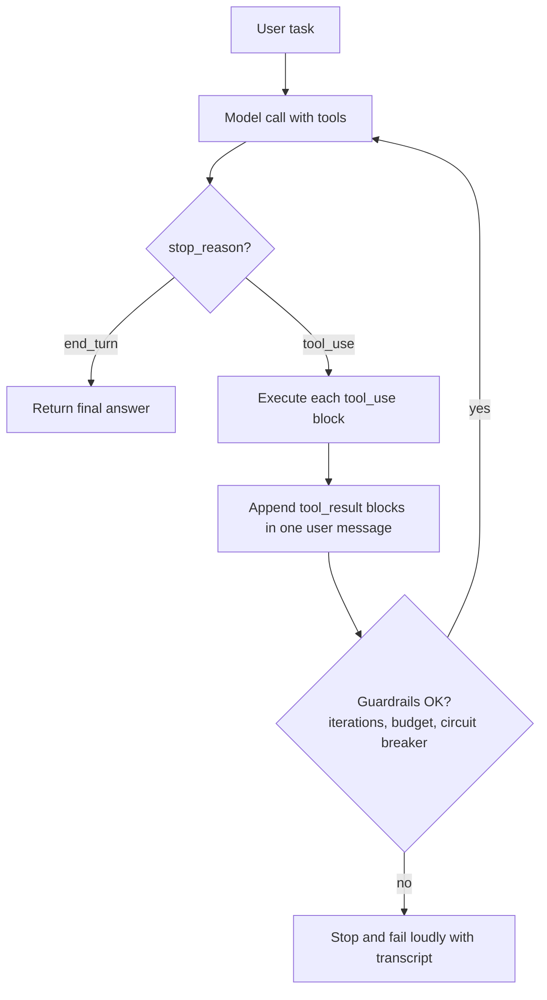

# 09 - Agents and Workflows

Domain 3 of CCDV-F (14.7%). This domain tests whether you know the spectrum from a single API call to a fully autonomous agent, the standard workflow patterns in between, and how to keep agents reliable in production.

---

## The Spectrum: Call, Workflow, Agent

| Tier | Who decides the next step | Example |
|---|---|---|
| Single call | Nobody; one request, one response | Summarize this document |
| Workflow | Your code, via fixed orchestration logic | Extract fields, then validate, then format |
| Agent | The model, via a tool-use loop | "Fix this failing test" with file and shell tools |

The distinction the exam cares about:

- A **workflow** is code-orchestrated. The steps and their order are decided by your program; the model fills in the content of each step. Predictable, testable, cheap.
- An **agent** is model-driven. Claude decides which tool to call next, observes the result, and keeps going until it judges the task done. Flexible, but slower, costlier, and harder to bound.

Default to the simplest tier that works. Most production LLM systems are single calls and workflows; agents are for tasks you cannot fully specify in advance.

---

## The Tool-Use Loop

Every agent, whatever the framework, is this loop:

```python
messages = [{"role": "user", "content": task}]
for _ in range(MAX_ITERATIONS):
    resp = client.messages.create(model=MODEL, max_tokens=4096,
                                  tools=tools, messages=messages)
    messages.append({"role": "assistant", "content": resp.content})
    if resp.stop_reason != "tool_use":
        break                     # agent decided it is done
    results = []
    for block in resp.content:
        if block.type == "tool_use":
            output = execute(block.name, block.input)   # your code
            results.append({"type": "tool_result",
                            "tool_use_id": block.id,
                            "content": output})
    messages.append({"role": "user", "content": results})
```

The diagram below shows the same loop as control flow: the model call either finishes the turn or requests tools, and tool results feed the next call until the model stops asking or a guardrail fires.



Key mechanics (details in [notes/03](03-tool-use-function-calling.md)):

- `stop_reason: "tool_use"` means "execute and continue," not an error.
- All tool results from one assistant turn go back in **one** user message.
- The full assistant content (including thinking blocks where present) is appended to history so the model sees its own prior calls.
- The loop terminates when the model stops calling tools, or when your guardrails fire.

---

## Workflow Patterns

Five named patterns cover almost every code-orchestrated design. Know them by name; the exam describes a scenario and asks which pattern fits.

### 1. Prompt chaining

Break a task into sequential steps, each its own API call, with the output of one feeding the next. Optionally add programmatic checks ("gates") between steps.

- Fit: tasks that decompose cleanly and benefit from each step being simpler. Example: generate an outline, check its length, then write the document from the outline.
- Cost: more calls, more latency, higher accuracy per step.

### 2. Routing

Classify the input first, then dispatch to a specialized prompt (and often a specialized model).

- Fit: distinct input categories that need different handling. Example: support triage sending refund requests, technical questions, and abuse reports to different prompts; easy categories to Haiku, hard ones to a bigger model.
- Bonus: routing is also a cost lever (see [notes/08](08-model-selection-and-optimization.md)).

```python
def handle(ticket: str) -> str:
    category = classify(ticket, model=CHEAP_MODEL)   # call 1: cheap classifier
    prompt, model = ROUTES[category]                 # your code picks the route
    return answer(ticket, prompt, model=model)       # call 2: specialized handler
```

### 3. Parallelization

Run multiple calls at once. Two variants:

- **Sectioning:** split independent subtasks (summarize each of 10 documents) and run them concurrently.
- **Voting:** run the same task several times and aggregate (majority vote, or take the strictest verdict) for higher confidence.

### 4. Orchestrator-workers

A central model call decomposes the task dynamically, farms subtasks to worker calls, and synthesizes their results. Unlike parallelization, the subtasks are not known in advance; the orchestrator invents them per input.

- Fit: tasks where the decomposition depends on the input, like "research this question across several sources" or multi-file code changes.
- Common cost shape: capable model as orchestrator, cheaper model as workers.

### 5. Evaluator-optimizer

One call generates, a second call evaluates against criteria, and the generator retries with the feedback until the evaluator passes it or a retry cap hits.

- Fit: tasks with clear evaluation criteria where iteration measurably helps, like translation refinement or code that must pass a review checklist.

---

## The Claude Agent SDK

The Claude Agent SDK packages the Claude Code harness as a library (Python and TypeScript). Instead of writing the loop above yourself, you get:

- The full agent loop with built-in tools: file read/write/edit, bash, glob/grep search, web fetch.
- Context management, permissions, hooks, and session handling.
- MCP server support and subagent orchestration.
- Programmatic invocation: give it a prompt and options, it drives everything and returns the result.

When to use what:

| You want | Use |
|---|---|
| A custom agent with only your own tools | Claude API + tool-use loop |
| A coding or filesystem agent with batteries included | Claude Agent SDK |
| Interactive terminal development | Claude Code itself |

The Agent SDK is Claude Code's engine exposed for automation; anything Claude Code can do interactively, the SDK can do headlessly (CI jobs, bots, pipelines). See **[📖 Claude Code overview](https://docs.anthropic.com/en/docs/claude-code/overview)** - Claude Code and Agent SDK documentation.

---

## Agent Reliability

Agents fail in ways single calls do not: they loop forever, burn budget, or take an action they should not. Production agents need guardrails.

### Iteration caps

Always bound the loop (`max_iterations`). An agent that has not converged in 20-30 steps is usually stuck, not thorough. On cap, fail loudly with the transcript attached; do not silently return the last partial answer as if complete.

### Budget limits

Track cumulative token spend (and wall-clock time) across the loop and stop at a ceiling. Tool results count as input on every subsequent iteration, so context - and per-step cost - grows as the loop runs.

### Circuit breakers

If the same tool fails N times in a row, or the model repeats the same call with the same input, break the loop instead of letting the model thrash. Repeated identical tool calls are the classic infinite-loop signature.

### Human-in-the-loop

Gate irreversible or high-stakes actions (sending email, deleting data, spending money, pushing code) behind explicit human approval. Implement the gate in the tool executor: pause, ask, and return a "user declined" tool result if refused. Read-only tools can run freely; destructive tools never should.

### Context hygiene

Long-running agents accumulate stale tool results. Clear or summarize old results once they are no longer needed, or the agent's context fills with noise and cost climbs. Give agents that span sessions a memory surface (a scratch file or store) instead of relying on one giant transcript.

### Observability

Log every iteration: tool name, input, result size, tokens, stop_reason. When an agent misbehaves, the transcript is the only way to debug it (see [notes/10](10-security-safety-claude-code-and-evals.md)).

---

## When NOT to Build an Agent

The highest-yield judgment call in this domain. Do not build an agent when:

- **The steps are known in advance.** If you can write the flowchart, write the workflow. Fixed steps in code are cheaper, faster, and testable.
- **One call would do.** Classification, extraction, summarization, and Q&A do not need a loop.
- **Errors are expensive and hard to catch.** Agents make mistakes; if there is no cheap way to verify or roll back (tests, review, undo), the autonomy is a liability.
- **Latency or cost budgets are tight.** Every agent iteration is a full model call over a growing context.
- **The "agent" would just be a wrapper.** An agent with one tool called once is a single call with extra ceremony.

Checklist before choosing the agent tier: the task is genuinely open-ended, the outcome justifies the cost, the model is demonstrably capable at this task type, and errors can be caught and recovered. Any "no" means step down a tier.

---

## Exam Focus

- Single call vs workflow vs agent: who decides the next step
- The tool-use loop: stop_reason handling, result pairing, termination
- The five workflow patterns by name and the scenarios that match each
- Orchestrator-workers vs parallelization: dynamic vs predefined subtasks
- Agent SDK = Claude Code harness as a library, with built-in tools
- Reliability: iteration caps, budgets, circuit breakers, human approval gates
- Recognizing when a scenario does NOT justify an agent
