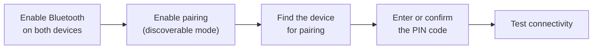
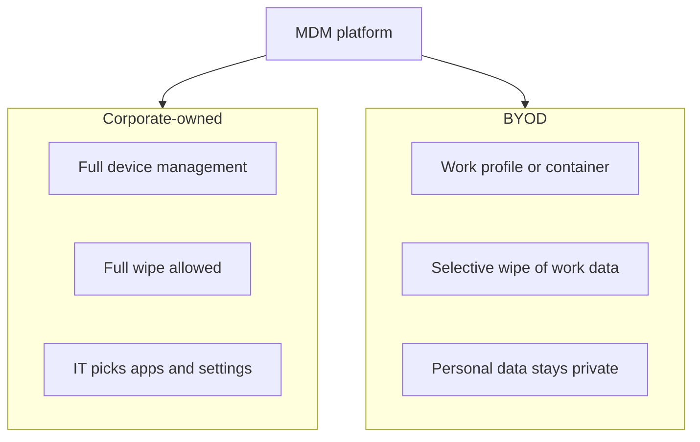

# Core 1 Domain 1: Mobile Devices (13%)

## Overview

This domain covers laptops, tablets, and phones as a support technician meets them: replacing parts, connecting accessories, getting devices onto Wi-Fi and cellular networks, and enrolling them in corporate management. It is the smallest Core 1 domain, but its content returns in Domain 5 (mobile troubleshooting) and in Core 2 (mobile security and mobile OS troubleshooting). Learn it once here and you collect marks three times.

The three objectives are:

- **1.1** Given a scenario, monitor mobile device hardware and use appropriate replacement techniques.
- **1.2** Compare and contrast accessories and connectivity options for mobile devices.
- **1.3** Given a scenario, configure basic mobile device network connectivity and provide application support.

**[📖 A+ Core 1 V15 (220-1201)](https://www.comptia.org/en-us/certifications/a/core-1-v15/)** - Official exam page with the domain list

## 1.1 Laptop Hardware and Replacement

Laptops are built from the same component types as desktops, but smaller, often proprietary, and sometimes soldered. The exam wants you to know which parts are commonly replaceable and how to replace them safely.

### General replacement practice

- **Get the service manual first.** Manufacturers publish disassembly steps. Laptop screws vary in length, and a long screw in the wrong hole can pierce the motherboard.
- **Remove power.** Unplug the AC adapter and disconnect the battery before touching anything inside. On modern laptops the battery is internal, so disconnect its cable from the board.
- **Use ESD protection.** Wear an antistatic strap or work on an ESD mat.
- **Track screws.** Use a magnetic mat or a labeled tray, one section per step.
- **Use plastic tools.** Spudgers and pry picks avoid scratching the case and shorting circuits.
- **Match the part exactly.** Model number, connector type, and firmware revision matter more on laptops than on desktops.

### Components in the objective

| Component | What to know |
|-----------|--------------|
| **Battery** | Lithium-ion or lithium-polymer. Health declines with charge cycles and heat. A swollen battery is a fire hazard: stop using the device, do not puncture it, and dispose of it through a battery recycler. |
| **Keyboard/keys** | Often held by the top cover or riveted into the palm rest assembly. Individual keycaps can sometimes be replaced. Spills are the most common cause of failure. |
| **RAM** | Laptops use **SODIMM** modules. Many thin laptops have soldered RAM that cannot be upgraded. Check the manual for the maximum supported size and speed. |
| **HDD/SSD** | Older laptops use 2.5-inch SATA drives. Modern laptops use M.2 NVMe SSDs. Clone the old drive or back up data before swapping. |
| **Wireless cards** | Usually M.2 (Key E). The Wi-Fi antenna leads snap onto small U.FL-style connectors. Mark which lead goes to which terminal. |
| **Wi-Fi antenna connector/placement** | Antennas run through the display lid, around the screen, because it is the highest point. A reassembled laptop with poor Wi-Fi often has a pinched or unplugged antenna lead. |
| **Camera/webcam** | Sits in the display bezel. Shares the display cable bundle on many models. |
| **Microphone** | Often in the bezel next to the webcam, or on the keyboard deck. |
| **Physical privacy and security** | **Biometrics** (fingerprint readers, IR cameras for face unlock) and **near-field scanner** features (NFC readers for badges and smart cards). Privacy shutters on webcams also belong here. |

### Monitoring hardware health

"Monitor" in the objective means knowing how to check health before replacing parts:

- **Battery reports** - On Windows, `powercfg /batteryreport` produces an HTML report comparing design capacity with full charge capacity. macOS shows battery condition under System Settings. Phones show battery health under settings.
- **Storage health** - S.M.A.R.T. data from the drive or vendor tool.
- **Thermal behavior** - Fans constantly at full speed, or throttled performance, point to dust or dried thermal paste.

## 1.2 Accessories and Connectivity

### Wired connection methods

| Connector | Where you see it | Notes |
|-----------|------------------|-------|
| **USB-C** | Almost every new laptop, Android phone, and iPhone 15 onward | Reversible. Can carry data, video (DisplayPort alt mode), Thunderbolt, and USB Power Delivery charging. The cable matters: not every USB-C cable carries video or high wattage. |
| **microUSB** | Older Android phones, accessories | Not reversible. USB 2.0 speeds for most devices. |
| **miniUSB** | Very old cameras, GPS units, some controllers | Legacy. Larger than micro. |
| **Lightning** | iPhones before iPhone 15, older iPads and accessories | Apple proprietary 8-pin, reversible. |
| **USB-A** | Chargers, keyboards, flash drives | The classic rectangular connector. |

### Wireless connection methods

| Method | Range | Typical use |
|--------|-------|-------------|
| **NFC** | A few centimeters | Tap-to-pay, badge access, pairing accessories quickly |
| **Bluetooth** | Around 10 m for most devices | Headsets, keyboards, mice, speakers, car kits |
| **Tethering** | Cable, Bluetooth, or Wi-Fi | Share a phone's cellular data with one laptop |
| **Hotspot** | Wi-Fi range | Phone becomes a Wi-Fi access point for several devices |

Tethering and hotspots use the phone's cellular data plan. Watch for data caps and carrier restrictions.

### Accessories

- **Stylus** - Active styluses need power (battery or charging) and pairing. Passive styluses work on any capacitive screen.
- **Headsets, speakers, webcams** - Usually Bluetooth or USB. Check that the OS has selected the right input and output device.
- **Trackpad, drawing pad, track points** - Alternative pointing devices. A drawing pad is also called a graphics tablet.

### Docking station vs port replicator

| | Docking station | Port replicator |
|-|----------------|-----------------|
| **Purpose** | Turns a laptop into a full desktop workstation | Adds extra ports |
| **Extras** | May add drive bays, expansion slots, multiple displays, charging | Duplicates the laptop's existing ports |
| **Connection** | Often Thunderbolt or USB-C, or a proprietary dock connector | USB or USB-C |

In practice the line is blurred, and most modern "docks" are USB-C or Thunderbolt. For the exam: a docking station adds capability, a port replicator just replicates ports.

## 1.3 Mobile Network Connectivity and App Support

### Cellular data

- **3G, 4G (LTE), 5G** are successive generations. 3G networks have been shut down in most countries, so a 3G-only device will not get cellular service.
- **Enable and disable** cellular data per device, and often per app. Airplane mode disables all radios, although Wi-Fi and Bluetooth can be turned back on while in airplane mode.
- **SIM** - The physical subscriber identity card. **eSIM** is an embedded, reprogrammable SIM activated by QR code or carrier app. Many phones support two lines using one SIM and one eSIM.
- **Hotspot** - Shares cellular data over Wi-Fi. Carriers may cap or block hotspot data.

### Wi-Fi on mobile devices

- Join the SSID, enter the passphrase or certificate, and confirm the IP address.
- Corporate Wi-Fi often uses WPA2/WPA3-Enterprise with 802.1X. MDM usually pushes these profiles so users do not type credentials.
- A phone that shows Wi-Fi connected but no internet may be behind a captive portal, or using a private (randomized) MAC address that the network does not allow.

### Bluetooth pairing steps

The objective lists the pairing process in order. Learn it as a sequence because PBQs may ask you to order the steps:

The five Bluetooth pairing steps from objective 1.3, from turning the radio on to testing the connection.

If pairing fails: make sure the accessory is in pairing mode (not just on), remove any old pairing from both devices, move closer, charge the accessory, and check that it is not still connected to another device.

### Location services

- **GPS** - Satellite positioning, most accurate outdoors, uses more battery.
- **Cellular location services** - Triangulation from cell towers, works indoors, less precise.
- Wi-Fi positioning also helps indoors. Location can be granted per app: always, while using, or never. Too many apps with "always" location is a common battery complaint.

### Mobile device management (MDM)

MDM lets an organization configure and control phones and tablets centrally.

| Capability | Examples |
|------------|----------|
| **Device configurations** | Push Wi-Fi, VPN, email, and certificate profiles |
| **Policy enforcement** | Require a passcode, encryption, OS version minimums, disable the camera |
| **Corporate applications** | Push, update, and remove business apps |
| **Security actions** | Remote lock, remote wipe, locate device |

**Corporate-owned vs BYOD:**

- **Corporate-owned** devices can be fully managed. IT controls everything.
- **BYOD** (bring your own device) devices usually get a work profile or container. IT manages the business apps and data, not the user's personal photos and apps. A selective wipe removes only corporate data.

How one MDM platform treats corporate-owned devices differently from personal BYOD devices.

**[📖 Apple Platform Deployment](https://support.apple.com/guide/deployment/welcome/web)** - How Apple devices are enrolled and managed by MDM
**[📖 Android Enterprise](https://www.android.com/enterprise/)** - Google's management framework, including work profiles for BYOD

### Application support

- **Business applications** - Mail, cloud storage, and line-of-business apps, usually delivered by MDM.
- **Mail** - Configure with the account type (Exchange/Microsoft 365, IMAP, POP3), server names, ports, and security settings. Most corporate mail uses modern authentication, not a typed server address.
- **Cloud storage** - OneDrive, Google Drive, iCloud. Watch for storage limits and sync conflicts.
- **Contacts and calendar** - Usually synced through the mail account.

### Mobile device synchronization

Synchronization keeps contacts, calendar, mail, photos, and files the same across phone, laptop, and cloud.

- **Recognizing data caps** - Photo and video sync over cellular can burn through a plan. Set sync to Wi-Fi only.
- **Calendar and contacts** - Duplicates usually mean the same account was added twice, or two sync sources were enabled for the same data.
- **Business vs personal accounts** - Keep them separate. MDM may block copying data from work apps to personal apps.

## Exam Tips and Traps

1. **SODIMM** is the laptop memory form factor. Soldered RAM cannot be upgraded.
2. **Swollen battery** means stop using it and dispose of it properly. Never try to press it flat.
3. **Wi-Fi antennas live in the lid.** Poor Wi-Fi after a screen replacement means check the antenna leads.
4. **NFC is centimeters, Bluetooth is meters.** Tap-to-pay is NFC.
5. **Hotspot** serves many devices over Wi-Fi. **Tethering** usually means one device over USB or Bluetooth.
6. **Docking station adds capability; port replicator copies ports.**
7. **BYOD uses a container and selective wipe.** Corporate-owned devices can be fully wiped.
8. **eSIM** is embedded and provisioned by QR code or app. A physical SIM is a removable card.
9. **Order the Bluetooth steps:** enable, pairing mode, find, PIN, test.
10. **Data caps** are a sync problem, not a hardware problem.

## Related Notes

- [05 - Hardware and Network Troubleshooting](05-hardware-network-troubleshooting.md#54-mobile-device-issues) - Mobile hardware symptoms
- [07 - Security](07-security.md#28-securing-mobile-devices) - Mobile hardening and MDM policy
- [08 - Software Troubleshooting](08-software-troubleshooting.md) - Mobile OS and app issues
- [Fact Sheet](../fact-sheet.md) - Connector and cable tables
