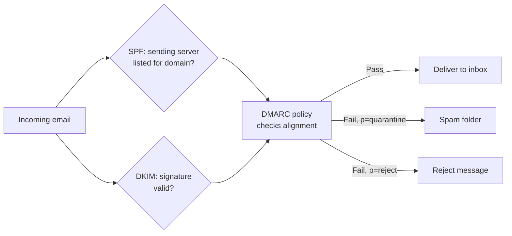
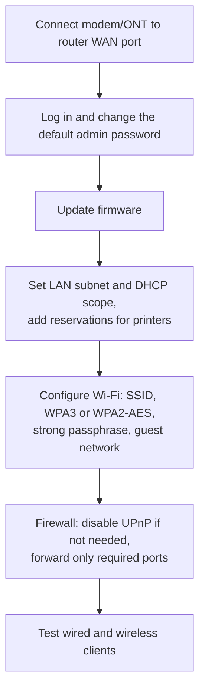

# Core 1 Domain 2: Networking (23%)

## Overview

Networking is almost a quarter of Core 1. It is the A+ slice of what Network+ covers in depth: ports and protocols, Wi-Fi, the services networked hosts provide, DNS and DHCP configuration, the hardware in a small office, IP addressing, internet connection types, and the tools you carry to fix cabling. Expect at least one PBQ that asks you to match ports to protocols or configure a SOHO router.

The objectives are:

- **2.1** Compare and contrast TCP and UDP ports, protocols, and their purposes.
- **2.2** Explain wireless networking technologies.
- **2.3** Summarize services provided by networked hosts.
- **2.4** Explain common network configuration concepts.
- **2.5** Compare and contrast common networking hardware devices.
- **2.6** Given a scenario, configure basic wired/wireless SOHO networks.
- **2.7** Compare and contrast internet connection types, network types, and their characteristics.
- **2.8** Explain networking tools and their purposes.

## 2.1 Ports, Protocols, TCP and UDP

### TCP vs UDP

| | TCP | UDP |
|-|-----|-----|
| **Connection** | Connection-oriented (three-way handshake: SYN, SYN-ACK, ACK) | Connectionless |
| **Reliability** | Acknowledgments, retransmission, ordering | Best effort, no retransmission |
| **Overhead** | Higher | Lower |
| **Use when** | Every byte must arrive in order (web, email, file transfer) | Speed matters more than a lost packet (DNS queries, DHCP, streaming, VoIP, gaming) |

A useful memory hook: TCP is a phone call where both sides confirm they heard each other. UDP is shouting across a room and hoping.

### The port list

These fourteen entries are named in the objective. Learn them in both directions: port to protocol and protocol to port.

| Port | Protocol | TCP/UDP | What it does | Secure alternative |
|------|----------|---------|--------------|--------------------|
| 20, 21 | FTP | TCP | File transfer. 21 is control, 20 is data (active mode) | SFTP (22) or FTPS |
| 22 | SSH | TCP | Encrypted remote command line. Also carries SFTP and SCP | - |
| 23 | Telnet | TCP | Unencrypted remote command line | SSH (22) |
| 25 | SMTP | TCP | Sends mail between servers | SMTP with STARTTLS, submission on 587 |
| 53 | DNS | UDP and TCP | Resolves names to IP addresses | DNS over HTTPS/TLS |
| 67, 68 | DHCP | UDP | Assigns IP configuration. 67 server, 68 client | - |
| 80 | HTTP | TCP | Web traffic | HTTPS (443) |
| 110 | POP3 | TCP | Downloads mail to one device | POP3S (995) |
| 137-139 | NetBIOS / NetBT | UDP and TCP | Legacy Windows name, datagram, and session services | SMB direct on 445 |
| 143 | IMAP | TCP | Accesses mail stored on the server, syncs across devices | IMAPS (993) |
| 389 | LDAP | TCP and UDP | Queries a directory such as Active Directory | LDAPS (636) |
| 443 | HTTPS | TCP (and UDP for HTTP/3) | Web over TLS | - |
| 445 | SMB/CIFS | TCP | Windows file and printer sharing | SMB 3 encryption |
| 3389 | RDP | TCP and UDP | Microsoft Remote Desktop | RDP through a VPN or gateway |

**POP3 vs IMAP** is a favorite question. POP3 downloads and usually deletes from the server, so mail lives on one device. IMAP leaves mail on the server and keeps every device in sync.

**[📖 IANA Service Name and Port Number Registry](https://www.iana.org/assignments/service-names-port-numbers/service-names-port-numbers.xhtml)** - The official registry for well-known ports

## 2.2 Wireless Networking Technologies

### Frequencies and channels

| Band | Strengths | Weaknesses |
|------|-----------|------------|
| **2.4 GHz** | Best range and wall penetration, every device supports it | Only three non-overlapping channels (1, 6, 11 in the US), crowded, microwave and Bluetooth interference |
| **5 GHz** | Many more channels, faster | Shorter range, weaker through walls. Some channels need DFS (radar detection) |
| **6 GHz** | Huge clean spectrum, no legacy devices | Shortest range. Wi-Fi 6E and Wi-Fi 7 only. WPA3 required |

- **Regulations** - Each country's regulator decides which channels and power levels are legal. That is why a router has a country setting.
- **Channel selection** - Pick channels that do not overlap with neighbors. A Wi-Fi analyzer shows what is in use.
- **Channel width** - 20, 40, 80, 160 MHz, and 320 MHz on Wi-Fi 7. Wider channels are faster but more likely to overlap. On a crowded 2.4 GHz band, stick to 20 MHz.

### 802.11 standards

| Standard | Name | Band | Max speed (theoretical) |
|----------|------|------|-------------------------|
| 802.11a | - | 5 GHz | 54 Mbps |
| 802.11b | - | 2.4 GHz | 11 Mbps |
| 802.11g | - | 2.4 GHz | 54 Mbps |
| 802.11n | Wi-Fi 4 | 2.4 / 5 GHz | 600 Mbps |
| 802.11ac | Wi-Fi 5 | 5 GHz | About 6.9 Gbps |
| 802.11ax | Wi-Fi 6 / 6E | 2.4 / 5 / 6 GHz (6E) | About 9.6 Gbps |
| 802.11be | Wi-Fi 7 | 2.4 / 5 / 6 GHz | About 46 Gbps |

Real throughput is far lower than the theoretical figure. The whole cell shares the airtime, and the slowest client drags everyone down on older standards.

**[📖 IEEE 802.11 Working Group](https://www.ieee802.org/11/)** - The body that publishes the 802.11 standards

### Other wireless technologies

- **Bluetooth** - Short-range personal area network. Low Energy (BLE) variants power fitness trackers and beacons.
- **NFC** - A few centimeters. Contactless payment, badge readers, quick pairing.
- **RFID** - Radio tags read at a distance. Inventory, toll tags, access badges. Passive tags have no battery and are powered by the reader.

## 2.3 Services Provided by Networked Hosts

### Server roles

| Role | What it does |
|------|--------------|
| **DNS** | Translates names to IP addresses |
| **DHCP** | Hands out IP address, subnet mask, gateway, DNS servers, lease time |
| **Fileshare** | Central file storage, usually SMB on Windows |
| **Print server** | Queues and manages jobs for shared printers, distributes drivers |
| **Mail server** | Sends (SMTP) and stores (IMAP/POP3) email |
| **Syslog** | Collects log messages from network devices and servers in one place |
| **Web server** | Serves websites over HTTP/HTTPS |
| **AAA** | Authentication, authorization, and accounting, usually RADIUS or TACACS+ |
| **Database server** | Stores structured data for applications |
| **NTP** | Keeps clocks in sync. Kerberos authentication fails if clocks drift too far apart |

### Internet appliances

| Appliance | Purpose |
|-----------|---------|
| **Spam gateway** | Filters inbound email before it reaches the mail server |
| **UTM** (unified threat management) | Firewall, IPS, antivirus, content filter, and VPN in one box. Common in small businesses |
| **Load balancer** | Spreads traffic across several servers for capacity and availability |
| **Proxy server** | Makes requests on behalf of clients. Caches content, filters URLs, hides internal addresses |

### Legacy, embedded, and IoT

- **SCADA** - Supervisory control and data acquisition. Controls industrial processes such as power grids, water treatment, and factories. Often old, hard to patch, and should be isolated on its own network.
- **IoT devices** - Smart thermostats, cameras, speakers, sensors. Weak default passwords and rare updates. Put them on a separate VLAN or guest network.

## 2.4 Network Configuration Concepts

### DNS record types

| Record | Purpose | Example |
|--------|---------|---------|
| **A** | Name to IPv4 address | `www` to 203.0.113.10 |
| **AAAA** | Name to IPv6 address | `www` to 2001:db8::10 |
| **CNAME** | Alias from one name to another | `shop` to `www` |
| **MX** | Mail server for the domain, with a priority number | `mail.example.com` priority 10 |
| **TXT** | Free text. Used for verification and email authentication | SPF, DKIM, and DMARC policies |

### Email authentication (spam management)

These three live in TXT records and work together:

| Mechanism | Answers the question | How |
|-----------|---------------------|-----|
| **SPF** (Sender Policy Framework) | Is this server allowed to send mail for this domain? | Lists authorized sending servers |
| **DKIM** (DomainKeys Identified Mail) | Was this message really signed by the domain, and is it unaltered? | Digital signature in the header, public key in DNS |
| **DMARC** | What should receivers do if SPF or DKIM fail, and who gets reports? | Policy of none, quarantine, or reject, plus a reporting address |

How a receiving mail server combines SPF and DKIM results under the sender's DMARC policy.

**[📖 DMARC.org Overview](https://dmarc.org/overview/)** - How DMARC builds on SPF and DKIM

### DHCP concepts

| Term | Meaning |
|------|---------|
| **Scope** | The pool of addresses the server can hand out, plus options like gateway and DNS |
| **Lease** | How long a client may keep the address before renewing |
| **Reservation** | A fixed address always given to a specific MAC address. Good for printers |
| **Exclusion** | Addresses inside the scope the server must never hand out (for static devices) |

The DHCP conversation is **DORA**: Discover, Offer, Request, Acknowledge. A client that gets no answer assigns itself an APIPA address.

### VLAN and VPN

- **VLAN** - Splits one physical switch into several logical networks. Keeps guest, IoT, voice, and staff traffic apart. Traffic between VLANs must pass through a router or Layer 3 switch.
- **VPN** - An encrypted tunnel across an untrusted network. Site-to-site VPNs join offices. Client VPNs let remote workers reach internal resources.

## 2.5 Networking Hardware

| Device | Role |
|--------|------|
| **Router** | Connects different networks and forwards packets by IP address. A SOHO router also does NAT, DHCP, firewall, and Wi-Fi |
| **Unmanaged switch** | Plug and play. No configuration, no VLANs |
| **Managed switch** | Configurable: VLANs, port security, QoS, monitoring, link aggregation |
| **Access point** | Bridges wireless clients onto the wired network |
| **Patch panel** | Terminates in-wall cable runs at the rack. Short patch cables connect it to the switch |
| **Firewall** | Filters traffic by rules (ports, addresses, applications) |
| **Cable modem** | Connects to the cable provider's coax network (DOCSIS) |
| **DSL modem** | Uses telephone lines |
| **ONT** (optical network terminal) | Converts the provider's fiber to Ethernet at the customer premises |
| **NIC** | The network interface in each host. Has a 48-bit **MAC address** burned in, written as 12 hex digits |

### Power over Ethernet

PoE sends power and data over the same Ethernet cable. It powers access points, VoIP phones, and cameras without a nearby outlet.

| Standard | Name | Power at the source port |
|----------|------|--------------------------|
| 802.3af | PoE | 15.4 W |
| 802.3at | PoE+ | 30 W |
| 802.3bt Type 3 | PoE++ | 60 W |
| 802.3bt Type 4 | PoE++ | 90-100 W |

- **PoE switch** - Powers devices directly from its ports. Check the total power budget.
- **PoE injector** - Adds power to one cable when the switch does not support PoE.

## 2.6 Configuring SOHO Networks

### IPv4 addressing

| Range | Type |
|-------|------|
| 10.0.0.0/8 | Private (RFC 1918) |
| 172.16.0.0/12 (172.16.0.0 to 172.31.255.255) | Private |
| 192.168.0.0/16 | Private |
| 169.254.0.0/16 | APIPA (link-local, self-assigned) |
| 127.0.0.0/8 | Loopback |

- **Private addresses** are not routable on the internet. The SOHO router uses NAT to share one **public address** among all internal devices.
- **APIPA** - A Windows client that cannot reach DHCP gives itself a 169.254.x.x address. It can talk to other APIPA hosts on the same segment, but not to the internet. Seeing APIPA almost always means a DHCP problem.
- **Static** addressing suits servers, printers, and network gear. **Dynamic** (DHCP) suits everything else.
- **Subnet mask** - Separates the network part from the host part. 255.255.255.0 (/24) is the SOHO default: 254 usable hosts.
- **Default gateway** - The router address. Without it, a host can reach only its own subnet.

### IPv6 basics

- 128-bit addresses written as eight groups of four hex digits. Leading zeros can be dropped and one run of all-zero groups can be written `::`.
- `::1` is loopback. Addresses starting `fe80::` are link-local, always present on an IPv6 interface.
- IPv6 hosts can configure themselves with SLAAC, or use DHCPv6.

### SOHO configuration checklist

A typical order of work when setting up a small office router. The security settings are covered again in [07 - Security](07-security.md#210-soho-network-security).

## 2.7 Internet Connection Types and Network Types

### Internet connection types

| Type | Medium | Notes |
|------|--------|-------|
| **Satellite** | Radio to orbit | Works anywhere with sky view. Geostationary has high latency (600 ms plus). Low Earth orbit services cut latency sharply. Weather affects it |
| **Fiber** | Glass, light | Fastest and most reliable, often symmetrical speeds. Needs an ONT |
| **Cable** | Coax (DOCSIS) | Fast downloads, shared bandwidth in the neighborhood, slower uploads |
| **DSL** | Telephone copper | Speed drops with distance from the exchange. Asymmetric (ADSL) is common |
| **Cellular** | 4G/5G radio | Mobile, quick to deploy, may have data caps |
| **WISP** (wireless internet service provider) | Fixed wireless antennas | Common in rural areas. Needs line of sight to the provider's tower |

### Network types

| Type | Scope |
|------|-------|
| **PAN** | A person's devices, a few meters (Bluetooth) |
| **LAN** | One building or floor |
| **WLAN** | A wireless LAN |
| **MAN** | A city or campus |
| **WAN** | Anything wider, including the internet |
| **SAN** | A dedicated network that gives servers block-level access to shared storage |

## 2.8 Networking Tools

| Tool | Use it to |
|------|-----------|
| **Crimper** | Attach RJ45 or RJ11 connectors to cable ends |
| **Cable stripper** | Remove the outer jacket without nicking the pairs |
| **Punchdown tool** | Seat wires into a patch panel or keystone jack (110 block) |
| **Cable tester** | Verify continuity and pin order (wire map), find opens, shorts, and split pairs |
| **Toner probe** | Trace one cable through a bundle or wall. The tone generator clips on one end, the probe listens for it |
| **Wi-Fi analyzer** | Show SSIDs, channels, signal strength, and interference |
| **Loopback plug** | Test a NIC or switch port by feeding its transmit back into its receive |
| **Network tap** | Copy traffic passing on a link to a monitoring device |

## Exam Tips and Traps

1. **APIPA (169.254.x.x) means DHCP failed.** Check the DHCP server, the cable, and the switch port.
2. **POP3 downloads; IMAP syncs.** Users with mail on several devices need IMAP (or Exchange).
3. **Telnet 23 and FTP 20/21 are cleartext.** The secure answer is SSH 22 or SFTP.
4. **2.4 GHz non-overlapping channels are 1, 6, 11.**
5. **6 GHz means Wi-Fi 6E or Wi-Fi 7, and WPA3.**
6. **DHCP reservation** keeps a printer on the same IP without configuring it statically.
7. **MX points to mail servers; TXT holds SPF, DKIM, DMARC.**
8. **Toner probe traces a cable; cable tester verifies it.**
9. **Unmanaged switch has no VLANs.** VLANs require a managed switch.
10. **ONT is fiber, cable modem is coax, DSL is phone line.**

## Related Notes

- [05 - Hardware and Network Troubleshooting](05-hardware-network-troubleshooting.md#55-network-issues) - Network symptoms and fixes
- [06 - Operating Systems](06-operating-systems.md#15-windows-command-line) - `ipconfig`, `ping`, `tracert`, `nslookup`, `netstat`
- [Network+ (N10-009)](../../network-plus/README.md) - The deeper networking cert that follows A+
- [Fact Sheet](../fact-sheet.md#ports-you-must-know-core-1-objective-21) - Port table for last-minute review
