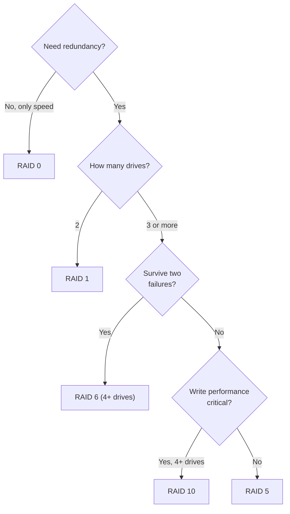
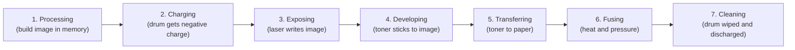

# Core 1 Domain 3: Hardware (25%)

## Overview

Hardware is a quarter of Core 1 and the domain most people picture when they think of A+. It covers displays, cables and connectors, memory, storage and RAID, motherboards and CPUs, firmware settings, cooling, power supplies, and printers. The questions are mostly "compare and contrast" (which part fits this need) and "given a scenario" (install or configure it correctly). Tables are your friend here, and so is an old PC you can take apart.

The objectives are:

- **3.1** Compare and contrast display components and attributes.
- **3.2** Summarize basic cable types and their connectors, features, and purposes.
- **3.3** Compare and contrast RAM characteristics.
- **3.4** Compare and contrast storage devices.
- **3.5** Given a scenario, install and configure motherboards, CPUs, and add-on cards.
- **3.6** Given a scenario, install the appropriate power supply.
- **3.7** Given a scenario, deploy and configure multifunction devices/printers and settings.
- **3.8** Given a scenario, perform appropriate printer maintenance.

## 3.1 Display Components and Attributes

### Display types

| Type | How it works | Strengths | Weaknesses |
|------|-------------|-----------|------------|
| **LCD - IPS** (in-plane switching) | Liquid crystals rotate in the plane of the screen | Best color accuracy and viewing angles | Higher cost, some "IPS glow" |
| **LCD - TN** (twisted nematic) | Crystals twist to block light | Fastest response, cheapest | Poor viewing angles and color |
| **LCD - VA** (vertical alignment) | Crystals align vertically | Best contrast of the LCD types, deep blacks | Slower response than TN, some smearing |
| **OLED** | Each pixel emits its own light | Perfect blacks, thin, fast | Burn-in risk, cost |
| **Mini-LED** | LCD with thousands of tiny LED backlight zones | Bright, good contrast, no burn-in | Some blooming around bright objects |

All LCDs need a backlight. Modern ones use LEDs. Older laptops used a CCFL backlight powered by an **inverter**, which converts DC to the AC the lamp needs. A dim screen you can just see with a flashlight on an older laptop points to a failed inverter or backlight.

**Touch screen/digitizer** - The digitizer is the touch-sensitive layer in front of the display. It can fail separately from the display: the picture is fine, but touches register in the wrong place or not at all.

### Display attributes

| Attribute | Meaning |
|-----------|---------|
| **Resolution** | Pixels across by down, such as 1920 x 1080 (FHD), 2560 x 1440 (QHD), 3840 x 2160 (4K UHD). Use the native resolution for the sharpest image |
| **Pixel density** | Pixels per inch (PPI). A small screen at high resolution looks sharper |
| **Refresh rate** | Times per second the image redraws, in Hz. 60 Hz is standard, 120-240 Hz for gaming |
| **Color gamut** | The range of colors the display can show, measured against standards like sRGB or DCI-P3 |

## 3.2 Cables and Connectors

### Network cables

**Copper twisted pair** is standard Ethernet. The twists cancel interference.

| Category | Speed | Distance |
|----------|-------|----------|
| Cat 5 | 100 Mbps | 100 m |
| Cat 5e | 1 Gbps | 100 m |
| Cat 6 | 1 Gbps (10 Gbps up to about 55 m) | 100 m |
| Cat 6a | 10 Gbps | 100 m |
| Cat 8 | 25/40 Gbps | 30 m |

- **UTP** (unshielded) is the default. **STP** (shielded) adds foil or braid for high-EMI areas such as factory floors or near motors.
- **Plenum-rated** cable has a fire-retardant jacket that produces less toxic smoke. Building codes require it in plenum spaces (the air-handling space above drop ceilings). Standard PVC jacket is "riser" or general purpose.
- **Direct burial** cable is waterproof and UV resistant for burying underground.
- **T568A and T568B** are the two wiring standards. Both ends the same is a **straight-through** cable. One end of each is a **crossover**. Modern ports auto-detect (Auto-MDIX), so crossovers are rarely needed.

**T568B:** white-orange, orange, white-green, blue, white-blue, green, white-brown, brown.
**T568A:** swap the orange and green pairs: white-green, green, white-orange, blue, white-blue, orange, white-brown, brown.

**Coaxial** cable (RG-6) has a single copper core inside shielding. It carries cable TV and cable internet and uses the screw-on **F-type** connector.

**Optical fiber** carries light, is immune to EMI, and runs much further than copper.

| | Single-mode (SMF) | Multimode (MMF) |
|-|-------------------|-----------------|
| Core | Very thin (about 9 microns) | Thicker (50 or 62.5 microns) |
| Light source | Laser | LED or VCSEL |
| Distance | Kilometers | Up to a few hundred meters |
| Cost | Higher optics | Cheaper optics |

### Peripheral cables

| Cable | Speed / notes |
|-------|---------------|
| **USB 2.0** | 480 Mbps. Max about 5 m |
| **USB 3.0** (now called USB 3.2 Gen 1) | 5 Gbps. Blue insert in Type-A ports |
| **USB-C** | A connector, not a speed. Can carry USB 2.0 up to USB4 (40-80 Gbps), DisplayPort, Thunderbolt, and up to 240 W of power with USB PD |
| **Thunderbolt** | Thunderbolt 3 and 4 run 40 Gbps over USB-C connectors. Thunderbolt 5 goes to 80 Gbps. Thunderbolt 1 and 2 used the Mini DisplayPort connector |
| **Serial** | RS-232 with a **DB9** connector. Still used for console ports on switches and routers |

**[📖 USB Implementers Forum](https://www.usb.org/)** - The organization that publishes the USB and USB-C specifications

### Video cables

| Cable | Signal | Audio | Notes |
|-------|--------|-------|-------|
| **HDMI** | Digital | Yes | TVs, projectors, monitors |
| **DisplayPort** | Digital | Yes | Monitors, supports daisy-chaining (MST). Mini DisplayPort is the small version |
| **DVI** | DVI-D digital, DVI-A analog, DVI-I both | No | Legacy monitors |
| **VGA** | Analog | No | Legacy, blue DE-15 connector (often called DB-15) |
| **USB-C** | Digital (DisplayPort alt mode) | Yes | One cable for video, data, and charging |

### Hard drive cables

- **SATA** - Thin 7-pin data cable, separate 15-pin SATA power connector.
- **eSATA** - External SATA. Shielded, no power (unless eSATAp). Largely replaced by USB 3 and Thunderbolt.

### Connector types

| Connector | Used for |
|-----------|----------|
| **RJ11** | Phone lines and DSL. 6 positions, usually 2 or 4 wires |
| **RJ45** | Ethernet. 8 positions, 8 wires |
| **F-type** | Coax |
| **ST** | Fiber, round bayonet (push and twist) |
| **SC** | Fiber, square push-pull |
| **LC** | Fiber, small form factor with a latch. Common on SFP modules |
| **Punchdown block** | Terminates wires on a patch panel or phone block (110 or 66 block) |
| **microUSB, miniUSB, USB-C, Lightning** | Mobile and peripheral devices |
| **Molex** | Legacy 4-pin power for older drives and fans |
| **DB9** | Serial |

**Adapters** convert between connectors, such as USB-C to HDMI or DisplayPort to DVI. An adapter can convert the plug but not always the signal. Going from digital (HDMI) to analog (VGA) needs an active converter.

## 3.3 RAM Characteristics

| Characteristic | Detail |
|----------------|--------|
| **DIMM** | Desktop memory module |
| **SODIMM** | Smaller laptop and small form factor module |
| **DDR iterations** | DDR3, DDR4, DDR5. Each generation is keyed differently, so they cannot be mixed or inserted in the wrong slot |
| **ECC vs non-ECC** | ECC adds error-correcting bits that fix single-bit errors. Used in servers. Needs motherboard and CPU support. Registered (buffered) ECC is a further server variant |
| **Channels** | Single, dual, triple, or quad. Multi-channel runs modules in parallel for more bandwidth. Install matched pairs in the same-colored slots (check the manual) |

| Generation | DIMM pins | SODIMM pins | Voltage |
|------------|-----------|-------------|---------|
| DDR3 | 240 | 204 | 1.5 V (1.35 V for DDR3L) |
| DDR4 | 288 | 260 | 1.2 V |
| DDR5 | 288 | 262 | 1.1 V |

DDR5 includes on-die ECC for reliability inside the chip. That is not the same as full ECC memory, which protects data on the way to the CPU.

## 3.4 Storage Devices

### Hard disk drives

- **Spindle speeds** - 5,400 rpm (quiet, low power), 7,200 rpm (desktop standard), 10,000 and 15,000 rpm (enterprise). Faster spin means lower latency.
- **Form factors** - 3.5-inch (desktops, NAS) and 2.5-inch (laptops, some servers).

### Solid-state drives

| Interface | Speed | Notes |
|-----------|-------|-------|
| **SATA** | Up to about 600 MB/s | Limited by the SATA III 6 Gbps bus. 2.5-inch or M.2 form factor |
| **NVMe over PCIe** | Several GB/s (PCIe 4.0 x4 about 7 GB/s) | Direct PCIe lanes. M.2 or add-in card |
| **SAS** | 12 Gbps and up | Enterprise, dual port, works with SAS controllers |

**Form factors:**
- **M.2** - Small card that plugs straight into the motherboard. Keyed **M** (PCIe x4, NVMe), **B** (SATA or PCIe x2), or **B+M** (fits both). An M.2 SATA SSD in a slot that supports only NVMe will not be detected, and the reverse is also true. Check the motherboard manual.
- **mSATA** - An older, smaller card form factor for SATA SSDs.

### Drive configurations: RAID

RAID combines drives for speed, redundancy, or both. **RAID is not a backup.** It protects against a drive failure, not deletion, ransomware, or fire.

| Level | Method | Min drives | Survives | Usable space | Best for |
|-------|--------|-----------|----------|--------------|----------|
| **0** | Striping | 2 | Nothing | All | Speed only, scratch data |
| **1** | Mirroring | 2 | One drive | Half | Boot drives, simple redundancy |
| **5** | Striping with distributed parity | 3 | One drive | n-1 drives | General file servers |
| **6** | Striping with double parity | 4 | Two drives | n-2 drives | Large arrays where rebuilds take long |
| **10** (1+0) | Striped mirrors | 4 | One drive per mirror pair | Half | Databases, fast and redundant |

A quick decision path for picking a RAID level from the requirement in the question.

**Worked example:** four 2 TB drives. RAID 0 = 8 TB, RAID 5 = 6 TB, RAID 6 = 4 TB, RAID 10 = 4 TB.

### Removable storage

- **Flash drives** - USB. Often FAT32 or exFAT for cross-platform use.
- **Memory cards** - SD, microSD, CompactFlash. Cameras and phones.
- **Optical drives** - CD (700 MB), DVD (4.7 GB single layer, 8.5 GB dual layer), Blu-ray (25 GB per layer). Mostly legacy, still used for archives and some software installs.

## 3.5 Motherboards, CPUs, and Add-on Cards

### Motherboard form factors

| Form factor | Size | Expansion |
|-------------|------|-----------|
| **ATX** | 12 x 9.6 in | Up to 7 expansion slots |
| **microATX** | 9.6 x 9.6 in | Up to 4 slots, fits most ATX cases |
| **ITX** (Mini-ITX) | 6.7 x 6.7 in | 1 slot, small form factor builds |

Smaller boards mean fewer slots, fewer RAM sockets, and tighter **fan and cooling** choices.

### Motherboard connectors

| Connector | Purpose |
|-----------|---------|
| **PCI** | Legacy parallel expansion bus |
| **PCIe** | Serial expansion lanes: x1, x4, x8, x16. A smaller card fits a larger slot. Each generation roughly doubles per-lane speed |
| **Power connectors** | 24-pin (20+4) main, 4/8-pin CPU (EPS) |
| **SATA / eSATA** | Drive connections |
| **Headers** | Front panel (power button, LEDs), front USB, audio, fans, RGB |
| **M.2** | SSDs (keyed M or B) and Wi-Fi cards (keyed E) |

### Compatibility and CPUs

- **CPU socket** must match the CPU. **Intel** uses LGA (land grid array, pins in the socket). **AMD** used PGA (pins on the CPU) through AM4 and moved to LGA with AM5.
- **Chipset** decides which CPUs, memory speeds, and features a board supports. A BIOS update may be needed to support a newer CPU on an older board.
- **Multisocket** boards hold two or more CPUs. Servers and workstations.
- **CPU architecture** - **x86/x64** (Intel, AMD) dominates PCs. **ARM** (Apple silicon, Qualcomm Snapdragon, phones) is more power efficient. Software built for one architecture needs translation or recompiling to run on the other.
- **Core configurations** - Multiple cores run tasks in parallel. Hyper-threading (Intel) and SMT (AMD) present two logical threads per core. Many modern CPUs mix performance cores and efficiency cores.
- **Virtualization support** - Intel VT-x or AMD-V must be enabled in firmware to run 64-bit VMs well.

### BIOS/UEFI settings

UEFI replaced legacy BIOS. It supports GPT disks larger than 2 TB, Secure Boot, a graphical interface, and faster startup.

| Setting | Why it matters |
|---------|---------------|
| **Boot options** | Boot order, USB or network (PXE) boot, UEFI vs legacy/CSM mode |
| **USB permissions** | Disable USB ports or USB boot to stop data theft and unauthorized boot media |
| **TPM** | Enable the Trusted Platform Module for BitLocker and Windows 11 |
| **Secure Boot** | Only boots signed bootloaders. Blocks bootkits and rootkits |
| **Boot password** | Required before the machine will start an OS |
| **BIOS password** | Required to change firmware settings (also called supervisor or admin password) |
| **Temperature monitoring** | Fan curves and alarms |
| **Virtualization support** | Enable VT-x/AMD-V and IOMMU (VT-d) |

### Encryption hardware

- **TPM** - A chip (or firmware function) on the motherboard that stores keys and measures boot integrity. BitLocker stores its key here. Windows 11 requires TPM 2.0.
- **HSM** (hardware security module) - A dedicated, tamper-resistant device (card or appliance) that generates and stores keys for servers, certificate authorities, and payment systems. Think "TPM for one PC, HSM for the data center."

### Expansion cards

Sound cards, video cards (GPUs), capture cards (record video from cameras or game consoles), and network cards. Install in the right slot, connect any extra power (GPUs often need 6/8-pin or 16-pin PCIe power), install drivers, and check Device Manager.

### Cooling

- **Fans** - Case fans set airflow (usually front intake, rear and top exhaust). CPU fans sit on the heat sink.
- **Heat sink** - Metal fins that pull heat from the CPU or GPU.
- **Thermal paste/pads** - Fill microscopic gaps between the chip and heat sink. Replace paste whenever you remove a cooler. Use a pea-sized amount.
- **Liquid cooling** - A pump moves coolant from a block on the CPU to a radiator. Quieter under load, but pumps can fail and leaks are possible.

## 3.6 Power Supplies

| Topic | What to know |
|-------|-------------|
| **Input voltage** | 110-120 VAC in North America, 220-240 VAC in most of the world. Most modern PSUs auto-sense. An older PSU with a manual switch set to 115 V and plugged into 230 V will be destroyed |
| **Output rails** | 3.3 V (orange), 5 V (red), 12 V (yellow). 12 V feeds the CPU and GPU. Black is ground |
| **20+4 pin connector** | Main motherboard connector. The 4 pins detach for older 20-pin boards |
| **Redundant PSU** | Two PSUs in one server, either can carry the load. Hot-swappable |
| **Modular PSU** | Detachable cables, only connect what you need. Better airflow |
| **Wattage rating** | Add up component draw (CPU and GPU dominate) and leave headroom of about 20-30% |
| **Energy efficiency** | 80 PLUS ratings (Bronze, Silver, Gold, Platinum, Titanium). Higher is less wasted heat |

**Safety:** never open a PSU. Capacitors hold a dangerous charge after unplugging. Replace the whole unit.

## 3.7 Multifunction Devices and Printers

### Deployment steps

1. **Unbox properly** - Remove all packing tape and locks (laser printers often have shipping locks). Pick a location with ventilation, power, network, and space for paper trays.
2. **Install the right driver** for the OS and architecture. **PCL** (Printer Control Language, from HP) is fast and widely supported. **PostScript** (from Adobe) is device independent and preferred for graphics and publishing.
3. **Update firmware.**
4. **Connect** by USB, Ethernet, or wireless. Give network printers a DHCP reservation or static IP.
5. **Configure settings** - Duplex (two-sided), orientation, tray settings (paper size and type per tray), quality.

### Sharing

- **Printer share** - A PC shares a locally connected printer. Depends on that PC being on.
- **Print server** - A server hosts the queue, drivers, and permissions for many printers. Better for businesses.

### Security

| Feature | Purpose |
|---------|---------|
| **User authentication** | Require login at the device |
| **Badging** | Tap a badge to release jobs |
| **Audit logs** | Record who printed, scanned, or copied what |
| **Secured prints** | Job waits in the queue until the user enters a PIN or badges at the device, so sensitive pages do not sit in the tray |

### Network scan services

Scan to **email** (SMTP settings), scan to **SMB** folder (share path and credentials), and scan to **cloud services**. The **ADF** (automatic document feeder) scans stacks of pages. The **flatbed** handles books and fragile originals.

## 3.8 Printer Maintenance

### Laser printers

The laser imaging process has seven steps. Know the order.

The seven stages of the laser printing process. Faults in a print usually point to one stage.

**Maintenance:** replace the toner cartridge, apply the **maintenance kit** at the page count the printer reports (new fuser, pickup rollers, transfer roller), calibrate, and clean with a toner vacuum (not a regular vacuum, toner particles are fine enough to pass through normal filters). The fuser runs very hot. Let it cool.

### Inkjet printers

- Parts: **ink cartridge**, **printhead** (sometimes built into the cartridge), **roller**, **feeder**, carriage and belt, duplexer.
- Maintenance: run the **printhead cleaning** utility for streaks and missing colors, **replace cartridges**, **calibrate/align** for misaligned colors or text, and **clear jams** gently.

### Thermal printers

- A heated printhead darkens **special thermal paper**. Used for receipts and shipping labels.
- Parts: **feed assembly** and heating element.
- Maintenance: **replace paper**, **clean the heating element** with isopropyl alcohol, **remove debris**.
- Direct thermal prints fade over time and with heat. Thermal transfer (with a ribbon) lasts longer.

### Impact printers

- Pins strike an inked ribbon against the paper (dot matrix).
- The only type that prints **multipart paper** (carbon copies), so they survive in warehouses and invoicing.
- Maintenance: **replace ribbon**, **printhead**, and **paper** (often tractor-fed continuous paper).

## Exam Tips and Traps

1. **Plenum-rated cable** is the answer whenever the question mentions a drop ceiling or air-handling space.
2. **Single-mode = laser, long distance. Multimode = LED, short distance.**
3. **VGA and DVI carry no audio.** HDMI and DisplayPort do.
4. **SODIMM = laptop. DDR generations are keyed and cannot mix.**
5. **RAID 5 needs 3 drives, RAID 6 and RAID 10 need 4.** RAID 0 has no redundancy.
6. **An M.2 drive not detected** - check whether the slot supports SATA, NVMe, or both.
7. **Enable VT-x/AMD-V in UEFI** before running a hypervisor.
8. **TPM for BitLocker and Windows 11, HSM for servers and CAs.**
9. **Never open a PSU.** Check the input voltage switch on older units.
10. **PostScript for graphics-heavy work, PCL for general office printing.**
11. **Secured print** holds the job until the user authenticates at the device.
12. **Impact printers are the only answer for multipart forms.**

## Related Notes

- [05 - Hardware and Network Troubleshooting](05-hardware-network-troubleshooting.md) - Symptoms for every component in this note
- [04 - Virtualization and Cloud](04-virtualization-cloud.md) - Why virtualization support matters in firmware
- [Fact Sheet](../fact-sheet.md#storage-and-raid) - RAID and cable tables
