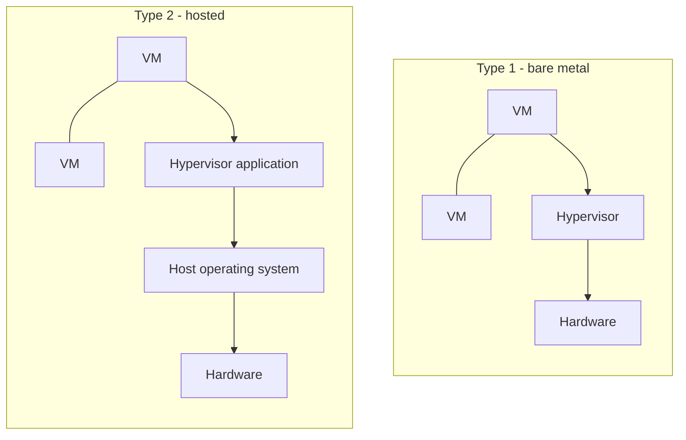
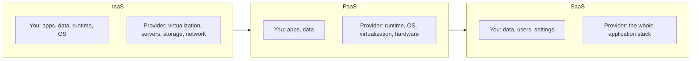

# Core 1 Domain 4: Virtualization and Cloud Computing (11%)

## Overview

This is the smallest Core 1 domain, but it matters more than its weight suggests. Help desk technicians now spin up test VMs, support virtual desktops, and field questions about cloud apps every day. The exam stays at the concept level: why you would use a VM, what kind of hypervisor fits, what a container is, and how cloud services are delivered and billed.

The objectives are:

- **4.1** Explain virtualization concepts.
- **4.2** Summarize cloud computing concepts.

## 4.1 Virtualization Concepts

### What virtualization is

Virtualization lets one physical computer (the **host**) run several isolated operating systems (**guests**, or virtual machines). A layer of software called the **hypervisor** shares the host's CPU, memory, storage, and network among the guests. Each guest believes it has its own hardware.

### Why we use virtual machines

| Purpose | Example |
|---------|---------|
| **Sandbox** | Open a suspicious attachment or test malware removal in a VM that can be thrown away |
| **Test development** | Try a new OS build, patch, or app on a VM before touching production. Snapshots let you roll back in seconds |
| **Application virtualization** | Deliver an app to users without installing it locally. The app runs in an isolated package or on a server |
| **Legacy software/OS** | Keep an old app running on an old OS that no longer runs on modern hardware |
| **Cross-platform virtualization** | Run Linux on a Windows laptop, or Windows on a Mac, for testing or training |

### Hypervisor types

| | Type 1 (bare metal) | Type 2 (hosted) |
|-|--------------------|-----------------|
| **Runs on** | Directly on the hardware | On top of a normal OS |
| **Examples** | VMware ESXi, Microsoft Hyper-V, KVM, Xen | Oracle VirtualBox, VMware Workstation, Parallels Desktop |
| **Performance** | Higher, less overhead | Lower, the host OS takes resources too |
| **Typical use** | Data centers, servers, cloud providers | Desktops and laptops, labs, testing |

A Type 1 hypervisor sits directly on the hardware. A Type 2 hypervisor runs as an application inside a host OS, adding an extra layer.

Hyper-V is a common trick question. When you enable it on Windows 11 Pro it looks like an app, but it actually installs as a Type 1 hypervisor underneath Windows.

### Containers

Containers package an application with its libraries and settings, but share the host's OS kernel instead of carrying a full OS.

| | Virtual machine | Container |
|-|-----------------|-----------|
| **Includes** | Full guest OS | App and dependencies only |
| **Size** | Gigabytes | Megabytes |
| **Start time** | Minutes | Seconds |
| **Isolation** | Strong, separate kernel | Lighter, shared kernel |
| **Examples** | Hyper-V VM, VMware VM | Docker, Podman, Kubernetes pods |

Containers are why "it works on my machine" became "it works everywhere." A Linux container needs a Linux kernel, so on Windows it runs inside a lightweight VM (WSL 2 or Hyper-V).

### Desktop virtualization and VDI

**VDI** (virtual desktop infrastructure) hosts user desktops as VMs in the data center or cloud. Users connect from a thin client, laptop, or browser.

- **Benefits** - Central management and patching, data stays in the data center, works on cheap or personal devices, fast recovery if a laptop is lost.
- **Costs** - Depends on the network. Poor latency means a poor user experience. Server and licensing costs move to the back end.
- **Examples** - Azure Virtual Desktop, Amazon WorkSpaces, Citrix, VMware Horizon.

### Requirements for virtualization

| Area | What to check |
|------|---------------|
| **CPU** | Hardware virtualization (Intel VT-x or AMD-V) enabled in UEFI. Enough cores for host and guests |
| **Memory** | Enough RAM for the host plus every running guest. RAM is usually the first limit you hit |
| **Storage** | Space for virtual disk files, snapshots, and ISO images. SSDs make a big difference |
| **Network** | Virtual switch modes: **bridged** (guest gets its own address on the physical network), **NAT** (guest shares the host's address), **internal/host-only** (guests talk only to each other and the host) |
| **Security** | Patch every guest like a physical machine. Isolate test and malware VMs from production networks. Protect snapshot files, which contain full disk images. Watch for VM sprawl, forgotten VMs that never get patched |

## 4.2 Cloud Computing Concepts

**[📖 NIST SP 800-145 - The NIST Definition of Cloud Computing](https://csrc.nist.gov/pubs/sp/800/145/final)** - The standard definition behind the service and deployment models

### Deployment models

| Model | Who uses it | Example |
|-------|-------------|---------|
| **Public** | Anyone, shared provider infrastructure | AWS, Microsoft Azure, Google Cloud |
| **Private** | One organization, on premises or dedicated hosting | A company's own VMware cluster |
| **Hybrid** | A mix of public and private, connected | On-premises Active Directory synced to Microsoft Entra ID, with apps in the cloud |
| **Community** | Several organizations with shared needs | A government cloud shared by agencies, or a healthcare consortium |

### Service models

The service model decides who manages what. The higher you go, the less you manage.

| Model | You manage | Provider manages | Example |
|-------|------------|------------------|---------|
| **IaaS** | OS, patches, apps, data | Hardware, virtualization, network | Azure VMs, Amazon EC2 |
| **PaaS** | Your application code and data | OS, runtime, scaling | Azure App Service, Google App Engine, AWS Elastic Beanstalk |
| **SaaS** | Your data and user settings | Everything else | Microsoft 365, Gmail, Salesforce |

The split of responsibility shifts toward the provider as you move from IaaS to PaaS to SaaS.

**Memory hook:** IaaS gives you a virtual server. PaaS gives you a place to run code. SaaS gives you a finished app you log in to.

### Cloud characteristics

| Characteristic | Meaning |
|----------------|---------|
| **Shared vs dedicated resources** | Most cloud runs on shared hardware. Dedicated hosts or instances cost more but meet compliance or licensing needs |
| **Metered utilization** | Pay for what you use, measured per second, hour, GB, or request |
| **Ingress/egress** | Data coming in (ingress) is usually free. Data going out (egress) is usually charged. Large downloads from the cloud can surprise a budget |
| **Elasticity** | Resources grow and shrink automatically with demand |
| **Availability** | Providers spread services across data centers and regions. Uptime is set by the SLA |
| **File synchronization** | Services such as OneDrive, Google Drive, and iCloud keep files the same across devices and the cloud |
| **Multitenancy** | Many customers share the same infrastructure, isolated from each other logically |

**Elasticity vs scalability:** scalability is the ability to grow. Elasticity is growing and shrinking automatically as load changes. The exam's word is "elasticity."

### Support angle

Cloud questions on A+ are usually framed from the help desk:

- A user cannot open a SaaS app - check internet access, identity (MFA, account lockout), license assignment, and the provider status page before blaming the PC.
- Sync conflicts - two devices edited the same file offline. The sync client keeps both copies with different names.
- Unexpected cloud bill - egress charges or resources left running. Metered billing means idle VMs still cost money.

## Exam Tips and Traps

1. **Type 1 = bare metal (ESXi, Hyper-V). Type 2 = runs on an OS (VirtualBox, Workstation).**
2. **Enable VT-x or AMD-V in UEFI** when a hypervisor says virtualization is not available.
3. **Containers share the host kernel.** VMs each have their own OS.
4. **Sandbox** is the answer for testing suspicious files safely.
5. **VDI keeps data in the data center.** A lost laptop exposes nothing.
6. **SaaS = you only manage data and users.** IaaS = you patch the OS.
7. **Community cloud** is shared by organizations with a common mission or compliance need.
8. **Egress** is the charge for data leaving the cloud.
9. **Elasticity** is automatic scale up and down.
10. **Multitenancy** means shared infrastructure with logical isolation.

## Related Notes

- [03 - Hardware](03-hardware.md#35-motherboards-cpus-and-add-on-cards) - UEFI virtualization settings and CPU architecture
- [06 - Operating Systems](06-operating-systems.md#111-cloud-based-productivity-tools) - Configuring cloud productivity tools in Core 2
- [Fact Sheet](../fact-sheet.md) - Quick reference tables
