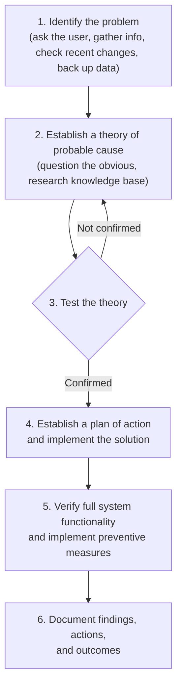
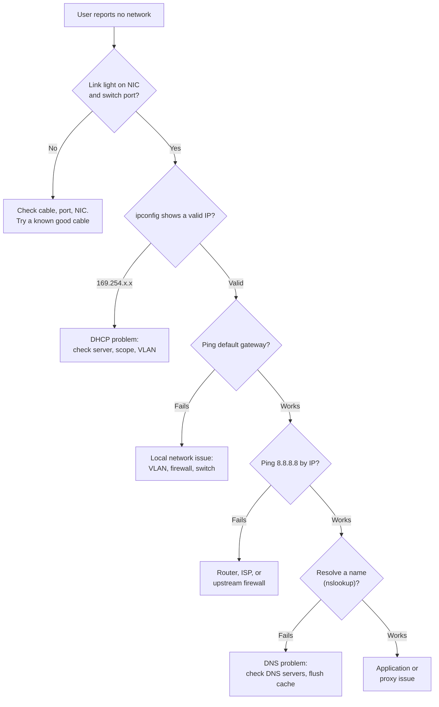

# Core 1 Domain 5: Hardware and Network Troubleshooting (28%)

## Overview

This is the heaviest Core 1 domain, at 28%. Every objective starts "Given a scenario, troubleshoot..." and lists common symptoms. The skill being tested is simple to state and hard to fake: read a symptom, name the most likely cause, and pick the right next step. This note is organized as symptom tables for that reason.

The objectives are:

- **5.1** Troubleshoot motherboards, RAM, CPUs, and power.
- **5.2** Troubleshoot drive and RAID issues.
- **5.3** Troubleshoot video, projector, and display issues.
- **5.4** Troubleshoot common mobile device issues.
- **5.5** Troubleshoot network issues.
- **5.6** Troubleshoot printer issues.

## The Troubleshooting Methodology

In the V15 objectives, CompTIA prints the troubleshooting methodology as a "competency standard" and states that it is **not** a formal tested objective in 220-1201. Learn it anyway. It is the thinking every scenario question expects, it still appears in training material, and it is tested on Network+.

The six-step troubleshooting methodology from the A+ objectives document. If a theory fails, you form a new one, or escalate.

Practical rules that fall out of it:

- **Back up data before making changes** when the problem involves storage or the OS.
- **Question the obvious.** Is it plugged in? Is the monitor on the right input? Is Wi-Fi turned off?
- **Change one thing at a time**, so you know which change fixed it.
- **Escalate** when the fix is outside your authority or skill.

## 5.1 Motherboards, RAM, CPUs, and Power

| Symptom | Likely causes | What to do |
|---------|---------------|------------|
| **POST beeps** | Firmware reporting a hardware fault before video starts. Patterns vary by BIOS vendor | Look up the beep code in the motherboard manual. Common culprits: RAM not seated, no video card, CPU fault |
| **Proprietary crash screens** (BSOD on Windows, kernel panic on macOS/Linux) | Faulty RAM, drivers, overheating, failing drive | Note the stop code, check Event Viewer, run memory diagnostics |
| **Blank screen** | No power to monitor, wrong input, loose cable, failed GPU, bad RAM (no POST) | Check power and input first, try another cable and display, listen for beeps |
| **No power** | Unplugged, power strip off, failed PSU, loose 24-pin, front panel switch header | Check the outlet, test the PSU with a PSU tester or multimeter, reseat connectors |
| **Sluggish performance** | Overheating and throttling, not enough RAM, failing drive, malware | Check temperatures and Task Manager, clean dust |
| **Overheating** | Dust, failed fan, dried thermal paste, blocked vents | Clean with compressed air, replace fan, reapply thermal paste |
| **Burning smell** | Failing PSU or component, shorted circuit | Power off immediately and unplug. Inspect. Replace the part |
| **Random shutdown** | Overheating, failing PSU, bad RAM | Check temperatures and PSU voltages. Event Viewer shows "unexpected shutdown" (Kernel-Power 41) |
| **Application crashes** | Bad RAM, driver issue, overheating | Run a memory test, update drivers |
| **Unusual noise** | Failing fan bearing (grinding, whining), coil whine, loose screw | Identify the source. Replace failing fans |
| **Capacitor swelling** | Bulging or leaking capacitors on motherboard or PSU | Replace the board or PSU. Do not repair |
| **Inaccurate system date/time** | Dead CMOS battery (CR2032) | Replace the coin cell battery, reset date and time in UEFI |

**RAM checks:** reseat modules, test one stick at a time, try a different slot, run Windows Memory Diagnostic (`mdsched.exe`) or MemTest86.

## 5.2 Drives and RAID

| Symptom | Likely causes | What to do |
|---------|---------------|------------|
| **LED status indicators** | Amber or red drive LEDs on servers and NAS units show a failed or failing drive | Replace the flagged drive, let the array rebuild |
| **Grinding noises** | Mechanical failure in an HDD | Back up immediately, replace |
| **Clicking sounds** ("click of death") | Head failure in an HDD | Back up if still possible, replace. Consider data recovery services |
| **Bootable device not found** | Wrong boot order, failed drive, corrupt boot sector, disconnected cable, UEFI vs legacy mode mismatch | Check UEFI boot order and mode, reseat cables, test the drive, repair boot records |
| **Data loss/corruption** | Failing drive, bad shutdown, malware | Restore from backup, run `chkdsk`, check S.M.A.R.T. |
| **RAID failure** | One or more drives failed, controller failure | Identify the failed drive, replace it, rebuild. On RAID 0 the data is gone |
| **S.M.A.R.T. failure** | The drive's own health monitoring predicts failure | Back up now, replace proactively |
| **Extended read/write times** | Failing drive, fragmentation on HDD, nearly full disk | Check health, free space, defragment HDDs (never defragment SSDs, Windows runs TRIM instead) |
| **Low IOPS** | Slow drive type, degraded array rebuilding, contention | Move to SSD, wait for rebuild, spread the load |
| **Missing drives in OS** | New drive not initialized, no drive letter, cable, driver | Open Disk Management, initialize, create a volume, assign a letter |
| **Array missing** | RAID controller failed or lost its configuration, driver missing | Check controller BIOS and driver. Do not initialize the disks, that destroys data |
| **Audible alarms** | RAID controller warning of a degraded or failed array | Check the controller utility, replace the failed drive |

**Key point:** a degraded RAID 5 array is running without protection. One more failure loses the array. Replace the failed drive quickly, and make sure backups are current before the rebuild, because rebuilds stress the remaining drives.

## 5.3 Video, Projector, and Display

| Symptom | Likely causes | What to do |
|---------|---------------|------------|
| **Incorrect input source** | Display set to HDMI 2 while the cable is on HDMI 1 | Change the input with the monitor or projector buttons |
| **Physical cabling issues** | Loose, damaged, or wrong cable. VGA with bent pins | Reseat, swap the cable |
| **Burnt-out bulb** (projector) | Lamps have a rated life in hours | Replace the lamp and reset the lamp timer. Let it cool first |
| **Fuzzy image** | Not at native resolution, analog connection, focus (projector) | Set native resolution, use a digital cable, adjust focus |
| **Display burn-in** | Static image left on OLED or plasma for long periods | Use screen savers and auto-off. Burn-in may be permanent |
| **Dead pixels** | Individual pixels stuck black (dead) or on a color (stuck) | Check warranty pixel policy. Replace the panel if bad enough |
| **Flashing screen** | Loose cable, refresh rate mismatch, driver, failing backlight | Reseat cable, update driver, set correct refresh rate |
| **Incorrect color display** | Loose or damaged cable (missing pin), wrong color profile, failing GPU | Swap cable, calibrate, test another display |
| **Audio issues** | HDMI/DP audio routed to the wrong device, muted display speakers | Select the correct output device in the OS |
| **Dim image** | Brightness setting, power saving, failing backlight or inverter, projector lamp near end of life | Check settings first, then hardware |
| **Intermittent projector shutdown** | Overheating (clogged filter, blocked vents), failing lamp | Clean filters, improve ventilation |
| **Sizing issues** | Wrong resolution or scaling, overscan on TVs | Adjust resolution, scaling, and overscan settings |
| **Distorted image** | Wrong resolution, keystone on projector, damaged cable | Fix resolution, adjust keystone correction |

## 5.4 Mobile Device Issues

| Symptom | Likely causes | What to do |
|---------|---------------|------------|
| **Poor battery health** | Age and charge cycles, heat | Check battery health, replace battery |
| **Swollen battery** | Lithium-ion failure, overcharging, heat | Stop using the device immediately. Do not charge. Replace and dispose via battery recycling |
| **Broken screen** | Physical damage | Replace the display assembly or digitizer |
| **Improper charging** | Dirty or damaged port, bad cable or adapter, underpowered charger | Clean the port with a non-conductive tool, try a known good cable and charger |
| **Poor/no connectivity** | Airplane mode, weak signal, SIM or eSIM issue, antenna damage | Toggle radios, reseat SIM, check carrier, forget and rejoin Wi-Fi |
| **Liquid damage** | Water or spills. Liquid contact indicators turn red | Power off, do not charge, dry and inspect. Often not covered by warranty |
| **Overheating** | Heavy apps, charging while gaming, blocked vents, failing battery | Close apps, remove case, check battery |
| **Digitizer issues** | Touch layer damaged or out of calibration | Recalibrate, remove screen protector, replace digitizer |
| **Physically damaged ports** | Bent pins, broken connectors | Replace port or board |
| **Malware** | Sideloaded or malicious apps | Remove the app, scan, factory reset if needed. Covered further in Core 2 |
| **Cursor drift/touch calibration** | Trackpad or digitizer calibration, swollen battery pushing on the trackpad | Recalibrate. A swollen battery under the trackpad is a classic cause on laptops |
| **Unable to install new applications** | Storage full, OS too old, MDM policy blocks it | Free space, update the OS, check MDM restrictions |
| **Stylus does not work** | Needs charging or pairing, wrong stylus type for the screen | Charge and pair, confirm compatibility |
| **Degraded performance** | Storage full, old OS, too many background apps, battery throttling | Free space, update, restart |

## 5.5 Network Issues

| Symptom | Likely causes | What to do |
|---------|---------------|------------|
| **Intermittent wireless connectivity** | Interference, weak signal, overlapping channels, roaming problems | Use a Wi-Fi analyzer, change channel, move or add access points |
| **Slow network speeds** | Congestion, duplex mismatch, bad cable, legacy Wi-Fi client, ISP throttling | Test wired vs wireless, check link speed, replace cable |
| **Limited connectivity** | APIPA address (DHCP failure), wrong gateway, wrong VLAN | Run `ipconfig`, check DHCP, verify gateway and VLAN |
| **Jitter** | Variation in packet arrival times, congestion | Enable QoS for voice and video, reduce congestion |
| **Poor VoIP quality** | Jitter, latency, packet loss | QoS, wired connection for phones, check bandwidth |
| **Port flapping** | A switch port going up and down repeatedly: bad cable, failing NIC, duplex mismatch | Replace cable, test NIC, check switch logs |
| **High latency** | Long distance (satellite), congestion, routing issues | `tracert`/`pathping` to find the slow hop |
| **External interference** | Microwaves, cordless phones, Bluetooth, neighboring networks on 2.4 GHz, EMI near motors and power lines | Move to 5/6 GHz, shielded cable, reroute cables away from power |
| **Authentication failures** | Wrong Wi-Fi passphrase, expired certificate, 802.1X/RADIUS problem, account locked | Verify credentials and certificates, check the RADIUS server |
| **Intermittent internet connectivity** | ISP issues, modem overheating, DNS failures | Check modem logs, test by IP vs by name, contact ISP |

### A fast network isolation path

A bottom-up path for isolating a network fault, from physical link to DNS.

## 5.6 Printer Issues

| Symptom | Likely causes | What to do |
|---------|---------------|------------|
| **Lines down the printed pages** | Laser: scratched drum or dirty corona wire. Inkjet: clogged nozzles | Replace drum/toner cartridge, clean. Run printhead cleaning on inkjets |
| **Garbled print** | Wrong or corrupt driver, wrong printer language (PCL vs PostScript) | Reinstall the correct driver, clear the queue |
| **Paper jams** | Worn pickup rollers, wrong paper type or weight, humid paper, debris | Clear carefully, replace rollers, use correct paper |
| **Faded prints** | Low toner or ink, economy mode, low print density setting | Replace cartridge, change settings |
| **Paper not feeding** | Worn pickup rollers, wrong tray setting, overfilled tray | Clean or replace rollers, check tray configuration |
| **Multipage misfeed** (several sheets at once) | Worn separation pad, static, humid paper | Fan the paper, replace separation pad |
| **Multiple prints pending in queue** | Stuck job at the front of the queue, printer offline | Clear the stuck job, restart the Print Spooler service |
| **Speckling on printed pages** | Loose toner inside the printer, damaged drum | Clean the printer with a toner vacuum, replace the cartridge |
| **Double/echo images** (ghosting) | Drum not fully cleaned or discharged, fuser issue | Replace drum or cartridge, check cleaning blade |
| **Grinding noise** | Stripped gears, fuser failure, obstruction | Inspect, clear debris, replace failed assembly |
| **Finishing issues** (staple jams, hole punch) | Finisher jam, wrong paper type, empty staple cartridge, full punch waste bin | Clear jam, refill staples, empty punch bin |
| **Incorrect page orientation** | Driver or application setting | Set orientation in the print dialog or driver defaults |
| **Tray not recognized** | Tray not seated, sensor fault, not enabled in the driver | Reseat, enable tray in device settings |
| **Connectivity issues** | IP changed, Wi-Fi dropped, wrong port, offline | Use a DHCP reservation, check network, re-add printer |
| **Frozen print queue** | Stuck spooler | Stop the Print Spooler service, clear `C:\Windows\System32\spool\PRINTERS`, restart the service |

**Toner not fused (smears or rubs off)** is also common in questions even though it is not in the list above: the fuser is failing.

## Hardware Tools for Troubleshooting

| Tool | Use |
|------|-----|
| **Multimeter** | Measure voltage, resistance, continuity |
| **PSU tester** | Quick check of all PSU rails |
| **POST card** | Shows POST codes on a display when the PC has no video |
| **Loopback plug** | Test NIC ports |
| **Cable tester and toner probe** | Verify and trace network cables |
| **Wi-Fi analyzer** | Find channel overlap and weak signal |

## Exam Tips and Traps

1. **Wrong date and time after power off** means the CMOS battery is dead.
2. **Swollen capacitors or battery** - replace, never repair.
3. **Clicking or grinding HDD** - back up first, then replace.
4. **Drive not in File Explorer** - check Disk Management for an uninitialized disk.
5. **Array missing** - do not initialize the drives.
6. **Ghost images** - drum or cleaning. **Smearing** - fuser. **Garbled** - driver.
7. **Frozen print queue** - restart the Print Spooler.
8. **169.254 address** - DHCP. **Ping by IP works but not by name** - DNS.
9. **Jitter and VoIP** - QoS. **Port flapping** - cable or NIC.
10. **Projector shuts off by itself** - overheating, clean the filter.
11. **Cursor drifting on a laptop trackpad** - consider a swollen battery.
12. **Always check the obvious first**: power, cables, input source, radios on.

## Related Notes

- [03 - Hardware](03-hardware.md) - How each component works
- [02 - Networking](02-networking.md) - Addressing, DHCP, Wi-Fi background for 5.5
- [01 - Mobile Devices](01-mobile-devices.md) - Mobile parts and connectivity
- [08 - Software Troubleshooting](08-software-troubleshooting.md) - The Core 2 counterpart for OS and app issues
