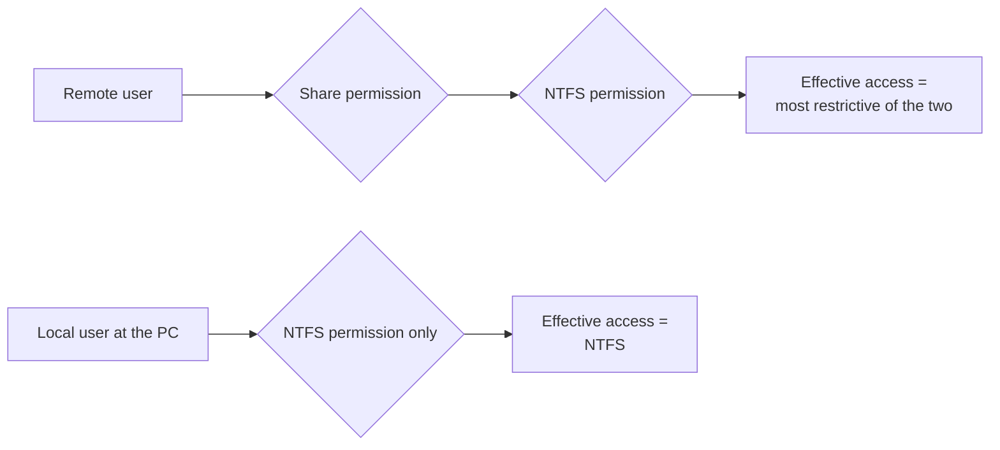
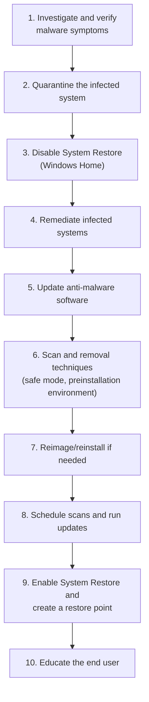

# Core 2 Domain 2: Security (28%)

## Overview

Security ties with Operating Systems as the largest Core 2 domain. It is the technician's view of security: physical and logical controls, securing Windows, wireless protocols, malware and how to remove it, social engineering, hardening workstations and phones, destroying data safely, and locking down SOHO routers and browsers. It overlaps with Security+ but stays practical. Expect "given a scenario, configure" questions, and a PBQ that orders the malware removal steps.

The objectives are:

- **2.1** Summarize various security measures and their purposes.
- **2.2** Given a scenario, configure and apply basic Microsoft Windows OS security settings.
- **2.3** Compare and contrast wireless security protocols and authentication methods.
- **2.4** Summarize types of malware and tools/methods for detection, removal, and prevention.
- **2.5** Compare and contrast common social engineering attacks, threats, and vulnerabilities.
- **2.6** Given a scenario, implement procedures for basic SOHO malware removal.
- **2.7** Given a scenario, apply workstation security options and hardening techniques.
- **2.8** Given a scenario, apply common methods for securing mobile devices.
- **2.9** Compare and contrast common data destruction and disposal methods.
- **2.10** Given a scenario, apply security settings on SOHO wireless and wired networks.
- **2.11** Given a scenario, configure relevant security settings in a browser.

## 2.1 Security Measures

### Physical security

| Control | Purpose |
|---------|---------|
| **Bollards** | Posts that stop vehicles reaching a building |
| **Access control vestibule** | Two-door space where only one door opens at a time. Stops tailgating (formerly called a mantrap) |
| **Badge reader** | Grants entry by badge, logs who entered |
| **Video surveillance** | Deters and records |
| **Alarm systems, motion sensors** | Detect intrusion |
| **Door locks, equipment locks** | Keep rooms and devices (cable locks on laptops) secure |
| **Security guards** | Human judgment, can challenge visitors |
| **Fences, lighting** | Deter and define the perimeter |
| **Magnetometers** | Metal detectors at entrances |

### Physical access security

Key fobs, smart cards, mobile digital keys (phone as badge), physical keys, and **biometrics**: retina scanner, fingerprint scanner, palm print scanner, facial recognition technology (FRT), and voice recognition.

### Logical security

| Concept | Meaning |
|---------|---------|
| **Principle of least privilege** | Give users only the access they need for their job |
| **Zero Trust model** | Never trust by network location. Verify every request |
| **ACLs** | Lists that allow or deny access to files, folders, or network traffic |
| **MFA** | Two or more different factor types: something you know, have, or are. Delivery methods include **email**, **hardware token**, **authenticator application**, **SMS**, **voice call**, **TOTP** (time-based one-time password), and **OTP** |
| **SAML** | XML standard for passing authentication between an identity provider and a service. Powers many SSO logins |
| **SSO** | Sign in once, reach many apps |
| **Just-in-time access** | Admin rights granted only for a short window when needed |
| **PAM** (privileged access management) | Vaults, monitors, and time-limits admin accounts |
| **MDM** | Manages and secures mobile devices |
| **DLP** (data loss prevention) | Detects and blocks sensitive data leaving (email, USB, cloud uploads) |
| **IAM** | Identity and access management: the process and systems for accounts and permissions |
| **Directory services** | Central identity store, such as Active Directory |

**MFA strength:** SMS and voice codes can be intercepted by SIM swapping, so authenticator apps and hardware tokens are stronger. Two passwords are not MFA, they are the same factor.

## 2.2 Windows Security Settings

### Microsoft Defender Antivirus and Firewall

- **Defender Antivirus** - Built in. Activate or deactivate (it disables itself when a third-party antivirus is installed), and update definitions (through Windows Update or manually).
- **Defender Firewall** - Activate or deactivate per profile, configure **port security** (allow only needed ports), and **application security** (allow specific apps).

**[📖 Microsoft Defender Antivirus in Windows](https://learn.microsoft.com/en-us/defender-endpoint/microsoft-defender-antivirus-windows)** - How the built-in antivirus works and is managed

### Users and groups

| Account | Rights |
|---------|--------|
| **Administrator** | Full control. Use only when needed |
| **Standard user** | Daily use. Cannot install system-wide software or change system settings without admin credentials |
| **Guest** | Very limited, disabled by default. Keep it disabled |
| **Power user** | Legacy group, kept for compatibility. Has more rights than standard users |
| **Local vs Microsoft account** | A local account exists on one PC. A Microsoft account syncs settings and OneDrive across PCs |

### Log-in options

Username and password, **PIN** (tied to the device and TPM, not usable remotely), **fingerprint**, **facial recognition**, **SSO**, and **Windows Hello / passwordless**.

**[📖 Windows Hello for Business](https://learn.microsoft.com/en-us/windows/security/identity-protection/hello-for-business/)** - Microsoft's passwordless sign-in documentation

### NTFS vs share permissions

This is one of the most tested concepts in the domain.

| | NTFS permissions | Share permissions |
|-|------------------|-------------------|
| **Applies to** | Local and network access | Network access only |
| **Granularity** | Full control, modify, read and execute, list, read, write | Full control, change, read |
| **Where set** | Security tab | Sharing tab, Advanced Sharing |

- **Combined rule:** when accessing over the network, the **most restrictive** of the share and NTFS permissions wins.
- **Inheritance:** folders and files inherit permissions from their parent unless inheritance is disabled.
- **Move vs copy:** moving a file within the same NTFS volume keeps its permissions. Copying, or moving to a different volume, takes the destination folder's permissions.
- **Explicit deny** beats allow.
- **File and folder attributes** such as read-only, hidden, and archive are separate from permissions.

Network access passes through both share and NTFS permissions, and the stricter one wins. Local access uses NTFS alone.

### Run as administrator and UAC

- **Run as administrator** elevates one app with admin rights.
- **User Account Control (UAC)** prompts before changes that need admin rights. It stops malware silently making system changes. Do not turn it off.

### Encryption

| Tool | Protects | Notes |
|------|----------|-------|
| **BitLocker** | Whole drive | Pro and higher. Uses TPM. Save the recovery key (Microsoft account, AD, or Entra ID) |
| **BitLocker To Go** | Removable drives | Password or smart card to unlock |
| **EFS** (Encrypting File System) | Individual files and folders on NTFS | Tied to the user's certificate. Lose the certificate, lose the files |

**[📖 BitLocker Overview](https://learn.microsoft.com/en-us/windows/security/operating-system-security/data-protection/bitlocker/)** - Microsoft's BitLocker documentation

### Active Directory tasks

The objective lists the tasks a technician does in AD:

- **Joining a domain** - System properties, needs a Pro or higher edition and domain admin (or delegated) credentials.
- **Assigning a log-in script** - Runs at sign-in, often to map drives.
- **Moving objects within organizational units (OUs)** - Moving a user or computer to another OU changes which Group Policy applies.
- **Assigning home folders** - A personal network folder for each user.
- **Applying Group Policy** - Linked to sites, domains, or OUs. Refresh with `gpupdate /force`.
- **Selecting security groups** - Assign permissions to groups, not individuals.
- **Configuring folder redirection** - Stores Documents and Desktop on a server, so they follow the user and get backed up.

**[📖 Active Directory Domain Services Overview](https://learn.microsoft.com/en-us/windows-server/identity/ad-ds/get-started/virtual-dc/active-directory-domain-services-overview)** - How AD DS stores and manages identities

## 2.3 Wireless Security and Authentication

### Protocols and encryption

| Protocol | Encryption | Status |
|----------|-----------|--------|
| **WEP** | RC4 | Broken. Never use (not in the V15 list but still a distractor) |
| **WPA** with **TKIP** | TKIP (RC4-based) | Deprecated |
| **WPA2** | **AES** (CCMP) | Acceptable. Personal (pre-shared key) or Enterprise (802.1X) |
| **WPA3** | AES (GCMP in Enterprise 192-bit) | Current best. **SAE** replaces the pre-shared key handshake and resists offline password guessing. Required on 6 GHz |

### Authentication

| Method | Key facts |
|--------|-----------|
| **RADIUS** | Open standard. UDP 1812/1813. Combines authentication and authorization. Encrypts only the password. Used for Wi-Fi 802.1X and VPNs |
| **TACACS+** | Cisco-developed. TCP 49. Separates authentication, authorization, and accounting. Encrypts the whole payload. Used for network device admin logins |
| **Kerberos** | Ticket-based. Used by Active Directory. Needs accurate clocks (within 5 minutes by default) |
| **Multifactor** | Combine factors on top of any of these |

## 2.4 Malware

### Types

| Malware | Behavior |
|---------|----------|
| **Trojan** | Pretends to be useful software, carries a hidden payload |
| **Rootkit** | Hides deep in the OS or firmware, conceals itself and other malware. Hard to remove. Often means reimage |
| **Virus** | Attaches to files and spreads when they run. Needs user action |
| **Spyware** | Secretly collects information |
| **Ransomware** | Encrypts files and demands payment |
| **Keylogger** | Records keystrokes to steal passwords |
| **Boot sector virus** | Infects the boot record, runs before the OS. Secure Boot helps prevent it |
| **Cryptominer** | Uses your CPU/GPU to mine cryptocurrency. Symptom: high CPU and heat |
| **Stalkerware** | Spyware installed by someone the victim knows, to track location and messages |
| **Fileless** | Runs in memory using legitimate tools (PowerShell, WMI). Leaves few files for antivirus to find |
| **Adware** | Unwanted ads, pop-ups, browser changes |
| **PUP** (potentially unwanted program) | Bundled toolbars and "optimizers." Not always malicious, usually unwanted |

### Tools and methods

| Tool | Purpose |
|------|---------|
| **Recovery console / Windows RE** | Offline repair environment |
| **Antivirus / anti-malware** | Signature and behavior-based detection |
| **EDR** (endpoint detection and response) | Monitors endpoint behavior, detects and responds to attacks |
| **MDR** (managed detection and response) | EDR run for you by an outside security team |
| **XDR** (extended detection and response) | Correlates signals across endpoints, email, network, and cloud |
| **Email security gateway** | Filters malicious attachments and links before delivery |
| **Software firewalls** | Block unwanted connections |
| **User education** | Antiphishing training. The single best defense against social engineering |
| **OS reinstallation** | The sure fix for rootkits and deep infections |

## 2.5 Social Engineering, Threats, and Vulnerabilities

### Social engineering

| Attack | Description |
|--------|-------------|
| **Phishing** | Fraudulent email to steal credentials or deliver malware |
| **Vishing** | Voice phishing by phone |
| **Smishing** | SMS phishing |
| **QR code phishing** | Malicious QR codes (stickers over real ones, emails with codes) |
| **Spear phishing** | Targeted at a specific person or group |
| **Whaling** | Spear phishing aimed at executives |
| **Shoulder surfing** | Watching someone type a password. Use privacy screens |
| **Tailgating** | Following an authorized person through a secure door. Prevent with vestibules and awareness |
| **Impersonation** | Pretending to be IT, a vendor, or a boss |
| **Dumpster diving** | Searching trash for information. Shred documents |

### Threats

| Threat | Description |
|--------|-------------|
| **DoS / DDoS** | Overwhelm a service (one source / many sources) |
| **Evil twin** | Rogue access point with a legitimate-looking SSID |
| **Zero-day** | Exploit for a flaw with no patch yet |
| **Spoofing** | Faking an identity: email sender, IP, MAC, caller ID |
| **On-path attack** | Intercepting traffic between two parties (formerly man-in-the-middle) |
| **Brute-force** | Trying every combination. Stopped by lockout and long passwords |
| **Dictionary attack** | Trying common words and leaked passwords |
| **Insider threat** | A trusted person misusing access |
| **SQL injection** | Malicious SQL in input fields |
| **XSS** (cross-site scripting) | Malicious script injected into a web page runs in other users' browsers |
| **BEC** (business email compromise) | Impersonating an executive or supplier to redirect payments |
| **Supply chain/pipeline attack** | Compromising a vendor or software update to reach its customers |

### Vulnerabilities

Non-compliant systems, unpatched systems, unprotected systems (missing antivirus or firewall), **EOL** operating systems, and **BYOD** devices outside IT's control.

## 2.6 SOHO Malware Removal

CompTIA lists the procedure in ten numbered steps. Learn the order exactly: PBQs ask you to arrange it.

The ten-step malware removal procedure from objective 2.6. Steps 4 to 7 are the remediation phase.

Why each step matters:

- **Quarantine** stops the malware spreading. Disconnect from the network, and do not plug in USB drives from other machines.
- **Disable System Restore** because restore points may contain the malware. Once clean, re-enable it and create a fresh, clean restore point.
- **Update anti-malware before scanning** so the newest signatures are used. If the malware blocks updates, download definitions on a clean machine.
- **Safe Mode or a preinstallation environment (WinPE)** stops the malware loading, so the scanner can remove it.
- **Reimage** when you cannot be sure the system is clean, such as with rootkits.
- **Educate the user** so it does not happen again.

## 2.7 Workstation Hardening

| Area | Settings |
|------|----------|
| **Data-at-rest encryption** | BitLocker, FileVault, device encryption |
| **Passwords** | Length (the biggest factor), character types, uniqueness, complexity, expiration (current guidance favors long passphrases without forced frequent change unless compromise is suspected), password managers |
| **BIOS/UEFI passwords** | Stop boot-order changes and booting from USB |
| **End-user practices** | Screensaver locks, log off when not in use (Windows+L), secure critical hardware (lock laptops away), protect PII and passwords (no sticky notes) |
| **Account management** | Restrict user permissions, restrict log-in times, disable the guest account, failed-attempt lockout, timeout/screen lock, account expiration dates for contractors |
| **Default admin account** | Rename or disable it and change the default password |
| **Disable AutoRun** | Stop USB and optical media running code on insertion |
| **Disable unused services** | Smaller attack surface |

## 2.8 Securing Mobile Devices

| Area | Methods |
|------|---------|
| **Hardening** | Device encryption. Screen locks: facial recognition, PIN, fingerprint, pattern, swipe (swipe is not a security lock). Configuration profiles |
| **Patch management** | OS updates and application updates |
| **Endpoint security** | Antivirus, anti-malware, content filtering |
| **Locator applications** | Find My (Apple), Find My Device (Google) |
| **Remote wipes** | Erase a lost or stolen device |
| **Remote backup** | iCloud, Google backup, corporate backup apps |
| **Failed log-in restrictions** | Lockout or wipe after too many wrong attempts |
| **Policies and procedures** | MDM enforcement, BYOD vs corporate-owned rules, profile security requirements (minimum passcode, encryption, OS version) |

## 2.9 Data Destruction and Disposal

### Physical destruction

| Method | Works on | Notes |
|--------|----------|-------|
| **Drilling** | HDDs, SSDs | Drill through platters or flash chips. Quick but may leave some chips intact on SSDs |
| **Shredding** | All media | Industrial shredder. Most certain |
| **Degaussing** | Magnetic media only (HDDs, tapes) | Strong magnetic field erases data and usually destroys the drive. **Does not work on SSDs** |
| **Incineration** | All media | Burn to ash. Usually outsourced |

### Recycling or repurposing

| Method | Result |
|--------|--------|
| **Erasing/wiping** | Overwrite the whole drive. For SSDs use the drive's secure erase or crypto erase. The drive can be reused |
| **Low-level formatting** | Factory-level format, now done by the manufacturer. Often used loosely to mean a full wipe |
| **Standard formatting** | Quick format only removes the file table. **Data is recoverable.** Not a secure method |

### Outsourcing and compliance

- **Third-party vendor** - A certified destruction or recycling company.
- **Certificate of destruction/recycling** - Proof for auditors that media was destroyed.
- **Regulatory and environmental requirements** - Data regulations (HIPAA, GDPR, and similar) and e-waste laws.

**[📖 NIST SP 800-88 - Guidelines for Media Sanitization](https://csrc.nist.gov/pubs/sp/800/88/r1/final)** - Clear, purge, and destroy methods for every media type

## 2.10 SOHO Network Security

### Router settings

- **Change default passwords** - The first thing to do.
- **IP filtering** - Allow or block by address.
- **Firmware updates** - Fix vulnerabilities.
- **Content filtering** - Block categories of websites.
- **Physical placement/secure locations** - Keep the router where visitors cannot reset it.
- **UPnP** - Lets devices open ports automatically. Convenient but abused by malware. Disable unless needed.
- **Screened subnet** - Formerly DMZ. A zone for public-facing devices, separate from the internal network.
- **Configure secure management access** - HTTPS only, disable remote (WAN-side) administration.

### Wireless settings

- **Change the SSID** from the default so it does not reveal the router model.
- **Disabling SSID broadcast** hides the name from casual view. It is not real security, since the SSID is still visible in traffic.
- **Encryption settings** - WPA3 or WPA2-AES with a long passphrase.
- **Guest access** - A separate network, isolated from internal devices.

### Firewall settings

- **Disable unused ports** on the router and switch.
- **Port forwarding/mapping** - Send inbound traffic on a port to one internal device (such as a camera DVR or game server). Forward only what is needed.

## 2.11 Browser Security

| Area | Settings |
|------|----------|
| **Download/installation** | Install browsers from **trusted sources** (the vendor site). Verify installers with **hashing**. Avoid **untrusted sources** |
| **Browser patching** | Keep the browser updated. Most update automatically |
| **Extensions and plug-ins** | From trusted sources (official stores) only. Remove unused ones |
| **Password managers** | Built-in or third party. Better than reused passwords |
| **Secure connections** | Check for HTTPS and a valid certificate. Do not click through certificate warnings |
| **Settings** | Pop-up blocker, clearing browsing data, clearing cache, private-browsing mode, sign-in/browser data synchronization, ad blockers, proxy, secure DNS (DNS over HTTPS) |
| **Feature management** | Enable or disable plug-ins, extensions, and features |

**Private browsing** does not hide activity from the network, employer, or ISP. It only stops history and cookies being saved locally.

## Exam Tips and Traps

1. **Access control vestibule** stops tailgating.
2. **Share plus NTFS = most restrictive.** Moving within a volume keeps permissions.
3. **Home edition has no BitLocker.** Use device encryption if supported, or upgrade to Pro.
4. **EFS encrypts files, BitLocker encrypts drives.**
5. **WPA3 with SAE** is the best wireless answer. TKIP is outdated.
6. **TACACS+ = TCP, separates AAA, encrypts everything. RADIUS = UDP, encrypts password only.**
7. **Malware removal order:** investigate, quarantine, disable System Restore, remediate (update, scan, reimage), schedule scans, re-enable System Restore, educate.
8. **Degaussing does not work on SSDs.** Standard format does not remove data.
9. **Disable UPnP and WPS**, change default credentials, update firmware.
10. **Hiding the SSID is not security.**
11. **Evil twin** is a fake access point. **On-path** is interception.
12. **Rootkit** means reimage.

## Related Notes

- [06 - Operating Systems](06-operating-systems.md#13-windows-editions) - Which editions support which security features
- [08 - Software Troubleshooting](08-software-troubleshooting.md#34-pc-security-issues) - Recognizing infections from symptoms
- [02 - Networking](02-networking.md) - Ports and SOHO network setup
- [Security+ (SY0-701)](../../security-plus/README.md) - The next step for this material
