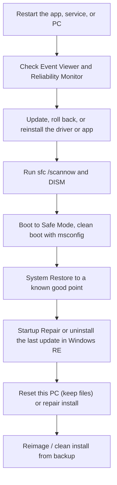
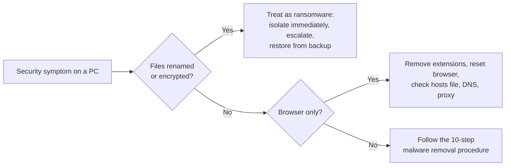

# Core 2 Domain 3: Software Troubleshooting (23%)

## Overview

Software Troubleshooting is the Core 2 twin of Core 1 Domain 5. Every objective is "Given a scenario, troubleshoot..." with a list of symptoms. Your job is to match the symptom to the most likely cause and the least disruptive fix that works. The tools come from [06 - Operating Systems](06-operating-systems.md), and the security fixes come from [07 - Security](07-security.md).

The objectives are:

- **3.1** Given a scenario, troubleshoot common Windows OS issues.
- **3.2** Given a scenario, troubleshoot common mobile OS and application issues.
- **3.3** Given a scenario, troubleshoot common mobile OS and application security issues.
- **3.4** Given a scenario, troubleshoot common PC security issues.

## A Repair Ladder for Windows

When the question asks for the **best** or **first** fix, pick the least destructive option that addresses the cause. This ladder runs from gentle to drastic:

A typical escalation from the least to the most disruptive Windows fix. Always back up data before the lower rungs.

**[📖 Windows Recovery Environment (Windows RE)](https://learn.microsoft.com/en-us/windows-hardware/manufacture/desktop/windows-recovery-environment--windows-re--technical-reference)** - Startup Repair, System Restore, and reset options

## 3.1 Windows OS Issues

| Symptom | Likely causes | Fixes |
|---------|---------------|-------|
| **Blue screen of death (BSOD)** | Faulty driver, bad RAM, failing disk, overheating, recent update | Note the stop code. Boot to Safe Mode, roll back the recent driver or update, run memory diagnostics and `chkdsk`. Check the minidump files |
| **Degraded performance** | Too many startup apps, low RAM, full disk, failing HDD, malware, outdated drivers | Task Manager startup tab, Disk Cleanup, add RAM, move to SSD, scan for malware |
| **Boot issues** | Corrupt boot configuration, wrong boot order, failing drive, bad update | Startup Repair in Windows RE, check UEFI boot order, `bootrec` commands, uninstall the last update |
| **Frequent shutdowns** | Overheating, power problems, failing hardware, policy-driven restarts | Check temperatures, Event Viewer (Kernel-Power 41), PSU |
| **Services not starting** | Dependency service stopped, wrong account or password on the service, corrupt files | Services console: check startup type, dependencies, and log-on account. Event Viewer |
| **Applications crashing** | Corrupt install, incompatible version, missing runtime (.NET, Visual C++), bad update | Repair or reinstall the app, install runtimes, compatibility mode, check Event Viewer Application log |
| **Low memory warnings** | Too many apps, memory leak, virtual memory too small | Close apps, find the leaking process in Task Manager, add RAM, let Windows manage the paging file |
| **USB controller resource warnings** | Too many devices on one controller, especially USB 3 hubs with bandwidth-hungry devices | Spread devices across ports and controllers, use a powered hub, update chipset drivers |
| **System instability** | Drivers, RAM, overheating, corrupted system files | `sfc /scannow`, memory test, driver updates, check temperatures |
| **No OS found** | Wrong boot device, USB stick left in, drive failed or disconnected, corrupt boot record, UEFI/legacy mismatch | Remove external media, check boot order and mode, run Startup Repair |
| **Slow profile load** | Large roaming profile, network drives unavailable, folder redirection over a slow link, corrupt profile | Reduce profile size, fix mapped drives, create a new profile and migrate data |
| **Time drift** | Dead CMOS battery, NTP not syncing, VM time sync issues | Check the time service (`w32tm /resync`), domain time source, replace CMOS battery |

### Useful tools for 3.1

| Tool | Helps with |
|------|-----------|
| **Event Viewer** | The first stop for crashes and services |
| **Reliability Monitor** (`perfmon /rel`) | A timeline of crashes, updates, and installs. Shows what changed right before a problem started |
| **Safe Mode** | Loads minimal drivers. If the problem is gone in Safe Mode, a driver or startup item is the cause |
| **msconfig clean boot** | Disable non-Microsoft services and startup items to isolate a conflict |
| **Device Manager rollback** | Undo a bad driver update |
| **System Restore** | Roll back system files, drivers, and registry without touching personal files |
| **`sfc /scannow` and `DISM /Online /Cleanup-Image /RestoreHealth`** | Repair system files. Run DISM first if SFC cannot repair |

## 3.2 Mobile OS and Application Issues

| Symptom | Likely causes | Fixes |
|---------|---------------|-------|
| **Application fails to launch** | Corrupt app data, incompatible OS version, low storage | Force stop, clear cache (Android), update or reinstall the app, restart |
| **Application fails to close/crashes** | Bug, corrupt data, low memory | Force close, update the app, clear app data, reinstall |
| **Application fails to update** | Low storage, no connection, store account issue, MDM restriction | Free space, check Wi-Fi, sign out and in to the store |
| **Application fails to install** | Low storage, OS too old, blocked by MDM, not compatible with the device | Free space, update OS, check policy |
| **Slow to respond** | Low storage, too many background apps, old device | Restart, close apps, free space, update |
| **OS fails to update** | Low storage, low battery, poor connection, device no longer supported | Free space, charge above 50%, use Wi-Fi, check vendor support list |
| **Battery life issues** | Screen brightness, background apps, location services, poor signal, aging battery | Check battery usage by app, restrict background activity, replace battery if health is low |
| **Random reboots** | Faulty app, overheating, failing battery, OS bug | Update OS, remove recent apps, check battery health |
| **Connectivity issues - Bluetooth** | Not in pairing mode, old pairing, interference | Forget and re-pair, toggle Bluetooth, restart both devices |
| **Connectivity issues - Wi-Fi** | Wrong password, captive portal, MAC randomization blocked, weak signal | Forget and rejoin, reset network settings |
| **Connectivity issues - NFC** | NFC off, case too thick, wrong position | Enable NFC, remove case, hold closer |
| **Screen does not autorotate** | Rotation lock on, app does not support rotation, sensor issue | Turn off rotation lock, test in another app, recalibrate |

**Escalation for mobile:** restart, update, clear cache/data, reinstall the app, reset network settings, then factory reset (after backup) as a last resort.

## 3.3 Mobile OS and Application Security Issues

### Security concerns

| Concern | Why it is a problem |
|---------|---------------------|
| **Application source / unofficial app stores** | Sideloaded apps skip store review and are a common source of malware |
| **Developer mode** | Enables debugging and sideloading. Should be off on corporate devices |
| **Root access / jailbreak** | Removes the OS security model. MDM usually blocks rooted or jailbroken devices from company data |
| **Unauthorized/malicious application** | Includes **application spoofing**: fake apps that copy a real app's name and icon |

### Common symptoms

| Symptom | Possible meaning |
|---------|------------------|
| **High network traffic** | Malware sending data out, or a background sync |
| **Degraded response time** | Malware or cryptominer using resources |
| **Data-usage limit notification** | Unexpected traffic from a malicious or misbehaving app |
| **Limited or no internet connectivity** | Malicious proxy or VPN profile installed, or DNS changed |
| **High number of ads** | Adware app |
| **Fake security warnings** | Scareware pushing a fake cleaner or antivirus |
| **Unexpected application behavior** | Compromised or spoofed app |
| **Leaked personal files/data** | Spyware or stalkerware, compromised cloud account |

### Response

1. Check installed apps and remove unknown or recently installed ones.
2. Check for unknown configuration profiles, VPNs, or device admin apps (Android) and remove them.
3. Run a mobile security scan.
4. Update the OS and apps.
5. Change passwords for accounts used on the device, from a clean device.
6. If still compromised, back up data (not apps) and factory reset.
7. Report to IT or security if it is a corporate device, so MDM can check other devices.

## 3.4 PC Security Issues

### Common symptoms

| Symptom | Likely cause |
|---------|--------------|
| **Unable to access the network** | Malware changed network settings, proxy, or hosts file. NAC quarantined the device |
| **Desktop alerts** | Pop-ups from a malicious or unwanted program |
| **False alerts regarding antivirus protection** | Scareware (fake antivirus) trying to get the user to pay or install more malware |
| **Altered system or personal files** | Malware or ransomware. **Missing/renamed files** and **inability to access files** point strongly to ransomware |
| **Unwanted notifications within the OS** | Browser notification permissions granted to malicious sites, or adware |
| **OS update failures** | Malware blocking updates to protect itself, or corrupted update components |

### Browser-related symptoms

| Symptom | Likely cause |
|---------|--------------|
| **Random/frequent pop-ups** | Adware, malicious extension, or site notification permissions |
| **Certificate warnings** | On-path attack, incorrect system time, expired certificate, or a malicious root certificate |
| **Redirection** | Browser hijacker, malicious extension, changed hosts file or DNS settings |
| **Degraded browser performance** | Too many or malicious extensions, cryptomining script |

A quick triage for PC security symptoms: ransomware gets isolated and escalated at once, browser-only problems usually clear with an extension and settings cleanup, and anything else follows the full removal procedure.

**Certificate warnings** deserve extra care. Check the system date and time first. A clock set years in the past makes every certificate look invalid. If the time is right, treat it as a possible interception and do not click through.

The full removal procedure is in [07 - Security](07-security.md#26-soho-malware-removal).

## Exam Tips and Traps

1. **BSOD after a driver update** - Safe Mode, then roll back the driver.
2. **Problem gone in Safe Mode** - a third-party driver or startup item is the cause. Use a clean boot to find it.
3. **Something changed yesterday** - Reliability Monitor, then System Restore.
4. **`sfc /scannow` for corrupted system files.** DISM repairs the image SFC uses.
5. **No OS found** - check for a USB stick left in, then boot order and mode.
6. **Slow profile load** - roaming profile or unreachable mapped drives.
7. **Time drift** - NTP or CMOS battery. Kerberos fails if the clock is off.
8. **Mobile app keeps crashing** - update, clear cache, reinstall, before factory reset.
9. **Jailbroken or rooted device** - MDM blocks it, remove from corporate access.
10. **Fake antivirus alert** - scareware. Do not click. Follow malware removal steps.
11. **Renamed files you cannot open** - ransomware. Isolate first.
12. **Certificate warnings on every site** - check the system clock.

## Related Notes

- [06 - Operating Systems](06-operating-systems.md#14-windows-features-and-tools) - The tools used in this note
- [07 - Security](07-security.md) - Malware types and removal steps
- [05 - Hardware and Network Troubleshooting](05-hardware-network-troubleshooting.md) - The hardware side of troubleshooting
