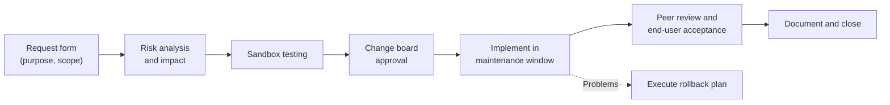
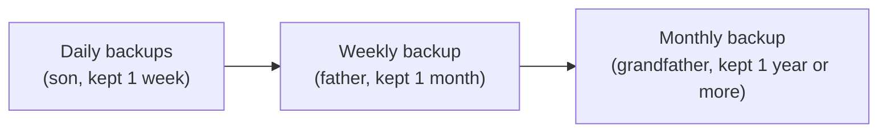

# Core 2 Domain 4: Operational Procedures (21%)

## Overview

Operational Procedures is how a professional technician works: documenting tickets and assets, following change management, backing up, staying safe, handling the environment and regulated data, treating customers well, writing small scripts, supporting users remotely, and (new in V15) understanding AI tools. Many questions here are common sense dressed in vocabulary, so the marks go to people who know the exact terms: synthetic full, GFS, chain of custody, MSDS, SPICE, hallucination.

The objectives are:

- **4.1** Implement best practices associated with documentation and support systems information management.
- **4.2** Apply change management procedures.
- **4.3** Implement workstation backup and recovery methods.
- **4.4** Use common safety procedures.
- **4.5** Summarize environmental impacts and local environment controls.
- **4.6** Explain the importance of prohibited content/activity and privacy, licensing, and policy concepts.
- **4.7** Use proper communication techniques and professionalism.
- **4.8** Explain the basics of scripting.
- **4.9** Use remote access technologies.
- **4.10** Explain basic concepts related to AI.

## 4.1 Documentation and Support Systems

### Ticketing systems

A good ticket lets anyone pick up the work without calling the user again.

| Field | What to capture |
|-------|-----------------|
| **User information** | Name, contact, department, location |
| **Device information** | Asset tag, hostname, OS, model |
| **Description of issues** | What happens, when it started, error messages, what changed |
| **Categories** | Hardware, software, network, access, and so on. Drives reporting and routing |
| **Severity** | Business impact and urgency. Decides priority |
| **Escalation levels** | Tier 1 (help desk), Tier 2 (desktop or specialist), Tier 3 (engineering or vendor) |
| **Clear, concise written communication** | An **issue description**, dated **progress notes**, and the **issue resolution** written so the next tech (or the knowledge base) can reuse it |

### Asset management

| Item | Purpose |
|------|---------|
| **Inventory lists** | What the organization owns and where |
| **CMDB** (configuration management database) | Assets plus their configurations and relationships. Supports change and incident work |
| **Asset tags and IDs** | Physical labels that link a device to its record |
| **Procurement life cycle** | Request, approve, purchase, receive, deploy, maintain, retire, dispose |
| **Warranty and licensing** | Track expiry dates and license counts |
| **Assigned users** | Who is responsible for each asset |

### Types of documents

| Document | Purpose |
|----------|---------|
| **Incident reports** | What happened, impact, response, root cause |
| **SOPs** (standard operating procedures) | Step-by-step instructions, such as a **software package custom installation procedure** |
| **New user/onboarding setup checklist** | Accounts, hardware, access, training |
| **User off-boarding checklist** | Disable accounts, recover hardware, transfer data, revoke access |
| **SLAs** (service-level agreements) | Promised response and resolution times. **Internal** (IT to the business) or **external/third-party** (vendor to you) |
| **Knowledge base/articles** | Reusable fixes, so the same problem is solved faster next time |

## 4.2 Change Management

Change management makes sure changes are planned, approved, tested, and reversible, so a fix for one problem does not cause an outage somewhere else.



The main stages of a change request, with the rollback plan ready if the change fails.

### Elements of a change

| Element | Meaning |
|---------|---------|
| **Documented business processes** | Changes follow a written process, not memory |
| **Rollback plan** | How to undo the change if it fails |
| **Backup plan** | Backups taken before the change |
| **Sandbox testing** | Test in an isolated copy before production |
| **Responsible staff members** | Who implements and who owns the change |
| **Request forms** | The formal request |
| **Purpose of the change** | Why it is needed |
| **Scope of the change** | What exactly will change |
| **Date and time** | When, usually during a **maintenance window** |
| **Change freeze** | A period when no changes are allowed (year-end, product launches) |
| **Affected systems/impact** | What might break or go down |
| **Risk analysis and risk level** | Likelihood and impact, rated low, medium, high |
| **Change board approvals** | The change advisory board (CAB) approves normal changes |
| **Implementation** | Carry out the approved plan |
| **Peer review** | A second person checks the work |
| **End-user acceptance** | Users confirm the change works for them |

### Change types

| Type | Approval |
|------|----------|
| **Standard** | Pre-approved, low risk, routine (password reset, adding RAM) |
| **Normal** | Goes through the full review and CAB |
| **Emergency** | Urgent fix. Expedited approval, documented afterwards |

## 4.3 Backup and Recovery

### Backup types

| Type | Copies | Backup speed | Restore needs |
|------|--------|--------------|---------------|
| **Full** | Everything | Slowest | Just the full |
| **Incremental** | Changes since the **last backup of any kind** | Fastest | The full plus **every** incremental since |
| **Differential** | Changes since the **last full** | Grows each day | The full plus the **latest** differential |
| **Synthetic full** | A new full built by merging the last full with later incrementals, on the backup system | No load on the source | Just the synthetic full |

**Worked example:** full on Sunday, failure on Thursday morning. With incrementals you restore Sunday + Monday + Tuesday + Wednesday. With differentials you restore Sunday + Wednesday.

### Frequency and recovery

- **Frequency** - Set by how much data the business can afford to lose.
- **In-place/overwrite recovery** - Restore over the original location. Fast, but overwrites current versions.
- **Alternative location recovery** - Restore somewhere else, compare, and then move. Safer when unsure.

### Rotation schemes

| Scheme | Meaning |
|--------|---------|
| **Onsite vs offsite** | Onsite copies restore quickly. Offsite (or cloud) copies survive fire, flood, and theft |
| **GFS** (grandfather-father-son) | Daily backups (son), weekly (father), monthly (grandfather). Keeps long history with limited media |
| **3-2-1 rule** | Three copies of data, on two different media types, with one offsite |



Grandfather-father-son rotation promotes one daily backup to weekly, and one weekly backup to monthly, so older history is kept with fewer copies.

**Backup testing** - A backup you have never restored is a hope, not a backup. Test restores regularly.

## 4.4 Safety Procedures

| Topic | Practice |
|-------|----------|
| **ESD straps** | Wrist strap clipped to the case or a ground point. Protects components from static |
| **ESD mats** | Work surface that drains static |
| **Antistatic bags** | Store and carry components in them |
| **Electrical safety** | **Equipment grounding**, **disconnect power before repairing a PC**. Never open PSUs or CRT monitors |
| **Proper component handling and storage** | Hold cards by the edges, avoid touching contacts and chips |
| **Cable management** | Prevents trip hazards and improves airflow |
| **Compliance with government regulations** | Follow local safety law (OSHA in the US, for example) |
| **Lifting techniques** | Lift with your legs, keep your back straight, keep the load close, get help or a cart for heavy items |
| **Fire safety** | Class C extinguishers for electrical fires (CO2 or clean agent). Never water on electrical equipment |
| **Safety goggles** | When working with compressed air, chemicals, or cutting |
| **Air filter mask** | When cleaning toner or dusty equipment |

**ESD strap caution:** do not wear an ESD strap when working on high-voltage equipment. The strap is a path to ground and makes a shock worse.

## 4.5 Environmental Impacts and Controls

### Disposal and MSDS

- **MSDS** (material safety data sheet, now often called SDS) describes a product's hazards, safe handling, first aid, and **disposal**. Look it up for toner, batteries, and cleaning chemicals.
- **Proper battery disposal** - Lithium-ion and other batteries go to battery recyclers, never the trash.
- **Proper toner disposal** - Return programs or recyclers. Toner is a fine powder, so clean spills with a toner vacuum.
- **Other devices and assets** - E-waste regulations apply to PCs, monitors, and phones. Remove and destroy data first.

**[📖 EPA Electronics Donation and Recycling](https://www.epa.gov/recycle/electronics-donation-and-recycling)** - US guidance on recycling electronics responsibly

### Environment

| Factor | Guidance |
|--------|----------|
| **Temperature** | Cool, stable temperatures. Heat shortens component life |
| **Humidity** | Too low increases static. Too high causes condensation and corrosion. Roughly 40-60% relative humidity is a common target |
| **Ventilation** | Keep vents clear, do not stack equipment |
| **Location/equipment placement** | Away from heat sources, windows, water, and foot traffic |
| **Dust cleanup** | **Compressed air** to blow dust out (outdoors or with a mask), **vacuums** designed for electronics |

### Power problems

| Problem | Description | Protection |
|---------|-------------|------------|
| **Surge/spike** | Short voltage increase | **Surge suppressor** |
| **Brownout** | Voltage drops for a while | **UPS** (line-interactive or online) |
| **Blackout** | Total power loss | **UPS** gives time to shut down cleanly, generator for longer outages |

## 4.6 Prohibited Content, Privacy, Licensing, and Policy

### Incident response (for the technician)

When you find prohibited content or evidence of a crime on a device:

1. **Stop** and do not investigate further on your own.
2. **Inform management and law enforcement as necessary**, following policy.
3. **Preserve the evidence**: make a **copy of the drive** (a forensic image) for data integrity and preservation.
4. Keep a **chain of custody** record: who handled the evidence, when, and why.
5. Collect data by **order of volatility**: most volatile first (CPU cache and RAM, then swap, disk, and archived data).
6. Complete **incident documentation**.

### Licensing

| Term | Meaning |
|------|---------|
| **Valid licenses** | Using software without a license breaks the law and policy |
| **Perpetual license** | Pay once, use forever (updates may cost extra) |
| **Personal-use vs corporate-use** | Personal licenses often forbid commercial use |
| **Open-source license** | Source is available, with conditions (such as GPL requiring shared changes) |
| **DRM** (digital rights management) | Technical controls that enforce license terms |
| **EULA** (end-user license agreement) | The terms the user accepts at install |

### Regulated data

| Data type | Examples | Regulations |
|-----------|----------|-------------|
| **Credit card payment information** | Card numbers, CVV | PCI DSS |
| **Personal government-issued information** | Social Security numbers, passports, driver's licenses | Various privacy laws |
| **PII** (personally identifiable information) | Name with address, birth date, ID numbers | GDPR, state privacy laws |
| **Healthcare data** | Medical records | HIPAA in the US |
| **Data retention requirements** | How long records must be kept, and when they must be destroyed | Industry and legal rules |

### Policies and agreements

- **NDA/MNDA** - Non-disclosure agreement (one-way) and mutual NDA (both parties).
- **AUP** (acceptable use policy) - What users may and may not do with company systems.
- **Regulatory and business compliance requirements** - Rules the organization must meet.
- **Splash screens** - Log-in banners that state authorized use and monitoring, supporting legal action later.

## 4.7 Communication and Professionalism

The objective lists behaviors. Most questions ask "what should the technician do?" and the answer is the most professional and customer-focused option.

- **Appearance** - Match the attire of the environment: **formal** or **business casual**.
- **Language** - Avoid jargon, acronyms, and slang. Explain in plain terms.
- **Attitude** - Positive, confident.
- **Listen actively** - Do not interrupt. Take notes.
- **Be culturally sensitive** - Use appropriate professional titles.
- **Be on time** - If you will be late, contact the customer.
- **Avoid distractions** - No personal calls, texting, social media, or personal interruptions.
- **Difficult customers** - Do not argue or get defensive. Do not dismiss their issues. Do not be judgmental. **Clarify** by asking open-ended questions, restating the issue, and confirming understanding. Do not post about customer experiences on social media.
- **Set and meet expectations** - Give timelines and status updates. Offer repair or replacement options. Provide documentation of the services. **Follow up** later to verify satisfaction.
- **Confidential and private materials** - Do not read, copy, or discuss documents on the customer's computer, desk, or printer.

**Open-ended vs closed questions:** "What happens when you try to print?" (open) gathers information. "Is the printer on?" (closed) confirms a detail. Start open, then narrow with closed questions.

## 4.8 Scripting Basics

### Script file types

| Extension | Language | Runs on |
|-----------|----------|---------|
| **.bat** | Windows batch | Windows Command Prompt |
| **.ps1** | PowerShell | Windows (and cross-platform PowerShell 7) |
| **.vbs** | VBScript | Windows Script Host (Microsoft is phasing VBScript out) |
| **.sh** | Shell script (bash, zsh) | Linux and macOS |
| **.js** | JavaScript | Browsers, Node.js, Windows Script Host |
| **.py** | Python | Any OS with Python installed |

**[📖 PowerShell Documentation](https://learn.microsoft.com/en-us/powershell/scripting/overview)** - Microsoft's PowerShell overview and reference

### Use cases

- Basic automation of repetitive tasks
- Restarting machines on a schedule
- Remapping network drives at sign-in
- Installing applications silently
- Automated backups
- Gathering information and data (inventory, logs)
- Initiating updates

A small illustrative example, a batch file that maps a drive at sign-in:

```bat
@echo off
net use S: /delete /y >nul 2>&1
net use S: \\fileserver\shared /persistent:no
```

### Other considerations

- **Unintentionally introducing malware** - Only run scripts from trusted sources. PowerShell execution policy and code signing help.
- **Inadvertently changing system settings** - Test in a sandbox or VM first.
- **Browser or system crashes due to mishandling of resources** - A loop that never ends, or one that eats memory, can hang a machine.

## 4.9 Remote Access Technologies

| Method | Port | Notes |
|--------|------|-------|
| **RDP** | 3389 | Full Windows desktop. Hosting needs Pro or higher. Do not expose to the internet: use a VPN or RD Gateway, and require Network Level Authentication |
| **VPN** | Varies | Encrypted tunnel into the network, then use internal tools |
| **VNC** (virtual network computing) | 5900 | Cross-platform screen sharing. Older versions have weak encryption, tunnel it |
| **SSH** | 22 | Encrypted command line for Linux, macOS, network devices |
| **RMM** (remote monitoring and management) | Vendor agent | MSP tools for patching, monitoring, scripting, and remote control at scale |
| **SPICE** | Varies | Simple Protocol for Independent Computing Environments. Remote display for KVM/QEMU virtual machines |
| **WinRM** | 5985 (HTTP), 5986 (HTTPS) | Windows Remote Management. Runs PowerShell commands remotely |
| **Third-party tools** | Vendor | Screen-sharing software, videoconferencing software, file transfer software, desktop management software |

**Security considerations of each method:**

- Require MFA and strong passwords.
- Do not expose RDP, VNC, or SSH directly to the internet.
- Get user consent before viewing their screen, and end sessions when done.
- Watch for unauthorized remote tools: scammers commonly ask victims to install screen-sharing software.
- Log remote sessions, especially RMM, which has admin rights on every managed machine.

## 4.10 Artificial Intelligence Basics

This objective is new in V15. It is about using AI tools safely at work, not how models are built.

| Topic | What to know |
|-------|--------------|
| **Application integration** | AI features built into existing tools: assistants in office suites, chat support bots, AI in ticketing systems |
| **Policy - appropriate use** | The organization decides which AI tools are allowed and for what |
| **Policy - plagiarism** | AI output can reproduce others' work. Do not pass it off as original without checking |
| **Limitations - bias** | Models reflect biases in their training data |
| **Limitations - hallucinations** | Confident but false output, such as made-up commands or sources |
| **Limitations - accuracy** | Always verify AI answers before acting, especially commands that change systems |
| **Private vs public** | **Public** AI tools may store or train on what you enter. **Private** (enterprise or self-hosted) AI keeps data inside the organization |
| **Data security** | Never paste passwords, keys, or confidential data into public AI tools |
| **Data source** | Know where the model's information comes from, and whether it is current |
| **Data privacy** | Entering PII or regulated data into a public tool may break privacy law and policy |

**[📖 NIST AI Risk Management Framework](https://www.nist.gov/itl/ai-risk-management-framework)** - A widely used framework for managing AI risks

## Exam Tips and Traps

1. **Incremental restore needs the full plus every incremental. Differential needs the full plus the last differential.**
2. **Synthetic full** is assembled on the backup server, not read from the source again.
3. **3-2-1:** three copies, two media, one offsite.
4. **Rollback plan** is the answer when a change could fail.
5. **Emergency change** is expedited, then documented.
6. **Chain of custody** starts the moment you find evidence. Do not keep investigating.
7. **MSDS** for disposal and handling of toner and chemicals.
8. **UPS for brownouts and blackouts. Surge suppressor for spikes.**
9. **Do not wear an ESD strap around high voltage.**
10. **Difficult customer** - listen, do not argue, clarify with open-ended questions.
11. **.ps1 = PowerShell, .sh = shell, .bat = batch, .vbs = VBScript.**
12. **SPICE** is remote display for virtual machines. **WinRM** is remote PowerShell.
13. **Hallucination** is confident but wrong AI output. Do not paste sensitive data into public AI.

## Related Notes

- [07 - Security](07-security.md#29-data-destruction-and-disposal) - Destroying data before disposal
- [06 - Operating Systems](06-operating-systems.md) - Commands used in scripts
- [02 - Networking](02-networking.md#21-ports-protocols-tcp-and-udp) - Ports for remote access tools
- [Strategy](../strategy.md) - How to handle the professionalism questions on exam day
