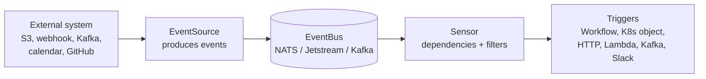

# 04 - Argo Events

**Domain 4: Argo Events (12%)**

The smallest domain. Event-driven automation on Kubernetes.

---

## Three objects

| Object | Role |
|---|---|
| **EventSource** | Connects to an external system and publishes events onto the bus |
| **EventBus** | Transports events between sources and sensors. Backed by NATS, Jetstream, or Kafka |
| **Sensor** | Subscribes to one or more dependencies, filters them, and fires triggers |

The EventBus is easy to forget and is required: without one deployed in the namespace, sources and sensors cannot communicate.

---

## Event sources

Over twenty types, including: webhook, S3 (through MinIO or bucket notifications), SNS, SQS, Kafka, NATS, AMQP, Redis, GitHub, GitLab, Bitbucket, calendar (cron-like), file, resource (Kubernetes object changes), Azure Events Hub, Azure Queue Storage, Google Cloud Pub/Sub, Slack, Stripe, and generic.

The **resource** event source is worth knowing: it watches Kubernetes objects, so a Sensor can react to a resource being created, updated, or deleted in the cluster.

---

## Sensors

A Sensor declares:

- **Dependencies** - which event source and event name it listens for
- **Filters** - narrowing which events count:
  - **data filters** on payload fields, with comparators
  - **context filters** on event metadata such as source and type
  - **time filters** restricting to a window of the day
  - **expression filters** using a full expression language over the payload
- **Triggers** - what to do when the dependency is satisfied

**Dependency logic** supports combinations: a trigger can require several dependencies with AND or OR semantics through a conditions expression, so a Sensor can wait for two different events before acting.

---

## Triggers

| Trigger | Creates or calls |
|---|---|
| **Argo Workflow** | A Workflow, the most common pairing |
| **Kubernetes object** | Any resource, such as a Job or a ConfigMap |
| **HTTP** | An arbitrary HTTP request |
| **AWS Lambda** | A function invocation |
| **Kafka / NATS / Pulsar** | A message |
| **Slack / email / Azure Service Bus** | A notification |
| **Log** | A log line, useful for debugging a Sensor |

**Parameterization** extracts values from the event payload into the triggered resource, using `dataKey` or `contextKey` and a destination path in the target object. This is how an S3 object key becomes a workflow parameter.

**Trigger policies** define retry behavior and how success is determined for a created Kubernetes resource.

---

## Practical points

- Argo Events is independent of Argo Workflows; the pairing is common but not required
- Idempotency matters: at-least-once delivery means a trigger can fire twice, so either make the triggered work idempotent or use a workflow **synchronization** mutex keyed on the payload
- Sensors and event sources are themselves Kubernetes resources, so they belong in the state store and are managed by Argo CD like anything else
- Debug with the **log trigger** and by inspecting the EventSource and Sensor pod logs

---

## Key terms

- **EventSource** - the Argo Events resource connecting to an external system and publishing events onto the bus
- **EventBus** - the transport between event sources and sensors, backed by NATS, Jetstream, or Kafka
- **Sensor** - the resource subscribing to event dependencies, applying filters, and firing triggers
- **Dependency** - a Sensor's declaration of which event source and event it listens for
- **Data filter** - a Sensor filter matching on fields within the event payload
- **Context filter** - a Sensor filter matching on event metadata such as source or type
- **Expression filter** - a Sensor filter evaluating a full expression against the event payload
- **Trigger** - the action a Sensor performs when its dependencies are satisfied
- **Trigger parameterization** - extracting values from an event payload into the resource the trigger creates
- **Resource event source** - an event source watching Kubernetes object changes within the cluster
- **Trigger policy** - configuration defining retry behavior and success criteria for a trigger

---

## Related

- [Notes 01: Argo Workflows](./01-argo-workflows.md)
- [Scenarios](../scenarios.md) - scenario 7
- [Queues vs streams](../../../../learn/concepts/queues-vs-streams.md)
