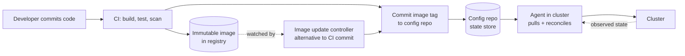

# 04 - Related practices and tooling

**Domain 4: Related Practices (16%) and Domain 5: Tooling (14%)**

Breadth rather than depth. You will not be asked to write configuration.

---

## Where GitOps sits

GitOps is a **continuous delivery** approach. It does not replace continuous integration.

The handover point is the commit to the configuration repository. Everything left of it is CI; everything right of it is GitOps.

---

## Infrastructure as Code

IaC and GitOps overlap but are not the same thing.

- **IaC** is declaring infrastructure in code. Terraform, OpenTofu, Pulumi, Bicep, CloudFormation.
- **GitOps** is an operating model: pull-based agents continuously reconciling declared state.

Terraform run from a CI pipeline is IaC without GitOps: it is push-based and runs only when triggered. Terraform run by an in-cluster controller (Crossplane, the Terraform operator, Flux's Terraform controller) that continuously reconciles is closer to GitOps for infrastructure.

The exam may ask whether a described IaC workflow is GitOps. Apply the same four-principle test.

---

## Policy and compliance

- **Policy as code**: Kyverno and OPA Gatekeeper enforce invariants at admission, so a non-compliant manifest is rejected regardless of what the state store says. This is the safety net beneath GitOps, since the agent will faithfully apply whatever is committed.
- **Audit**: the state store history answers who changed what, when, and who approved it. This is a genuine compliance benefit, and it depends on nobody bypassing the model with direct cluster access.
- **Separation of duties**: enforced through repository access control and required reviews rather than through cluster RBAC.
- **Signed commits and provenance**: commit signing, and artifact attestations (SLSA, Sigstore) so the deployed image can be traced to the source and build that produced it.

---

## Security considerations

| Concern | Control |
|---|---|
| Agent has broad cluster rights | Scope agent RBAC per tenant or namespace where possible; run an agent per boundary |
| A bad commit deploys automatically | Required reviews, CODEOWNERS, policy admission, progressive delivery with automated rollback |
| Secrets in the state store | Encryption or external references; never plaintext |
| Repository compromise | Signed commits, branch protection, and treating the state store as production infrastructure |
| Supply chain | Image signing, provenance attestation, admission verification |

The pull model removes external cluster credentials, which is a real gain, and concentrates trust in the state store, which then needs the protection that a production system deserves.

---

## DORA metrics

GitOps affects all four:

- **Deployment frequency** - rises, because deploying is a commit
- **Lead time for changes** - falls, because the path from merge to running is automated
- **Change failure rate** - typically falls, through review, policy admission, and progressive delivery
- **Time to restore service** - falls sharply, because rollback is a revert

These appear in questions about why an organization adopts GitOps.

---

## Tooling breadth

### GitOps agents

| | Argo CD | Flux |
|---|---|---|
| Shape | Application-centric, with a strong web UI | A set of composable controllers, CLI and CRD driven |
| Core resource | `Application`, `ApplicationSet` | `GitRepository`, `Kustomization`, `HelmRelease` |
| Multi-tenancy | Projects and RBAC | Namespaces and per-tenant controllers |
| Typical draw | Visibility and developer self-service | Composability and a smaller footprint |

Both are CNCF graduated projects and both implement the same principles. The exam wants awareness of the difference, not configuration detail.

### The rest of the landscape

| Category | Tools |
|---|---|
| Manifest composition | Kustomize, Helm, jsonnet |
| Progressive delivery | Argo Rollouts, Flagger |
| Policy | Kyverno, OPA Gatekeeper |
| Secrets | Sealed Secrets, External Secrets Operator, SOPS, Vault |
| Infrastructure control planes | Crossplane, Terraform controllers |
| Supply chain | Sigstore, cosign, in-toto, SLSA |
| Image automation | Argo CD Image Updater, Flux image automation controllers |

---

## Key terms

- **Continuous integration** - automatically building and testing changes as they are merged
- **Infrastructure as Code** - declaring infrastructure in version-controlled code, which may or may not be operated in a GitOps model
- **Crossplane** - a control plane that provisions cloud infrastructure through Kubernetes custom resources, enabling GitOps for infrastructure
- **Policy as code** - enforcing configuration rules automatically at admission through an engine such as Kyverno or Gatekeeper
- **Admission control** - the Kubernetes mechanism validating or mutating resources before they are persisted
- **Provenance attestation** - signed metadata linking a built artifact to the source and build process that produced it
- **SLSA** - a framework of supply chain security levels for build integrity
- **Sigstore** - the project providing keyless signing and verification for artifacts, including cosign
- **DORA metrics** - deployment frequency, lead time for changes, change failure rate, and time to restore service
- **Argo CD** - a CNCF graduated, application-centric GitOps agent with a web UI and Application custom resources
- **Flux** - a CNCF graduated GitOps toolkit of composable controllers driven by custom resources
- **Flagger** - a progressive delivery controller automating canary and blue-green releases with metric analysis
- **Image update controller** - automation that watches a registry and commits new image tags to the state store

---

## Related

- [Notes 01: GitOps principles](./01-gitops-principles.md)
- [Scenarios](../scenarios.md) - scenario 5
- [CAPA](../../capa/) - Argo project depth
- [Build a CI/CD pipeline](../../../../resources/hands-on-projects/build-ci-cd-pipeline.md)
