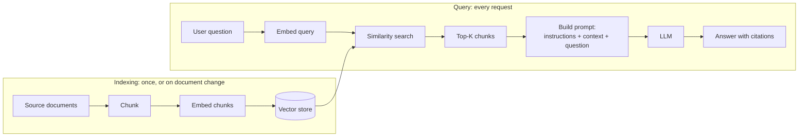

# 03 - Building, deploying, and evaluating LLM applications

---

## The RAG pipeline



Two phases. Indexing runs when documents change; the query path runs on every request.

---

## Chunking

The lever with the largest effect on answer quality.

| Chunk size | Consequence |
|---|---|
| **Too small** | Each chunk lacks surrounding context. Retrieval finds the right words but the model cannot ground an answer |
| **Too large** | The embedding averages too many ideas and becomes imprecise. Retrieved context wastes the window and buries the relevant sentence |

Practical guidance:
- A few hundred tokens is a reasonable starting point, tuned by measurement
- **Overlap** between adjacent chunks so information straddling a boundary is not lost
- Split on **structural boundaries**: paragraphs, headings, sections, or function definitions, rather than at fixed character counts
- Carry **metadata** on every chunk: source document, section, date, and any tenant or access-control attribute. Metadata is what makes citation and authorization possible

---

## Vector storage and retrieval

**Similarity metrics**: cosine similarity is the usual default for text; dot product and Euclidean distance are alternatives. The metric must match how the embedding model was trained.

**Oracle AI Vector Search** in Autonomous Database stores vectors as a native column type and performs similarity search in SQL. The advantage is that vectors sit beside the relational data, so a query can combine semantic similarity with ordinary predicates and joins, and there is no second system to operate or secure.

Retrieval quality improvements beyond basic top-K:
- **Hybrid search** combining semantic similarity with keyword matching, which fixes the case where the user's wording differs from the document's
- **Reranking**: retrieve a wider set, then rerank with a more precise model and keep the best few
- **Metadata filtering**: constrain by tenant, date, document type, or access rights **in the query**, not after retrieval
- **Query rewriting**: have the model rephrase the question into better search terms

---

## LangChain concepts

The exam references LangChain as the application framework.

| Concept | Purpose |
|---|---|
| **Model** | The LLM or chat model interface |
| **Prompt template** | A parameterized prompt with variable substitution |
| **Chain** | A composed sequence of steps: prompt, model, parser |
| **Document loader** | Reads source documents from files, object storage, databases, or the web |
| **Text splitter** | Implements the chunking strategy |
| **Embeddings** | The interface to an embedding model |
| **Vector store** | The interface to the vector database |
| **Retriever** | Returns relevant documents for a query, wrapping the vector store |
| **Memory** | Carries conversation history between turns |
| **Output parser** | Converts model text into structured data, with validation |
| **Agent and tools** | Lets the model choose actions to take |

**Memory** deserves attention because it drives cost: naive memory resends the entire conversation on every turn, so token use grows quadratically over a long session. Windowed memory keeps recent turns, and summary memory compresses older ones.

---

## Prompt construction for RAG

```text
Answer the question using ONLY the context below. Cite the source
of each claim using its [source] marker. If the context does not
contain the answer, say "I don't have that information."

<context>
[source: policy-2024.pdf, section 4.2]
...chunk text...

[source: policy-2024.pdf, section 7.1]
...chunk text...
</context>

Question: {question}
```

Three elements are load-bearing: the **ONLY** constraint, the **escape hatch**, and the **citation requirement**. Without them the model falls back on training knowledge and produces a confident answer that did not come from your documents.

---

## Evaluation

Evaluate the two halves separately, because they fail differently.

**Retrieval quality**
- Did the correct chunk appear in the top-K? (recall@K)
- How highly was it ranked? (mean reciprocal rank)
- Measured against a labeled set of question and expected-source pairs

**Answer quality**
- **Faithfulness**: is every claim supported by the retrieved context?
- **Relevance**: does the answer address the question?
- **Correctness**: against a reference answer where one exists
- Measured by human review or LLM-as-judge, with the judge itself validated against human labels

Build an eval set of 50 to 200 question, ideal-answer, and ideal-source tuples early. Without it you cannot tell whether a change to chunking, embedding model, or prompt helped or hurt.

Also track: latency, cost per query, and refusal rate. A system that gets safer by refusing everything is easy to build and useless.

---

## Deployment and operations

- **Where it runs**: OCI Container Instances, OKE, or Functions for the application layer, calling the Generative AI service for inference
- **Observability**: trace each request end to end, logging the query, retrieved chunk IDs, prompt token count, model, latency, and cost. Retrieved chunk IDs are the single most useful thing to log, because most quality problems are retrieval problems
- **Caching**: cache embeddings for unchanged documents, and cache responses for repeated identical queries
- **Rate limiting and budgets** per user and per tenant
- **Guardrails**: content moderation on input and output, and validation of any structured output before it reaches a downstream system
- **Re-indexing**: schedule it on document change, or the index silently goes stale

---

## Security considerations

Worth stating explicitly, because the exam touches it and production demands it:

- **Retrieval authorization** must filter on the end user's identity, in the query. This is the most common serious defect in production RAG
- **Model output is untrusted input** to whatever consumes it. Validate before rendering, executing, or querying with it
- **Embeddings are not anonymized**; source text can be substantially reconstructed, so a leaked vector store is a data breach
- **Prompt injection** can arrive through a retrieved document, so anything a user can write into the corpus is an injection vector

Full treatment in the repo's [AI security](../../../../resources/ai-security/) material.

---

## Key terms

- **RAG** - retrieval-augmented generation, retrieving relevant text into the prompt before generating
- **Chunking** - splitting source documents into retrievable units, the largest lever on RAG quality
- **Chunk overlap** - repeated text between adjacent chunks so boundary-straddling information is not lost
- **Chunk metadata** - the source, section, and access attributes carried with each chunk, enabling citation and filtering
- **Top-K retrieval** - returning the K most similar chunks for a query
- **Hybrid search** - combining semantic similarity with keyword matching to improve recall
- **Reranking** - retrieving a wider candidate set then reordering it with a more precise model
- **Query rewriting** - rephrasing a user's question into better search terms before retrieval
- **AI Vector Search** - Oracle Autonomous Database's native vector column type and similarity search
- **Retriever** - the LangChain component returning relevant documents for a query
- **Text splitter** - the LangChain component implementing a chunking strategy
- **Output parser** - the component converting model text into validated structured data
- **Conversation memory** - the mechanism carrying prior turns into the current request, and a major cost driver
- **Recall@K** - the proportion of queries for which the correct source appeared in the top K results
- **Faithfulness** - whether every claim in an answer is supported by the retrieved context
- **LLM-as-judge** - using a model to score outputs against criteria, itself requiring validation
- **Re-indexing** - rebuilding the vector index when source documents change, without which retrieval goes stale

---

## Related

- [Notes 01: LLM fundamentals](./01-llm-fundamentals.md)
- [Scenarios](../scenarios.md) - scenarios 1, 3, 5, and 6
- [Build a RAG pipeline](../../../../resources/hands-on-projects/build-rag-pipeline.md)
- [RAG explained](../../../../learn/concepts/rag-explained.md)
- [AI security](../../../../resources/ai-security/)
