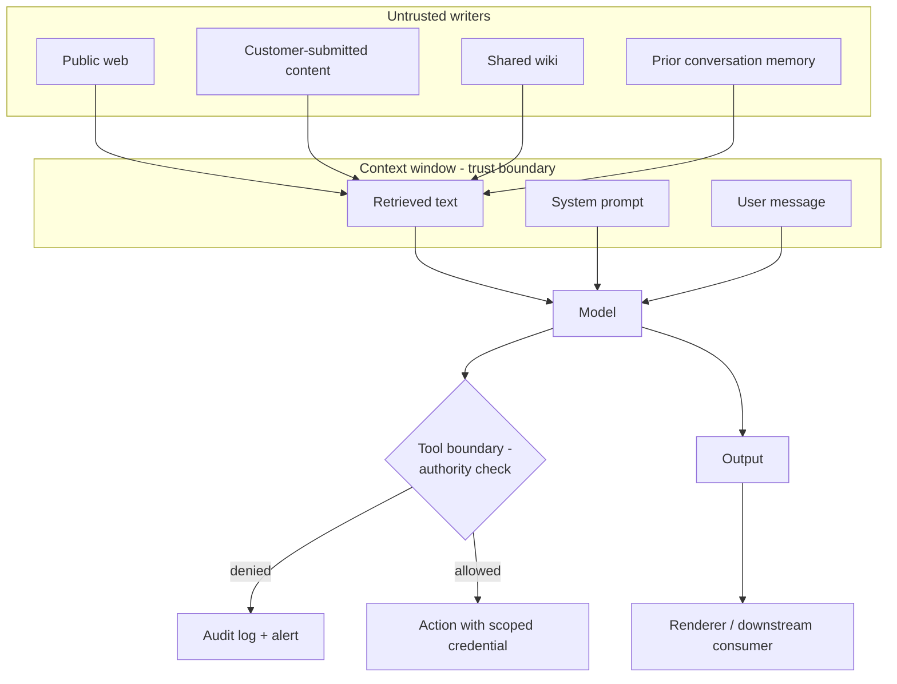

# AI Threat Modeling

> **9-minute read. Assumes you've read [Prompt injection explained](./prompt-injection-explained.md).**

## The one-line answer

Threat modeling an AI feature means answering three questions before you build it: what goes into the model's context, what the model can cause to happen, and whose authority each of those actions runs under.

Answer those three and you will find most of the risk. Everything else is refinement.

## Why the usual approach needs adjusting

Classic threat modeling assumes control flow is code. You trace inputs through functions you wrote, and the branches are ones you can read.

In an LLM feature, part of the control flow is decided at inference time by a model reading text, and that text is assembled from several sources with different trust levels. A data-flow diagram that stops at "call the LLM" hides the interesting part.

So the adjustment is small but important: **treat the context window as a trust boundary, and treat every tool as an authority boundary.**

## The three questions

### 1. What is in the context, and who can write to each source?

List every source of text that reaches the model, and for each one, who can put words there.

| Source | Who can write to it | Trust |
|---|---|---|
| System prompt | Your team | Trusted |
| User message | The authenticated user | Semi-trusted (they may attack their own session) |
| Retrieved documents | Anyone who can edit the corpus | Untrusted if the corpus takes outside input |
| Fetched web pages | Anyone on the internet | Untrusted |
| Tool results | Depends on the tool, and on what the tool read | Usually untrusted |
| Conversation memory | Whoever wrote to it earlier, possibly weeks ago | Untrusted |

The row people miss is memory. Text planted in one session can surface in a prompt much later, which makes it a stored injection vector in the same way a stored XSS differs from a reflected one.

### 2. What can the model cause to happen?

Enumerate every effect. Not just tools: anything downstream that consumes the output.

- Tool calls, with their parameters
- Text rendered in a UI (HTML? markdown? auto-loaded images?)
- Text written to a database, a ticket, a log
- Text passed to another agent
- Code that gets executed
- Emails, messages, webhooks, payments

Then sort them by reversibility. A read is free to get wrong. A published post is not.

### 3. Whose authority does each action run under?

For each effect, name the principal.

If the answer is "the application's service account," you have a confused-deputy problem: a user who could not do X directly can ask the assistant to do X, and the assistant can.

The target answer is the intersection of the user's rights and the tool's scoped credential, checked in code at the tool boundary.

## A diagram worth drawing

Two boxes matter more than the rest: the context window, where untrusted text mixes with trusted text, and the tool boundary, which is the last place a non-model control can say no.

## STRIDE, adapted

If your organization already uses STRIDE, here is how each category tends to show up.

| STRIDE | AI-specific shape |
|---|---|
| **Spoofing** | Injected text impersonating a system message or a developer instruction |
| **Tampering** | Poisoned training data, or a poisoned document in the retrieval corpus |
| **Repudiation** | No audit trail of what the model was shown or which tool it called |
| **Information disclosure** | Retrieval returning documents the user cannot see; system prompt extraction; embeddings leaking source text |
| **Denial of service** | Unbounded agent loops, maximum-length output floods, denial of wallet |
| **Elevation of privilege** | Confused deputy: the agent's service account exceeding the user's rights |

The mapping is imperfect but useful for teams who need findings to land in an existing process.

## Questions that surface real problems

Ask these in a design review. They are chosen because in practice they find things.

- If an attacker could write one document into our corpus, what is the worst outcome?
- Which tool has the broadest permission, and does its task actually need that?
- If the system prompt were published on the internet tomorrow, what would we lose?
- Can user A's data reach user B through retrieval, cache, or memory?
- What stops the loop if the model never decides it is finished?
- What does the model output touch that could execute it: a renderer, a shell, a query, a fetch?
- Who is on the hook when the model is confidently wrong, and does the UI set that expectation?
- What is the rollback if we ship a prompt or model change that regresses safety?

## Rating what you find

Severity should track impact and reachability, not the elegance of the attack.

- **Critical** - a single crafted document causes an unauthorized action or cross-tenant data exposure.
- **High** - sensitive data reaches the wrong user; a tool can be invoked outside the caller's entitlement.
- **Medium** - system prompt extraction with no secrets in it; a bounded cost attack.
- **Low** - the model can be made to say something off-brand with no data or action consequence.

Teams often over-rate jailbreaks and under-rate retrieval authorization bugs. The second category is where the real breaches live.

## Do it early, redo it on change

Threat model at design time, when changing the answer is cheap. Then revisit whenever any of the three questions changes answer: a new data source, a new tool, a new model version, a new user population, or a change of purpose.

A model upgrade is a threat model change. The new model may be more capable at exactly the thing you were relying on it not doing.

## What to look at next

- **[Prompt injection explained](./prompt-injection-explained.md)** - the attack this defends against
- **[Guardrails and safety](./guardrails-and-safety.md)** - the control layer
- **[Agentic loops](./agentic-loops.md)** - where autonomy multiplies blast radius
- **[Shared responsibility model](./shared-responsibility-model.md)** - what your provider covers and what you own
- **[Agent and tool security](../../resources/ai-security/agent-security.md)** - the engineering-depth controls
- **[LLM red teaming](../../resources/ai-security/llm-red-teaming.md)** - how to test the model you just built
- **[Zero trust architecture](../../resources/architecture-patterns/zero-trust-architecture.md)** - the identity model that makes step 3 workable
