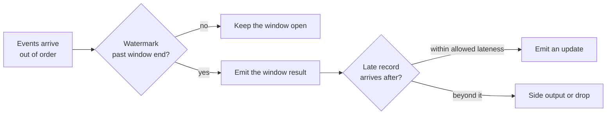

# Batch vs streaming

> **10-minute read. [Queues vs streams](./queues-vs-streams.md) covers the transport; this page is about the processing on top of it.**

## The one-line answer

**Batch** processing runs on a schedule over a bounded set of data: everything that arrived yesterday. **Stream** processing runs continuously over an unbounded feed, handling each record or small window as it arrives.

The real difference is not speed. It is that a batch job knows when its input is complete, and a streaming job never does.

## Why that matters more than latency

A nightly job that sums yesterday's orders starts at 01:00 and trusts that yesterday is over. It can sort, join and aggregate freely, and if it fails you re-run it and get the same answer.

A streaming job computing the same total has to answer a harder question continuously: *is this hour finished?* An order placed at 23:59 might arrive at 00:04 because a phone was offline. The job has already emitted an hourly total. Does it revise it? Wait longer, and be later for everyone? Ignore the late record and be quietly wrong?

That question, **event time versus processing time**, is the whole discipline of stream processing.

- **Event time** is when the thing happened.
- **Processing time** is when your system saw it.

They diverge constantly, so a streaming system uses a **watermark**: a moving assertion that says "we believe we have seen everything up to 14:00". When the watermark passes a window's end, the window closes and emits. Records arriving after that are late, and you must choose a policy: drop them, send them to a side output, or re-emit a corrected result.

How a streaming job decides a time window is finished, and what it does about records that turn up afterwards.

## Windows

Streaming aggregates over windows, and there are three shapes worth knowing:

| Window | Shape | Use it for |
|---|---|---|
| **Tumbling** | Fixed, non-overlapping: every 5 minutes | Periodic totals. Each event lands in exactly one window |
| **Sliding** | Fixed length, overlapping: last 5 minutes, recomputed every minute | Moving averages, rate alerts |
| **Session** | Bounded by a gap in activity, not a clock | Grouping a user's activity into visits |

## What each is good at

**Batch is good at** anything where the answer is allowed to be a few hours old: financial reporting, model training, billing, large joins, backfills, anything where correctness and reproducibility matter more than freshness. It is dramatically simpler to test, because the input is a fixed file you can run against repeatedly.

**Streaming is good at** cases where a late answer is a worthless answer: fraud detection before the transaction completes, fresh features for a model at inference time, operational dashboards, alerting, and anything feeding a user-facing experience that must reflect what just happened.

## The honest warning

Streaming costs more than its latency benefit usually justifies, and teams reach for it too early. It runs continuously, so you pay continuously. Bugs are harder to reproduce because you cannot rewind to the exact input. State has to be checkpointed so a crashed job resumes rather than restarts. Deploying a new version means deciding what happens to in-flight state.

A good rule: if nobody can name a decision that changes when data is 5 minutes old rather than 6 hours old, that pipeline is a batch pipeline. Micro-batching every 15 minutes gets most of the perceived benefit for a fraction of the operational load.

## Lambda and Kappa

Two named architectures you will meet in exam questions and design reviews:

- **Lambda** runs both. A streaming layer gives fast approximate answers, a batch layer recomputes the accurate version later, and a serving layer merges them. It works, and the cost is maintaining the same business logic twice in two languages, where the two copies drift.
- **Kappa** runs streaming only. Reprocessing means replaying the log from the beginning through a new version of the job. This is why retention on the log matters, and why Kafka's replayability is the feature the architecture rests on.

Modern engines blur this: Spark Structured Streaming, Flink and Databricks Delta Live Tables all let the same code run over a bounded or unbounded source, which removes most of Lambda's original justification.

## Exactly-once, honestly

Systems advertise **exactly-once processing**. What they actually provide is at-least-once delivery plus deduplication and transactional commits, so the *observable effect* is exactly once, within that system's boundary.

Once your job writes to something outside that boundary, a payment API or a third-party webhook, you are back to needing [idempotency](./idempotency-explained.md) on your side. "Exactly-once" is a property of a closed pipeline, not a promise about the outside world.

## The managed options

| | AWS | Azure | GCP | Open source |
|---|---|---|---|---|
| **Stream transport** | Kinesis Data Streams, MSK | Event Hubs | Pub/Sub | Kafka, Pulsar |
| **Stream processing** | Managed Flink, Lambda | Stream Analytics | Dataflow | Flink, Spark Streaming |
| **Batch processing** | Glue, EMR | Data Factory, Synapse | Dataproc, Dataflow | Spark, dbt |

## What to look at next

- **[Queues vs streams](./queues-vs-streams.md)** - the transport layer underneath, and why a stream is replayable
- **[ETL vs ELT](./etl-vs-elt.md)** - the batch world's equivalent question
- **[Data pipelines and orchestration](./data-pipelines-and-orchestration.md)** - scheduling, retries, and backfills
- **[Idempotency explained](./idempotency-explained.md)** - what exactly-once does not cover
- **[Eventual consistency](./eventual-consistency.md)** - the same "when is it settled" problem in storage
- **[Service comparison: messaging and queues](../../resources/service-comparison-messaging-queues.md)** - the services side by side
- **[Data engineering topic](../../topics/data-engineering.md)** - everything in the repo on this subject
