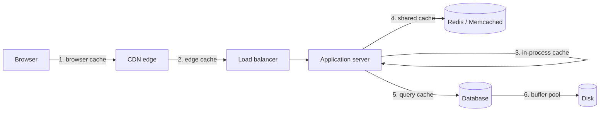

# Caching Explained

> **8-minute read. Assumes you've read [What is cloud computing?](./what-is-cloud-computing.md).**

## The one-line answer

A cache stores the result of expensive work so the next request gets it cheaply, and the whole discipline is deciding when that stored copy is no longer good enough to use.

Caching is the most common performance fix in computing and the source of some of the most confusing bugs, for the same reason: you are deliberately serving data that might be out of date.

## Where caches live

A request passes through several potential caches before it reaches your database:



Each layer is faster and smaller than the one below it. A request answered at layer 1 never troubles layers 2 through 6.

| Layer | Typical latency | Shared between users? |
|---|---|---|
| Browser cache | Microseconds | No |
| CDN edge | 10-50 ms | Yes |
| In-process (in the app's memory) | Nanoseconds | No, per instance |
| Shared cache (Redis) | 1-5 ms | Yes |
| Database buffer pool | Microseconds | Yes |

## Why in-process and shared caches both exist

An in-process cache is the fastest possible, because the data is already in the application's memory. But every application instance has its own copy, so ten instances mean ten copies that can disagree, and a deploy wipes them all.

A shared cache like Redis costs a network round trip but gives every instance the same view, survives deploys, and can hold far more data than one process.

Real systems often use both: a small in-process cache for the hottest items, backed by Redis for everything else.

## The hard part: invalidation

> "There are only two hard things in Computer Science: cache invalidation and naming things." - Phil Karlton

The problem is simple to state. You cached a value. The underlying data changed. How does the cache find out?

Three approaches, and most systems use a mix:

### 1. Time to live (TTL)

Give each entry an expiry. After it passes, the next request fetches fresh data.

- **Simple**, works everywhere, needs no coordination
- **Stale window**: with a 5-minute TTL you serve up to 5 minutes of outdated data
- Choose the TTL from how stale the data may acceptably be, not from how often it changes

### 2. Explicit invalidation

When the data changes, delete or update the cache entry.

- **Fresh immediately**
- Requires every write path to remember to do it, which is where bugs live
- Gets harder as more services write to the same data

### 3. Write-through

Every write goes to the cache and the database together, so they never diverge.

- **Always consistent**
- Slower writes, and you cache data nobody may ever read

## Caching patterns

**Cache-aside (lazy loading)** is the most common. The application checks the cache; on a miss it reads the database and populates the cache.

```python
def get_user(user_id):
    cached = cache.get(f"user:{user_id}")
    if cached is not None:
        return cached
    user = db.query("SELECT * FROM users WHERE id = %s", (user_id,))
    cache.set(f"user:{user_id}", user, ttl=300)
    return user
```

Only requested data gets cached, so the cache stays relevant. The cost is that the first request after an expiry is slow.

**Read-through** puts the cache in front of the database so the application only talks to the cache, which fetches on a miss. Less application code, less control.

**Write-behind** writes to the cache immediately and to the database asynchronously. Fast writes, at the risk of losing data if the cache fails before the write lands.

## The failure modes worth knowing

**Cache stampede (thundering herd).** A popular key expires and a thousand simultaneous requests all miss and all hit the database at once. Fixes: add jitter to TTLs so keys do not expire together, or use a lock so only one request refreshes while others serve the stale value briefly.

**Cold cache after deploy.** Restarting every instance empties every in-process cache at once, and the database takes the full load. This is why a shared cache is more resilient, and why staged deploys are gentler than simultaneous ones.

**Caching an error.** A transient failure returns an empty result, and you cache it for an hour. Only cache successful responses, or use a much shorter TTL for negative results.

**Caching per-user data in a shared cache without the user in the key.** The classic serious bug: user A's data served to user B. Always include every dimension that varies the result in the cache key, including tenant and user identity.

**Unbounded growth.** A cache with no size limit and no eviction eventually consumes all available memory. Set a maximum size and an eviction policy such as least-recently-used.

## Measuring whether it works

The number that matters is **hit rate**: the proportion of requests served from the cache.

- Below 50%, the cache is adding a lookup without saving much. Check whether your keys are too specific or your TTL too short.
- Above 95%, it is doing real work, but check that you are not serving unacceptably stale data.

Also watch memory use, eviction rate (high evictions mean the cache is too small for the working set), and the latency difference between hits and misses.

## When not to cache

- Data that must be exactly current: account balances at the moment of a transaction, inventory at the moment of purchase
- Data read once and never again, where you pay the write cost for no benefit
- Anything where a stale answer causes a correctness problem rather than a cosmetic one
- As a substitute for fixing a genuinely slow query. A cache hides the problem until the day the cache is cold

## What to look at next

- **[CDN explained](./cdn-explained.md)** - caching at the network edge
- **[Eventual consistency](./eventual-consistency.md)** - why a cached read returning stale data is a general distributed systems problem
- **[Prompt caching](./prompt-caching.md)** - the same idea applied to LLM inputs
- **[Idempotency explained](./idempotency-explained.md)** - the companion property for safe retries
- **[Load balancing deep dive](../../resources/networking-deep-dives/load-balancing-deep-dive.md)** - where caches sit in a request path
