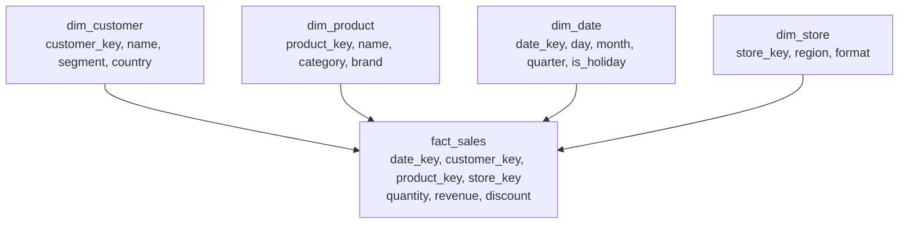

# Data modeling for analytics

> **9-minute read. Assumes you have met tables and joins. [SQL vs NoSQL](./sql-vs-nosql.md) is the gentler starting point.**

## The one-line answer

Analytical tables are shaped differently from application tables on purpose. The dominant shape is the **star schema**: one central table of events (a fact table) surrounded by tables describing the things involved (dimension tables).

The application database normalizes to avoid storing anything twice. The warehouse deliberately denormalizes, because storage is cheap and the goal is queries that are fast and legible to someone who is not an engineer.

## Facts and dimensions

- A **fact** is something that happened, with numbers you want to add up. An order line, a page view, a payment. Fact tables are long and narrow, and they grow forever.
- A **dimension** describes the context of a fact. The customer, the product, the store, the date. Dimension tables are short and wide, and they change slowly.

The test for which is which: if you would sum it, it belongs in a fact. If you would group by it or filter on it, it belongs in a dimension.



A star schema. Every question of the form "revenue by X over time" is one join per X, and an analyst can read the diagram without asking anyone what a table means.

The query it is built for reads almost like the question:

```sql
SELECT d.quarter, p.category, SUM(f.revenue)
FROM fact_sales f
JOIN dim_date d    ON d.date_key = f.date_key
JOIN dim_product p ON p.product_key = f.product_key
WHERE d.year = 2026
GROUP BY d.quarter, p.category;
```

## Star versus snowflake

A **snowflake schema** normalizes the dimensions further: `dim_product` points at `dim_category`, which points at `dim_department`.

It saves a little storage and adds a join to nearly every query. On modern columnar warehouses that trade is usually wrong, and a flat star is the default. Snowflake the schema and Snowflake the warehouse are unrelated, which is an unfortunate collision of names.

## Slowly changing dimensions

The problem that catches everyone: a customer moves from Germany to France. Last year's orders were placed by a German customer. If you simply update the row, last year's report changes retrospectively, which is usually wrong and occasionally a compliance issue.

The standard handling, named by type:

| Type | What it does | Use when |
|---|---|---|
| **Type 0** | Never changes | True constants, like a birth date |
| **Type 1** | Overwrite, keep no history | Corrections of genuine errors, like a typo |
| **Type 2** | New row per version, with valid-from and valid-to dates | The default when history matters |
| **Type 3** | Keep a "previous value" column | You only ever need the one prior value |

Type 2 is the one worth knowing properly. The dimension gains `valid_from`, `valid_to` and `is_current`, and the fact table references the **surrogate key** of the version that was current when the fact occurred. That is why dimensions use a generated surrogate key rather than the source system's natural key: the natural key identifies the customer, the surrogate key identifies a *version* of the customer.

## Grain

The **grain** is what one row of a fact table means, and it is the first decision, before any column. "One row per order line per shipment" is a grain. "One row per order, sort of" is how a table ends up double-counting.

Two rules that follow:

- **State the grain in writing** at the top of the model. Most fact-table bugs are two people assuming different grains.
- **Do not mix grains in one table.** An order-level discount stored on an order-line fact will be summed once per line, inflating it. Either allocate it across lines or keep a separate order-grain fact.

## Fan-out, the silent duplication bug

Join a fact to a dimension that is not unique on the join key and every matching fact row is multiplied. Revenue goes up, nothing errors, and the uniqueness test you did not write is the one that would have caught it.

Assert uniqueness on every dimension key. This is the cheapest high-value test in [data quality](./data-quality-and-lineage.md), and the reason it is listed there as a starting point.

## Wide tables and One Big Table

Some teams skip dimensions and publish **One Big Table**: facts with every descriptive attribute already joined in.

It is not heresy. On a columnar engine, unused columns cost almost nothing to skip, and a single table is easier for a BI tool and for a casual analyst. It works well for a specific well-understood use case.

What you give up is reuse and consistency. Ten wide tables built by different people will define "active customer" ten ways. The usual compromise: model a star in silver, publish wide tables in gold for specific consumers, and generate them from the star so there is still one definition.

## A note on the metrics layer

Even with a clean star, the definition of a metric tends to live in whichever dashboard needed it first. A **semantic** or **metrics layer** (dbt's semantic layer, Cube, LookML) moves those definitions into version-controlled code that every tool reads.

It is worth reaching for at the point where two dashboards disagree about revenue and both are technically correct.

## What to look at next

- **[Warehouses, lakes, and lakehouses](./warehouses-lakes-lakehouses.md)** - where these tables live
- **[ETL vs ELT](./etl-vs-elt.md)** - the transforms that build them
- **[Data quality and lineage](./data-quality-and-lineage.md)** - the tests that keep a model honest
- **[File formats and partitioning](./file-formats-and-partitioning.md)** - how the fact table is physically laid out
- **[SQL vs NoSQL](./sql-vs-nosql.md)** - the normalized world these tables are copied from
- **[Data engineering topic](../../topics/data-engineering.md)** - everything in the repo on this subject
