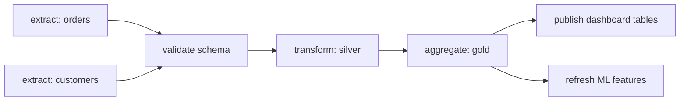

# Data pipelines and orchestration

> **9-minute read. The thing that actually runs everything the other data pages describe.**

## The one-line answer

An **orchestrator** runs your pipeline steps in the right order, on a schedule or a trigger, retries the ones that fail, and tells you when something did not finish. It is the difference between a set of scripts and a system somebody can rely on.

Airflow, Dagster, Prefect, AWS Step Functions and Azure Data Factory are all answers to the same question.

## Why a cron job stops being enough

Everybody starts with cron. It works until one of these happens, and all of them happen:

- **Step B needs step A's output.** Cron can only run B twenty minutes after A and hope. When A takes twenty-five minutes, B silently processes yesterday's data.
- **A step fails halfway.** Cron has no concept of retrying just that step, so you re-run everything or fix it by hand at 06:00.
- **Somebody asks you to reprocess March.** With cron, that is a bespoke script.
- **Nobody notices a failure.** Cron mails a machine account nobody reads. The dashboard shows a flat line and someone asks about it on Thursday.

An orchestrator exists to make dependency, retry, backfill and visibility first-class instead of improvised.

## DAGs

Pipelines are modelled as a **DAG**, a directed acyclic graph: steps with declared dependencies and no cycles.

Declaring dependencies rather than times means the two extracts run in parallel, the transform waits for both, and the two consumers of the gold tables also run in parallel. The orchestrator works the schedule out.

Because the dependencies are declared, the orchestrator can also answer "what broke, and what downstream of it is now stale", which is the question you have at 3am.

## The properties that matter

**Idempotency.** Re-running a task must produce the same result, not a doubled one. Write to a partition you overwrite rather than appending blindly. This is the property that makes everything else safe, and [Idempotency explained](./idempotency-explained.md) covers the patterns.

**Backfills.** Re-running a date range through the current code. Pipelines are usually parameterized by an execution date rather than reading "now", precisely so a backfill is the same code with a different parameter. A pipeline that calls `today()` internally cannot be backfilled, and you will find that out on the day you need to.

**Retries with backoff.** Most failures are transient: an API rate limit, a brief network problem. Retry a few times with increasing delay before waking anyone.

**Alerting on the right thing.** Alert on *outcomes*, not just exceptions. A task that succeeds while writing zero rows is the dangerous case, because nothing is red and the data is missing. Assert on row counts and freshness, not only on exit codes.

**Data-aware scheduling.** Newer orchestrators (Dagster's assets, Airflow's datasets) let you declare what a task *produces* rather than when it runs, so downstream work triggers when its input is actually refreshed. This models the thing you care about, which is the table being current.

## The tools

| Tool | Shape | Suits |
|---|---|---|
| **Airflow** | Python DAGs, the long-standing default | Teams wanting the biggest ecosystem and plenty of hiring pool |
| **Dagster** | Asset-oriented, strong typing and testing | Teams who want data assets and lineage as the first-class model |
| **Prefect** | Python-native, dynamic workflows | Pipelines whose shape is decided at run time |
| **Step Functions** | AWS state machines, serverless | AWS-native work, no cluster to run |
| **Data Factory / Synapse pipelines** | Azure, largely visual | Azure estates, heavy on connectors |
| **dbt** | Not an orchestrator. Models and runs SQL transforms | The T in ELT, usually invoked *by* one of the above |

dbt is worth calling out because it is often mistaken for an orchestrator. It builds a DAG of SQL models, tests them and documents them. Something else still has to decide when it runs.

## Two failure modes worth designing against

**The silent zero.** A task completes successfully having produced nothing, because an upstream API returned an empty page or a filter matched no rows. Every check is green. Assert a minimum row count on anything that should never legitimately be empty.

**The invisible backlog.** A task is slow rather than failed, so the schedule overlaps itself and runs pile up. Set a timeout and a maximum number of concurrent runs, so lateness surfaces as an alert rather than as a queue.

Both matter more than they look, because neither produces an error message. Around a full-time job, the failure that does not shout is the one that costs a week.

## What to look at next

- **[ETL vs ELT](./etl-vs-elt.md)** - the steps an orchestrator is sequencing
- **[Batch vs streaming](./batch-vs-streaming.md)** - when there is no schedule to orchestrate
- **[Idempotency explained](./idempotency-explained.md)** - the property retries and backfills depend on
- **[Data quality and lineage](./data-quality-and-lineage.md)** - the assertions worth attaching to each step
- **[Observability basics](./observability-basics.md)** - the same discipline for services
- **[Build a data pipeline](../../resources/hands-on-projects/build-data-pipeline.md)** - build one end to end
- **[Data engineering topic](../../topics/data-engineering.md)** - everything in the repo on this subject
