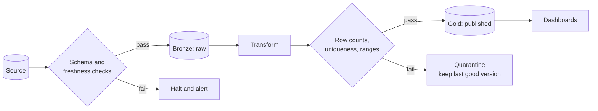

# Data quality and lineage

> **9-minute read. How a number on a dashboard earns the right to be believed.**

## The one-line answer

**Data quality** is a set of automated assertions that a dataset still looks the way everyone assumed it looks. **Lineage** is the record of where each table's contents came from, so that when an assertion fails you can see what is affected and who to tell.

Together they are the difference between a warehouse people trust and one where every number gets checked by hand before anyone quotes it.

## Why this is not optional at scale

A software bug throws an exception. A data bug produces a number.

Nothing crashes when an upstream team renames `total_amount` to `amount_total` and your pipeline starts writing nulls. The job is green, the dashboard shows revenue falling 4%, and someone spends a fortnight investigating a business problem that does not exist. The failure is silent by nature, so it has to be detected on purpose.

## The six dimensions

The standard framing, and a genuinely useful checklist when deciding what to assert:

| Dimension | The question | A typical test |
|---|---|---|
| **Completeness** | Is anything missing? | No nulls in `customer_id`; row count within 20% of the 7-day average |
| **Uniqueness** | Are there duplicates? | `order_id` is unique |
| **Validity** | Does it match the rules? | `country` is in the ISO list; `total >= 0` |
| **Accuracy** | Does it match reality? | Warehouse revenue reconciles to the billing system within 0.1% |
| **Consistency** | Do the copies agree? | Customer count matches between silver and gold |
| **Timeliness** | Is it current? | `max(updated_at)` is within 3 hours |

Accuracy is the hard one, because it requires a source of truth outside the pipeline. It is also the one that catches the errors that matter most, so a reconciliation check against the operational system is worth the work.

## Where the tests go

Put assertions at the boundaries, where data enters and where it is published:

The decision that matters is the one on the right: what happens when a check fails. Publishing bad data is usually worse than publishing yesterday's data, so the default should be to hold the last good version and alert, not to overwrite.

**Circuit breaking** is the name for stopping the pipeline on a failed assertion. It feels aggressive until the first time it prevents a board pack being built on broken numbers.

## The tools

- **dbt tests** - assertions declared alongside the model in YAML. `unique`, `not_null`, `accepted_values` and `relationships` out of the box, plus any SQL you write. If you already use dbt, start here; the marginal cost is nearly zero.
- **Great Expectations** - a large library of expectations with profiling and data docs. More capable, more to run.
- **Soda** and **Monte Carlo** - checks-as-config and, in Monte Carlo's case, anomaly detection that learns the normal shape of a table and alerts on deviation.
- **Cloud-native** - AWS Glue Data Quality, Azure Purview, Google Dataplex.

The anomaly-detection products are attractive because they need no rules written, and that is also their weakness: they find that something changed, not that something is wrong. Explicit assertions encode what you actually believe.

## Lineage

Lineage answers two questions:

- **Upstream:** this number looks wrong, what fed it?
- **Downstream:** this source broke, what is now suspect and who uses it?

The second is the one that pays for itself. When an upstream system has an incident, lineage turns "probably some dashboards are affected" into a list of tables, dashboards and owners you can notify in ten minutes.

Lineage can be captured three ways: parsed from SQL automatically (dbt and most warehouses do this), emitted by pipelines through a standard like [OpenLineage](https://openlineage.io/), or maintained by hand in a catalog. Hand-maintained lineage is accurate the week it is written and misleading a quarter later, so prefer the automatic kinds and accept that they cover only what runs through the tools.

## Catalogs and contracts

A **data catalog** (DataHub, Amundsen, Unity Catalog, Purview, Dataplex) is where lineage, schemas, ownership and documentation live so people can find a table and know whether to trust it. The technical part is easy; keeping ownership current is the part that decays.

A **data contract** is an agreement between the team producing data and the teams consuming it: this schema, these guarantees, this notice period before a breaking change. It is process more than technology, and it addresses the root cause that quality tests only detect. The test tells you the column was renamed; the contract is why it should not have been renamed without warning.

## Where to start

If none of this exists yet, in order:

1. **Freshness and row-count checks on your most-used gold tables.** Two assertions, and they catch the majority of real incidents.
2. **Uniqueness and not-null on primary keys.** Cheap, and catches join fan-out, which is the silent duplication bug.
3. **One reconciliation** against the operational source for the number people care about most, usually revenue.
4. **Ownership** recorded for every gold table, so an alert has a destination.

Lineage tooling comes after those. A perfect graph of a pipeline nobody is checking is decoration.

## What to look at next

- **[Data pipelines and orchestration](./data-pipelines-and-orchestration.md)** - where the checks get run
- **[ETL vs ELT](./etl-vs-elt.md)** - schema drift, the most common thing these tests catch
- **[Warehouses, lakes, and lakehouses](./warehouses-lakes-lakehouses.md)** - why a lake without this becomes a swamp
- **[Observability basics](./observability-basics.md)** - the same argument for services
- **[Compliance guides](../../resources/compliance-guides/)** - where lineage stops being good practice and becomes a requirement
- **[Data engineering topic](../../topics/data-engineering.md)** - everything in the repo on this subject
