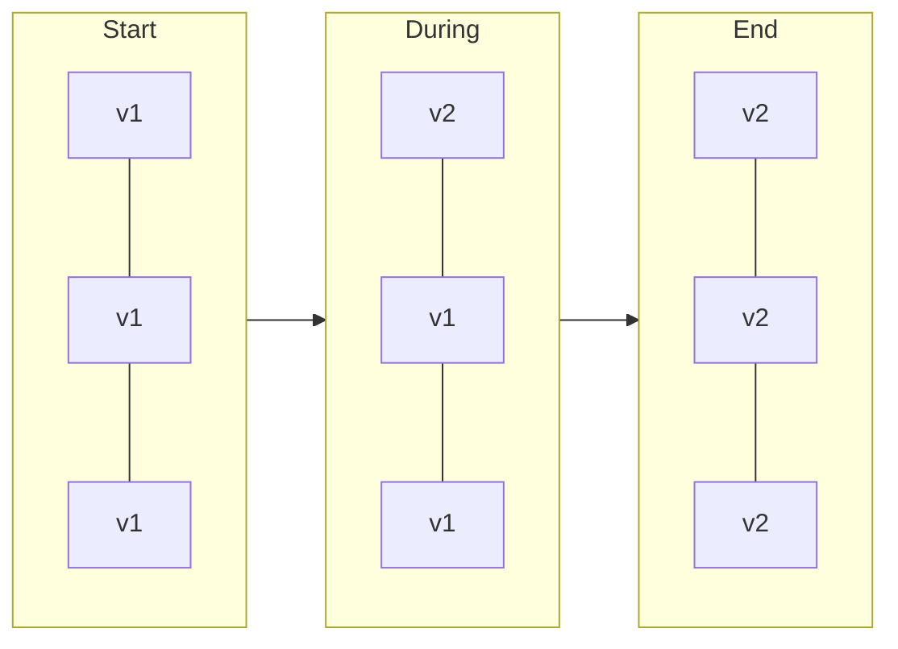

# Deployment Strategies

> **8-minute read. Assumes you've read [CI/CD explained](./cicd-explained.md).**

## The one-line answer

A deployment strategy is how you replace the running version of software with a new one, and every strategy is a trade between how fast you find out something is wrong and how much it costs to run.

## The strategies

### Recreate

Stop the old version, start the new one.

- Simple, and the only option when two versions genuinely cannot run at once
- **Downtime** for the length of the restart
- Acceptable for internal tools and batch systems, rarely for anything user-facing

### Rolling update

Replace instances a few at a time. Kubernetes Deployments do this by default.

- **No downtime**, no extra capacity beyond a small surge
- Both versions serve traffic simultaneously, so they must be compatible with each other and with the database schema
- Rollback means rolling back through the same process, which is not instant

The two knobs are `maxSurge` (how many extra instances may exist) and `maxUnavailable` (how many may be missing). Setting both to zero is a contradiction and stalls the rollout.

### Blue-green

Run two complete environments. Blue serves production; green gets the new version. Test green, then switch all traffic at once.

- **Instant rollback**: switch back
- **Instant cutover**, so no period of mixed versions
- **Doubles infrastructure** during the deploy
- Long-lived connections and in-flight requests need draining
- Suits changes that cannot tolerate two versions at once, such as an incompatible schema change

### Canary

Send a small percentage of traffic to the new version, watch, then increase.

- **Real production traffic** exposes problems that staging never will
- **Small blast radius** if it fails
- Requires traffic splitting and, to be worth doing, **automated analysis** of error rate and latency
- Slower to complete, and requires both versions to coexist

A canary without metrics analysis is just a slow rolling update with extra steps. The value comes from automatically aborting when the new version's error rate diverges.

### A/B testing

Superficially like canary, but a different purpose. Canary asks "is this version broken?" and A/B asks "which version performs better on a business metric?" A/B runs longer, splits by user attribute rather than by percentage of requests, and is measured by conversion rather than error rate.

### Shadow (dark launch)

Send a copy of production traffic to the new version and discard its responses.

- Tests real load and real data with zero user risk
- Cannot test anything with side effects unless carefully isolated, or you will send duplicate emails and double-charge cards

## Choosing

| Requirement | Strategy |
|---|---|
| Simplest possible, downtime acceptable | Recreate |
| No downtime, no extra cost | Rolling |
| Instant rollback, no mixed versions | Blue-green |
| Catch problems with a small blast radius | Canary |
| Compare business outcomes | A/B |
| Test under real load with no risk | Shadow |

Most organizations settle on rolling as the default and canary for the services where a bad release is expensive.

## The part that actually breaks: schema changes

Every strategy except recreate has both versions running at once, which means the database must work with both.

The **expand and contract** pattern makes this safe:

1. **Expand**: add the new column, nullable, without removing anything
2. **Deploy** code that writes both old and new, and reads the old
3. **Backfill** existing rows
4. **Deploy** code that reads the new
5. **Contract**: remove the old column, and the dual-write code, in a later release

It takes several releases instead of one. That is the price of being able to roll back at any point, and skipping it is the most common cause of "the deploy was fine until we rolled back".

Rules that follow: never rename a column in one step, never drop a column the previous version still reads, and make every migration backward compatible for at least one release.

## Feature flags

A flag separates **deploying** code from **releasing** behavior. Ship the code disabled, turn it on for internal users, then a percentage, then everyone. Turning it off is instant and needs no deploy.

This makes trunk-based development practical, and it is the fastest possible rollback for a behavior change. The cost is that flags accumulate: every flag is a branch in your code and a combination to test. Remove them once the rollout is finished.

## What makes any of this work

Whatever strategy you pick, these are what make it safe:

- **Health checks** that reflect readiness accurately
- **Graceful shutdown**: stop accepting new requests, finish in-flight ones, then exit
- **Backward-compatible schema changes**
- **Idempotent** operations, so retries during a deploy do not duplicate work
- **Observability** during and after: error rate, latency, saturation, compared against the previous version
- **A tested rollback path**, because an untested rollback is a hope

## What to look at next

- **[CI/CD explained](./cicd-explained.md)** - the pipeline that gets you to the deploy
- **[Idempotency explained](./idempotency-explained.md)** - why retries during a rollout are safe or not
- **[Autoscaling explained](./autoscaling-explained.md)** - capacity changes during a rollout
- **[Observability basics](./observability-basics.md)** - what you watch to decide whether to proceed
- **[CGOA: GitOps certification](../../exams/kubernetes/cgoa/)** - rollback as a state store operation
