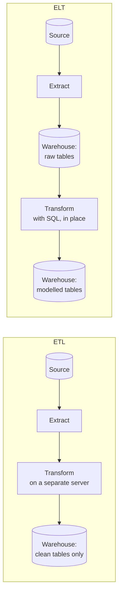

# ETL vs ELT

> **8-minute read. Read [Warehouses, lakes, and lakehouses](./warehouses-lakes-lakehouses.md) first if "warehouse" is not yet a familiar word.**

## The one-line answer

Both move data from a source into a warehouse. **ETL** transforms it on the way in; **ELT** loads it raw and transforms it once it has landed, using the warehouse's own compute.

The letters are the same three steps in a different order, and the reorder was driven by one thing: warehouse compute got cheap and elastic.

## The two orders

The same three steps, with the transform moved to the other side of the load. In ELT the raw data stays in the warehouse, which is the property most of the benefits come from.

## Why ETL came first

When warehouses were fixed-size appliances you had bought and racked, storage was expensive and compute was finite. Loading raw data you would not query was waste. So a separate machine, running a tool like Informatica or SSIS, did the cleaning and only the finished result was loaded.

That constraint is gone. Object storage is cheap, and Snowflake, BigQuery and their peers scale compute on demand. Loading raw data now costs very little, and the warehouse is often the most powerful engine available.

## Why ELT won for most new work

- **The raw data stays.** When a transform turns out to be wrong, and it will, you re-run it against data you still have. Under ETL the raw input was discarded, so a logic bug means going back to the source system and re-extracting, if it even retains the history.
- **Transformations become SQL.** Analysts who know SQL can own them. This is most of why [dbt](https://docs.getdbt.com/docs/introduction) took hold: transformations become version-controlled, tested, reviewable SQL models rather than boxes wired together in a GUI.
- **One engine to operate.** No separate transform cluster to size, patch and pay for.
- **Rebuilds are cheap.** Adding a column to a model means re-running SQL over data already sitting in the warehouse.

## When ETL is still right

Not a legacy choice. Transform before loading when:

- **The data must not land raw.** Personal data that has to be masked, tokenized or dropped before it touches the analytical store. If your compliance boundary says the warehouse never holds raw card numbers, transform first. This is the strongest reason and it is not negotiable by architecture preference.
- **The volume is huge and most of it is discarded.** Filtering 95% of a firehose before paying to store it.
- **The source is fragile.** A mainframe or an old ERP that can afford exactly one carefully shaped extraction per night.
- **The transformation is not expressible in SQL.** Image processing, a Java library that encodes business rules nobody will rewrite.

In practice most estates run both, and the useful question is per-pipeline, not architectural.

## Reverse ETL

Worth knowing because the name is confusing. **Reverse ETL** moves modelled data back *out* of the warehouse into operational tools: pushing a computed "likely to churn" score into Salesforce or HubSpot so a human sees it where they work.

It exists because the warehouse became the place where the best version of the truth lives, and the operational tools want that truth without rebuilding the logic.

## Where the work actually goes wrong

Whichever order you choose, the same three things cause most incidents:

1. **Schema drift.** The source adds, renames or retypes a column and the pipeline either fails or, much worse, silently writes nulls. Assert on schema, do not assume it.
2. **Late and duplicate data.** Records arrive after the window that should have contained them, or arrive twice after a retry. Design the load to be [idempotent](./idempotency-explained.md) so re-running a batch cannot double-count.
3. **Full reloads that quietly became too slow.** A nightly full refresh works until the table is large, then runs past the point people need it. Moving to incremental loads means deciding how to detect change, which is harder than it sounds.

## Incremental loading, briefly

The three usual strategies, cheapest first:

| Strategy | How it detects change | Catch |
|---|---|---|
| **Full refresh** | Does not. Reloads everything | Simple and correct. Stops scaling |
| **High-water mark** | `WHERE updated_at > last_run` | Misses hard deletes, and any row whose timestamp is not reliably updated |
| **Change data capture (CDC)** | Reads the database's own write-ahead log | Catches deletes and every change. More moving parts, and the log is a coupling to the source |

CDC tools such as Debezium, AWS DMS or Fivetran read the transaction log rather than querying the table, so they capture deletes and put almost no load on the source. It is the most complete option and the most infrastructure.

## What to look at next

- **[Data pipelines and orchestration](./data-pipelines-and-orchestration.md)** - what actually runs these steps, in order, on a schedule
- **[Warehouses, lakes, and lakehouses](./warehouses-lakes-lakehouses.md)** - where the data lands
- **[Batch vs streaming](./batch-vs-streaming.md)** - the same question about timing rather than order
- **[Idempotency explained](./idempotency-explained.md)** - why a re-run has to be safe
- **[Data quality and lineage](./data-quality-and-lineage.md)** - catching the wrong number before a dashboard shows it
- **[Build a data pipeline](../../resources/hands-on-projects/build-data-pipeline.md)** - the hands-on version
- **[Architecture pattern: data pipeline / ETL](../../resources/architecture-patterns/data-pipeline-etl.md)** - the reference implementation
