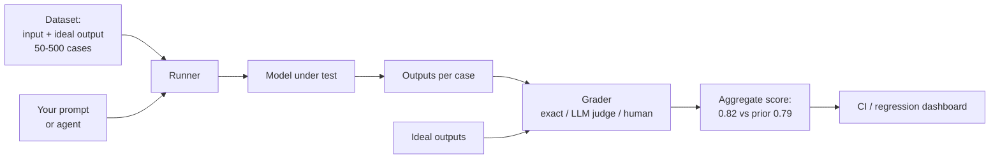

# Evals for LLMs

> **8-minute read.**

## The one-line answer

An **eval** is a test suite for an LLM application. You collect a set of representative inputs, define what "good" output looks like for each, then run your prompt/agent against them and measure quality. Without evals, you're shipping based on vibes. With them, you can change a prompt or model and *know* whether you made things better or worse.

This is the engineering practice that separates "demo that worked once" from "production system that holds up."

## Why "I tested it manually" doesn't count

You wrote a prompt, ran it on 5 examples, looked good, shipped. Three months later:

- The model version updated, behavior shifted, you didn't notice.
- Someone tweaked the prompt for a specific bug, accidentally regressed three other cases.
- A new edge case appeared in production - was it always broken or did something change?
- You want to try a cheaper model, no idea if it's safe.

Evals turn all of those into measurable questions.

## The shape of a basic eval

You need three things:

1. **A dataset**: 50-500 (input, ideal output) pairs covering normal cases, edge cases, and known failures.
2. **A grader**: code or another LLM that decides if a given output is good.
3. **A runner**: harness that runs your prompt against the dataset, applies the grader, reports scores.



Output: a single number (or a few). "Prompt v3 scored 0.82, prompt v2 scored 0.79."

## Building the dataset

This is where the work is. Source it from:

- **Real production traffic** (anonymized): your highest-signal source. Sample logs, label them.
- **Hand-written cases**: 20-50 examples covering the obvious paths.
- **Failure cases**: every production bug becomes a permanent eval case. Especially this.
- **Adversarial cases**: prompt injection attempts, ambiguous inputs, off-topic queries.

Quantity rule of thumb: 50 cases gets you signal, 200+ gets you reliable trend tracking, 1000+ if you're seriously fine-tuning or model-shopping.

Make labels carefully. If you can't agree with yourself on what "good" looks like, the eval is worthless. Two independent labelers should agree at least 90% of the time on the same case.

## Grading: how to decide if output is good

Three flavors, in increasing order of fuzziness:

### 1. Exact / structural match
Output should equal expected, or contain a specific string, or parse as valid JSON, or match a regex. Cheap, deterministic, perfect for classification or structured output tasks.

```python
def grade(output, expected):
    return output.strip() == expected.strip()
```

### 2. Programmatic checks
Output should *behave* a certain way. Run it: does the SQL execute? Does the code pass tests? Does the JSON have the required fields? Does the answer cite the right doc?

Deterministic and high-signal when applicable. Use this whenever you can.

### 3. LLM-as-judge
For open-ended outputs (summaries, explanations, chat responses) where exact match is impossible, you ask another LLM to grade.

```text
You are an evaluator. Given a user question, an expected answer,
and a model's actual answer, decide if the actual answer is
substantially correct. Output JSON: { "correct": bool, "reason": string }
```

Pros: handles fuzzy quality at scale.

Cons:
- The judge has its own biases.
- Use a different model than the one you're evaluating, or it's marking its own homework.
- Calibrate against human ratings on a sample - if judge disagrees with humans 30% of the time, your scores are noise.
- LLM judges are stricter on length, structure, and tone than they look. Watch for that.

### 4. Human grading (the gold standard, expensive)
For high-stakes evaluation, sample 50-200 outputs and have humans rate them. Slow, but the most trustworthy signal. Use to calibrate your LLM-judge.

## Specific metrics for specific tasks

### Classification
Precision, recall, F1, accuracy. Standard ML metrics work fine.

### Retrieval (RAG)
- **Recall@K**: of the relevant docs, what fraction made it into top-K?
- **MRR (Mean Reciprocal Rank)**: how high in the list does the first relevant doc appear?
- **NDCG**: rewards getting relevant docs *and* ranking them high.

For a RAG system, evaluate retrieval and answer quality separately. Otherwise you can't tell which one broke when scores drop.

### Generation
- **Faithfulness**: does the answer reflect the source / context, or does it hallucinate? Often LLM-judged.
- **Relevance**: does it actually answer the question?
- **Format adherence**: does it follow the structure you asked for?

### Agents
- **Task success rate**: did the agent achieve the goal?
- **Steps to completion**: efficiency.
- **Tool call validity**: fraction of calls that succeed without retry.
- **Cost per task**: dollars spent.

### Safety / alignment
- **Refusal rate on disallowed prompts**: should be high.
- **Refusal rate on safe prompts**: should be low (avoid over-refusal).
- Adversarial test sets: does it fall for prompt injection?

## Run them in CI

The whole point is regression detection. An eval that doesn't run automatically before every prompt change is decoration.

Setup:
- Eval suite runs on every PR that touches prompts/agents.
- Score must not regress more than X% on each metric.
- Diff old vs new outputs on failing cases for human review.

Some teams gate deploys on eval pass. At minimum, post the score delta as a PR comment.

## Cost-aware evaluation

Evals on frontier models are expensive. 200 cases × 5 prompts you're testing × $0.05 per call = $50 per eval run. Mitigations:

- Cache: reuse outputs when prompt + input + model haven't changed.
- Smaller eval set for routine PRs, full set for releases.
- Cheaper model for grader (sometimes; calibrate carefully).
- Run only on changed components.

## Common mistakes

| Mistake | Fix |
|---------|-----|
| Eval set written from your prompt's correct outputs | You'll never catch a regression. Source from real cases. |
| One metric for everything | Multiple metrics. A summary can be faithful but irrelevant, or relevant but unfaithful. |
| Static eval set, never updated | Add every production failure as a permanent case. |
| LLM-as-judge with the same model being tested | Marking its own homework. Use a different model. |
| Grading only the final output | Grade intermediate steps too (which docs retrieved, which tools called). That's where bugs hide. |
| Only "pass/fail" no diffing | When score drops, you need to *see* the new outputs vs old, not just see the number. |

## "Vibes" still matter, but...

You can't fully reduce LLM quality to numbers. Spending time *looking at outputs* with no grader at all - "vibe checks" - catches things metrics miss. New emergent behaviors, weird tone shifts, formatting drift.

But: vibes alone don't scale, don't catch regressions, don't survive team changes. You need both. Evals as the bottom line, vibe checks as the daily walkthrough.

## What to look at next

- **[Prompt engineering](./prompt-engineering.md)** - the thing you're evaluating
- **[RAG explained](./rag-explained.md)** - the case where eval setup is non-trivial
- **[AI agents explained](./agents-explained.md)** - even harder eval setup
- **[Anthropic Claude Certified Architect - Professional cert](../../exams/anthropic/claude-certified-architect-professional/)** - production AI systems including evaluation
- **[Architecture pattern: AI/ML pipeline](../../resources/architecture-patterns/ai-ml-pipeline.md)** - where evals fit in production
