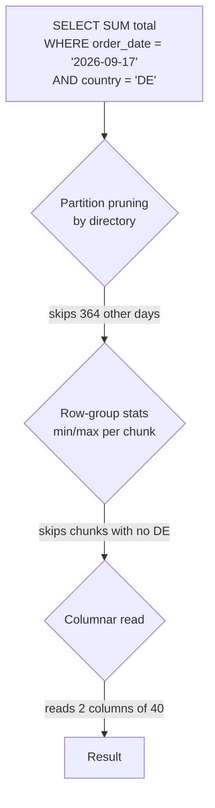

# File formats and partitioning

> **9-minute read. The least glamorous page in this section and the one that saves the most money.**

## The one-line answer

How you store files decides how much data a query has to read, and on most cloud platforms you are billed by bytes scanned. Choosing **Parquet** over CSV and partitioning on the column people actually filter by routinely cuts a query's cost by an order of magnitude, with no change to the query itself.

## Row formats and column formats

A CSV or a JSON Lines file stores whole records one after another. To read one column you read every byte.

Parquet and ORC store data **by column**. All the country codes sit together, all the timestamps sit together. Two things follow:

- A query touching 3 columns out of 50 reads roughly 6% of the file.
- Compression gets dramatically better, because a column holds one type with repeating values. A country column of 2 million rows with 40 distinct values compresses to almost nothing.

Parquet also carries **statistics per row group**: the min and max of each column in each chunk. A query filtering `WHERE order_date = '2026-09-01'` can skip an entire chunk whose max date is in August without decompressing it. This is **predicate pushdown**, and it is why the format matters more than it sounds.

| Format | Shape | Use it for |
|---|---|---|
| **CSV** | Row, text | Interchange with humans and old tools. Never for analytics at scale |
| **JSON / JSONL** | Row, text | Raw landing of semi-structured events, nested data |
| **Parquet** | Columnar, binary | The default for analytics. Broad support everywhere |
| **ORC** | Columnar, binary | Similar to Parquet, strongest in the Hive and Trino world |
| **Avro** | Row, binary | Streaming and message payloads, where whole records are read and schema evolution matters |

The usual shape: land raw as JSON, convert to Parquet on the way into silver, and never query the JSON again.

## Partitioning

Partitioning means storing files in a directory structure that encodes a column's value:

```text
s3://lake/orders/
  order_date=2026-09-15/part-0000.parquet
  order_date=2026-09-16/part-0000.parquet
  order_date=2026-09-17/part-0000.parquet
```

A query filtering on `order_date` reads one directory. Everything else is never opened. This is **partition pruning**, and it is the single biggest lever on both query time and cost.

Partition on the column people actually filter by. In practice that is almost always a date, sometimes a date plus a tenant or region.



Three independent filters between a query and the bytes it pays for. Getting the layout wrong disables the first two, and nothing in the query's text will tell you.

## The small files problem

The most common way a lake gets slow. A streaming job writing every minute produces 1,440 files a day per partition. Each file carries a metadata read, an open and a close. A query over a year is then opening half a million tiny objects, and the overhead dwarfs the reading.

Aim for files in the **128 MB to 1 GB** range. Every lakehouse engine ships a compaction operation for exactly this: `OPTIMIZE` in Delta, `rewrite_data_files` in Iceberg. Schedule it. A table nobody compacts gets slower every week in a way that looks like a query problem and is a layout problem.

## Over-partitioning

The mirror-image mistake. Partitioning by hour when queries ask for months, or by a high-cardinality column like `user_id`, gives you hundreds of thousands of directories holding one small file each. You have combined maximum metadata overhead with the small files problem.

A working rule: a partition should hold at least a few hundred megabytes. If your daily volume is 10 MB, partition by month, not by day.

For the case where you genuinely need to filter on a high-cardinality column, the answer is not partitioning but **clustering** (sorting data by that column within files) or **bucketing** (hashing it into a fixed number of buckets). Iceberg's hidden partitioning and Databricks' liquid clustering both exist to let you get the benefit without encoding the choice into directory names you can never change.

## Compression

Parquet compresses per column chunk, and the codec is a choice:

- **Snappy** - the default. Fast to decompress, moderate ratio. Right for hot data queried often.
- **ZSTD** - better ratio at similar speed, and now well supported. A good default for new tables.
- **Gzip** - highest ratio, slowest. For cold archival data read rarely.

The trade is storage cost against CPU on every read. For data queried daily, decompression speed wins.

## What this costs you if you ignore it

A concrete shape, common enough to be worth stating plainly. One year of events as gzipped JSON in a single directory: a query for one day reads the entire year, because nothing can be skipped. The same data as daily-partitioned Parquet: the query reads one day, three columns. Same SQL, same result, a fraction of the bytes scanned and therefore a fraction of the bill on BigQuery, Athena or Snowflake.

This is why "the warehouse is expensive" is usually a layout problem rather than a pricing problem.

## What to look at next

- **[Warehouses, lakes, and lakehouses](./warehouses-lakes-lakehouses.md)** - what sits on top of these files
- **[ETL vs ELT](./etl-vs-elt.md)** - where the format conversion happens
- **[Batch vs streaming](./batch-vs-streaming.md)** - why streaming writes create small files
- **[Cloud cost basics](./cloud-cost-basics.md)** - bytes scanned as a billing model
- **[Data engineering topic](../../topics/data-engineering.md)** - everything in the repo on this subject
