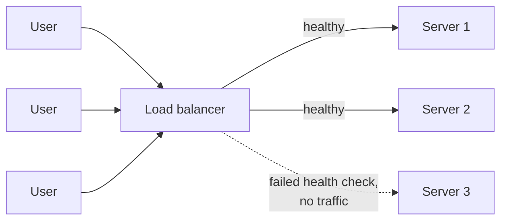

# Load Balancing Explained

> **7-minute read. Assumes you've read [What is a server?](../day-one/what-is-a-server.md).**

## The one-line answer

A load balancer sits in front of several servers, receives every request, and decides which server handles it. That one indirection gives you scale, resilience, and the ability to deploy without downtime.

## Why one server is not enough

A single server has three problems:

1. **Capacity** - it can only handle so many requests
2. **Failure** - when it dies, the service dies
3. **Deployment** - restarting it to deploy new code means downtime

Adding servers fixes all three, but only if something distributes traffic across them and stops sending requests to ones that are unhealthy. That something is a load balancer.

## Layer 4 versus layer 7

The most useful distinction, and the one that shows up in every cloud provider's product names.

**Layer 4** balances on TCP/UDP information: source and destination IP and port. It does not read the request content.

- Very fast, low overhead
- Works for any TCP protocol, not just HTTP
- Cannot route on URL path, header, or cookie
- Examples: AWS Network Load Balancer, Azure Load Balancer, GCP passthrough load balancer

**Layer 7** balances on the application request: it parses HTTP and can see the path, headers, method, and cookies.

- Route `/api/*` to one pool and `/static/*` to another
- Terminate TLS, rewrite headers, apply a web application firewall
- More work per request, so slightly higher latency
- Examples: AWS Application Load Balancer, Azure Application Gateway, GCP HTTP(S) Load Balancer

Choose layer 7 for HTTP applications, which is most of the time. Choose layer 4 when you need raw throughput, a non-HTTP protocol, or the client IP preserved without extra configuration.

## Algorithms

| Algorithm | How it picks | Good when |
|---|---|---|
| **Round robin** | Next server in order | Requests cost roughly the same |
| **Weighted round robin** | Proportional to assigned weights | Servers have different capacities |
| **Least connections** | Fewest active connections | Request durations vary widely |
| **Least response time** | Fastest recent responses | Server performance varies |
| **IP hash** | Deterministic by client IP | You need the same client on the same server |
| **Consistent hashing** | Hash of a key, stable as the pool changes | Cache affinity, sharded backends |

Round robin is the sensible default. Least connections is the usual upgrade when some requests are much slower than others, because round robin will happily keep sending work to a server that is already stuck on a long request.

## Health checks

The load balancer's most important job is knowing which servers to avoid.

A health check is a periodic request to each server; failing servers are removed from rotation and re-added when they recover.

- **Shallow check** (`/healthz` returning 200): confirms the process is up. Cheap, and blind to a broken database connection.
- **Deep check**: verifies dependencies too. More accurate, and risky: if the shared database is slow, every server fails its check simultaneously and the load balancer removes all of them.

The usual compromise is a shallow liveness check for the load balancer, and separate deeper readiness signals used at deploy time. Getting this wrong turns a partial degradation into a total outage.

## Sticky sessions

Session affinity sends a given user back to the same server, usually via a cookie.

It is occasionally necessary and generally a smell. It means your servers hold user state in memory, which breaks scaling (load becomes uneven), breaks deploys (restarting a server loses sessions), and breaks failover.

The better fix is to make servers **stateless** and keep session state in a shared store such as Redis or in a signed token. Then any server can handle any request.

## Health, capacity, and deploys

Once a load balancer is in place, several things become possible that were not before:

- **Rolling deploys**: remove one server from rotation, update it, health check it, return it, repeat. No downtime.
- **Blue-green**: run two full environments and switch which one the load balancer points at.
- **Canary**: send a small percentage of traffic to the new version and watch error rates before shifting more.
- **Zone and region distribution**: spread backends across availability zones so a zone failure removes some capacity rather than all of it.

See [Regions and availability zones](./regions-and-availability-zones.md).

## Beyond the classic load balancer

- **Global load balancing** and DNS-based routing send users to the nearest healthy region.
- **Service meshes** move balancing into a per-service proxy so it happens between internal services, not just at the edge.
- **Ingress controllers** are how this works in Kubernetes, mapping external traffic to services.
- **CDNs** balance and cache at the network edge, closer to users than any load balancer of yours. See [CDN explained](./cdn-explained.md).

## Common mistakes

- **A single load balancer as the new single point of failure.** Managed cloud load balancers are redundant by design; a self-hosted one usually is not unless you make it so.
- **Health checks that are too deep**, removing every server at once when a shared dependency wobbles.
- **Health checks that are too shallow**, happily sending traffic to a process that cannot serve anything.
- **Timeouts that do not match.** If the load balancer's idle timeout is shorter than the backend's, clients see mysterious connection resets.
- **Forgetting the client IP.** Behind a proxy, the backend sees the load balancer's address unless you read `X-Forwarded-For` or use proxy protocol.

## What to look at next

- **[CDN explained](./cdn-explained.md)** - balancing and caching at the edge
- **[Regions and availability zones](./regions-and-availability-zones.md)** - what you are spreading across
- **[Kubernetes in 10 minutes](./kubernetes-in-10-minutes.md)** - services and ingress do this inside a cluster
- **[Load balancing deep dive](../../resources/networking-deep-dives/load-balancing-deep-dive.md)** - the reference-depth version
- **[Service comparison: networking](../../resources/service-comparison-networking.md)** - the equivalent products per cloud
