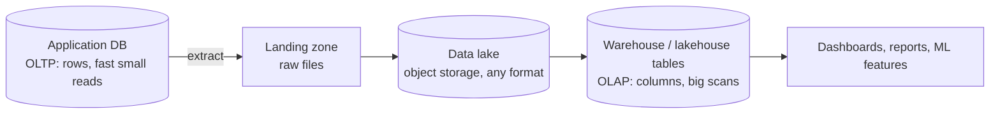

# Warehouses, lakes, and lakehouses

> **10-minute read. Assumes you know roughly what a database is.**

## The one-line answer

A **data warehouse** stores cleaned, structured data ready to be queried. A **data lake** stores raw files of any shape, cheaply, and works out what they mean later. A **lakehouse** puts warehouse-style tables on top of lake-style file storage, so you get one copy of the data instead of two.

The three are not competitors so much as three answers to the same question: where does data live once it is no longer in the application database?

## Why not just query the application database?

Because the two workloads want opposite things.

Your application database is **OLTP**: online transaction processing. It handles many small reads and writes, each touching a few rows, and it must answer in milliseconds. It stores rows together on disk, because fetching one whole order at a time is what it does.

Analytics is **OLAP**: online analytical processing. It scans millions of rows and touches a few columns. "What was average order value by country last quarter" reads two columns out of forty, across the whole table.

Running the second kind of query on the first kind of database does two bad things: it is slow, because the engine reads whole rows to get two columns, and it competes for resources with the customers actually using your application. So analytical data gets copied somewhere built for it.

The path data takes from the application to the dashboard. Every arrow is somewhere a pipeline can break, which is why the rest of the data pages in this section exist.

## The data warehouse

A warehouse is a database tuned for analytics. Snowflake, BigQuery, Redshift, Synapse and Microsoft Fabric are the ones you will meet.

What makes it a warehouse rather than just a large database:

- **Columnar storage.** Values from the same column sit together on disk, so a query touching 2 of 40 columns reads 5% of the bytes. It also compresses far better, because a column of country codes has few distinct values.
- **Separated storage and compute** in the modern ones. The data sits in object storage; query engines spin up against it and shut down. You can run a huge query for ten minutes and pay for ten minutes.
- **Schema on write.** You define the table before loading, and the load fails if the data does not fit. That is the point: by the time anyone queries it, the shape is known.

The cost of schema on write is that somebody has to design the schema, and changing it later is work. The benefit is that a query returns something trustworthy.

## The data lake

A lake is object storage plus a convention. S3, Azure Data Lake Storage or Google Cloud Storage, holding files.

The pitch is **schema on read**: land the data now in whatever shape it arrives, decide what it means when you query it. That matters when the data is semi-structured (JSON event payloads, logs), when it is huge and mostly never read, or when you do not yet know which questions you will ask.

The risk is the well-worn one. A lake with no catalog, no ownership and no quality checks becomes a **data swamp**: terabytes nobody can interpret and nobody dares delete. The difference between a lake and a swamp is entirely governance, not technology.

## The lakehouse

The lakehouse exists because most organizations ended up running both, and paying for both.

The pattern: keep the files in object storage, and add a **table format** over them that supplies the things a warehouse had and a lake lacked. Delta Lake, Apache Iceberg and Apache Hudi are the three; Iceberg has become the most broadly supported.

A table format is metadata that turns a directory of Parquet files into a table with:

- **ACID transactions.** A write either lands completely or not at all, so a reader never sees a half-written batch.
- **Schema evolution.** Add a column without rewriting history.
- **Time travel.** Query the table as it stood yesterday, which is how you recover from a bad pipeline run.
- **Efficient updates and deletes.** Object storage has no UPDATE. The table format records changes as new files plus metadata, which is also how you satisfy a GDPR deletion request without rewriting a petabyte.

| | Warehouse | Lake | Lakehouse |
|---|---|---|---|
| **Stores** | Structured tables | Files, any format | Files plus table metadata |
| **Schema** | On write | On read | On write, evolvable |
| **Transactions** | Yes | No | Yes |
| **Cost per TB** | Higher | Lowest | Low |
| **Best at** | BI and reporting | Cheap retention, ML on raw data | Both, one copy |
| **Examples** | Snowflake, BigQuery, Redshift | S3, ADLS, GCS | Databricks, Iceberg on any engine |

## Medallion layers

Most lakehouses organize data in three tiers, a convention Databricks named **medallion** and everyone borrowed:

- **Bronze** - raw, as it arrived, never edited. Its job is to be replayable. If a transform was wrong, you fix the code and rebuild from bronze.
- **Silver** - cleaned, deduplicated, typed, joined into sensible entities.
- **Gold** - aggregated for consumption. The tables a dashboard or a model actually reads.

The value is that each layer has one job, and a failure has an obvious blast radius. A wrong currency conversion is a silver problem; a missing day of data is a bronze problem.

## How to choose

Reach for a **warehouse** when the data is mostly structured, the consumers are analysts and dashboards, and you want the least operational work. This is the right default for most organizations, and "just use BigQuery or Snowflake" is rarely the wrong first answer.

Reach for a **lake** when you are storing large volumes of semi-structured or binary data, most of which will never be queried, and cheap retention is the goal. Logs, telemetry, images, model training sets.

Reach for a **lakehouse** when you have both and do not want to maintain two copies, or when the same data feeds both dashboards and model training. Also when open formats matter to you: Iceberg tables in your own object storage are readable by many engines, which is real protection against lock-in.

The honest caveat: at small scale the distinction barely matters. A few hundred gigabytes in PostgreSQL will outrun the time you spend building a lakehouse for it. Choose the architecture your data volume actually justifies.

## What to look at next

- **[ETL vs ELT](./etl-vs-elt.md)** - how the data gets in, and why the order changed
- **[File formats and partitioning](./file-formats-and-partitioning.md)** - why Parquet, and why layout decides your bill
- **[Batch vs streaming](./batch-vs-streaming.md)** - whether the data arrives hourly or continuously
- **[SQL vs NoSQL](./sql-vs-nosql.md)** - the operational-database question this one sits downstream of
- **[Data quality and lineage](./data-quality-and-lineage.md)** - what keeps a lake from becoming a swamp
- **[Architecture pattern: lakehouse](../../resources/architecture-patterns/lakehouse-architecture.md)** - the implementation view
- **[Service comparison: databases](../../resources/service-comparison-databases.md)** - the warehouse options side by side
- **[Data engineering topic](../../topics/data-engineering.md)** - everything in the repo on this subject
