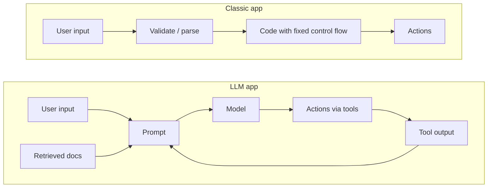

# AI security

Securing systems that have a language model somewhere in the request path.

Classic application security still applies: you still need authentication, least privilege, input validation, and logging. What changes is that one component in your architecture now takes untrusted natural language as input, produces text that other components trust, and can be persuaded to do things you did not intend. That single property breaks assumptions that most security controls were built on.

This directory covers the attack surface, the defenses that actually work, and how to test them.

---

## Why LLM systems need their own security treatment

In a classic app, control flow is code you wrote. In an LLM app, control flow is decided at inference time by a model reading a prompt, and that prompt is assembled from sources an attacker may control: the user's message, a retrieved document, the output of a previous tool call, a web page the agent fetched. There is no reliable separator between "instructions" and "data" inside that prompt.

Everything in this directory follows from that one fact.

---

## Pages

| Page | What it covers |
|---|---|
| [OWASP Top 10 for LLM Applications](./owasp-llm-top-10.md) | The reference risk taxonomy, entry by entry, with cloud-specific mitigations |
| [Prompt injection defense](./prompt-injection-defense.md) | Direct and indirect injection, why filtering fails, what actually reduces risk |
| [Agent and tool security](./agent-security.md) | Excessive agency, tool scoping, sandboxing, human-in-the-loop design |
| [Model supply chain security](./model-supply-chain.md) | Model provenance, weight integrity, poisoned datasets, dependency risk |
| [LLM red teaming](./llm-red-teaming.md) | How to test an LLM system adversarially, and what to measure |

---

## Governance and compliance

Security controls are one half. The other half is being able to demonstrate governance to a regulator, an auditor, or an enterprise customer.

- **[EU AI Act](../compliance-guides/eu-ai-act.md)** - risk tiers, obligations, and timelines for AI systems placed on the EU market
- **[NIST AI Risk Management Framework](../compliance-guides/nist-ai-rmf.md)** - the voluntary US framework: Govern, Map, Measure, Manage
- **[ISO/IEC 42001](../compliance-guides/iso-42001.md)** - the certifiable AI management system standard
- **[SOC 2](../compliance-guides/soc2.md)**, **[GDPR](../compliance-guides/gdpr.md)**, **[HIPAA](../compliance-guides/hipaa.md)** - the existing obligations that AI features inherit

---

## Where this connects

**Learn the concepts first**
- [Prompt injection explained](../../learn/concepts/prompt-injection-explained.md) - the plain-English version
- [AI threat modeling](../../learn/concepts/ai-threat-modeling.md) - how to reason about a system you are building
- [Guardrails and safety](../../learn/concepts/guardrails-and-safety.md) - the control layer
- [Tool use and function calling](../../learn/concepts/tool-use-and-function-calling.md) - the mechanism agents use to act
- [Agentic loops](../../learn/concepts/agentic-loops.md) - why autonomy multiplies blast radius

**Build**
- [Set up an eval harness](../hands-on-projects/set-up-eval-harness.md) - regression testing, including safety regressions
- [Build a RAG pipeline](../hands-on-projects/build-rag-pipeline.md) - the retrieval layer that indirect injection targets
- [Implement zero trust](../hands-on-projects/implement-zero-trust.md) - the identity model agents should sit inside

**Certify**

No certification covers this material end to end yet. The closest coverage:

- [AWS GenAI Developer Professional (AIP-C01)](../../exams/aws/professional/genai-developer-aip-c01/) - has a dedicated AI safety, security, and governance domain
- [AWS AI Practitioner (AIF-C01)](../../exams/aws/foundational/ai-practitioner-aif-c01/) - responsible AI at foundational depth
- [NVIDIA GenAI and LLMs Associate](../../exams/nvidia/genai-llms-associate/) - ethics and responsible AI domain
- [Azure AI Engineer (AI-102)](../../exams/azure/ai-102/) - content safety and responsible AI tooling
- [Cloud Security Alliance CCSK](../../exams/cloud-security-alliance/ccsk/) - cloud governance the AI controls sit inside

---

## Reference

**[📖 OWASP GenAI Security Project](https://genai.owasp.org/)** - the working group behind the LLM Top 10 and related guidance
**[📖 NIST AI Risk Management Framework](https://www.nist.gov/itl/ai-risk-management-framework)** - AI RMF 1.0 and the Generative AI Profile
**[📖 MITRE ATLAS](https://atlas.mitre.org/)** - adversarial threat landscape for AI systems, structured like ATT&CK
**[📖 Anthropic: Claude's constitution and safeguards](https://www.anthropic.com/research)** - published safety research
**[📖 Google Secure AI Framework (SAIF)](https://saif.google/)** - Google's conceptual framework for securing AI systems
**[📖 Microsoft Responsible AI Standard](https://www.microsoft.com/en-us/ai/responsible-ai)** - Microsoft's governance model and tooling
