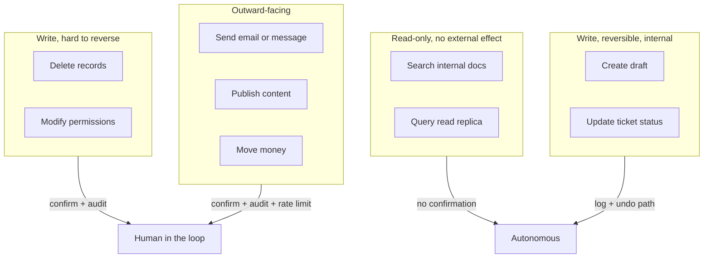

# Agent and tool security

An agent is a model in a loop with tools. Each of those three words adds risk: the model decides, the loop repeats, and the tools touch real systems. This page covers how to give an agent enough authority to be useful and not enough to be dangerous.

The governing principle: **an agent should be treated as a confused deputy, permanently.** It acts on behalf of a user, it can be persuaded by content it reads, and it will occasionally be wrong for no adversarial reason at all. Design as though every tool call might be attacker-chosen.

---

## The blast radius model



Classify every tool into a tier before writing the agent. The tier decides the controls, and the exercise usually reveals that half the tools were more powerful than the task needed.

---

## Tool design is security design

### Narrow beats general

The most common security mistake in agent code is exposing a general-purpose tool because it is easier to write.

| Avoid | Prefer | Why |
|---|---|---|
| `run_sql(query)` | `get_order_status(order_id)`, `list_orders_for_customer(customer_id)` | The general tool grants the union of every query the credential can run |
| `http_request(url, method, body)` | `lookup_shipping_rate(zip, weight)` | The general tool is an SSRF primitive and an exfiltration channel |
| `run_shell(cmd)` | `restart_service(service_name)` with an enum | The general tool is remote code execution by design |
| `write_file(path, content)` | `save_draft(draft_id, content)` | Path traversal, config overwrite, and persistence |
| `send_email(to, subject, body)` | `reply_to_ticket(ticket_id, body)` | Recipient resolved server-side from the ticket, not chosen by the model |

The pattern is consistent: replace free-form parameters with identifiers the server resolves, and replace open verbs with specific ones.

### Constrain the schema

Every parameter is an attack surface. Use the tightest type the task allows.

```json
{
  "name": "refund_order",
  "description": "Refund an order the authenticated customer owns. Refunds above 100.00 require approval.",
  "input_schema": {
    "type": "object",
    "properties": {
      "order_id": {"type": "string", "pattern": "^ord_[a-zA-Z0-9]{12}$"},
      "amount_cents": {"type": "integer", "minimum": 1, "maximum": 10000},
      "reason": {"type": "string", "enum": ["damaged", "not_received", "wrong_item"]}
    },
    "required": ["order_id", "amount_cents", "reason"]
  }
}
```

Enums instead of free text. Patterns instead of bare strings. Numeric bounds. Then validate server-side against the same schema, because the model's compliance with a schema is a convenience, not a guarantee.

Note what is missing: no `customer_id`. That comes from the session.

### Identity: three separate principals

Confusion here causes most real agent incidents.

| Principal | What it is | What it must not do |
|---|---|---|
| **The user** | The authenticated human | - |
| **The agent** | The service running the loop | Must not hold permissions the user lacks |
| **The tool** | The credential each tool executes with | Must not be one shared admin credential |

The rule: **effective permission = intersection of user permission and tool permission.** Never the union, never just the service account.

```python
# The runtime injects actor from the session. It is not in the tool schema,
# so no amount of prompt manipulation can change it.
def execute_tool(name: str, args: dict, *, session: Session):
    tool = REGISTRY[name]
    validate(args, tool.schema)                       # reject on mismatch
    authz.require(session.principal, tool.permission, args)   # user's rights
    with tool.credential() as cred:                   # tool's own scoped identity
        result = tool.run(args, cred)
    audit.record(session, name, args, result.summary)
    return result
```

In practice this means: a distinct IAM role, service account, or database user per tool; read-only wherever the task is read-only; and row-level or tenant scoping enforced in the query, not in the prompt.

---

## Bounding the loop

Autonomy is the multiplier. A single wrong tool call is a bug; a loop making wrong calls for six hours is an incident.

Enforce all of these **in code, outside the model**:

- **Max iterations.** A hard cap on turns. Fail closed and surface to a human when hit.
- **Wall-clock timeout** for the whole run, plus a per-tool-call timeout.
- **Token and spend budget** per run, per user, per tenant, per day.
- **Action counters.** No more than N writes, N emails, N records touched per run.
- **Loop detection.** Same tool with same arguments three times means stop, not retry.
- **Kill switch.** A flag that halts all agent runs without a deploy.

A stopping condition the model decides is not a stopping condition.

---

## Sandboxing code execution

If your agent runs generated code, that is the highest-risk tool you have. Treat it as running untrusted code, because you are.

- Isolated runtime: container with a read-only root filesystem, gVisor or Firecracker if the workload justifies it.
- **No network** by default. Add a proxy with a destination allowlist only when the task requires it.
- **No credentials** in the environment. No cloud instance metadata access. Block the metadata endpoint explicitly.
- Non-root user, dropped capabilities, seccomp profile.
- CPU, memory, PID, and disk quotas.
- Ephemeral: destroy after the run, never reuse across users or tenants.
- Egress logging so exfiltration attempts are visible after the fact.

Managed options: AWS Bedrock AgentCore code interpreter, Azure Container Apps dynamic sessions, Google Cloud Run sandboxed execution, or E2B and Modal for hosted sandboxes.

---

## Memory and multi-tenancy

Persistent memory is a stored injection vector. Text an attacker plants in turn 1 can be retrieved into a prompt weeks later, in a different session.

- Scope memory by tenant and user; never share an index or namespace across tenants.
- Record provenance on every memory: who wrote it, from what source, when.
- Expire memory. Unbounded retention is unbounded exposure.
- Never write raw untrusted content into memory. Write validated, structured extractions.
- Let users view and delete their agent's memory, which is a GDPR requirement as well as a security control.

---

## Multi-agent systems

Agent-to-agent messages are untrusted input. A supervisor that treats a worker's output as instruction is one compromised worker away from full control.

- Validate inter-agent messages against a schema, exactly as you would an external API response.
- Do not let a worker escalate the supervisor's permissions; the supervisor's authority should be the intersection, not the sum.
- Trace with a shared correlation ID so an audit can reconstruct which agent caused which action.
- Cap total system-wide iterations, not just per-agent iterations, or two agents will happily talk to each other until the budget runs out.

---

## MCP and third-party tools

The Model Context Protocol makes it easy to plug external tool servers into an agent. That is the point, and it is also the risk: an MCP server runs with your agent's trust.

- Vet MCP servers like production dependencies: source, maintainer, permissions requested, update policy.
- Pin versions. An auto-updating tool server is an auto-updating change to your agent's capabilities.
- Read the tool descriptions. Descriptions are part of the prompt, so a malicious server can inject through them ("tool poisoning").
- Run third-party servers in a separate process with their own credentials and network policy.
- Log every call crossing the boundary.

See [MCP explained](../../learn/concepts/mcp-explained.md) for the protocol itself and [Build a Claude agent with MCP](../hands-on-projects/build-claude-agent-with-mcp.md) for a worked build.

---

## Audit and detection

You cannot investigate what you did not record. For every agent run, log:

- Run ID, user principal, agent version, model and version, system prompt hash.
- Every tool call: name, arguments, tool credential, result status, latency.
- Every retrieval: query, document IDs returned, their provenance.
- Token counts and cost.
- Human confirmations: what was shown, who approved, when.

Then alert on the shapes that matter: tool calls denied by authorization, sudden spikes in call volume, first-time-seen tool sequences, runs hitting iteration caps, and any call to a tier 2 or 3 tool outside business hours.

Treat these logs as sensitive. They contain prompts, retrieved documents, and arguments.

---

## Review checklist

Use this before shipping an agent.

- [ ] Every tool classified into a blast-radius tier
- [ ] No general-purpose `run_sql` / `http_request` / `run_shell` / `write_file` tool
- [ ] Each tool has its own scoped credential, read-only where possible
- [ ] Authorization enforced at the tool boundary against the user's identity
- [ ] Caller identity injected by the runtime, absent from the tool schema
- [ ] Tenant scoping enforced in queries, not in the prompt
- [ ] Human confirmation on all tier 2 and 3 actions, showing real parameters
- [ ] Destination allowlist for every outbound URL, webhook, and recipient
- [ ] Hard iteration cap, wall-clock timeout, and spend budget in code
- [ ] Loop and repetition detection
- [ ] Generated code runs sandboxed, no network, no credentials, ephemeral
- [ ] Model output validated against schema before any downstream use
- [ ] Memory scoped per tenant, with provenance and expiry
- [ ] Full audit log of tool calls and retrievals, alerting configured
- [ ] Kill switch that does not require a deploy
- [ ] Injection tests in the eval suite, run on every change

---

## Related

- **[Prompt injection defense](./prompt-injection-defense.md)** - the attack this design defends against
- **[OWASP Top 10 for LLM Applications](./owasp-llm-top-10.md)** - LLM06 Excessive Agency in context
- **[LLM red teaming](./llm-red-teaming.md)** - how to test the controls above
- **[Agentic loops](../../learn/concepts/agentic-loops.md)** - how the loop works
- **[Tool use and function calling](../../learn/concepts/tool-use-and-function-calling.md)** - the mechanism
- **[Zero trust architecture](../architecture-patterns/zero-trust-architecture.md)** - the identity model agents belong inside

**[📖 OWASP LLM06: Excessive Agency](https://genai.owasp.org/llmrisk/llm06-excessive-agency/)** - canonical entry
**[📖 OWASP Agentic AI threats and mitigations](https://genai.owasp.org/resource/agentic-ai-threats-and-mitigations/)** - agent-specific taxonomy
**[📖 Model Context Protocol specification](https://modelcontextprotocol.io/)** - protocol and security considerations
**[📖 Anthropic: building effective agents](https://www.anthropic.com/engineering/building-effective-agents)** - design patterns for agent systems
