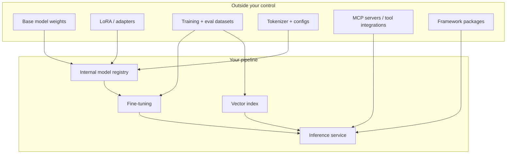

# Model supply chain security

Software supply chain security asks: do you know what code is running, where it came from, and whether it changed? AI adds four more artifact types that answer none of those questions by default - model weights, adapters, datasets, and tool servers - and most teams pull them from public hubs with less scrutiny than they apply to an npm package.

---

## The artifacts

Every arrow crossing from the left box to the right is a trust boundary that needs a control.

---

## Weight provenance and integrity

### The problems

- **Typosquatted and impersonated repositories.** A hub namespace that looks official but is not. Community re-uploads of popular models are routine and legitimate, which is exactly what makes malicious ones hard to spot.
- **Moving tags.** `latest`, `main`, or an unversioned reference resolves to different bytes over time. Your reproducible build is not reproducible.
- **Unsafe serialization.** PyTorch `.pt`, `.bin`, and `.ckpt` files are Python pickles. Loading one executes arbitrary code in your process, before any inference happens. This is not a theoretical risk; malicious pickles have been found on public hubs repeatedly.
- **Modified tokenizers and configs.** The weights can be genuine while the tokenizer or generation config is not, which changes behavior in ways benchmarks may not catch.
- **License drift.** A model whose license forbids commercial use, or whose base model's license propagates in ways the derivative page does not mention.

### The controls

| Control | What it looks like |
|---|---|
| **Pin by digest** | Reference the commit SHA or content digest, never a tag or branch |
| **Prefer safetensors** | Format is data-only, so loading cannot execute code. Refuse pickle formats in production |
| **Scan before promotion** | Run a model scanner over candidate artifacts to detect unsafe serialization and embedded payloads |
| **Mirror internally** | Approved models go to an internal registry. Production has no egress to public hubs |
| **Verify signatures** | Where the publisher signs (Sigstore, provider-native attestations), verify before promotion |
| **Record the license** | Base model license, derivative license, and any use restrictions, checked by legal once per model |
| **Re-verify on update** | A new version is a new artifact and repeats the whole process |

Managed registries that support this: AWS SageMaker Model Registry and Bedrock custom model import, Azure ML model registry with Purview lineage, Google Vertex AI Model Registry, plus Hugging Face Enterprise Hub for organization-scoped mirroring.

---

## AI bill of materials (AI-BOM)

An SBOM lists your code dependencies. An AI-BOM lists everything that determines model behavior. Enterprise customers and EU AI Act technical documentation both increasingly ask for one, so build it early rather than reconstructing it under deadline.

Record per deployed model:

| Field | Example |
|---|---|
| Model name and version | `internal/support-classifier:2026-07-14` |
| Base model and digest | `meta-llama/Llama-3.3-70B-Instruct@sha256:...` |
| Source and retrieval date | Hugging Face, 2026-06-02, mirrored to internal registry |
| License and restrictions | Llama 3.3 Community License, no use in EU high-risk contexts without review |
| Adapters | `lora/support-tone-v4`, trained 2026-06-20 |
| Training datasets | `support-tickets-2024-2026` (internal, redacted), `public-qa-mix-v2` |
| Eval sets and results | `safety-suite-v7`: 98.2% pass; `accuracy-holdout`: 0.91 F1 |
| Serving stack | vLLM 0.9.x, CUDA 12.6, container digest |
| Owner and review date | Platform ML team, next review 2026-12-01 |

Generate it from the pipeline rather than maintaining it by hand, or it will drift within a quarter.

---

## Dataset integrity

Training and fine-tuning data is the highest-leverage poisoning target, and it is often the least controlled artifact in the pipeline.

- **Version and hash every dataset.** A dataset without a hash is a dataset that can change silently.
- **Record lineage.** Where each record came from, when, under what consent or license.
- **Gate user-generated content.** Never route raw user content or feedback signals into a training loop without review and anomaly detection. Upvote farming is cheap.
- **Hold out a clean eval set** the training pipeline cannot read, and diff behavior across versions. A backdoor that only fires on a trigger phrase will not show up in aggregate accuracy, which is why the eval set needs explicit trigger tests.
- **Scrub secrets and PII before training.** Data that enters weights cannot be deleted from them; the only remedy is retraining.
- **Apply the same rules to RAG corpora.** Write access to your vector index is functionally equivalent to write access to your prompts. It is cheaper to attack than weights and just as effective. See [Vector and embedding weaknesses](./owasp-llm-top-10.md#llm08-vector-and-embedding-weaknesses).

---

## Framework and tool dependencies

The code around the model is a normal supply chain problem with two AI-specific twists.

- **Fast-moving ecosystem.** Inference servers, agent frameworks, and vector clients ship breaking changes and security fixes quickly. Pin versions, watch advisories, patch deliberately.
- **Hallucinated package names.** Coding assistants invent plausible package names; attackers register them. Verify every AI-suggested dependency against the real registry before installing. This is sometimes called slopsquatting.
- **MCP servers and plugins.** These run with your agent's privileges and their tool descriptions become part of your prompt. Vet, pin, isolate, and log. See [Agent and tool security](./agent-security.md#mcp-and-third-party-tools).
- **Model-serving containers.** Scan the image, pin the digest, and check what the base image includes. GPU base images are large and often carry more than you need.

---

## Managed model providers

Using Bedrock, Azure OpenAI, or Vertex AI removes most weight-integrity risk, because the provider owns the artifact. It does not remove your obligations.

Still yours to control and document:

- **Model version pinning.** Providers deprecate and update model versions. Pin an explicit version, test before moving, and know the deprecation timeline.
- **Data handling settings.** Whether prompts are retained, used for training, or logged by the provider. Record the setting as a control, with a screenshot or API response as evidence.
- **Region and residency.** Which region serves inference, and whether cross-region routing is enabled.
- **Private connectivity.** PrivateLink, Private Endpoint, or Private Service Connect so inference traffic does not traverse the public internet.
- **Encryption with customer-managed keys** where the compliance posture requires it.
- **Contractual terms.** Indemnity, uptime, and change notification. These belong in your vendor risk file.

---

## Checklist

- [ ] Every model pinned by digest, not tag
- [ ] Production has no direct egress to public model hubs
- [ ] Only safetensors (or provider-managed) formats in production
- [ ] Model scanner runs before any artifact is promoted
- [ ] AI-BOM generated automatically per deployed model
- [ ] Licenses reviewed and recorded, including base model propagation
- [ ] Datasets versioned, hashed, and lineage-tracked
- [ ] Clean holdout eval set, with explicit backdoor and trigger tests
- [ ] No unmoderated user content in any training loop
- [ ] Vector index write access controlled and audited
- [ ] MCP servers and plugins vetted, pinned, and isolated
- [ ] AI-suggested dependencies verified against the real registry
- [ ] Provider data-handling, residency, and retention settings recorded as controls
- [ ] Model version deprecation calendar tracked

---

## Related

- **[OWASP Top 10 for LLM Applications](./owasp-llm-top-10.md)** - LLM03 and LLM04
- **[Agent and tool security](./agent-security.md)** - MCP and plugin risk
- **[NIST AI RMF](../compliance-guides/nist-ai-rmf.md)** - Map and Govern functions cover provenance
- **[EU AI Act](../compliance-guides/eu-ai-act.md)** - technical documentation obligations that an AI-BOM feeds
- **[ISO/IEC 42001](../compliance-guides/iso-42001.md)** - supplier and resource controls

**[📖 OWASP LLM03: Supply Chain](https://genai.owasp.org/llmrisk/llm03-supply-chain/)** - canonical entry
**[📖 Hugging Face security documentation](https://huggingface.co/docs/hub/security)** - malware scanning, pickle scanning, signed commits
**[📖 CISA Secure by Design for AI](https://www.cisa.gov/ai)** - US guidance on AI supply chain and deployment
**[📖 SLSA framework](https://slsa.dev/)** - supply chain levels for software artifacts, applicable to model pipelines
