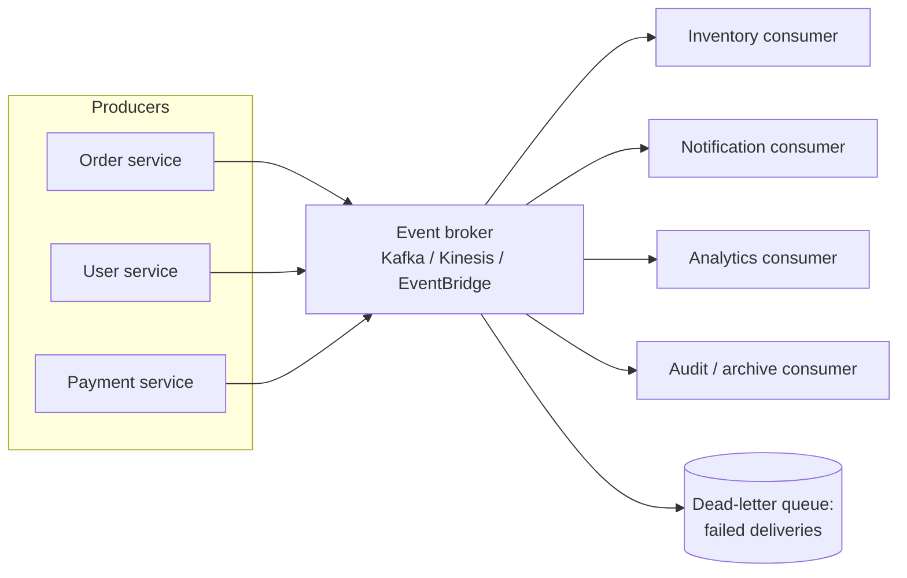

# Event-Driven Architecture

A comprehensive guide to building scalable, loosely coupled event-driven systems using AWS, Azure, and Google Cloud Platform.

---

## Table of Contents

1. [Architecture Overview](#architecture-overview)
2. [Architecture Diagram Description](#architecture-diagram-description)
3. [Component Breakdown](#component-breakdown)
4. [AWS Implementation](#aws-implementation)
5. [Azure Implementation](#azure-implementation)
6. [GCP Implementation](#gcp-implementation)
7. [Security Considerations](#security-considerations)
8. [Performance Optimization](#performance-optimization)
9. [Cost Estimates](#cost-estimates)
10. [Best Practices](#best-practices)
11. [Common Patterns](#common-patterns)
12. [Monitoring and Observability](#monitoring-and-observability)
13. [CI/CD for Event-Driven Systems](#cicd-for-event-driven-systems)
14. [Common Pitfalls](#common-pitfalls)

---

## Architecture Overview

### What is Event-Driven Architecture?

Event-driven architecture (EDA) is a software design pattern where:
- **Events**: Significant changes in state that are recorded and distributed
- **Producers**: Components that emit events when something happens
- **Consumers**: Components that react to events
- **Event Broker**: Infrastructure that routes events from producers to consumers
- **Loose Coupling**: Producers don't know about consumers
- **Asynchronous**: Processing happens independently of the request

### Core Components

1. **Event Producers**: Services that generate events (Order Service, User Service)
2. **Event Broker**: Message infrastructure (Kafka, EventBridge, Pub/Sub)
3. **Event Consumers**: Services that process events (Analytics, Notifications)
4. **Event Store**: Persistent storage for events (for event sourcing)
5. **Schema Registry**: Event schema management and validation
6. **Dead Letter Queue**: Storage for failed event processing

### Benefits

- **Loose Coupling**: Services evolve independently
- **Scalability**: Consumers scale independently based on load
- **Resilience**: Failures don't cascade immediately
- **Real-time Processing**: React to events as they happen
- **Audit Trail**: Events provide natural audit log
- **Flexibility**: Easy to add new consumers without changing producers
- **Peak Load Handling**: Queue absorbs traffic spikes

### Trade-offs

- **Eventual Consistency**: Data isn't immediately consistent
- **Complexity**: Harder to debug and trace
- **Message Ordering**: Difficult to guarantee order
- **Idempotency**: Must handle duplicate events
- **Testing**: Integration testing is more complex
- **Monitoring**: Requires distributed tracing

### Use Cases

- E-commerce order processing workflows
- Real-time analytics and dashboards
- IoT data ingestion and processing
- Notification systems (email, SMS, push)
- Audit logging and compliance
- Data synchronization between systems
- Saga pattern for distributed transactions
- Stream processing (fraud detection, recommendations)

### When to Use Event-Driven Architecture

**Good Fit**:
- Asynchronous workflows that don't need immediate response
- Multiple consumers need to react to the same event
- Decoupling services for independent scaling
- Real-time data processing requirements
- High-volume, spiky workloads
- Audit and compliance requirements
- Microservices communication

**Poor Fit**:
- Simple CRUD applications
- Strict request-response requirements
- Strong consistency requirements
- Small teams unfamiliar with distributed systems
- Low-volume, predictable traffic

---

## Architecture Diagram Description

### High-Level Architecture



```
                        [Event Producers]
           ┌─────────────────┼─────────────────┐
           │                 │                 │
    [Order Service]   [User Service]   [Payment Service]
           │                 │                 │
           └────────┬────────┴────────┬────────┘
                    │                 │
                    ▼                 ▼
              ┌───────────────────────────┐
              │       Event Broker        │
              │  (EventBridge/Kafka/      │
              │   Pub-Sub/Service Bus)    │
              └─────────────┬─────────────┘
                            │
        ┌───────────┬───────┼───────┬───────────┐
        │           │       │       │           │
        ▼           ▼       ▼       ▼           ▼
  [Analytics]  [Search]  [Email] [Audit]  [Inventory]
   Service     Service   Service Service   Service
        │           │       │       │           │
        ▼           ▼       ▼       ▼           ▼
   [RedShift] [Elastic] [SES]  [S3]      [DynamoDB]
              [Search]
```

### Pub/Sub Pattern

```
Publisher (1) ─────→ Topic ─────┬────→ Subscriber A
                                │
                                ├────→ Subscriber B
                                │
                                └────→ Subscriber C

Each subscriber gets a copy of every message.
Subscribers can filter based on attributes.
```

### Queue-Based Pattern

```
Producer ─────→ Queue ─────→ Consumer Pool
                  │              │
                  │         ┌────┼────┐
                  │         │    │    │
                  └────────→[C1][C2][C3]

Messages are distributed among consumers.
Each message is processed by exactly one consumer.
Enables load balancing and scaling.
```

### Event Streaming Pattern

```
                    Partition 0: [E1][E4][E7]...
                         ↓
Producer ──→ Topic ─────────────────────────→ Consumer Group A
                    Partition 1: [E2][E5][E8]...    ├── Consumer A1 (P0)
                         ↓                          └── Consumer A2 (P1)
                    Partition 2: [E3][E6][E9]...
                         ↓                    ────→ Consumer Group B
                                                   └── Consumer B1 (all)

Ordered within partition.
Consumer groups track their own offset.
Replay possible from any offset.
```

### Request Flow

```
1. User places order in web application
   ↓
2. Order Service validates and creates order
   ↓
3. Order Service publishes "OrderCreated" event
   ↓
4. Event broker receives and persists event
   ↓
5. Event broker delivers to all subscribers:
   ├── Payment Service → Processes payment
   ├── Inventory Service → Reserves stock
   ├── Email Service → Sends confirmation
   └── Analytics Service → Updates metrics
   ↓
6. Each subscriber processes independently
   ↓
7. Each subscriber may publish new events
   (PaymentProcessed, StockReserved, etc.)
```

### Choreography vs Orchestration

```
CHOREOGRAPHY (Decentralized):
┌────────────────────────────────────────────────────────┐
│                                                        │
│  Order ──→ OrderCreated ──→ Payment                   │
│                                  │                     │
│                           PaymentProcessed             │
│                                  │                     │
│           Inventory ←────────────┘                     │
│               │                                        │
│        StockReserved                                   │
│               │                                        │
│           Shipping ←─────────────────                  │
│                                                        │
└────────────────────────────────────────────────────────┘

ORCHESTRATION (Centralized):
┌────────────────────────────────────────────────────────┐
│                    Orchestrator                        │
│                         │                              │
│         ┌───────────────┼───────────────┐              │
│         │               │               │              │
│         ▼               ▼               ▼              │
│      Payment        Inventory       Shipping           │
│         │               │               │              │
│         └───────────────┼───────────────┘              │
│                         │                              │
│                    Orchestrator                        │
│              (tracks state, handles failures)          │
└────────────────────────────────────────────────────────┘
```

---

## Component Breakdown

### Event Brokers

#### Message Queues (Point-to-Point)
- **AWS SQS**: Fully managed, unlimited throughput, at-least-once delivery
- **Azure Service Bus Queues**: Enterprise messaging with transactions
- **GCP Cloud Tasks**: Task queue for async work distribution

#### Pub/Sub Systems (Fan-out)
- **AWS SNS**: Push-based pub/sub, multiple protocols
- **Azure Service Bus Topics**: Topic/subscription model
- **GCP Pub/Sub**: Global, serverless pub/sub

#### Event Buses (Event Routing)
- **AWS EventBridge**: Serverless event bus with rules
- **Azure Event Grid**: Event routing with filtering
- **GCP Eventarc**: Event routing for Cloud Run

#### Event Streaming (Log-based)
- **AWS Kinesis**: Real-time streaming data
- **Azure Event Hubs**: Big data streaming
- **GCP Pub/Sub**: Can also do streaming
- **Apache Kafka**: Open source, self-managed or Confluent/MSK

### Event Producers

#### Characteristics
- Emit events when state changes
- Include all relevant data in event payload
- Use consistent event schema (CloudEvents)
- Don't wait for consumer acknowledgment
- Implement retry logic for broker failures

#### Event Structure (CloudEvents)
```json
{
  "specversion": "1.0",
  "type": "com.example.order.created",
  "source": "/orders/order-service",
  "id": "A234-1234-1234",
  "time": "2024-01-15T10:00:00Z",
  "datacontenttype": "application/json",
  "subject": "order-12345",
  "data": {
    "orderId": "order-12345",
    "customerId": "cust-67890",
    "total": 99.99,
    "items": [
      {"productId": "prod-111", "quantity": 2, "price": 49.99}
    ]
  }
}
```

### Event Consumers

#### Processing Patterns
- **Push**: Broker pushes to consumer (webhooks, Lambda triggers)
- **Pull**: Consumer polls broker (Kafka consumer groups)
- **Competing Consumers**: Multiple consumers share load
- **Fan-out**: All consumers receive all messages

#### Consumer Responsibilities
- Idempotent processing (handle duplicates)
- Error handling and retry logic
- Dead letter queue for failures
- Acknowledge after successful processing
- Track processing position (offset/receipt handle)

### Schema Registry

#### Purpose
- Store and version event schemas
- Validate events against schema
- Enable schema evolution
- Documentation for event contracts

#### Options
- **AWS Glue Schema Registry**: Native AWS integration
- **Azure Schema Registry**: Event Hubs integration
- **Confluent Schema Registry**: Kafka ecosystem
- **Apicurio**: Open source registry

---

## AWS Implementation

### Architecture with EventBridge

```yaml
# AWS SAM Template
AWSTemplateFormatVersion: '2010-09-09'
Transform: AWS::Serverless-2016-10-31

Resources:
  # Custom Event Bus
  OrderEventBus:
    Type: AWS::Events::EventBus
    Properties:
      Name: order-events

  # Event Archive for replay
  OrderEventArchive:
    Type: AWS::Events::Archive
    Properties:
      ArchiveName: order-events-archive
      SourceArn: !GetAtt OrderEventBus.Arn
      RetentionDays: 90

  # Schema Registry
  OrderSchemaRegistry:
    Type: AWS::EventSchemas::Registry
    Properties:
      RegistryName: order-schemas

  # Producer Lambda
  OrderServiceFunction:
    Type: AWS::Serverless::Function
    Properties:
      Handler: order.handler
      Runtime: nodejs18.x
      Policies:
        - EventBridgePutEventsPolicy:
            EventBusName: !Ref OrderEventBus
      Environment:
        Variables:
          EVENT_BUS_NAME: !Ref OrderEventBus

  # EventBridge Rule - Payment Processing
  PaymentRule:
    Type: AWS::Events::Rule
    Properties:
      EventBusName: !Ref OrderEventBus
      EventPattern:
        source:
          - "order-service"
        detail-type:
          - "OrderCreated"
      Targets:
        - Id: PaymentTarget
          Arn: !GetAtt PaymentFunction.Arn
          RetryPolicy:
            MaximumRetryAttempts: 3
            MaximumEventAgeInSeconds: 3600
          DeadLetterConfig:
            Arn: !GetAtt PaymentDLQ.Arn

  # Consumer Lambda - Payment
  PaymentFunction:
    Type: AWS::Serverless::Function
    Properties:
      Handler: payment.handler
      Runtime: nodejs18.x
      Events:
        OrderCreated:
          Type: EventBridgeRule
          Properties:
            EventBusName: !Ref OrderEventBus
            Pattern:
              source:
                - "order-service"
              detail-type:
                - "OrderCreated"

  # Dead Letter Queue
  PaymentDLQ:
    Type: AWS::SQS::Queue
    Properties:
      QueueName: payment-dlq
      MessageRetentionPeriod: 1209600  # 14 days

  # EventBridge Rule - Notification Fan-out
  NotificationRule:
    Type: AWS::Events::Rule
    Properties:
      EventBusName: !Ref OrderEventBus
      EventPattern:
        source:
          - "order-service"
          - "payment-service"
        detail-type:
          - "OrderCreated"
          - "PaymentProcessed"
          - "OrderShipped"
      Targets:
        - Id: EmailTarget
          Arn: !Ref NotificationTopic

  # SNS Topic for notifications
  NotificationTopic:
    Type: AWS::SNS::Topic
    Properties:
      TopicName: order-notifications

  # Email Subscription
  EmailSubscription:
    Type: AWS::SNS::Subscription
    Properties:
      TopicArn: !Ref NotificationTopic
      Protocol: lambda
      Endpoint: !GetAtt EmailFunction.Arn
```

### Producer Code (Node.js)

```javascript
// order-service/handler.js
const { EventBridgeClient, PutEventsCommand } = require('@aws-sdk/client-eventbridge');

const eventBridge = new EventBridgeClient({});

exports.createOrder = async (event) => {
  const order = JSON.parse(event.body);

  // Validate and save order
  const savedOrder = await saveOrder(order);

  // Publish event
  const eventEntry = {
    Source: 'order-service',
    DetailType: 'OrderCreated',
    Detail: JSON.stringify({
      orderId: savedOrder.id,
      customerId: savedOrder.customerId,
      total: savedOrder.total,
      items: savedOrder.items,
      createdAt: new Date().toISOString(),
    }),
    EventBusName: process.env.EVENT_BUS_NAME,
    Time: new Date(),
  };

  try {
    await eventBridge.send(new PutEventsCommand({
      Entries: [eventEntry],
    }));
    console.log('Event published:', eventEntry.DetailType);
  } catch (error) {
    console.error('Failed to publish event:', error);
    // Store event locally for retry
    await storeFailedEvent(eventEntry);
  }

  return {
    statusCode: 201,
    body: JSON.stringify(savedOrder),
  };
};
```

### Consumer Code (Node.js)

```javascript
// payment-service/handler.js
const { DynamoDBClient, PutItemCommand, GetItemCommand } = require('@aws-sdk/client-dynamodb');
const { EventBridgeClient, PutEventsCommand } = require('@aws-sdk/client-eventbridge');

const dynamodb = new DynamoDBClient({});
const eventBridge = new EventBridgeClient({});

exports.handler = async (event) => {
  console.log('Received event:', JSON.stringify(event, null, 2));

  const orderData = event.detail;

  // Idempotency check
  const existing = await checkIdempotency(orderData.orderId);
  if (existing) {
    console.log('Event already processed:', orderData.orderId);
    return { statusCode: 200, body: 'Already processed' };
  }

  try {
    // Process payment
    const paymentResult = await processPayment({
      orderId: orderData.orderId,
      customerId: orderData.customerId,
      amount: orderData.total,
    });

    // Store idempotency record
    await storeIdempotencyRecord(orderData.orderId, paymentResult);

    // Publish success event
    await eventBridge.send(new PutEventsCommand({
      Entries: [{
        Source: 'payment-service',
        DetailType: 'PaymentProcessed',
        Detail: JSON.stringify({
          orderId: orderData.orderId,
          paymentId: paymentResult.id,
          status: 'SUCCESS',
          processedAt: new Date().toISOString(),
        }),
        EventBusName: process.env.EVENT_BUS_NAME,
      }],
    }));

    return { statusCode: 200, body: 'Payment processed' };
  } catch (error) {
    console.error('Payment failed:', error);

    // Publish failure event
    await eventBridge.send(new PutEventsCommand({
      Entries: [{
        Source: 'payment-service',
        DetailType: 'PaymentFailed',
        Detail: JSON.stringify({
          orderId: orderData.orderId,
          error: error.message,
          failedAt: new Date().toISOString(),
        }),
        EventBusName: process.env.EVENT_BUS_NAME,
      }],
    }));

    throw error; // Will go to DLQ
  }
};

async function checkIdempotency(orderId) {
  const result = await dynamodb.send(new GetItemCommand({
    TableName: process.env.IDEMPOTENCY_TABLE,
    Key: { orderId: { S: orderId } },
  }));
  return result.Item;
}
```

### Kinesis Streaming

```yaml
# Kinesis Data Streams for high-throughput
Resources:
  OrderStream:
    Type: AWS::Kinesis::Stream
    Properties:
      Name: order-stream
      ShardCount: 4
      StreamModeDetails:
        StreamMode: ON_DEMAND

  # Lambda consumer with event source mapping
  StreamProcessor:
    Type: AWS::Serverless::Function
    Properties:
      Handler: stream-processor.handler
      Runtime: nodejs18.x
      Events:
        KinesisEvent:
          Type: Kinesis
          Properties:
            Stream: !GetAtt OrderStream.Arn
            StartingPosition: TRIM_HORIZON
            BatchSize: 100
            MaximumBatchingWindowInSeconds: 5
            ParallelizationFactor: 2
            MaximumRetryAttempts: 3
            BisectBatchOnFunctionError: true
            DestinationConfig:
              OnFailure:
                Destination: !GetAtt StreamDLQ.Arn
```

---

## Azure Implementation

### Architecture with Event Grid

```bicep
// event-grid.bicep
resource eventGridTopic 'Microsoft.EventGrid/topics@2023-06-01-preview' = {
  name: 'order-events'
  location: resourceGroup().location
  properties: {
    inputSchema: 'CloudEventSchemaV1_0'
    publicNetworkAccess: 'Enabled'
  }
}

// Event subscription for payment processing
resource paymentSubscription 'Microsoft.EventGrid/topics/eventSubscriptions@2023-06-01-preview' = {
  parent: eventGridTopic
  name: 'payment-subscription'
  properties: {
    destination: {
      endpointType: 'AzureFunction'
      properties: {
        resourceId: paymentFunction.id
        maxEventsPerBatch: 1
        preferredBatchSizeInKilobytes: 64
      }
    }
    filter: {
      includedEventTypes: [
        'OrderCreated'
      ]
      advancedFilters: [
        {
          operatorType: 'NumberGreaterThan'
          key: 'data.total'
          value: 0
        }
      ]
    }
    retryPolicy: {
      maxDeliveryAttempts: 30
      eventTimeToLiveInMinutes: 1440
    }
    deadLetterDestination: {
      endpointType: 'StorageBlob'
      properties: {
        resourceId: deadLetterStorage.id
        blobContainerName: 'deadletter'
      }
    }
  }
}

// Azure Function for payment processing
resource paymentFunction 'Microsoft.Web/sites/functions@2022-09-01' = {
  parent: functionApp
  name: 'ProcessPayment'
  properties: {
    config: {
      bindings: [
        {
          type: 'eventGridTrigger'
          name: 'event'
          direction: 'in'
        }
      ]
    }
  }
}

// Service Bus for queuing and advanced scenarios
resource serviceBusNamespace 'Microsoft.ServiceBus/namespaces@2022-10-01-preview' = {
  name: 'order-servicebus'
  location: resourceGroup().location
  sku: {
    name: 'Premium'
    tier: 'Premium'
    capacity: 1
  }
}

resource orderTopic 'Microsoft.ServiceBus/namespaces/topics@2022-10-01-preview' = {
  parent: serviceBusNamespace
  name: 'orders'
  properties: {
    maxSizeInMegabytes: 5120
    defaultMessageTimeToLive: 'P14D'
    enableBatchedOperations: true
    enablePartitioning: true
  }
}

resource paymentSubscriptionSB 'Microsoft.ServiceBus/namespaces/topics/subscriptions@2022-10-01-preview' = {
  parent: orderTopic
  name: 'payment-subscription'
  properties: {
    maxDeliveryCount: 10
    deadLetteringOnMessageExpiration: true
    deadLetteringOnFilterEvaluationExceptions: true
  }
}

resource paymentFilter 'Microsoft.ServiceBus/namespaces/topics/subscriptions/rules@2022-10-01-preview' = {
  parent: paymentSubscriptionSB
  name: 'PaymentFilter'
  properties: {
    filterType: 'SqlFilter'
    sqlFilter: {
      sqlExpression: 'eventType = \'OrderCreated\' AND total > 0'
    }
  }
}
```

### Producer Code (C#)

```csharp
// OrderService/Functions/CreateOrder.cs
using Azure.Messaging.EventGrid;
using Microsoft.Azure.Functions.Worker;
using Microsoft.Azure.Functions.Worker.Http;

public class CreateOrder
{
    private readonly EventGridPublisherClient _eventGridClient;
    private readonly ILogger<CreateOrder> _logger;

    public CreateOrder(EventGridPublisherClient eventGridClient, ILogger<CreateOrder> logger)
    {
        _eventGridClient = eventGridClient;
        _logger = logger;
    }

    [Function("CreateOrder")]
    public async Task<HttpResponseData> Run(
        [HttpTrigger(AuthorizationLevel.Function, "post")] HttpRequestData req)
    {
        var orderRequest = await req.ReadFromJsonAsync<CreateOrderRequest>();

        // Validate and save order
        var order = await SaveOrder(orderRequest);

        // Create CloudEvent
        var cloudEvent = new CloudEvent(
            source: "/orders/order-service",
            type: "OrderCreated",
            jsonSerializableData: new OrderCreatedEvent
            {
                OrderId = order.Id,
                CustomerId = order.CustomerId,
                Total = order.Total,
                Items = order.Items,
                CreatedAt = DateTime.UtcNow
            });

        // Publish event
        try
        {
            await _eventGridClient.SendEventAsync(cloudEvent);
            _logger.LogInformation("Published OrderCreated event for order {OrderId}", order.Id);
        }
        catch (Exception ex)
        {
            _logger.LogError(ex, "Failed to publish event for order {OrderId}", order.Id);
            // Store for retry
            await StoreFailedEvent(cloudEvent);
        }

        var response = req.CreateResponse(HttpStatusCode.Created);
        await response.WriteAsJsonAsync(order);
        return response;
    }
}
```

### Consumer Code (C#)

```csharp
// PaymentService/Functions/ProcessPayment.cs
using Azure.Messaging.EventGrid;
using Azure.Messaging.ServiceBus;
using Microsoft.Azure.Functions.Worker;

public class ProcessPayment
{
    private readonly IPaymentProcessor _paymentProcessor;
    private readonly ServiceBusClient _serviceBusClient;
    private readonly ILogger<ProcessPayment> _logger;

    [Function("ProcessPayment")]
    public async Task Run(
        [EventGridTrigger] CloudEvent cloudEvent)
    {
        _logger.LogInformation("Processing event: {EventId}", cloudEvent.Id);

        var orderData = cloudEvent.Data.ToObjectFromJson<OrderCreatedEvent>();

        // Idempotency check
        if (await IsAlreadyProcessed(orderData.OrderId))
        {
            _logger.LogInformation("Event already processed: {OrderId}", orderData.OrderId);
            return;
        }

        try
        {
            // Process payment
            var result = await _paymentProcessor.ProcessAsync(new PaymentRequest
            {
                OrderId = orderData.OrderId,
                CustomerId = orderData.CustomerId,
                Amount = orderData.Total
            });

            // Store idempotency record
            await StoreProcessingRecord(orderData.OrderId, result);

            // Publish success event via Service Bus
            var sender = _serviceBusClient.CreateSender("payment-events");
            await sender.SendMessageAsync(new ServiceBusMessage
            {
                Body = BinaryData.FromObjectAsJson(new PaymentProcessedEvent
                {
                    OrderId = orderData.OrderId,
                    PaymentId = result.PaymentId,
                    Status = "SUCCESS"
                }),
                Subject = "PaymentProcessed",
                ContentType = "application/json"
            });

            _logger.LogInformation("Payment processed for order {OrderId}", orderData.OrderId);
        }
        catch (Exception ex)
        {
            _logger.LogError(ex, "Payment failed for order {OrderId}", orderData.OrderId);
            throw; // Will retry based on Event Grid retry policy
        }
    }
}
```

### Event Hubs for Streaming

```bicep
// event-hubs.bicep
resource eventHubNamespace 'Microsoft.EventHub/namespaces@2022-10-01-preview' = {
  name: 'order-eventhubs'
  location: resourceGroup().location
  sku: {
    name: 'Standard'
    tier: 'Standard'
    capacity: 2
  }
  properties: {
    kafkaEnabled: true
  }
}

resource orderEventHub 'Microsoft.EventHub/namespaces/eventhubs@2022-10-01-preview' = {
  parent: eventHubNamespace
  name: 'orders'
  properties: {
    messageRetentionInDays: 7
    partitionCount: 8
  }
}

resource orderConsumerGroup 'Microsoft.EventHub/namespaces/eventhubs/consumergroups@2022-10-01-preview' = {
  parent: orderEventHub
  name: 'analytics-consumer'
}
```

---

## GCP Implementation

### Architecture with Pub/Sub and Eventarc

```yaml
# pub-sub.yaml (Terraform)
resource "google_pubsub_topic" "order_events" {
  name = "order-events"

  message_storage_policy {
    allowed_persistence_regions = ["us-central1"]
  }

  schema_settings {
    schema   = google_pubsub_schema.order_schema.id
    encoding = "JSON"
  }
}

resource "google_pubsub_schema" "order_schema" {
  name       = "order-schema"
  type       = "AVRO"
  definition = jsonencode({
    type = "record"
    name = "OrderEvent"
    fields = [
      { name = "orderId", type = "string" },
      { name = "customerId", type = "string" },
      { name = "total", type = "double" },
      { name = "eventType", type = "string" },
      { name = "timestamp", type = "string" }
    ]
  })
}

# Dead letter topic
resource "google_pubsub_topic" "order_dlq" {
  name = "order-events-dlq"
}

# Subscription for payment service
resource "google_pubsub_subscription" "payment_subscription" {
  name  = "payment-subscription"
  topic = google_pubsub_topic.order_events.name

  ack_deadline_seconds = 60

  message_retention_duration = "604800s" # 7 days

  retry_policy {
    minimum_backoff = "10s"
    maximum_backoff = "600s"
  }

  dead_letter_policy {
    dead_letter_topic     = google_pubsub_topic.order_dlq.id
    max_delivery_attempts = 5
  }

  push_config {
    push_endpoint = google_cloud_run_v2_service.payment_service.uri

    oidc_token {
      service_account_email = google_service_account.pubsub_invoker.email
    }

    attributes = {
      x-goog-version = "v1"
    }
  }

  filter = "attributes.eventType = \"OrderCreated\""
}

# Pull subscription for analytics (batch processing)
resource "google_pubsub_subscription" "analytics_subscription" {
  name  = "analytics-subscription"
  topic = google_pubsub_topic.order_events.name

  ack_deadline_seconds       = 300
  message_retention_duration = "604800s"
  retain_acked_messages      = true
  enable_exactly_once_delivery = true
}
```

### Eventarc for Cloud Run

```yaml
# eventarc.yaml (Terraform)
resource "google_eventarc_trigger" "order_created_trigger" {
  name     = "order-created-trigger"
  location = var.region

  matching_criteria {
    attribute = "type"
    value     = "google.cloud.pubsub.topic.v1.messagePublished"
  }

  destination {
    cloud_run_service {
      service = google_cloud_run_v2_service.payment_service.name
      region  = var.region
    }
  }

  transport {
    pubsub {
      topic = google_pubsub_topic.order_events.id
    }
  }

  service_account = google_service_account.eventarc_sa.email
}

# Cloud Run service
resource "google_cloud_run_v2_service" "payment_service" {
  name     = "payment-service"
  location = var.region

  template {
    containers {
      image = "${var.region}-docker.pkg.dev/${var.project_id}/services/payment-service:latest"

      env {
        name  = "PROJECT_ID"
        value = var.project_id
      }
    }

    service_account = google_service_account.payment_service.email
  }
}
```

### Producer Code (Python)

```python
# order_service/main.py
from google.cloud import pubsub_v1
from google.protobuf import timestamp_pb2
import json
import uuid
from datetime import datetime

publisher = pubsub_v1.PublisherClient()
topic_path = publisher.topic_path(PROJECT_ID, "order-events")

def create_order(request):
    """Create order and publish event."""
    order_data = request.get_json()

    # Validate and save order
    order = save_order(order_data)

    # Create event
    event = {
        "specversion": "1.0",
        "type": "OrderCreated",
        "source": "/orders/order-service",
        "id": str(uuid.uuid4()),
        "time": datetime.utcnow().isoformat() + "Z",
        "data": {
            "orderId": order["id"],
            "customerId": order["customerId"],
            "total": order["total"],
            "items": order["items"]
        }
    }

    # Publish with attributes for filtering
    future = publisher.publish(
        topic_path,
        json.dumps(event).encode("utf-8"),
        eventType="OrderCreated",
        orderId=order["id"],
        customerId=order["customerId"]
    )

    try:
        message_id = future.result(timeout=30)
        print(f"Published message {message_id}")
    except Exception as e:
        print(f"Failed to publish: {e}")
        # Store for retry
        store_failed_event(event)

    return {"statusCode": 201, "body": order}
```

### Consumer Code (Python)

```python
# payment_service/main.py
from google.cloud import pubsub_v1, firestore
from flask import Flask, request
import json
import base64

app = Flask(__name__)
db = firestore.Client()
publisher = pubsub_v1.PublisherClient()

@app.route("/", methods=["POST"])
def handle_pubsub():
    """Handle Pub/Sub push message."""
    envelope = request.get_json()

    if not envelope:
        return "Bad Request: no message", 400

    pubsub_message = envelope.get("message", {})
    data = base64.b64decode(pubsub_message.get("data", ""))
    event = json.loads(data)

    order_data = event.get("data", {})
    order_id = order_data.get("orderId")

    # Idempotency check
    idempotency_ref = db.collection("idempotency").document(order_id)
    if idempotency_ref.get().exists:
        print(f"Already processed: {order_id}")
        return "OK", 200

    try:
        # Process payment
        payment_result = process_payment(
            order_id=order_id,
            customer_id=order_data.get("customerId"),
            amount=order_data.get("total")
        )

        # Store idempotency record
        idempotency_ref.set({
            "processedAt": firestore.SERVER_TIMESTAMP,
            "paymentId": payment_result["id"]
        })

        # Publish success event
        success_event = {
            "type": "PaymentProcessed",
            "source": "/payments/payment-service",
            "data": {
                "orderId": order_id,
                "paymentId": payment_result["id"],
                "status": "SUCCESS"
            }
        }

        topic_path = publisher.topic_path(PROJECT_ID, "payment-events")
        publisher.publish(topic_path, json.dumps(success_event).encode())

        print(f"Payment processed for order {order_id}")
        return "OK", 200

    except Exception as e:
        print(f"Payment failed: {e}")
        # Return error to trigger retry
        return str(e), 500
```

### Dataflow for Stream Processing

```python
# dataflow_pipeline.py
import apache_beam as beam
from apache_beam.options.pipeline_options import PipelineOptions
from apache_beam.io.gcp.pubsub import ReadFromPubSub
from apache_beam.io.gcp.bigquery import WriteToBigQuery

class ParseOrderEvent(beam.DoFn):
    def process(self, element):
        import json
        event = json.loads(element.decode('utf-8'))
        yield {
            'order_id': event['data']['orderId'],
            'customer_id': event['data']['customerId'],
            'total': event['data']['total'],
            'event_type': event['type'],
            'timestamp': event['time']
        }

def run():
    options = PipelineOptions([
        '--project=my-project',
        '--region=us-central1',
        '--streaming',
        '--runner=DataflowRunner'
    ])

    with beam.Pipeline(options=options) as p:
        (p
         | 'Read from Pub/Sub' >> ReadFromPubSub(
             subscription='projects/my-project/subscriptions/analytics-subscription')
         | 'Parse Event' >> beam.ParDo(ParseOrderEvent())
         | 'Window' >> beam.WindowInto(beam.window.FixedWindows(60))
         | 'Write to BigQuery' >> WriteToBigQuery(
             table='my-project:analytics.order_events',
             schema='order_id:STRING,customer_id:STRING,total:FLOAT,event_type:STRING,timestamp:TIMESTAMP',
             write_disposition=beam.io.BigQueryDisposition.WRITE_APPEND)
        )

if __name__ == '__main__':
    run()
```

---

## Security Considerations

### Event Encryption

```yaml
# AWS: Server-side encryption for SQS/SNS
Resources:
  EncryptedQueue:
    Type: AWS::SQS::Queue
    Properties:
      KmsMasterKeyId: alias/aws/sqs
      KmsDataKeyReusePeriodSeconds: 86400

  EncryptedTopic:
    Type: AWS::SNS::Topic
    Properties:
      KmsMasterKeyId: alias/aws/sns
```

### Access Control

```yaml
# AWS: IAM policy for EventBridge
{
  "Version": "2012-10-17",
  "Statement": [
    {
      "Effect": "Allow",
      "Action": [
        "events:PutEvents"
      ],
      "Resource": "arn:aws:events:*:*:event-bus/order-events",
      "Condition": {
        "StringEquals": {
          "events:source": ["order-service"]
        }
      }
    }
  ]
}
```

### Event Validation

```javascript
// Validate incoming events
const Ajv = require('ajv');
const ajv = new Ajv();

const orderCreatedSchema = {
  type: 'object',
  required: ['orderId', 'customerId', 'total'],
  properties: {
    orderId: { type: 'string', pattern: '^ord-[a-z0-9]+$' },
    customerId: { type: 'string', pattern: '^cust-[a-z0-9]+$' },
    total: { type: 'number', minimum: 0 },
    items: {
      type: 'array',
      items: {
        type: 'object',
        required: ['productId', 'quantity'],
        properties: {
          productId: { type: 'string' },
          quantity: { type: 'integer', minimum: 1 }
        }
      }
    }
  }
};

const validate = ajv.compile(orderCreatedSchema);

function validateEvent(event) {
  const valid = validate(event.data);
  if (!valid) {
    throw new Error(`Invalid event: ${JSON.stringify(validate.errors)}`);
  }
  return true;
}
```

### Security Checklist

| Layer | Controls |
|-------|----------|
| Transport | TLS/SSL for all connections |
| Encryption | Server-side encryption for queues/topics |
| Authentication | IAM/service accounts for producers/consumers |
| Authorization | Fine-grained policies per topic/queue |
| Validation | Schema validation at ingestion |
| Audit | CloudTrail/Activity logs for all operations |
| DLQ | Monitor and alert on dead letter queues |

---

## Performance Optimization

### Batching

```javascript
// AWS EventBridge batch publishing
const entries = orders.map(order => ({
  Source: 'order-service',
  DetailType: 'OrderCreated',
  Detail: JSON.stringify(order),
  EventBusName: EVENT_BUS_NAME,
}));

// Batch up to 10 events per call
const batches = chunk(entries, 10);
await Promise.all(batches.map(batch =>
  eventBridge.send(new PutEventsCommand({ Entries: batch }))
));
```

### Partitioning

```python
# GCP Pub/Sub with ordering key for partitioning
publisher.publish(
    topic_path,
    data.encode('utf-8'),
    ordering_key=order['customerId']  # Orders for same customer processed in order
)
```

### Consumer Scaling

```yaml
# AWS Lambda with reserved concurrency
PaymentFunction:
  Type: AWS::Serverless::Function
  Properties:
    ReservedConcurrentExecutions: 100
    Events:
      SQSEvent:
        Type: SQS
        Properties:
          Queue: !GetAtt PaymentQueue.Arn
          BatchSize: 10
          MaximumBatchingWindowInSeconds: 5
```

### Performance Tips

| Area | Optimization |
|------|-------------|
| Throughput | Batch messages, increase partitions |
| Latency | Use push delivery, reduce batch window |
| Cost | Batch to reduce API calls, use reserved capacity |
| Reliability | Enable retries, configure DLQ, use exactly-once |
| Ordering | Use partition keys, single consumer per partition |

---

## Cost Estimates

### Monthly Cost Comparison (10M events/month)

| Component | AWS | Azure | GCP |
|-----------|-----|-------|-----|
| Event Bus/Grid | EventBridge: $10 | Event Grid: $6 | Eventarc: Free |
| Pub/Sub | SNS: $5 + SQS: $4 | Service Bus: $10 | Pub/Sub: $40 |
| Streaming (high volume) | Kinesis: $50 | Event Hubs: $22 | Pub/Sub: $40 |
| Lambda/Functions | $20 | $20 | $20 |
| Dead Letter Queue | $2 | $2 | $2 |
| **Total (Basic)** | **~$41** | **~$40** | **~$62** |

### Cost Optimization Tips

1. **Use filtering** - Filter at broker level to reduce consumer invocations
2. **Batch processing** - Process multiple events per invocation
3. **Reserved capacity** - For predictable workloads
4. **Compress payloads** - Reduce data transfer costs
5. **Lifecycle policies** - Auto-delete old messages
6. **Right-size retention** - Don't over-retain messages

---

## Best Practices

### Event Design

```json
// Good event design - self-contained
{
  "type": "OrderCreated",
  "source": "/orders/order-service",
  "id": "unique-event-id",
  "time": "2024-01-15T10:00:00Z",
  "data": {
    "orderId": "ord-12345",
    "customerId": "cust-67890",
    "customerEmail": "customer@example.com",
    "total": 99.99,
    "currency": "USD",
    "items": [
      {
        "productId": "prod-111",
        "productName": "Widget",
        "quantity": 2,
        "unitPrice": 49.99
      }
    ],
    "shippingAddress": {
      "street": "123 Main St",
      "city": "Seattle",
      "state": "WA",
      "zip": "98101"
    }
  },
  "metadata": {
    "correlationId": "req-abc123",
    "causationId": "evt-xyz789",
    "version": "1.0"
  }
}
```

### Idempotency Pattern

```javascript
// Idempotent event processing
async function processEvent(event) {
  const eventId = event.id;

  // Check if already processed
  const lock = await acquireLock(eventId);
  if (!lock) {
    console.log('Event already being processed');
    return;
  }

  try {
    const processed = await checkProcessed(eventId);
    if (processed) {
      console.log('Event already processed');
      return;
    }

    // Process event
    await doBusinessLogic(event);

    // Mark as processed
    await markProcessed(eventId);
  } finally {
    await releaseLock(eventId);
  }
}
```

### Schema Evolution

```json
// Version 1
{
  "orderId": "ord-123",
  "total": 99.99
}

// Version 2 - Add field (backward compatible)
{
  "orderId": "ord-123",
  "total": 99.99,
  "currency": "USD"  // New field with default
}

// Version 3 - Rename field (NOT backward compatible - avoid!)
// Instead, add new field and deprecate old
{
  "orderId": "ord-123",
  "total": 99.99,      // Deprecated
  "amount": 99.99,     // New field
  "currency": "USD"
}
```

---

## Common Patterns

### Saga Pattern with Events

```
Order Saga (Choreography):

┌─────────────────────────────────────────────────────────────────┐
│                                                                 │
│  [Order Service]                                                │
│       │                                                         │
│       ├── Create Order (PENDING)                                │
│       │                                                         │
│       └── Publish: OrderCreated ─────────────────────────────┐  │
│                                                               │  │
│  [Payment Service] ←──────────────────────────────────────────┘  │
│       │                                                         │
│       ├── Process Payment                                       │
│       │       │                                                 │
│       │       ├── Success: Publish PaymentProcessed ─────────┐  │
│       │       │                                               │  │
│       │       └── Failure: Publish PaymentFailed ───────────┐│  │
│                                                              ││  │
│  [Inventory Service] ←───────────────────────────────────────┘│  │
│       │                                                       │  │
│       ├── Reserve Stock                                       │  │
│       │       │                                               │  │
│       │       └── Publish: StockReserved ──────────────────┐  │  │
│                                                             │  │  │
│  [Order Service] ←──────────────────────────────────────────┘  │  │
│       │                                                        │  │
│       └── Update Order (CONFIRMED)                             │  │
│                                                                │  │
│  COMPENSATION (PaymentFailed): ←───────────────────────────────┘  │
│       │                                                           │
│  [Order Service]                                                  │
│       │                                                           │
│       └── Update Order (CANCELLED)                                │
│                                                                   │
└───────────────────────────────────────────────────────────────────┘
```

### Event Sourcing

```
                      Event Store
                          │
    ┌─────────────────────┼─────────────────────┐
    │                     │                     │
OrderCreated     ItemAdded        OrderShipped
   (t=1)           (t=2)             (t=3)
    │                     │                     │
    └─────────────────────┼─────────────────────┘
                          │
                          ▼
                   Current State
                   ─────────────
                   orderId: 123
                   status: SHIPPED
                   items: [{...}]
                   total: 99.99
```

### CQRS with Events

```
Write Side:                          Read Side:
─────────────                        ─────────────

[Command] ──→ [Aggregate]            [Query] ──→ [Read Model]
                   │                                  ▲
                   │                                  │
                   └── Event ──────────────────→ [Projector]
                          │
                          ▼
                    [Event Store]
```

### Outbox Pattern

```
Database Transaction:
┌─────────────────────────────────────────────────┐
│                                                 │
│   BEGIN TRANSACTION                             │
│                                                 │
│   INSERT INTO orders (...)                      │
│   INSERT INTO outbox (event_type, payload, ...) │
│                                                 │
│   COMMIT                                        │
│                                                 │
└─────────────────────────────────────────────────┘

Separate Process (CDC or Polling):
┌─────────────────────────────────────────────────┐
│                                                 │
│   SELECT * FROM outbox WHERE published = false  │
│                                                 │
│   Publish to message broker                     │
│                                                 │
│   UPDATE outbox SET published = true            │
│                                                 │
└─────────────────────────────────────────────────┘
```

---

## Monitoring and Observability

### Key Metrics

```yaml
# Prometheus metrics for event-driven systems
- name: events_published_total
  type: counter
  labels: [source, event_type]

- name: events_consumed_total
  type: counter
  labels: [consumer, event_type, status]

- name: event_processing_duration_seconds
  type: histogram
  labels: [consumer, event_type]

- name: event_queue_depth
  type: gauge
  labels: [queue_name]

- name: dlq_messages_total
  type: counter
  labels: [source_queue]

- name: event_lag_seconds
  type: gauge
  labels: [consumer]
```

### Distributed Tracing

```javascript
// Propagate trace context through events
const event = {
  type: 'OrderCreated',
  data: { ... },
  metadata: {
    traceId: context.traceId,
    spanId: context.spanId,
    parentSpanId: context.parentSpanId
  }
};

// Consumer: Extract and continue trace
function processEvent(event) {
  const parentContext = extract(event.metadata);
  const span = tracer.startSpan('processOrderCreated', {
    childOf: parentContext
  });

  try {
    // Process event
  } finally {
    span.finish();
  }
}
```

### Alerting Rules

```yaml
# Alert on high DLQ rate
- alert: HighDeadLetterRate
  expr: rate(dlq_messages_total[5m]) > 10
  for: 5m
  labels:
    severity: critical
  annotations:
    summary: "High dead letter queue rate"

# Alert on consumer lag
- alert: ConsumerLagHigh
  expr: event_lag_seconds > 300
  for: 10m
  labels:
    severity: warning
  annotations:
    summary: "Consumer lag exceeds 5 minutes"

# Alert on processing failures
- alert: EventProcessingFailures
  expr: rate(events_consumed_total{status="failure"}[5m]) / rate(events_consumed_total[5m]) > 0.05
  for: 5m
  labels:
    severity: critical
  annotations:
    summary: "Event processing failure rate > 5%"
```

---

## CI/CD for Event-Driven Systems

### Schema Validation in CI

```yaml
# GitHub Actions - Schema validation
name: Event Schema Validation

on:
  pull_request:
    paths:
      - 'schemas/**'

jobs:
  validate:
    runs-on: ubuntu-latest
    steps:
      - uses: actions/checkout@v4

      - name: Validate schemas
        run: |
          npm install ajv-cli
          npx ajv validate -s schemas/meta-schema.json -d "schemas/*.json"

      - name: Check backward compatibility
        run: |
          # Compare with main branch schemas
          git fetch origin main
          ./scripts/check-schema-compatibility.sh
```

### Contract Testing

```javascript
// Pact contract test for events
const { MessageConsumerPact, synchronousBodyHandler } = require('@pact-foundation/pact');

describe('Order Events Contract', () => {
  const messagePact = new MessageConsumerPact({
    consumer: 'PaymentService',
    provider: 'OrderService',
  });

  it('receives OrderCreated event', () => {
    return messagePact
      .expectsToReceive('an order created event')
      .withContent({
        type: 'OrderCreated',
        data: {
          orderId: like('ord-12345'),
          customerId: like('cust-67890'),
          total: like(99.99),
        },
      })
      .verify(synchronousBodyHandler(async (message) => {
        // Verify consumer can process this event
        const result = await processOrderCreated(message);
        expect(result.success).toBe(true);
      }));
  });
});
```

### Event Replay Testing

```bash
#!/bin/bash
# replay-events.sh - Test event replay capability

# Archive events from production
aws events list-archive-events \
  --archive-name order-events-archive \
  --start-time 2024-01-01T00:00:00Z \
  --end-time 2024-01-02T00:00:00Z

# Replay to test environment
aws events start-replay \
  --replay-name test-replay \
  --event-source-arn arn:aws:events:us-east-1:123456789:archive/order-events-archive \
  --destination arn:aws:events:us-east-1:123456789:event-bus/test-order-events \
  --event-start-time 2024-01-01T00:00:00Z \
  --event-end-time 2024-01-02T00:00:00Z
```

---

## Common Pitfalls

### 1. Not Handling Duplicates

**Problem**: Assuming exactly-once delivery.

```javascript
// BAD: No idempotency
async function processOrder(event) {
  await chargeCustomer(event.data.total);  // May charge twice!
  await createOrder(event.data);
}

// GOOD: Idempotent processing
async function processOrder(event) {
  const eventId = event.id;
  if (await isProcessed(eventId)) return;

  await chargeCustomer(event.data.total, { idempotencyKey: eventId });
  await createOrder(event.data);
  await markProcessed(eventId);
}
```

### 2. Event Storms

**Problem**: One event triggers cascade of events.

```
BAD: Event storm
OrderCreated → InventoryUpdated → PriceRecalculated → OrderUpdated → InventoryUpdated → ...

GOOD: Controlled propagation
- Use correlation IDs to detect loops
- Implement circuit breakers
- Rate limit event publishing
- Design bounded contexts carefully
```

### 3. Ignoring Message Ordering

**Problem**: Assuming events arrive in order.

```javascript
// BAD: Assuming order
if (event.type === 'OrderShipped') {
  // Assumes OrderCreated already processed
  updateOrderStatus('SHIPPED');
}

// GOOD: Handle out-of-order
if (event.type === 'OrderShipped') {
  const order = await getOrder(event.data.orderId);
  if (!order) {
    // Order not yet created, store event for later
    await storeForReprocessing(event);
    return;
  }
  updateOrderStatus('SHIPPED');
}
```

### 4. Missing Dead Letter Queue

**Problem**: Failed events disappear.

```yaml
# Always configure DLQ
Resources:
  MainQueue:
    Type: AWS::SQS::Queue
    Properties:
      RedrivePolicy:
        deadLetterTargetArn: !GetAtt DLQ.Arn
        maxReceiveCount: 3

  DLQ:
    Type: AWS::SQS::Queue
    Properties:
      MessageRetentionPeriod: 1209600  # 14 days
```

### 5. Tight Coupling Through Events

**Problem**: Events contain too much detail, coupling consumers to producer internals.

```json
// BAD: Exposes internal structure
{
  "type": "OrderCreated",
  "data": {
    "internalOrderId": "12345",
    "dbRowVersion": 3,
    "createdByUserId": "admin-user"
  }
}

// GOOD: Clean public contract
{
  "type": "OrderCreated",
  "data": {
    "orderId": "ord-12345",
    "customerId": "cust-67890",
    "total": 99.99
  }
}
```

### 6. No Schema Evolution Strategy

**Problem**: Breaking changes break consumers.

```
Rules for backward-compatible changes:
✓ Add optional fields
✓ Add new event types
✗ Remove fields
✗ Change field types
✗ Rename fields
✗ Change field semantics
```

---

## Documentation Links

### AWS
- [Amazon EventBridge](https://docs.aws.amazon.com/eventbridge/)
- [Amazon SQS](https://docs.aws.amazon.com/sqs/)
- [Amazon SNS](https://docs.aws.amazon.com/sns/)
- [Amazon Kinesis](https://docs.aws.amazon.com/kinesis/)
- [Event-Driven Architecture on AWS](https://aws.amazon.com/event-driven-architecture/)

### Azure
- [Azure Event Grid](https://docs.microsoft.com/azure/event-grid/)
- [Azure Service Bus](https://docs.microsoft.com/azure/service-bus-messaging/)
- [Azure Event Hubs](https://docs.microsoft.com/azure/event-hubs/)
- [Event-driven architecture style](https://docs.microsoft.com/azure/architecture/guide/architecture-styles/event-driven)

### GCP
- [Cloud Pub/Sub](https://cloud.google.com/pubsub/docs)
- [Eventarc](https://cloud.google.com/eventarc/docs)
- [Cloud Tasks](https://cloud.google.com/tasks/docs)
- [Building event-driven systems](https://docs.cloud.google.com/eventarc/docs/event-driven-architectures)

### General
- [CloudEvents Specification](https://cloudevents.io/)
- [Enterprise Integration Patterns](https://www.enterpriseintegrationpatterns.com/)
- [Event Sourcing Pattern](https://martinfowler.com/eaaDev/EventSourcing.html)
