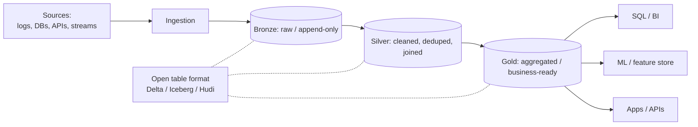

# Lakehouse Architecture

A comprehensive guide to building unified lakehouse architectures that combine the best of data lakes and data warehouses across AWS, Azure, and Google Cloud Platform.

---

## Table of Contents

1. [Architecture Overview](#architecture-overview)
2. [Architecture Diagram Description](#architecture-diagram-description)
3. [Component Breakdown](#component-breakdown)
4. [Table Formats](#table-formats)
5. [AWS Implementation](#aws-implementation)
6. [Azure Implementation](#azure-implementation)
7. [GCP Implementation](#gcp-implementation)
8. [Design Considerations](#design-considerations)
9. [Schema Management](#schema-management)
10. [Cost Estimation](#cost-estimation)
11. [Production Checklist](#production-checklist)

---

## Architecture Overview

### What is Lakehouse Architecture?

Lakehouse architecture combines the flexibility of data lakes with the performance and governance of data warehouses:
- **Open Storage**: Data stored in open formats on object storage (S3, ADLS, GCS)
- **ACID Transactions**: Full transactional support on data lake files
- **Schema Enforcement**: Schema-on-write with schema evolution support
- **Unified Platform**: Single architecture for BI, ML, streaming, and data engineering
- **Time Travel**: Query historical data at any point in time
- **Performance**: Indexing, caching, and query optimization on raw data

### Data Lake vs Data Warehouse vs Lakehouse

| Feature | Data Lake | Data Warehouse | Lakehouse |
|---------|-----------|----------------|-----------|
| **Storage** | Object storage (cheap) | Proprietary (expensive) | Object storage (cheap) |
| **Data Types** | Structured, semi, unstructured | Structured only | All types |
| [**Schema**](../../learn/glossary.md#term-schema) | Schema-on-read | Schema-on-write | Both |
| [**ACID**](../../learn/glossary.md#term-acid) | No | Yes | Yes |
| **Performance** | Slow for SQL | Fast for SQL | Fast for SQL |
| **Cost** | Low storage, variable compute | High (coupled) | Low storage, elastic compute |
| **ML Support** | Native | Limited | Native |
| **Governance** | Limited | Strong | Strong |

### Benefits

- **Cost Efficiency**: Cheap object storage with elastic compute
- **Unified Analytics**: BI, data science, and streaming on one platform
- **Open Formats**: Avoid vendor lock-in with open table formats
- **ACID Compliance**: Reliable data operations with transactional guarantees
- **Time Travel**: Audit, rollback, and reproduce historical queries
- **Schema Evolution**: Safely evolve schemas without breaking downstream consumers
- **Performance**: Comparable to data warehouses for structured queries

### Trade-offs

- **Complexity**: More components to manage than a simple warehouse
- **Maturity**: Table format ecosystem is still evolving
- **Tooling**: Not all BI tools support lakehouse formats natively
- **Optimization**: Requires tuning (compaction, Z-ordering, partitioning)
- **Expertise**: Teams need to understand storage optimization techniques

---

## Architecture Diagram Description

### High-Level Architecture



```
[Data Sources] --> [Ingestion Layer] --> [Raw/Bronze Zone]
                                              |
                                     [Transformation]
                                              |
                                     [Curated/Silver Zone]
                                              |
                                     [Aggregated/Gold Zone]
                                              |
                          +-------------------+-------------------+
                          |                   |                   |
                   [BI / Reporting]    [Data Science / ML]  [Streaming Apps]
```

### Medallion Architecture

The lakehouse typically uses a medallion (multi-hop) architecture:

| Layer | Also Called | Purpose | Data Quality |
|-------|-----------|---------|-------------|
| **Bronze** | Raw | Ingest raw data as-is | As received |
| **Silver** | Curated | Cleaned, conformed, deduplicated | Validated |
| **Gold** | Aggregated | Business-level aggregations | Production-ready |

---

## Component Breakdown

### Storage Layer

| Component | Purpose | Key Features |
|-----------|---------|--------------|
| **Object Storage** | Persist all data | S3, ADLS Gen2, GCS |
| **Table Format** | ACID transactions on files | Delta Lake, Apache Iceberg, Apache Hudi |
| **File Format** | Columnar storage | Apache Parquet, Apache ORC |
| **Metadata Catalog** | Track table schemas and locations | Hive Metastore, Glue Catalog, Unity Catalog |

### Compute Layer

| Component | Purpose | Key Features |
|-----------|---------|--------------|
| **SQL Engine** | BI and analytics queries | Spark SQL, Trino, Athena, Synapse |
| **Processing Engine** | ETL and transformations | Apache Spark, Flink |
| **ML Runtime** | Model training and inference | MLlib, pandas, scikit-learn |
| **Streaming Engine** | Real-time data processing | Spark Structured Streaming, Flink |

### Governance Layer

| Component | Purpose | Key Features |
|-----------|---------|--------------|
| **Access Control** | Fine-grained permissions | Table, column, row-level security |
| **Data Lineage** | Track data flow | End-to-end lineage visualization |
| **Audit Logging** | Record all data access | Compliance and security |
| **Data Quality** | Validate data | Rules, expectations, monitoring |

---

## Table Formats

### Comparison

| Feature | Delta Lake | Apache Iceberg | Apache Hudi |
|---------|-----------|----------------|-------------|
| **Creator** | Databricks | Netflix / Apache | Uber / Apache |
| **ACID Transactions** | Yes | Yes | Yes |
| **Time Travel** | Yes | Yes | Yes |
| **Schema Evolution** | Yes | Yes | Yes |
| **Partition Evolution** | Limited | Full (hidden partitioning) | Limited |
| **Engine Support** | Spark, Trino, Flink | Spark, Trino, Flink, Hive | Spark, Trino, Flink, Hive |
| **Cloud Support** | All major clouds | All major clouds | All major clouds |
| **Merge Operations** | MERGE INTO | MERGE INTO | Upsert native |
| **Compaction** | OPTIMIZE | Automatic / manual | Automatic / manual |
| **Z-Order / Clustering** | Z-ORDER BY | Sort orders | Clustering |
| **Adoption** | High (Databricks ecosystem) | Growing rapidly | Moderate |

### When to Choose

- **Delta Lake**: Best if using Databricks or Spark-heavy workloads; most mature ecosystem
- **Apache Iceberg**: Best for multi-engine environments; strongest partition evolution and hidden partitioning
- **Apache Hudi**: Best for streaming upserts and change data capture (CDC) workloads

**Documentation:**
- [Delta Lake](https://docs.delta.io/index.html)
- [Apache Iceberg](https://iceberg.apache.org/docs/latest/)
- [Apache Hudi](https://hudi.apache.org/docs/overview)

---

## AWS Implementation

### Core Services

| Component | AWS Service | Purpose |
|-----------|------------|---------|
| **Storage** | Amazon S3 | Data lake storage |
| **Catalog** | AWS Glue Data Catalog | Hive-compatible metastore |
| **SQL Query** | Amazon Athena | Serverless SQL on S3 |
| **Warehouse Query** | Amazon Redshift Spectrum | Query S3 from Redshift |
| **Processing** | AWS Glue, Amazon EMR | Spark-based ETL |
| **Streaming** | Amazon Kinesis, MSK | Real-time ingestion |
| **Governance** | AWS Lake Formation | Access control and sharing |
| **Orchestration** | AWS Step Functions, MWAA | Pipeline orchestration |

### Architecture Pattern

- S3 as the storage layer with Delta Lake or Iceberg table format
- Glue Data Catalog as the metastore
- Athena for ad-hoc SQL queries directly on S3
- Redshift Spectrum for joining warehouse and lake data
- EMR or Glue for Spark-based transformations
- Lake Formation for fine-grained access control
- Kinesis Data Firehose for streaming ingestion to S3

**Documentation:**
- [Amazon Athena](https://docs.aws.amazon.com/athena/latest/ug/what-is.html)
- [Amazon Redshift Spectrum](https://docs.aws.amazon.com/redshift/latest/dg/c-using-spectrum.html)
- [AWS Lake Formation](https://docs.aws.amazon.com/lake-formation/latest/dg/what-is-lake-formation.html)
- [Amazon EMR](https://docs.aws.amazon.com/emr/latest/ManagementGuide/emr-what-is-emr.html)

---

## Azure Implementation

### Core Services

| Component | Azure Service | Purpose |
|-----------|--------------|---------|
| **Storage** | Azure Data Lake Storage Gen2 | Data lake storage |
| **Catalog** | Hive Metastore / Unity Catalog | Table metadata |
| **SQL Query** | Synapse Serverless SQL | Serverless SQL on ADLS |
| **Warehouse Query** | Synapse Dedicated SQL Pools | Managed data warehouse |
| **Processing** | Azure Databricks, Synapse Spark | Spark-based ETL |
| **Streaming** | Azure Event Hubs, Stream Analytics | Real-time ingestion |
| **Governance** | Microsoft Purview | Data governance and lineage |
| **Orchestration** | Azure Data Factory, Synapse Pipelines | Pipeline orchestration |

### Architecture Pattern

- ADLS Gen2 as the storage layer with Delta Lake format
- Azure Databricks for unified analytics (ETL, ML, SQL)
- Synapse Serverless SQL for ad-hoc queries on lake data
- Synapse Dedicated Pools for high-performance warehouse queries
- Purview for data cataloging, lineage, and governance
- Event Hubs for streaming data ingestion
- Data Factory for batch pipeline orchestration

**Documentation:**
- [Azure Synapse Analytics](https://learn.microsoft.com/en-us/azure/synapse-analytics/overview-what-is)
- [Azure Databricks](https://learn.microsoft.com/en-us/azure/databricks/introduction/)
- [ADLS Gen2](https://learn.microsoft.com/en-us/azure/storage/blobs/data-lake-storage-introduction)
- [Microsoft Purview](https://learn.microsoft.com/en-us/purview/purview)

---

## GCP Implementation

### Core Services

| Component | GCP Service | Purpose |
|-----------|------------|---------|
| **Storage** | Cloud Storage (GCS) | Data lake storage |
| **Catalog** | Dataplex, BigQuery Metastore | Table metadata |
| **SQL Query** | BigQuery | Serverless analytics |
| **Processing** | Dataproc (Spark), Dataflow | ETL/ELT pipelines |
| **Streaming** | Pub/Sub, Dataflow | Real-time ingestion |
| **Governance** | Dataplex | Data quality and governance |
| **Orchestration** | Cloud Composer (Airflow) | Pipeline orchestration |
| **ML** | Vertex AI, BigQuery ML | Machine learning |

### Architecture Pattern

- GCS as the storage layer with Iceberg or Delta Lake format
- BigQuery for SQL analytics with BigLake for unified access
- BigLake tables provide a single interface to query data in GCS and BigQuery
- Dataproc for Spark-based transformations
- Dataplex for data quality, cataloging, and governance
- Pub/Sub and Dataflow for streaming ingestion
- BigQuery ML for in-place machine learning

### BigLake Integration

BigLake is Google Cloud's lakehouse solution that unifies data lakes and warehouses:
- Query data in GCS using BigQuery SQL engine
- Fine-grained access control on external data
- Support for Iceberg, Delta Lake, and Hudi tables
- No data movement required

**Documentation:**
- [BigQuery](https://cloud.google.com/bigquery/docs/introduction)
- [BigLake](https://cloud.google.com/bigquery/docs/biglake-intro)
- [Dataplex](https://cloud.google.com/dataplex/docs/introduction)
- [Dataproc](https://cloud.google.com/dataproc/docs/concepts/overview)

---

## Design Considerations

### Partitioning Strategy

- **Time-based partitioning**: Most common; partition by date, hour, or month
- **Column-based partitioning**: Partition by high-cardinality columns (region, customer_id)
- **Hidden partitioning (Iceberg)**: Users query without knowing partition structure
- **Over-partitioning risk**: Too many small files degrades performance
- **Rule of thumb**: Aim for partition sizes of 100 MB to 1 GB

### File Size Optimization

- **Target file size**: 128 MB to 1 GB for Parquet files
- **Small file problem**: Too many small files causes slow queries and high metadata overhead
- **Compaction**: Run regular compaction jobs to merge small files
- **Auto-optimization**: Delta Lake auto-optimize, Iceberg automatic compaction

### Query Performance

- **Z-Ordering / Clustering**: Co-locate related data for faster range queries
- **Column statistics**: Maintain min/max statistics for data skipping
- **Caching**: Use SSD caching or query result caching for frequent queries
- **Materialized views**: Pre-compute common aggregations

---

## Schema Management

### Schema Enforcement

- **Schema-on-write**: Reject data that does not match the expected schema
- **Schema validation**: Validate at ingestion time to catch issues early
- **Data type enforcement**: Ensure correct data types for all columns
- **Not-null constraints**: Enforce required fields

### Schema Evolution

| Operation | Delta Lake | Iceberg | Hudi |
|-----------|-----------|---------|------|
| **Add column** | Yes | Yes | Yes |
| **Drop column** | Yes | Yes | Yes |
| **Rename column** | Yes | Yes | Yes |
| **Reorder columns** | Yes | Yes | Limited |
| **Widen type** | Yes (int to long) | Yes | Yes |
| **Change nullability** | Yes | Yes | Yes |

### Best Practices

- **Backward compatibility**: Adding columns is safe; removing columns requires coordination
- **Versioned schemas**: Track schema changes in version control
- **Default values**: Use default values for new columns to avoid null issues
- **Schema registry**: Use a schema registry for streaming data (Avro, Protobuf)
- **Testing**: Validate schema changes against downstream consumers before deploying

### Time Travel and Versioning

- **Snapshot queries**: Query data as it existed at a specific point in time
- **Rollback**: Restore a table to a previous version if errors are detected
- **Audit**: Compare current data with historical versions for auditing
- **Retention**: Configure how long historical versions are retained (storage cost trade-off)
- **Reproducibility**: Re-run ML experiments against the exact same data

```sql
-- Delta Lake time travel
SELECT * FROM my_table VERSION AS OF 5;
SELECT * FROM my_table TIMESTAMP AS OF '2024-01-01';

-- Iceberg time travel
SELECT * FROM my_table FOR SYSTEM_TIME AS OF TIMESTAMP '2024-01-01 00:00:00';

-- Rollback
RESTORE TABLE my_table TO VERSION AS OF 3;
```

---

## Cost Estimation

### AWS (Monthly Estimate - 10 TB Lakehouse)

| Component | Service | Estimated Cost |
|-----------|---------|---------------|
| Storage | S3 (10 TB) | ~$230/month |
| Catalog | Glue Data Catalog | ~$1/month |
| SQL Queries | Athena (5 TB scanned/month) | ~$25/month |
| Processing | EMR (10 m5.xlarge, 8 hrs/day) | ~$1,200/month |
| Governance | Lake Formation | Free |
| Orchestration | Step Functions | ~$25/month |
| **Total** | | **~$1,480/month** |

### Azure (Monthly Estimate - 10 TB Lakehouse)

| Component | Service | Estimated Cost |
|-----------|---------|---------------|
| Storage | ADLS Gen2 (10 TB) | ~$210/month |
| SQL Queries | Synapse Serverless (5 TB) | ~$25/month |
| Processing | Databricks (Standard, moderate) | ~$1,500/month |
| Governance | Purview | ~$250/month |
| Orchestration | Data Factory | ~$100/month |
| **Total** | | **~$2,085/month** |

### GCP (Monthly Estimate - 10 TB Lakehouse)

| Component | Service | Estimated Cost |
|-----------|---------|---------------|
| Storage | GCS (10 TB) | ~$200/month |
| SQL Queries | BigQuery (5 TB scanned/month) | ~$25/month |
| Processing | Dataproc (moderate) | ~$800/month |
| Governance | Dataplex | ~$50/month |
| Orchestration | Cloud Composer (small) | ~$300/month |
| **Total** | | **~$1,375/month** |

---

## Production Checklist

### Storage and Format

- [ ] Table format selected (Delta Lake, Iceberg, or Hudi)
- [ ] Medallion architecture zones defined (bronze, silver, gold)
- [ ] Partitioning strategy designed and documented
- [ ] File size targets configured (128 MB - 1 GB)
- [ ] Compaction jobs scheduled
- [ ] Storage lifecycle policies configured for cost optimization

### Data Quality

- [ ] Schema enforcement enabled on all tables
- [ ] Data quality rules defined for each zone
- [ ] Quality monitoring dashboards operational
- [ ] Alerting configured for quality violations
- [ ] Dead letter handling for rejected records

### Performance

- [ ] Z-ordering or clustering configured for frequently queried columns
- [ ] Column statistics maintained and up to date
- [ ] Query performance benchmarks established
- [ ] Caching strategy implemented for hot queries
- [ ] Small file compaction automated

### Governance and Security

- [ ] Access control implemented (table, column, row level)
- [ ] Data catalog populated with business metadata
- [ ] Data lineage tracking configured
- [ ] Audit logging enabled for all data access
- [ ] Encryption at rest and in transit configured
- [ ] PII detection and masking implemented

### Operations

- [ ] Pipeline monitoring and alerting configured
- [ ] Backup and recovery procedures tested
- [ ] Time travel retention policies configured
- [ ] Cost monitoring and optimization in place
- [ ] Schema evolution procedures documented
- [ ] Runbooks for common operational tasks created

---

**Related Guides:**
- [Data Pipeline ETL Architecture](./data-pipeline-etl.md)
- [Data Mesh Architecture](./data-mesh.md)
- [Service Comparison - Databases](../service-comparison-databases.md)
