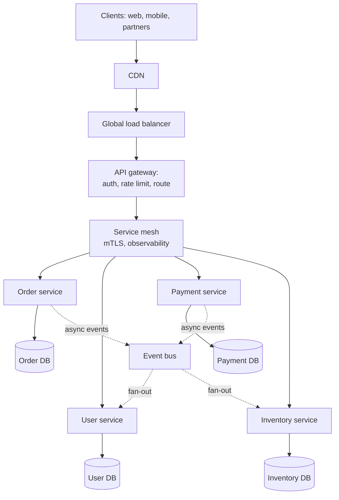

# Microservices Architecture

A comprehensive guide to building scalable, maintainable microservices applications using AWS, Azure, and Google Cloud Platform.

---

## Table of Contents

1. [Architecture Overview](#architecture-overview)
2. [Architecture Diagram Description](#architecture-diagram-description)
3. [Component Breakdown](#component-breakdown)
4. [AWS Implementation](#aws-implementation)
5. [Azure Implementation](#azure-implementation)
6. [GCP Implementation](#gcp-implementation)
7. [Security Considerations](#security-considerations)
8. [Performance Optimization](#performance-optimization)
9. [Cost Estimates](#cost-estimates)
10. [Best Practices](#best-practices)
11. [Common Patterns](#common-patterns)
12. [Monitoring and Observability](#monitoring-and-observability)
13. [CI/CD for Microservices](#cicd-for-microservices)
14. [Common Pitfalls](#common-pitfalls)

---

## Architecture Overview

### What is Microservices Architecture?

Microservices architecture is a software design approach where:
- **Loosely Coupled Services**: Each service is independently deployable and scalable
- **Single Responsibility**: Each service handles one business capability
- **Decentralized Data**: Each service owns its data store
- **Technology Agnostic**: Services can use different tech stacks
- **Resilient**: Failure in one service doesn't cascade to others
- **Team Autonomy**: Small teams can own entire services end-to-end

### Core Components

1. [**API Gateway**](../../learn/glossary.md#term-api-gateway): Single entry point for all client requests
2. **Service Mesh**: Service-to-service communication infrastructure
3. **Container Orchestration**: Managing containerized services (Kubernetes, ECS)
4. **Service Registry**: Dynamic service discovery
5. **Load Balancers**: Distributing traffic across service instances
6. **Message Broker**: Asynchronous inter-service communication
7. **Centralized Logging**: Aggregated logs across all services
8. **Distributed Tracing**: End-to-end request tracking

### Benefits

- **Independent Deployment**: Deploy services without affecting others
- **Scalability**: Scale individual services based on demand
- **Technology Flexibility**: Choose the right tool for each service
- **Fault Isolation**: Failures are contained to individual services
- **Team Autonomy**: Small teams can move fast
- **Easier Maintenance**: Smaller codebases are easier to understand
- **Reusability**: Services can be shared across applications

### Trade-offs

- **Increased Complexity**: Distributed systems are harder to debug
- **Network Latency**: Service-to-service calls add latency
- **Data Consistency**: Eventual consistency across services
- **Operational Overhead**: More services to deploy and monitor
- **Testing Complexity**: Integration testing is more difficult
- **Cost**: More infrastructure components needed

### Use Cases

- E-commerce platforms with separate cart, inventory, payment services
- Streaming platforms with content, recommendation, user services
- Banking systems with accounts, transactions, fraud detection services
- Healthcare systems with patient, appointment, billing services
- SaaS platforms with multi-tenant, modular features

### When to Use Microservices

**Good Fit**:
- Large, complex applications with clear domain boundaries
- Teams of 50+ engineers needing autonomy
- High scalability requirements for specific components
- Polyglot development needs
- Frequent, independent deployments required
- Long-lived applications that will evolve significantly

**Poor Fit**:
- Simple applications or MVPs
- Small teams (< 10 engineers)
- Tight deadlines without existing infrastructure
- Applications with tightly coupled data requirements
- Real-time systems requiring ultra-low latency between components

---

## Architecture Diagram Description

### High-Level Architecture



```
                           [Internet]
                               |
                               |
                    [Global Load Balancer]
                               |
                               |
                         [API Gateway]
                    (Authentication, Rate Limiting,
                     Request Routing)
                               |
           +-------------------+-------------------+
           |                   |                   |
    [User Service]      [Order Service]     [Product Service]
           |                   |                   |
    [Users DB]           [Orders DB]        [Products DB]
    (PostgreSQL)         (DynamoDB)         (MongoDB)
           |                   |                   |
           +-------------------+-------------------+
                               |
                        [Message Broker]
                    (SQS/SNS, Service Bus,
                         Pub/Sub)
                               |
           +-------------------+-------------------+
           |                   |                   |
  [Notification Service]  [Analytics Service]  [Payment Service]
           |                   |                   |
    [SES/SendGrid]      [Data Warehouse]    [Stripe/Payment DB]
```

### Container Orchestration View

```
[Kubernetes Cluster / ECS Cluster / GKE Cluster]
    |
    +-- Namespace: production
    |       |
    |       +-- [Ingress Controller] ─────────────────────────────────────+
    |       |                                                              |
    |       +-- Service: user-service ──────── [Pod] [Pod] [Pod]          |
    |       |       └── ClusterIP: 10.0.1.10                               |
    |       |                                                              |
    |       +-- Service: order-service ─────── [Pod] [Pod]                |
    |       |       └── ClusterIP: 10.0.1.20                               |
    |       |                                                              |
    |       +-- Service: product-service ───── [Pod] [Pod] [Pod] [Pod]    |
    |               └── ClusterIP: 10.0.1.30                               |
    |                                                                      |
    +-- Namespace: monitoring                                              |
            |                                                              |
            +-- [Prometheus] [Grafana] [Jaeger]                           |
```

### Request Flow

```
1. Client makes HTTP request to api.example.com
   ↓
2. DNS resolves to Global Load Balancer
   ↓
3. Load Balancer routes to healthy API Gateway instance
   ↓
4. API Gateway authenticates request (JWT/OAuth)
   ↓
5. Gateway routes to appropriate microservice based on path
   ↓
6. Service Mesh (sidecar proxy) intercepts the request
   ↓
7. Sidecar handles mTLS, load balancing, retry logic
   ↓
8. Target service processes request
   ↓
9. Service may call other services (through sidecar)
   ↓
10. Service queries its database
   ↓
11. Response bubbles back through the same path
   ↓
12. Client receives response with trace ID for debugging
```

### Service Mesh Pattern

```
[Service A Pod]                         [Service B Pod]
+------------------+                    +------------------+
| [Application]    |                    | [Application]    |
|       ↓          |                    |       ↑          |
| [Envoy Sidecar]  | ──── mTLS ──────→  | [Envoy Sidecar]  |
+------------------+                    +------------------+
        ↑                                        ↑
        |                                        |
        +────────────── [Control Plane] ─────────+
                     (Istio/App Mesh/Linkerd)
                              |
                    [Configuration]
                    - Traffic policies
                    - Retry logic
                    - Circuit breakers
                    - mTLS certificates
```

---

## Component Breakdown

### API Gateway

#### Responsibilities
- Single entry point for all client requests
- Request routing to appropriate microservices
- Authentication and authorization
- Rate limiting and throttling
- Request/response transformation
- API versioning
- Caching
- Request aggregation (BFF pattern)

#### Features by Provider
- **AWS API Gateway**: REST, HTTP, WebSocket; Lambda authorizers
- **Azure API Management**: Full lifecycle management, developer portal
- **GCP API Gateway**: OpenAPI-based, Cloud Endpoints

### Container Orchestration

#### Kubernetes Concepts
- **Pods**: Smallest deployable unit, contains containers
- **Services**: Stable network endpoint for pods
- **Deployments**: Declarative updates for pods
- **ConfigMaps/Secrets**: Configuration management
- [**Ingress**](../../learn/glossary.md#term-ingress): External access to services
- **HPA**: Horizontal Pod Autoscaler for scaling

#### Managed Kubernetes Options
- **AWS EKS**: Managed Kubernetes on AWS
- **Azure AKS**: Managed Kubernetes on Azure
- **GCP GKE**: Managed Kubernetes on GCP (most mature)

#### Container Services (Non-Kubernetes)
- **AWS ECS/Fargate**: Native AWS container orchestration
- **Azure Container Instances**: Serverless containers
- **GCP Cloud Run**: Serverless containers

### Service Mesh

#### What It Provides
- **Traffic Management**: Load balancing, routing, retries
- **Security**: mTLS, authentication, authorization
- [**Observability**](../../learn/glossary.md#term-observability): Metrics, tracing, logging
- **Resilience**: Circuit breakers, timeouts, fault injection

#### Service Mesh Options
- **AWS App Mesh**: Native AWS service mesh
- **Istio**: Open-source, works on all clouds
- **Linkerd**: Lightweight, CNCF graduated
- **Consul Connect**: HashiCorp's service mesh

### Service Discovery

#### Mechanisms
- **DNS-based**: Services registered in DNS (simple, eventual consistency)
- **Client-side**: Client queries registry, caches results
- **Server-side**: Load balancer queries registry

#### Provider Services
- **AWS Cloud Map**: Native service discovery
- **Azure Service Fabric**: Built-in discovery
- **GCP Service Directory**: Managed service registry
- **Consul**: Multi-cloud service mesh and discovery

### Message Brokers

#### Use Cases
- Asynchronous communication between services
- Event-driven architectures
- Decoupling producers and consumers
- Work queue distribution
- Event sourcing

#### Provider Services
- [**AWS**](../../learn/glossary.md#term-aws): SQS (queues), SNS (pub/sub), EventBridge, Kinesis (streaming)
- [**Azure**](../../learn/glossary.md#term-azure): Service Bus, Event Grid, Event Hubs
- **GCP**: Pub/Sub, Cloud Tasks

### Databases (Per Service)

#### Database Per Service Pattern
Each microservice owns its database:
- **Isolation**: No direct database sharing
- **Autonomy**: Teams choose their own database
- **Scalability**: Scale databases independently
- **Trade-off**: Data consistency is harder

#### Common Patterns
- **Polyglot Persistence**: Different DBs for different services
  - User Service → PostgreSQL (relational data)
  - Order Service → DynamoDB (high throughput)
  - Product Service → MongoDB (flexible schema)
  - Search Service → Elasticsearch (full-text search)
  - Cache → Redis (session, hot data)

---

## AWS Implementation

### Architecture Components

#### EKS Cluster with Service Mesh

```yaml
# eks-cluster.yaml (eksctl)
apiVersion: eksctl.io/v1alpha5
kind: ClusterConfig

metadata:
  name: microservices-cluster
  region: us-east-1
  version: "1.28"

managedNodeGroups:
  - name: general-workloads
    instanceType: m5.large
    desiredCapacity: 3
    minSize: 2
    maxSize: 10
    volumeSize: 100
    labels:
      workload-type: general
    iam:
      withAddonPolicies:
        albIngress: true
        cloudWatch: true
        autoScaler: true
        appMesh: true
        xRay: true

  - name: memory-optimized
    instanceType: r5.large
    desiredCapacity: 2
    minSize: 1
    maxSize: 5
    labels:
      workload-type: memory-intensive

addons:
  - name: vpc-cni
    version: latest
  - name: coredns
    version: latest
  - name: kube-proxy
    version: latest

cloudWatch:
  clusterLogging:
    enableTypes: ["api", "audit", "authenticator", "controllerManager", "scheduler"]
```

#### Kubernetes Deployment Example

```yaml
# user-service-deployment.yaml
apiVersion: apps/v1
kind: Deployment
metadata:
  name: user-service
  namespace: production
  labels:
    app: user-service
    version: v1
spec:
  replicas: 3
  selector:
    matchLabels:
      app: user-service
  template:
    metadata:
      labels:
        app: user-service
        version: v1
      annotations:
        prometheus.io/scrape: "true"
        prometheus.io/port: "8080"
    spec:
      serviceAccountName: user-service-sa
      containers:
        - name: user-service
          image: 123456789012.dkr.ecr.us-east-1.amazonaws.com/user-service:v1.2.3
          ports:
            - containerPort: 8080
              name: http
          env:
            - name: DB_HOST
              valueFrom:
                secretKeyRef:
                  name: user-service-secrets
                  key: db-host
            - name: AWS_REGION
              value: "us-east-1"
          resources:
            requests:
              memory: "256Mi"
              cpu: "250m"
            limits:
              memory: "512Mi"
              cpu: "500m"
          livenessProbe:
            httpGet:
              path: /health
              port: 8080
            initialDelaySeconds: 30
            periodSeconds: 10
          readinessProbe:
            httpGet:
              path: /ready
              port: 8080
            initialDelaySeconds: 5
            periodSeconds: 5
      affinity:
        podAntiAffinity:
          preferredDuringSchedulingIgnoredDuringExecution:
            - weight: 100
              podAffinityTerm:
                labelSelector:
                  matchLabels:
                    app: user-service
                topologyKey: topology.kubernetes.io/zone
---
apiVersion: v1
kind: Service
metadata:
  name: user-service
  namespace: production
spec:
  selector:
    app: user-service
  ports:
    - port: 80
      targetPort: 8080
      name: http
  type: ClusterIP
---
apiVersion: autoscaling/v2
kind: HorizontalPodAutoscaler
metadata:
  name: user-service-hpa
  namespace: production
spec:
  scaleTargetRef:
    apiVersion: apps/v1
    kind: Deployment
    name: user-service
  minReplicas: 3
  maxReplicas: 20
  metrics:
    - type: Resource
      resource:
        name: cpu
        target:
          type: Utilization
          averageUtilization: 70
    - type: Resource
      resource:
        name: memory
        target:
          type: Utilization
          averageUtilization: 80
```

#### AWS App Mesh Configuration

```yaml
# app-mesh-virtual-service.yaml
apiVersion: appmesh.k8s.aws/v1beta2
kind: Mesh
metadata:
  name: microservices-mesh
spec:
  namespaceSelector:
    matchLabels:
      mesh: microservices-mesh
---
apiVersion: appmesh.k8s.aws/v1beta2
kind: VirtualNode
metadata:
  name: user-service
  namespace: production
spec:
  podSelector:
    matchLabels:
      app: user-service
  listeners:
    - portMapping:
        port: 8080
        protocol: http
      healthCheck:
        healthyThreshold: 2
        intervalMillis: 5000
        path: /health
        port: 8080
        protocol: http
        timeoutMillis: 2000
        unhealthyThreshold: 3
  backends:
    - virtualService:
        virtualServiceRef:
          name: order-service
  serviceDiscovery:
    awsCloudMap:
      namespaceName: production
      serviceName: user-service
---
apiVersion: appmesh.k8s.aws/v1beta2
kind: VirtualService
metadata:
  name: user-service
  namespace: production
spec:
  awsName: user-service.production.svc.cluster.local
  provider:
    virtualRouter:
      virtualRouterRef:
        name: user-service-router
---
apiVersion: appmesh.k8s.aws/v1beta2
kind: VirtualRouter
metadata:
  name: user-service-router
  namespace: production
spec:
  listeners:
    - portMapping:
        port: 8080
        protocol: http
  routes:
    - name: user-service-route
      httpRoute:
        match:
          prefix: /
        action:
          weightedTargets:
            - virtualNodeRef:
                name: user-service
              weight: 100
        retryPolicy:
          maxRetries: 3
          perRetryTimeout:
            unit: s
            value: 2
          httpRetryEvents:
            - server-error
            - gateway-error
            - connection-error
```

#### API Gateway with VPC Link

```yaml
# api-gateway.yaml (AWS SAM)
AWSTemplateFormatVersion: '2010-09-09'
Transform: AWS::Serverless-2016-10-31

Resources:
  MicroservicesApi:
    Type: AWS::ApiGatewayV2::Api
    Properties:
      Name: microservices-api
      ProtocolType: HTTP
      CorsConfiguration:
        AllowHeaders:
          - Authorization
          - Content-Type
        AllowMethods:
          - GET
          - POST
          - PUT
          - DELETE
        AllowOrigins:
          - https://example.com

  VpcLink:
    Type: AWS::ApiGatewayV2::VpcLink
    Properties:
      Name: microservices-vpc-link
      SubnetIds:
        - !Ref PrivateSubnet1
        - !Ref PrivateSubnet2
      SecurityGroupIds:
        - !Ref VpcLinkSecurityGroup

  UserServiceIntegration:
    Type: AWS::ApiGatewayV2::Integration
    Properties:
      ApiId: !Ref MicroservicesApi
      IntegrationType: HTTP_PROXY
      IntegrationUri: !Ref UserServiceLoadBalancerListener
      IntegrationMethod: ANY
      ConnectionType: VPC_LINK
      ConnectionId: !Ref VpcLink
      PayloadFormatVersion: "1.0"

  UserServiceRoute:
    Type: AWS::ApiGatewayV2::Route
    Properties:
      ApiId: !Ref MicroservicesApi
      RouteKey: "ANY /users/{proxy+}"
      Target: !Sub "integrations/${UserServiceIntegration}"
      AuthorizationType: JWT
      AuthorizerId: !Ref CognitoAuthorizer

  CognitoAuthorizer:
    Type: AWS::ApiGatewayV2::Authorizer
    Properties:
      ApiId: !Ref MicroservicesApi
      AuthorizerType: JWT
      IdentitySource:
        - "$request.header.Authorization"
      JwtConfiguration:
        Audience:
          - !Ref CognitoUserPoolClient
        Issuer: !Sub "https://cognito-idp.${AWS::Region}.amazonaws.com/${CognitoUserPool}"
      Name: cognito-authorizer
```

#### Terraform for ECS Fargate

```hcl
# ecs-service.tf
resource "aws_ecs_cluster" "main" {
  name = "${var.project_name}-${var.environment}-cluster"

  setting {
    name  = "containerInsights"
    value = "enabled"
  }

  tags = {
    Name        = "${var.project_name}-${var.environment}-cluster"
    Environment = var.environment
    ManagedBy   = "terraform"
  }
}

resource "aws_ecs_task_definition" "user_service" {
  family                   = "user-service"
  requires_compatibilities = ["FARGATE"]
  network_mode             = "awsvpc"
  cpu                      = 256
  memory                   = 512
  execution_role_arn       = aws_iam_role.ecs_execution.arn
  task_role_arn            = aws_iam_role.user_service_task.arn

  container_definitions = jsonencode([
    {
      name      = "user-service"
      image     = "${aws_ecr_repository.user_service.repository_url}:latest"
      essential = true

      portMappings = [
        {
          containerPort = 8080
          protocol      = "tcp"
        }
      ]

      environment = [
        {
          name  = "ENVIRONMENT"
          value = var.environment
        }
      ]

      secrets = [
        {
          name      = "DB_CONNECTION_STRING"
          valueFrom = aws_secretsmanager_secret.user_db.arn
        }
      ]

      logConfiguration = {
        logDriver = "awslogs"
        options = {
          "awslogs-group"         = aws_cloudwatch_log_group.user_service.name
          "awslogs-region"        = var.aws_region
          "awslogs-stream-prefix" = "ecs"
        }
      }

      healthCheck = {
        command     = ["CMD-SHELL", "curl -f http://localhost:8080/health || exit 1"]
        interval    = 30
        timeout     = 5
        retries     = 3
        startPeriod = 60
      }
    }
  ])
}

resource "aws_ecs_service" "user_service" {
  name            = "user-service"
  cluster         = aws_ecs_cluster.main.id
  task_definition = aws_ecs_task_definition.user_service.arn
  desired_count   = 3
  launch_type     = "FARGATE"

  network_configuration {
    subnets          = var.private_subnet_ids
    security_groups  = [aws_security_group.user_service.id]
    assign_public_ip = false
  }

  load_balancer {
    target_group_arn = aws_lb_target_group.user_service.arn
    container_name   = "user-service"
    container_port   = 8080
  }

  service_registries {
    registry_arn = aws_service_discovery_service.user_service.arn
  }

  deployment_circuit_breaker {
    enable   = true
    rollback = true
  }

  depends_on = [aws_lb_listener.main]
}

resource "aws_appautoscaling_target" "user_service" {
  max_capacity       = 10
  min_capacity       = 3
  resource_id        = "service/${aws_ecs_cluster.main.name}/${aws_ecs_service.user_service.name}"
  scalable_dimension = "ecs:service:DesiredCount"
  service_namespace  = "ecs"
}

resource "aws_appautoscaling_policy" "user_service_cpu" {
  name               = "user-service-cpu"
  policy_type        = "TargetTrackingScaling"
  resource_id        = aws_appautoscaling_target.user_service.resource_id
  scalable_dimension = aws_appautoscaling_target.user_service.scalable_dimension
  service_namespace  = aws_appautoscaling_target.user_service.service_namespace

  target_tracking_scaling_policy_configuration {
    predefined_metric_specification {
      predefined_metric_type = "ECSServiceAverageCPUUtilization"
    }
    target_value       = 70.0
    scale_in_cooldown  = 300
    scale_out_cooldown = 60
  }
}
```

---

## Azure Implementation

### Architecture Components

#### AKS Cluster with Service Mesh

```yaml
# aks-cluster.yaml (Azure CLI / Bicep)
resource aksCluster 'Microsoft.ContainerService/managedClusters@2023-05-01' = {
  name: 'microservices-aks'
  location: resourceGroup().location
  identity: {
    type: 'SystemAssigned'
  }
  properties: {
    kubernetesVersion: '1.28.0'
    dnsPrefix: 'microservices'
    enableRBAC: true

    agentPoolProfiles: [
      {
        name: 'systempool'
        count: 3
        vmSize: 'Standard_D2s_v3'
        mode: 'System'
        osType: 'Linux'
        availabilityZones: ['1', '2', '3']
        enableAutoScaling: true
        minCount: 3
        maxCount: 10
      }
      {
        name: 'workerpool'
        count: 3
        vmSize: 'Standard_D4s_v3'
        mode: 'User'
        osType: 'Linux'
        availabilityZones: ['1', '2', '3']
        enableAutoScaling: true
        minCount: 3
        maxCount: 20
        nodeLabels: {
          'workload-type': 'application'
        }
      }
    ]

    networkProfile: {
      networkPlugin: 'azure'
      networkPolicy: 'calico'
      loadBalancerSku: 'standard'
    }

    addonProfiles: {
      omsagent: {
        enabled: true
        config: {
          logAnalyticsWorkspaceResourceID: logAnalyticsWorkspace.id
        }
      }
      azureKeyvaultSecretsProvider: {
        enabled: true
      }
    }

    serviceMeshProfile: {
      mode: 'Istio'
      istio: {
        components: {
          ingressGateways: [
            {
              enabled: true
              mode: 'External'
            }
          ]
        }
      }
    }
  }
}
```

#### Azure Container Apps (Serverless Microservices)

```bicep
// container-apps.bicep
resource containerAppEnvironment 'Microsoft.App/managedEnvironments@2023-05-01' = {
  name: 'microservices-env'
  location: resourceGroup().location
  properties: {
    appLogsConfiguration: {
      destination: 'log-analytics'
      logAnalyticsConfiguration: {
        customerId: logAnalytics.properties.customerId
        sharedKey: logAnalytics.listKeys().primarySharedKey
      }
    }
    daprAIInstrumentationKey: appInsights.properties.InstrumentationKey
  }
}

resource userService 'Microsoft.App/containerApps@2023-05-01' = {
  name: 'user-service'
  location: resourceGroup().location
  properties: {
    managedEnvironmentId: containerAppEnvironment.id
    configuration: {
      ingress: {
        external: false
        targetPort: 8080
        transport: 'http'
      }
      dapr: {
        enabled: true
        appId: 'user-service'
        appPort: 8080
        appProtocol: 'http'
      }
      secrets: [
        {
          name: 'db-connection'
          keyVaultUrl: '${keyVault.properties.vaultUri}secrets/user-db-connection'
          identity: 'system'
        }
      ]
    }
    template: {
      containers: [
        {
          name: 'user-service'
          image: '${containerRegistry.properties.loginServer}/user-service:latest'
          resources: {
            cpu: json('0.5')
            memory: '1Gi'
          }
          env: [
            {
              name: 'DB_CONNECTION'
              secretRef: 'db-connection'
            }
          ]
          probes: [
            {
              type: 'Liveness'
              httpGet: {
                path: '/health'
                port: 8080
              }
              initialDelaySeconds: 30
              periodSeconds: 10
            }
            {
              type: 'Readiness'
              httpGet: {
                path: '/ready'
                port: 8080
              }
              initialDelaySeconds: 5
              periodSeconds: 5
            }
          ]
        }
      ]
      scale: {
        minReplicas: 2
        maxReplicas: 10
        rules: [
          {
            name: 'http-scaling'
            http: {
              metadata: {
                concurrentRequests: '100'
              }
            }
          }
        ]
      }
    }
  }
}
```

#### Azure API Management

```bicep
// api-management.bicep
resource apiManagement 'Microsoft.ApiManagement/service@2023-03-01-preview' = {
  name: 'microservices-apim'
  location: resourceGroup().location
  sku: {
    name: 'Developer'
    capacity: 1
  }
  properties: {
    publisherEmail: 'admin@example.com'
    publisherName: 'Example Corp'
    virtualNetworkType: 'Internal'
    virtualNetworkConfiguration: {
      subnetResourceId: apimSubnet.id
    }
  }
}

resource userApi 'Microsoft.ApiManagement/service/apis@2023-03-01-preview' = {
  parent: apiManagement
  name: 'user-api'
  properties: {
    displayName: 'User API'
    path: 'users'
    protocols: ['https']
    serviceUrl: 'http://user-service.internal.azurecontainerapps.io'
    subscriptionRequired: true
    subscriptionKeyParameterNames: {
      header: 'Ocp-Apim-Subscription-Key'
    }
  }
}

resource rateLimitPolicy 'Microsoft.ApiManagement/service/apis/policies@2023-03-01-preview' = {
  parent: userApi
  name: 'policy'
  properties: {
    value: '''
      <policies>
        <inbound>
          <base />
          <rate-limit calls="100" renewal-period="60" />
          <validate-jwt header-name="Authorization">
            <openid-config url="https://login.microsoftonline.com/{tenant}/.well-known/openid-configuration" />
            <required-claims>
              <claim name="aud" match="all">
                <value>{client-id}</value>
              </claim>
            </required-claims>
          </validate-jwt>
          <set-header name="X-Request-ID" exists-action="skip">
            <value>@(context.RequestId.ToString())</value>
          </set-header>
        </inbound>
        <backend>
          <base />
        </backend>
        <outbound>
          <base />
        </outbound>
        <on-error>
          <base />
        </on-error>
      </policies>
    '''
    format: 'xml'
  }
}
```

---

## GCP Implementation

### Architecture Components

#### GKE Cluster with Anthos Service Mesh

```yaml
# gke-cluster.yaml (gcloud/Terraform)
resource "google_container_cluster" "primary" {
  name     = "microservices-cluster"
  location = "us-central1"

  # Remove default node pool
  remove_default_node_pool = true
  initial_node_count       = 1

  # Enable Workload Identity
  workload_identity_config {
    workload_pool = "${var.project_id}.svc.id.goog"
  }

  # Enable Anthos Service Mesh
  addons_config {
    http_load_balancing {
      disabled = false
    }
    horizontal_pod_autoscaling {
      disabled = false
    }
    network_policy_config {
      disabled = false
    }
  }

  # Network configuration
  network    = google_compute_network.vpc.name
  subnetwork = google_compute_subnetwork.subnet.name

  ip_allocation_policy {
    cluster_secondary_range_name  = "pods"
    services_secondary_range_name = "services"
  }

  private_cluster_config {
    enable_private_nodes    = true
    enable_private_endpoint = false
    master_ipv4_cidr_block  = "172.16.0.0/28"
  }

  # Logging and monitoring
  logging_config {
    enable_components = ["SYSTEM_COMPONENTS", "WORKLOADS"]
  }

  monitoring_config {
    enable_components = ["SYSTEM_COMPONENTS", "WORKLOADS"]
    managed_prometheus {
      enabled = true
    }
  }
}

resource "google_container_node_pool" "primary_nodes" {
  name       = "primary-pool"
  location   = "us-central1"
  cluster    = google_container_cluster.primary.name
  node_count = 3

  autoscaling {
    min_node_count = 3
    max_node_count = 10
  }

  node_config {
    preemptible  = false
    machine_type = "e2-standard-4"
    disk_size_gb = 100
    disk_type    = "pd-ssd"

    oauth_scopes = [
      "https://www.googleapis.com/auth/cloud-platform"
    ]

    workload_metadata_config {
      mode = "GKE_METADATA"
    }

    labels = {
      env = var.environment
    }

    tags = ["microservices", var.environment]
  }
}
```

#### Cloud Run (Serverless Microservices)

```yaml
# cloud-run-service.yaml
apiVersion: serving.knative.dev/v1
kind: Service
metadata:
  name: user-service
  annotations:
    run.googleapis.com/ingress: internal
    run.googleapis.com/vpc-access-connector: projects/PROJECT/locations/REGION/connectors/connector
    run.googleapis.com/vpc-access-egress: all-traffic
spec:
  template:
    metadata:
      annotations:
        autoscaling.knative.dev/minScale: "2"
        autoscaling.knative.dev/maxScale: "100"
        run.googleapis.com/cpu-throttling: "false"
        run.googleapis.com/startup-cpu-boost: "true"
    spec:
      serviceAccountName: user-service-sa@PROJECT.iam.gserviceaccount.com
      containerConcurrency: 80
      timeoutSeconds: 300
      containers:
        - image: gcr.io/PROJECT/user-service:latest
          ports:
            - containerPort: 8080
          resources:
            limits:
              cpu: "2"
              memory: "2Gi"
          env:
            - name: PROJECT_ID
              value: PROJECT
            - name: DB_HOST
              valueFrom:
                secretKeyRef:
                  name: db-secrets
                  key: host
          startupProbe:
            httpGet:
              path: /health
              port: 8080
            initialDelaySeconds: 10
            periodSeconds: 5
            failureThreshold: 3
          livenessProbe:
            httpGet:
              path: /health
              port: 8080
            periodSeconds: 15
```

#### Terraform for Cloud Run

```hcl
# cloud-run.tf
resource "google_cloud_run_v2_service" "user_service" {
  name     = "user-service"
  location = var.region
  ingress  = "INGRESS_TRAFFIC_INTERNAL_LOAD_BALANCER"

  template {
    service_account = google_service_account.user_service.email

    scaling {
      min_instance_count = 2
      max_instance_count = 100
    }

    vpc_access {
      connector = google_vpc_access_connector.connector.id
      egress    = "ALL_TRAFFIC"
    }

    containers {
      image = "${var.region}-docker.pkg.dev/${var.project_id}/microservices/user-service:latest"

      ports {
        container_port = 8080
      }

      resources {
        limits = {
          cpu    = "2"
          memory = "2Gi"
        }
        cpu_idle = false
      }

      env {
        name  = "PROJECT_ID"
        value = var.project_id
      }

      env {
        name = "DB_HOST"
        value_source {
          secret_key_ref {
            secret  = google_secret_manager_secret.db_host.secret_id
            version = "latest"
          }
        }
      }

      startup_probe {
        http_get {
          path = "/health"
          port = 8080
        }
        initial_delay_seconds = 10
        period_seconds        = 5
        failure_threshold     = 3
      }

      liveness_probe {
        http_get {
          path = "/health"
          port = 8080
        }
        period_seconds = 15
      }
    }
  }

  traffic {
    type    = "TRAFFIC_TARGET_ALLOCATION_TYPE_LATEST"
    percent = 100
  }
}

# Internal Load Balancer for Cloud Run
resource "google_compute_region_network_endpoint_group" "user_service_neg" {
  name                  = "user-service-neg"
  region                = var.region
  network_endpoint_type = "SERVERLESS"

  cloud_run {
    service = google_cloud_run_v2_service.user_service.name
  }
}

resource "google_compute_region_backend_service" "user_service" {
  name                  = "user-service-backend"
  region                = var.region
  load_balancing_scheme = "INTERNAL_MANAGED"
  protocol              = "HTTP"

  backend {
    group           = google_compute_region_network_endpoint_group.user_service_neg.id
    balancing_mode  = "UTILIZATION"
    capacity_scaler = 1.0
  }
}
```

#### GCP API Gateway

```yaml
# api-gateway-config.yaml
swagger: "2.0"
info:
  title: Microservices API
  version: "1.0.0"
host: "api.example.com"
x-google-endpoints:
  - name: "api.example.com"
    target: "LOAD_BALANCER_IP"
schemes:
  - "https"
produces:
  - "application/json"

securityDefinitions:
  firebase:
    authorizationUrl: ""
    flow: "implicit"
    type: "oauth2"
    x-google-issuer: "https://securetoken.google.com/PROJECT_ID"
    x-google-jwks_uri: "https://www.googleapis.com/service_accounts/v1/metadata/x509/securetoken@system.gserviceaccount.com"
    x-google-audiences: "PROJECT_ID"

paths:
  /users:
    get:
      summary: List users
      operationId: listUsers
      security:
        - firebase: []
      x-google-backend:
        address: https://user-service-xxxxx-uc.a.run.app
        jwt_audience: https://user-service-xxxxx-uc.a.run.app
      responses:
        200:
          description: Success
    post:
      summary: Create user
      operationId: createUser
      security:
        - firebase: []
      x-google-backend:
        address: https://user-service-xxxxx-uc.a.run.app
        jwt_audience: https://user-service-xxxxx-uc.a.run.app
      responses:
        201:
          description: Created

  /users/{userId}:
    get:
      summary: Get user
      operationId: getUser
      parameters:
        - name: userId
          in: path
          required: true
          type: string
      security:
        - firebase: []
      x-google-backend:
        address: https://user-service-xxxxx-uc.a.run.app
        path_translation: APPEND_PATH_TO_ADDRESS
        jwt_audience: https://user-service-xxxxx-uc.a.run.app
      responses:
        200:
          description: Success
```

---

## Security Considerations

### Authentication and Authorization

#### Service-to-Service Authentication
```yaml
# mTLS with Istio
apiVersion: security.istio.io/v1beta1
kind: PeerAuthentication
metadata:
  name: default
  namespace: production
spec:
  mtls:
    mode: STRICT
---
apiVersion: security.istio.io/v1beta1
kind: AuthorizationPolicy
metadata:
  name: user-service-policy
  namespace: production
spec:
  selector:
    matchLabels:
      app: user-service
  action: ALLOW
  rules:
    - from:
        - source:
            principals:
              - cluster.local/ns/production/sa/order-service-sa
              - cluster.local/ns/production/sa/api-gateway-sa
      to:
        - operation:
            methods: ["GET", "POST"]
            paths: ["/users/*"]
```

#### JWT Validation at Gateway
```yaml
# Istio RequestAuthentication
apiVersion: security.istio.io/v1beta1
kind: RequestAuthentication
metadata:
  name: jwt-auth
  namespace: production
spec:
  jwtRules:
    - issuer: "https://auth.example.com"
      jwksUri: "https://auth.example.com/.well-known/jwks.json"
      forwardOriginalToken: true
      outputPayloadToHeader: "x-jwt-payload"
```

### Network Security

#### Network Policies
```yaml
# Kubernetes Network Policy
apiVersion: networking.k8s.io/v1
kind: NetworkPolicy
metadata:
  name: user-service-network-policy
  namespace: production
spec:
  podSelector:
    matchLabels:
      app: user-service
  policyTypes:
    - Ingress
    - Egress
  ingress:
    - from:
        - podSelector:
            matchLabels:
              app: api-gateway
        - podSelector:
            matchLabels:
              app: order-service
      ports:
        - protocol: TCP
          port: 8080
  egress:
    - to:
        - podSelector:
            matchLabels:
              app: postgres
      ports:
        - protocol: TCP
          port: 5432
    - to:
        - namespaceSelector:
            matchLabels:
              name: kube-system
          podSelector:
            matchLabels:
              k8s-app: kube-dns
      ports:
        - protocol: UDP
          port: 53
```

### Secrets Management

#### External Secrets Operator
```yaml
# External Secrets with AWS Secrets Manager
apiVersion: external-secrets.io/v1beta1
kind: ExternalSecret
metadata:
  name: user-service-secrets
  namespace: production
spec:
  refreshInterval: 1h
  secretStoreRef:
    name: aws-secrets-manager
    kind: ClusterSecretStore
  target:
    name: user-service-secrets
    creationPolicy: Owner
  data:
    - secretKey: db-host
      remoteRef:
        key: production/user-service/db
        property: host
    - secretKey: db-password
      remoteRef:
        key: production/user-service/db
        property: password
```

### Security Checklist

| Layer | Controls |
|-------|----------|
| Network | VPC isolation, Network Policies, Private endpoints |
| Transport | mTLS between services, TLS termination at edge |
| Authentication | JWT validation, API keys, service accounts |
| Authorization | RBAC, ABAC, fine-grained policies |
| Data | Encryption at rest, field-level encryption |
| Secrets | External secrets store, rotation policies |
| Monitoring | Audit logging, anomaly detection |

---

## Performance Optimization

### Caching Strategies

#### Distributed Cache
```yaml
# Redis cluster for session/cache
apiVersion: apps/v1
kind: StatefulSet
metadata:
  name: redis-cluster
spec:
  serviceName: redis-cluster
  replicas: 6
  selector:
    matchLabels:
      app: redis-cluster
  template:
    metadata:
      labels:
        app: redis-cluster
    spec:
      containers:
        - name: redis
          image: redis:7-alpine
          ports:
            - containerPort: 6379
            - containerPort: 16379
          command:
            - redis-server
            - /conf/redis.conf
          resources:
            requests:
              memory: "1Gi"
              cpu: "500m"
            limits:
              memory: "2Gi"
              cpu: "1000m"
          volumeMounts:
            - name: data
              mountPath: /data
            - name: conf
              mountPath: /conf
  volumeClaimTemplates:
    - metadata:
        name: data
      spec:
        accessModes: ["ReadWriteOnce"]
        resources:
          requests:
            storage: 10Gi
```

### Connection Pooling

#### Database Connection Pool
```javascript
// Node.js with pg-pool
const { Pool } = require('pg');

const pool = new Pool({
  host: process.env.DB_HOST,
  database: process.env.DB_NAME,
  user: process.env.DB_USER,
  password: process.env.DB_PASSWORD,
  port: 5432,
  max: 20,                    // Maximum connections
  idleTimeoutMillis: 30000,   // Close idle connections after 30s
  connectionTimeoutMillis: 2000, // Fail fast if can't connect
  maxUses: 7500,              // Close connection after N uses
});
```

### Circuit Breaker Pattern

```javascript
// Using Opossum circuit breaker
const CircuitBreaker = require('opossum');

const orderServiceCall = async (userId) => {
  const response = await fetch(`http://order-service/orders?userId=${userId}`);
  return response.json();
};

const breaker = new CircuitBreaker(orderServiceCall, {
  timeout: 3000,              // Time before timeout error
  errorThresholdPercentage: 50, // Open circuit at 50% failure
  resetTimeout: 30000,         // Try again after 30s
  volumeThreshold: 10,         // Minimum requests before calculating
});

breaker.fallback(() => ({ orders: [], cached: true }));
breaker.on('open', () => console.log('Circuit opened'));
breaker.on('halfOpen', () => console.log('Circuit half-open'));
breaker.on('close', () => console.log('Circuit closed'));

// Usage
const orders = await breaker.fire(userId);
```

### Performance Optimization Checklist

| Area | Optimization |
|------|-------------|
| Latency | Connection pooling, caching, async processing |
| Throughput | Horizontal scaling, batch processing |
| Database | Read replicas, query optimization, indexing |
| Network | Service mesh optimizations, gRPC, compression |
| Cold Start | Provisioned concurrency, keep-warm strategies |

---

## Cost Estimates

### Monthly Cost Comparison (Medium Workload)

| Component | AWS | Azure | GCP |
|-----------|-----|-------|-----|
| Container Orchestration (3 nodes) | EKS: $73 + EC2: $200 | AKS: Free + VMs: $200 | GKE: $73 + VMs: $180 |
| Load Balancer | ALB: $25 | App Gateway: $50 | HTTPS LB: $25 |
| Service Mesh | App Mesh: Free | Istio: Free | Anthos SM: $150 |
| API Gateway (10M requests) | $35 | APIM Dev: $50 | $30 |
| Container Registry | ECR: $10 | ACR: $5 | Artifact Registry: $10 |
| Secrets Manager | $5 | Key Vault: $3 | Secret Manager: $3 |
| Monitoring | CloudWatch: $30 | Monitor: $30 | Cloud Monitoring: $30 |
| **Total** | **~$378** | **~$338** | **~$501** |

### Serverless Alternative (Cloud Run/Fargate)

| Component | AWS Fargate | Azure Container Apps | GCP Cloud Run |
|-----------|-------------|---------------------|---------------|
| Compute (500K requests/day) | $150 | $100 | $80 |
| API Gateway | $35 | $50 | $30 |
| Load Balancer | $25 | Included | $18 |
| **Total** | **~$210** | **~$150** | **~$128** |

### Cost Optimization Tips

1. **Use Spot/Preemptible instances** for non-critical workloads (60-90% savings)
2. **Right-size containers** - Start small, scale based on metrics
3. **Implement auto-scaling** - Scale down during off-peak hours
4. **Use reserved capacity** for baseline workloads
5. **Optimize container images** - Smaller images = faster pulls = lower costs
6. **Share common dependencies** - Base images, sidecar containers
7. **Use managed services** - Often cheaper than self-managed

---

## Best Practices

### Domain-Driven Design

```
Bounded Contexts → Microservices

E-commerce Domain:
├── Order Context → Order Service
│   ├── Order Aggregate
│   ├── OrderItem Entity
│   └── Order Repository
├── Inventory Context → Inventory Service
│   ├── Product Aggregate
│   ├── StockLevel Entity
│   └── Inventory Repository
├── Customer Context → Customer Service
│   ├── Customer Aggregate
│   ├── Address Entity
│   └── Customer Repository
└── Payment Context → Payment Service
    ├── Payment Aggregate
    ├── Transaction Entity
    └── Payment Repository
```

### API Design

```yaml
# RESTful API Standards
openapi: "3.0.0"
paths:
  /users:
    get:
      summary: List users with pagination
      parameters:
        - name: page
          in: query
          schema:
            type: integer
            default: 1
        - name: limit
          in: query
          schema:
            type: integer
            default: 20
            maximum: 100
      responses:
        200:
          content:
            application/json:
              schema:
                type: object
                properties:
                  data:
                    type: array
                    items:
                      $ref: '#/components/schemas/User'
                  pagination:
                    $ref: '#/components/schemas/Pagination'
                  _links:
                    $ref: '#/components/schemas/Links'
```

### Database Per Service

```
Service           Database            Why?
────────────────────────────────────────────────────
User Service      PostgreSQL          Relational data, ACID
Order Service     DynamoDB            High throughput, simple queries
Product Service   MongoDB             Flexible schema, catalog data
Search Service    Elasticsearch       Full-text search
Session Service   Redis               Fast reads, TTL support
Analytics Service BigQuery/Redshift   OLAP workloads
```

### Async Communication

```yaml
# Event schema with CloudEvents
{
  "specversion": "1.0",
  "type": "com.example.order.created",
  "source": "/order-service",
  "id": "A234-1234-1234",
  "time": "2024-01-15T10:00:00Z",
  "datacontenttype": "application/json",
  "data": {
    "orderId": "ord-12345",
    "customerId": "cust-67890",
    "total": 99.99,
    "items": [...]
  }
}
```

---

## Common Patterns

### Saga Pattern (Distributed Transactions)

```
Order Saga - Choreography:

1. Order Service: Create Order (PENDING)
         ↓ OrderCreated event
2. Payment Service: Process Payment
         ↓ PaymentProcessed event
3. Inventory Service: Reserve Stock
         ↓ StockReserved event
4. Order Service: Confirm Order (CONFIRMED)

Compensation (if Payment fails):
1. Order Service: Receives PaymentFailed event
2. Order Service: Cancel Order (CANCELLED)
```

### CQRS (Command Query Responsibility Segregation)

```
Command Side (Write):                Query Side (Read):
┌─────────────────────┐             ┌─────────────────────┐
│   Command Handler   │             │    Query Handler    │
└──────────┬──────────┘             └──────────┬──────────┘
           │                                   │
           ▼                                   ▼
┌─────────────────────┐             ┌─────────────────────┐
│   Domain Model      │  ─Events──▶ │   Read Model        │
│   (PostgreSQL)      │             │   (Elasticsearch)   │
└─────────────────────┘             └─────────────────────┘
```

### API Gateway Patterns

```
Backend for Frontend (BFF):

[Mobile App] ──→ [Mobile BFF] ──→ ┐
                                   │
[Web App]    ──→ [Web BFF]    ──→ ├──→ [User Service]
                                   │    [Order Service]
[Partner API] ─→ [Partner BFF] ─→ ┘    [Product Service]
```

### Strangler Fig Pattern (Migration)

```
Phase 1: Route new features to new microservice
┌────────────┐     ┌─────────────────┐
│  Monolith  │ ←── │   API Gateway   │ ──→ [New User Service]
└────────────┘     └─────────────────┘

Phase 2: Gradually migrate existing features
┌────────────┐     ┌─────────────────┐
│  Monolith  │ ←── │   API Gateway   │ ──→ [User Service]
│  (smaller) │     │   (routes more  │ ──→ [Order Service]
└────────────┘     │    to services) │
                   └─────────────────┘

Phase 3: Monolith fully replaced
                   ┌─────────────────┐
                   │   API Gateway   │ ──→ [User Service]
                   │                 │ ──→ [Order Service]
                   │                 │ ──→ [Product Service]
                   └─────────────────┘
```

---

## Monitoring and Observability

### Three Pillars of Observability

#### 1. Metrics (Prometheus/CloudWatch)
```yaml
# Prometheus ServiceMonitor
apiVersion: monitoring.coreos.com/v1
kind: ServiceMonitor
metadata:
  name: user-service
  namespace: monitoring
spec:
  selector:
    matchLabels:
      app: user-service
  endpoints:
    - port: http
      path: /metrics
      interval: 15s
  namespaceSelector:
    matchNames:
      - production
```

#### 2. Logs (ELK/CloudWatch Logs)
```yaml
# Fluent Bit configuration
[INPUT]
    Name              tail
    Path              /var/log/containers/*.log
    Parser            docker
    Tag               kube.*
    Refresh_Interval  5
    Mem_Buf_Limit     50MB

[FILTER]
    Name                kubernetes
    Match               kube.*
    Kube_URL            https://kubernetes.default.svc:443
    Kube_CA_File        /var/run/secrets/kubernetes.io/serviceaccount/ca.crt
    Kube_Token_File     /var/run/secrets/kubernetes.io/serviceaccount/token
    Merge_Log           On
    K8S-Logging.Parser  On
    K8S-Logging.Exclude Off

[OUTPUT]
    Name            es
    Match           *
    Host            elasticsearch.logging.svc.cluster.local
    Port            9200
    Index           logs
    Type            _doc
```

#### 3. Traces (Jaeger/X-Ray)
```javascript
// OpenTelemetry instrumentation
const { NodeTracerProvider } = require('@opentelemetry/sdk-trace-node');
const { OTLPTraceExporter } = require('@opentelemetry/exporter-trace-otlp-http');
const { registerInstrumentations } = require('@opentelemetry/instrumentation');
const { HttpInstrumentation } = require('@opentelemetry/instrumentation-http');
const { ExpressInstrumentation } = require('@opentelemetry/instrumentation-express');

const provider = new NodeTracerProvider({
  resource: new Resource({
    [SemanticResourceAttributes.SERVICE_NAME]: 'user-service',
    [SemanticResourceAttributes.SERVICE_VERSION]: '1.0.0',
  }),
});

provider.addSpanProcessor(
  new BatchSpanProcessor(
    new OTLPTraceExporter({
      url: 'http://jaeger-collector:4318/v1/traces',
    })
  )
);

provider.register();

registerInstrumentations({
  instrumentations: [
    new HttpInstrumentation(),
    new ExpressInstrumentation(),
  ],
});
```

### Golden Signals Dashboard

```
┌─────────────────────────────────────────────────────────────────┐
│                    User Service Dashboard                        │
├────────────────────┬────────────────────┬───────────────────────┤
│ Latency (p99)      │ Error Rate         │ Traffic (RPS)         │
│ ███████░░░ 250ms   │ ██░░░░░░░░ 0.5%    │ ████████░░ 1.2K       │
├────────────────────┼────────────────────┼───────────────────────┤
│ Saturation (CPU)   │ Saturation (Mem)   │ Active Connections    │
│ ████░░░░░░ 40%     │ ██████░░░░ 60%     │ ███████░░░ 850        │
└────────────────────┴────────────────────┴───────────────────────┘
```

---

## CI/CD for Microservices

### GitOps with ArgoCD

```yaml
# ArgoCD Application
apiVersion: argoproj.io/v1alpha1
kind: Application
metadata:
  name: user-service
  namespace: argocd
spec:
  project: production
  source:
    repoURL: https://github.com/example/microservices-config
    targetRevision: HEAD
    path: services/user-service/overlays/production
  destination:
    server: https://kubernetes.default.svc
    namespace: production
  syncPolicy:
    automated:
      prune: true
      selfHeal: true
    syncOptions:
      - CreateNamespace=true
  # Progressive delivery with Argo Rollouts
  ignoreDifferences:
    - group: argoproj.io
      kind: Rollout
      jsonPointers:
        - /spec/replicas
```

### Canary Deployment

```yaml
# Argo Rollouts Canary
apiVersion: argoproj.io/v1alpha1
kind: Rollout
metadata:
  name: user-service
spec:
  replicas: 5
  selector:
    matchLabels:
      app: user-service
  template:
    metadata:
      labels:
        app: user-service
    spec:
      containers:
        - name: user-service
          image: user-service:v2
  strategy:
    canary:
      steps:
        - setWeight: 5
        - pause: { duration: 5m }
        - setWeight: 20
        - pause: { duration: 10m }
        - setWeight: 50
        - pause: { duration: 10m }
        - setWeight: 80
        - pause: { duration: 10m }
      canaryService: user-service-canary
      stableService: user-service-stable
      trafficRouting:
        istio:
          virtualService:
            name: user-service-vsvc
```

### Multi-Service Pipeline

```yaml
# GitHub Actions - Service-specific pipeline
name: User Service CI/CD

on:
  push:
    paths:
      - 'services/user-service/**'
      - '.github/workflows/user-service.yml'
    branches: [main]
  pull_request:
    paths:
      - 'services/user-service/**'

jobs:
  test:
    runs-on: ubuntu-latest
    steps:
      - uses: actions/checkout@v4
      - name: Run tests
        run: |
          cd services/user-service
          npm ci
          npm test
          npm run lint

  build:
    needs: test
    runs-on: ubuntu-latest
    steps:
      - uses: actions/checkout@v4
      - name: Build and push image
        run: |
          docker build -t $ECR_REPO:${{ github.sha }} services/user-service
          docker push $ECR_REPO:${{ github.sha }}

  deploy:
    needs: build
    if: github.ref == 'refs/heads/main'
    runs-on: ubuntu-latest
    steps:
      - name: Update manifest
        run: |
          cd kubernetes-config
          kustomize edit set image user-service=$ECR_REPO:${{ github.sha }}
          git commit -am "Deploy user-service ${{ github.sha }}"
          git push
```

---

## Common Pitfalls

### 1. Distributed Monolith

**Problem**: Services are tightly coupled through synchronous calls.

```
BAD: Synchronous chain
Order → User → Payment → Inventory → Notification
(Any failure breaks the entire flow)

GOOD: Async with events
Order publishes OrderCreated
├── Payment subscribes, processes, publishes PaymentComplete
├── Inventory subscribes, reserves stock
└── Notification subscribes, sends email
```

### 2. Over-Granular Services

**Problem**: Too many tiny services increase complexity.

```
BAD: Nano-services
- UserProfileService
- UserPreferencesService
- UserAddressService
- UserNotificationSettingsService

GOOD: Cohesive bounded context
- UserService (handles all user-related functionality)
```

### 3. Shared Database

**Problem**: Services sharing a database creates tight coupling.

```
BAD: Shared database
Order Service ─┐
               ├──→ [Shared PostgreSQL]
User Service  ─┘

GOOD: Database per service
Order Service ──→ [Orders DB]
User Service  ──→ [Users DB]
(Sync via events when needed)
```

### 4. Missing Observability

**Problem**: Can't debug issues across services.

**Solution**: Implement correlation IDs.

```javascript
// Middleware to propagate trace context
app.use((req, res, next) => {
  req.traceId = req.headers['x-trace-id'] || uuidv4();
  req.spanId = uuidv4();

  // Add to all outgoing requests
  axios.defaults.headers.common['x-trace-id'] = req.traceId;
  axios.defaults.headers.common['x-parent-span-id'] = req.spanId;

  // Add to logs
  req.logger = logger.child({ traceId: req.traceId, spanId: req.spanId });

  next();
});
```

### 5. No Circuit Breakers

**Problem**: Cascading failures when downstream services fail.

```javascript
// Always wrap external calls with circuit breakers
const breaker = new CircuitBreaker(callExternalService, {
  timeout: 3000,
  errorThresholdPercentage: 50,
  resetTimeout: 30000,
});

// Provide fallback behavior
breaker.fallback(() => cachedResponse || defaultResponse);
```

### 6. Ignoring Data Consistency

**Problem**: Expecting ACID across services.

**Solution**: Embrace eventual consistency.

```
Saga Pattern for distributed transactions:
1. Start transaction in Service A
2. Publish event
3. Service B processes event
4. If B fails, publish compensation event
5. Service A rolls back

Key principle: Design for failure, plan compensating actions
```

---

## Documentation Links

### AWS
- [EKS Best Practices](https://aws.github.io/aws-eks-best-practices/)
- [ECS Best Practices](https://docs.aws.amazon.com/AmazonECS/latest/bestpracticesguide/)
- [AWS App Mesh](https://docs.aws.amazon.com/app-mesh/)
- [AWS Well-Architected - Microservices](https://docs.aws.amazon.com/whitepapers/latest/microservices-on-aws/microservices-on-aws.html)

### Azure
- [AKS Best Practices](https://docs.microsoft.com/azure/aks/best-practices)
- [Azure Container Apps](https://docs.microsoft.com/azure/container-apps/)
- [Microservices on Azure](https://docs.microsoft.com/azure/architecture/microservices/)

### GCP
- [GKE Best Practices](https://cloud.google.com/kubernetes-engine/docs/best-practices)
- [Cloud Run](https://cloud.google.com/run/docs)
- [Anthos Service Mesh](https://cloud.google.com/service-mesh/docs)

### General
- [Microservices.io](https://microservices.io/) - Patterns and best practices
- [12-Factor App](https://12factor.net/) - Cloud-native application principles
- [CNCF Landscape](https://landscape.cncf.io/) - Cloud-native technologies
