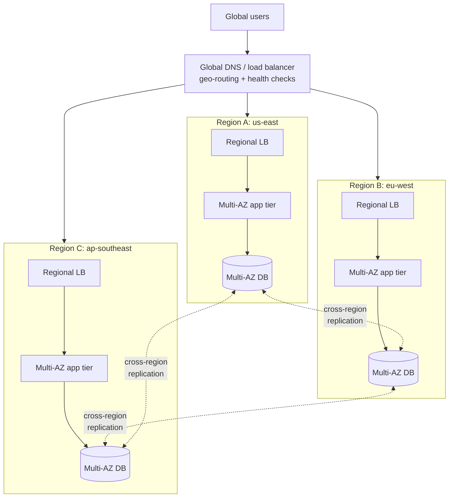

# Multi-Region Active-Active Architecture

A comprehensive guide to building globally distributed active-active systems across AWS, Azure, and Google Cloud Platform.

---

## Table of Contents

1. [Architecture Overview](#architecture-overview)
2. [Architecture Diagram Description](#architecture-diagram-description)
3. [Component Breakdown](#component-breakdown)
4. [AWS Implementation](#aws-implementation)
5. [Azure Implementation](#azure-implementation)
6. [GCP Implementation](#gcp-implementation)
7. [Data Replication Strategies](#data-replication-strategies)
8. [Conflict Resolution](#conflict-resolution)
9. [Design Considerations](#design-considerations)
10. [Cost Estimation](#cost-estimation)
11. [Production Checklist](#production-checklist)

---

## Architecture Overview

### What is Active-Active Architecture?

Active-active architecture runs identical workloads in multiple regions simultaneously:
- **All Regions Active**: Every region handles production traffic
- **Global Load Balancing**: Traffic is routed to the nearest or healthiest region
- **Data Replication**: Data is synchronized across regions
- **Fault Tolerance**: If one region fails, others absorb the traffic
- **Low Latency**: Users are served from the closest region
- **High Availability**: No single region is a single point of failure

### Active-Active vs Active-Passive

| Aspect | Active-Active | Active-Passive |
|--------|--------------|----------------|
| **Traffic** | All regions serve traffic | Only primary serves traffic |
| **Failover** | Automatic, near-instant | Requires failover process (minutes) |
| [**Latency**](../../learn/glossary.md#term-latency) | Low (nearest region) | Higher for distant users |
| **Cost** | Higher (full capacity in all regions) | Lower (standby can be scaled down) |
| **Complexity** | High (data sync, conflict resolution) | Moderate (one-way replication) |
| **Data Consistency** | Eventual (typically) | Strong (single primary) |
| **RPO** | Near zero | Depends on replication lag |
| **RTO** | Near zero | Minutes to hours |

### Benefits

- **Global Low Latency**: Users served from the nearest region
- **Maximum Availability**: Survives full region failures
- **Disaster Recovery Built-in**: No separate DR infrastructure needed
- **Scalability**: Distribute load across regions globally
- **Compliance**: Keep data in required geographic regions
- **No Failover Delay**: Traffic automatically reroutes on failure

### Trade-offs

- **Data Consistency**: Eventual consistency is the norm
- **Conflict Resolution**: Concurrent writes to same data must be handled
- **Cost**: Running full infrastructure in multiple regions
- **Complexity**: Cross-region networking, replication, and monitoring
- **Testing**: Must test region failure scenarios regularly
- **Debugging**: Distributed tracing across regions is challenging

### Use Cases

- Global SaaS platforms with worldwide users
- Financial services requiring extreme availability
- E-commerce with global customer base
- Gaming platforms with regional player servers
- IoT platforms processing data from global devices
- Content delivery and media streaming platforms

---

## Architecture Diagram Description

### High-Level Architecture



```
                    [Global DNS / Load Balancer]
                              |
              +---------------+---------------+
              |               |               |
       [Region A]      [Region B]      [Region C]
       [US-East]       [EU-West]       [AP-Southeast]
              |               |               |
       [Load Balancer] [Load Balancer] [Load Balancer]
              |               |               |
       [App Tier]      [App Tier]      [App Tier]
              |               |               |
       [Database]      [Database]      [Database]
              |               |               |
              +-------<Replication>--------+
```

### Traffic Flow

1. User makes a request to the global DNS endpoint
2. DNS or global load balancer routes to the nearest healthy region
3. Regional load balancer distributes traffic across application instances
4. Application reads/writes to the local database replica
5. Database replication propagates changes to other regions
6. Conflict resolution handles concurrent modifications

---

## Component Breakdown

### Global Routing Layer

| Component | Purpose | Key Features |
|-----------|---------|--------------|
| **Global DNS** | Route users to nearest region | Latency-based, geolocation, health checks |
| **Global Load Balancer** | Distribute traffic globally | Anycast, SSL termination, CDN integration |
| **Health Checks** | Detect region failures | Endpoint monitoring, automatic failover |
| [**CDN**](../../learn/glossary.md#term-cdn-content-delivery-network) | Cache static content globally | Edge locations, origin shielding |

### Regional Application Layer

| Component | Purpose | Key Features |
|-----------|---------|--------------|
| **Load Balancer** | Regional traffic distribution | SSL termination, health checks |
| [**Compute**](../../learn/glossary.md#term-compute) | Application logic | Auto-scaling, containerized |
| **Cache** | Reduce database load | In-memory, session management |
| **Queue** | Async processing | Decouple components, buffer writes |

### Data Layer

| Component | Purpose | Key Features |
|-----------|---------|--------------|
| **Global Database** | Multi-region data store | Multi-master replication |
| **Object Storage** | Static assets and backups | Cross-region replication |
| **Cache Cluster** | Session and data caching | Regional cache with invalidation |
| **Message Queue** | Cross-region events | Event replication |

---

## AWS Implementation

### Core Services

| Component | AWS Service | Purpose |
|-----------|------------|---------|
| **Global DNS** | Amazon Route 53 | Latency-based routing, health checks |
| **Global Accelerator** | AWS Global Accelerator | Anycast IP, intelligent routing |
| **CDN** | Amazon CloudFront | Global edge caching |
| **Compute** | ECS/EKS/Lambda | Regional application compute |
| **Global Database** | DynamoDB Global Tables | Multi-region, multi-master |
| [**Relational DB**](../../learn/glossary.md#term-relational-db) | Aurora Global Database | Multi-region read/write |
| **Cache** | ElastiCache Global Datastore | Cross-region Redis replication |
| **Object Storage** | S3 Cross-Region Replication | Multi-region object storage |
| **Messaging** | Amazon EventBridge Global Endpoints | Cross-region event routing |

### DynamoDB Global Tables

- Multi-region, multi-master replication
- Automatic conflict resolution (last writer wins)
- Sub-second replication latency
- No application changes required for multi-region
- Strongly consistent reads available within a region

### Aurora Global Database

- One primary region for writes, up to 5 read-only secondary regions
- Sub-second replication lag (typically < 1 second)
- Managed planned failover and unplanned failover
- Write forwarding from secondary regions to primary
- Headless mode for disaster recovery

**Documentation:**
- [Route 53](https://docs.aws.amazon.com/Route53/latest/DeveloperGuide/Welcome.html)
- [DynamoDB Global Tables](https://docs.aws.amazon.com/amazondynamodb/latest/developerguide/GlobalTables.html)
- [Aurora Global Database](https://docs.aws.amazon.com/AmazonRDS/latest/AuroraUserGuide/aurora-global-database.html)
- [Global Accelerator](https://docs.aws.amazon.com/global-accelerator/latest/dg/what-is-global-accelerator.html)

---

## Azure Implementation

### Core Services

| Component | Azure Service | Purpose |
|-----------|--------------|---------|
| **Global DNS** | Azure Traffic Manager | DNS-based global routing |
| **Global LB** | Azure Front Door | Global HTTP load balancing, CDN |
| **CDN** | Azure CDN / Front Door | Global edge caching |
| **Compute** | AKS / App Service / Functions | Regional application compute |
| **Global Database** | Azure Cosmos DB | Multi-region, multi-master |
| **Relational DB** | Azure SQL Geo-Replication | Multi-region read replicas |
| **Cache** | Azure Cache for Redis (Geo-Replication) | Cross-region cache |
| **Object Storage** | Azure Blob GRS/GZRS | Geo-redundant storage |
| **Messaging** | Azure Service Bus Geo-DR | Cross-region messaging |

### Cosmos DB Multi-Region

- Multi-region writes (multi-master)
- Five consistency levels (strong to eventual)
- Automatic and manual failover
- Conflict resolution policies (last write wins, custom)
- Sub-10ms read and write latency at p99
- Guaranteed 99.999% availability with multi-region writes

### Azure Front Door

- Global HTTP load balancing with anycast
- Built-in CDN and WAF
- Session affinity and health probes
- Priority and weighted routing methods
- Automatic failover between backends

**Documentation:**
- [Azure Traffic Manager](https://learn.microsoft.com/en-us/azure/traffic-manager/traffic-manager-overview)
- [Azure Cosmos DB](https://learn.microsoft.com/en-us/azure/cosmos-db/introduction)
- [Azure Front Door](https://learn.microsoft.com/en-us/azure/frontdoor/front-door-overview)
- [Azure SQL Geo-Replication](https://learn.microsoft.com/en-us/azure/azure-sql/database/active-geo-replication-overview)

---

## GCP Implementation

### Core Services

| Component | GCP Service | Purpose |
|-----------|------------|---------|
| **Global DNS** | Cloud DNS | Managed DNS with routing policies |
| **Global LB** | Cloud Load Balancing (External) | Global anycast load balancing |
| **CDN** | Cloud CDN | Global edge caching |
| **Compute** | GKE / Cloud Run / Cloud Functions | Regional compute |
| **Global Database** | Cloud Spanner | Globally consistent, multi-region |
| [**NoSQL**](../../learn/glossary.md#term-nosql) | Firestore Multi-Region | Multi-region document database |
| **Cache** | Memorystore for Redis | Regional caching |
| **Object Storage** | Cloud Storage (Multi-Region) | Multi-region object storage |
| **Messaging** | Pub/Sub (Global) | Global messaging service |

### Cloud Spanner

- Globally distributed with strong consistency (external consistency)
- Multi-region configurations (nam-eur, nam-asia, eur-asia)
- Automatic sharding and rebalancing
- 99.999% availability SLA for multi-region
- SQL interface with horizontal scaling
- No conflict resolution needed (strong consistency via TrueTime)

### GCP Global Load Balancing

- Single anycast IP address for global traffic
- Automatic routing to nearest healthy backend
- Built-in DDoS protection
- Integration with Cloud CDN and Cloud Armor
- Cross-region failover in seconds

**Documentation:**
- [Cloud Spanner](https://docs.cloud.google.com/spanner/docs)
- [Cloud Load Balancing](https://cloud.google.com/load-balancing/docs/load-balancing-overview)
- [Cloud DNS](https://cloud.google.com/dns/docs/overview)
- [Cloud CDN](https://cloud.google.com/cdn/docs/overview)

---

## Data Replication Strategies

### Synchronous vs Asynchronous

| Aspect | Synchronous | Asynchronous |
|--------|------------|--------------|
| **Consistency** | Strong | Eventual |
| **Latency** | Higher (cross-region round trip) | Lower (local write only) |
| **Availability** | Lower (depends on remote region) | Higher (local write succeeds) |
| **Data Loss Risk** | None | Possible (replication lag) |
| **Use Case** | Financial transactions | User profiles, content |
| **Example** | Cloud Spanner | DynamoDB Global Tables |

### Replication Patterns

1. **Multi-Master**: All regions accept writes, conflicts resolved automatically
2. **Single-Primary**: One region for writes, others for reads with forwarding
3. **Conflict-Free Replicated Data Types (CRDTs)**: Data structures that merge without conflicts
4. **Event Sourcing**: Replicate events, rebuild state locally

### Cross-Region Database Options

| Database | Type | Replication | Consistency | Conflict Resolution |
|----------|------|-------------|-------------|-------------------|
| DynamoDB Global Tables | NoSQL | Async | Eventual | Last writer wins |
| Aurora Global Database | Relational | Async | Eventual (cross-region) | Single primary |
| Cosmos DB | Multi-model | Configurable | 5 levels | Configurable |
| Cloud Spanner | Relational | Sync (TrueTime) | Strong | Not needed |
| CockroachDB | Relational | Sync (Raft) | Strong | Not needed |

---

## Conflict Resolution

### Strategies

| Strategy | Description | Pros | Cons |
|----------|-------------|------|------|
| **Last Writer Wins** | Most recent timestamp wins | Simple | Data loss possible |
| **Application-Level** | Application logic resolves | Flexible | Complex to implement |
| **CRDTs** | Mathematically guaranteed merge | No conflicts | Limited data structures |
| **Strong Consistency** | Prevent conflicts via consensus | No conflicts | Higher latency |
| **Version Vectors** | Track causality of updates | Accurate conflict detection | Complex |

### Best Practices

- **Design for idempotency**: Ensure operations can be safely retried
- **Use unique IDs**: Generate globally unique identifiers (UUIDs, ULIDs)
- **Partition by region**: Assign data ownership to regions where possible
- **Event sourcing**: Record all changes as immutable events
- **Compensating transactions**: Handle conflicts with corrective operations

---

## Design Considerations

### Network Architecture

- **Inter-region connectivity**: Use cloud provider backbone (not public internet)
- **DNS TTL**: Set low TTLs (60s) for faster failover
- **Health checks**: Multi-layer health checks (TCP, HTTP, application-level)
- **Session handling**: Use regional sticky sessions or shared session stores

### Deployment Strategy

- **Infrastructure as Code**: Same templates deployed across all regions
- **Blue-green per region**: Update one region at a time
- **Feature flags**: Control feature rollout per region
- **Canary deployment**: Test changes in one region before global rollout

### Testing

- **Chaos engineering**: Regularly simulate region failures
- **Failover drills**: Test failover procedures quarterly
- **Latency testing**: Validate cross-region replication lag
- **Load testing**: Test each region can handle full global traffic

---

## Cost Estimation

### AWS (Monthly Estimate - 3 Regions)

| Component | Service | Estimated Cost |
|-----------|---------|---------------|
| DNS | Route 53 (health checks + queries) | ~$50-100/month |
| Global Accelerator | 2 accelerators | ~$50/month + data transfer |
| CDN | CloudFront (1 TB) | ~$85/month |
| Compute | ECS Fargate (per region x3) | ~$900/month |
| Database | DynamoDB Global Tables (3 regions) | ~$600-1,200/month |
| Cache | ElastiCache (per region x3) | ~$300/month |
| Data Transfer | Cross-region | ~$200-500/month |
| **Total** | | **~$2,185-3,135/month** |

### Azure (Monthly Estimate - 3 Regions)

| Component | Service | Estimated Cost |
|-----------|---------|---------------|
| Global LB | Azure Front Door | ~$100-300/month |
| Compute | AKS (per region x3) | ~$900/month |
| Database | Cosmos DB (3 regions, multi-write) | ~$800-1,500/month |
| Cache | Redis Cache (per region x3) | ~$300/month |
| Storage | Blob GZRS | ~$50/month |
| Data Transfer | Cross-region | ~$200-500/month |
| **Total** | | **~$2,350-3,550/month** |

### GCP (Monthly Estimate - 3 Regions)

| Component | Service | Estimated Cost |
|-----------|---------|---------------|
| Global LB | External HTTP(S) Load Balancer | ~$50-100/month |
| CDN | Cloud CDN (1 TB) | ~$80/month |
| Compute | Cloud Run (per region x3) | ~$600/month |
| Database | Cloud Spanner (multi-region) | ~$1,500-2,500/month |
| Cache | Memorystore (per region x3) | ~$300/month |
| Data Transfer | Cross-region | ~$150-400/month |
| **Total** | | **~$2,680-3,980/month** |

---

## Production Checklist

### Global Routing

- [ ] Global DNS or load balancer configured with health checks
- [ ] Latency-based or geolocation routing enabled
- [ ] DNS TTLs set appropriately for failover speed
- [ ] CDN configured for static content
- [ ] SSL/TLS certificates deployed in all regions

### Application Layer

- [ ] Application deployed in all target regions
- [ ] Auto-scaling configured per region
- [ ] Session management strategy implemented (stateless or distributed)
- [ ] Feature flags for per-region control
- [ ] Same deployment artifacts used across all regions

### Data Layer

- [ ] Multi-region database deployed and replicating
- [ ] Conflict resolution strategy implemented and tested
- [ ] Cross-region replication lag monitored
- [ ] Object storage replication configured
- [ ] Cache strategy defined (local vs distributed)
- [ ] Data residency requirements met

### Resilience Testing

- [ ] Region failover tested and documented
- [ ] Failover time measured and meets RTO target
- [ ] Data loss during failover measured and meets RPO target
- [ ] Chaos engineering experiments scheduled
- [ ] Load testing confirms single region can handle full traffic
- [ ] Runbooks for region failure scenarios created

### Monitoring

- [ ] Cross-region monitoring dashboard deployed
- [ ] Replication lag alerting configured
- [ ] Regional health check alerting active
- [ ] Distributed tracing across regions operational
- [ ] Cost monitoring per region configured
- [ ] Regular failover drill schedule established

---

**Related Guides:**
- [Disaster Recovery Patterns](./disaster-recovery-patterns.md)
- [Service Comparison - Networking](../service-comparison-networking.md)
- [Service Comparison - Databases](../service-comparison-databases.md)
