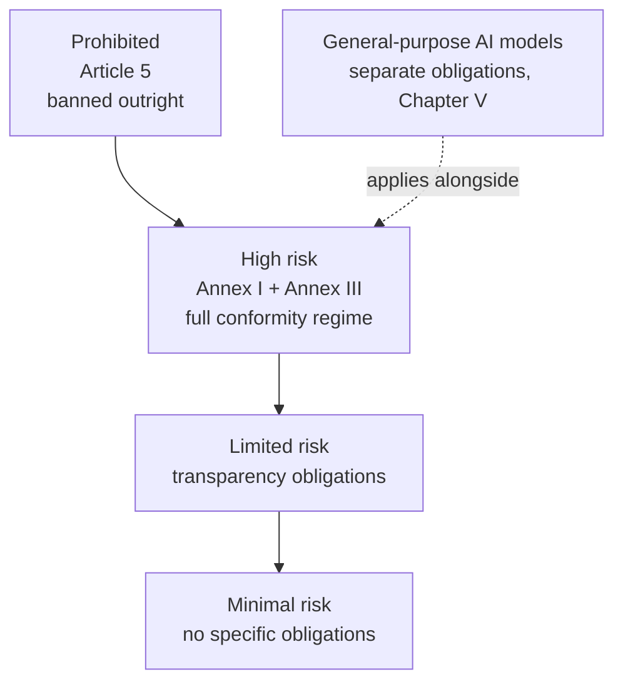

# Compliance Guide - EU AI Act

## Overview

The EU Artificial Intelligence Act (Regulation (EU) 2024/1689) is the first comprehensive horizontal law regulating AI. It entered into force on 1 August 2024 and applies in phases through 2027.

It is a **product safety regulation**, not a data protection law. That distinction matters: obligations attach to the AI system and to the role you play in its lifecycle, and they apply extraterritorially. If your AI system is placed on the EU market, or its output is used in the EU, the Act reaches you regardless of where you are established.

Penalties are tiered, with the highest band for prohibited practices reaching the greater of EUR 35 million or 7% of worldwide annual turnover.

> **This is not legal advice.** Timelines, guidance, and harmonized standards are still being published. Verify current obligations against the official text and your counsel before making compliance decisions.

**[📖 Regulation (EU) 2024/1689 (official text)](https://eur-lex.europa.eu/eli/reg/2024/1689/oj)** - the Act as published in the Official Journal
**[📖 European Commission AI Act page](https://digital-strategy.ec.europa.eu/en/policies/regulatory-framework-ai)** - official guidance, FAQs, and implementing acts
**[📖 EU AI Act Explorer](https://artificialintelligenceact.eu/)** - browsable article-by-article reference

---

## The risk pyramid

Classification drives everything. Most compliance effort goes into establishing, and documenting, which tier a system falls into.

### Prohibited practices (Article 5)

Banned since 2 February 2025. Includes subliminal or manipulative techniques causing significant harm, exploitation of vulnerabilities due to age or disability, social scoring by public authorities, untargeted scraping of facial images to build recognition databases, emotion inference in workplaces and education (with narrow exceptions), biometric categorization to infer protected characteristics, and most real-time remote biometric identification in publicly accessible spaces for law enforcement.

### High-risk systems

Two routes into the tier:

- **Annex I** - AI used as a safety component of a product already covered by EU harmonization legislation (machinery, medical devices, vehicles, lifts, toys).
- **Annex III** - listed use cases: biometrics, critical infrastructure, education and vocational training, employment and worker management, access to essential public and private services (including credit scoring and insurance pricing), law enforcement, migration and border control, and administration of justice.

There is a filter in Article 6(3): an Annex III system may not be high risk if it performs only a narrow procedural task, improves the result of a previously completed human activity, detects decision patterns without replacing human assessment, or performs preparatory work. Profiling of natural persons is always high risk. If you rely on this filter, you must document the assessment and register the system.

### Limited risk (transparency)

Article 50 obligations. Disclose to people that they are interacting with an AI system unless it is obvious. Mark synthetic audio, image, video, and text as artificially generated in a machine-readable way. Disclose deep fakes and, for text published to inform the public on matters of public interest, disclose AI generation unless there was human editorial review.

### Minimal risk

Everything else: spam filters, recommendation engines, most productivity tooling, most internal assistants. No specific obligations, though voluntary codes of conduct are encouraged and other law (GDPR, sectoral rules) still applies.

---

## Who you are determines what you owe

| Role | Definition | Core obligations |
|---|---|---|
| **Provider** | Develops an AI system or has one developed and places it on the market under its own name | The full high-risk regime: risk management, data governance, technical documentation, logging, transparency, human oversight, accuracy and robustness, quality management system, conformity assessment, CE marking, registration, post-market monitoring, incident reporting |
| **Deployer** | Uses an AI system under its own authority (in a professional capacity) | Use per instructions, ensure human oversight competence, ensure input data relevance, monitor operation, retain logs, inform affected workers, carry out a fundamental rights impact assessment where required, cooperate with authorities |
| **Importer / Distributor** | Places or makes available a third-country or third-party system on the EU market | Verify the provider's conformity, documentation, and marking; do not place non-conforming systems |
| **Product manufacturer** | Integrates AI into their own product | Assumes provider obligations for the combined product |

**The trap most enterprises hit:** a deployer becomes a provider if it puts its own name or trademark on a high-risk system, substantially modifies one, or changes the intended purpose of a system so that it becomes high risk. Fine-tuning a general-purpose model and shipping it in a hiring product is a fast route from "we just use a vendor's AI" to full provider obligations.

---

## High-risk requirements in practice

| Article | Requirement | What it means for an engineering team |
|---|---|---|
| 9 | Risk management system | A continuous, documented process across the lifecycle. Not a one-time assessment |
| 10 | Data and data governance | Training, validation, and test sets are relevant, representative, and as error-free as possible; examine for bias; document provenance |
| 11 + Annex IV | Technical documentation | System description, design choices, architecture, training methodology, datasets, metrics, limitations. Your [AI-BOM](../ai-security/model-supply-chain.md#ai-bill-of-materials-ai-bom) feeds this directly |
| 12 | Logging | Automatic recording of events over the system's lifetime, sufficient for traceability. Retain per Article 19 |
| 13 | Transparency to deployers | Instructions for use covering capabilities, limitations, accuracy, and known risks |
| 14 | Human oversight | Designed so a person can understand, monitor, intervene, and stop. For certain biometric systems, verification by two people |
| 15 | Accuracy, robustness, cybersecurity | Declared accuracy metrics, resilience to errors and adversarial manipulation, including data poisoning and model evasion |
| 17 | Quality management system | Documented organizational process covering all of the above |
| 43 | Conformity assessment | Mostly internal control; third-party notified body for certain biometric systems |
| 49 | Registration | In the EU database before placing on the market |
| 72 | Post-market monitoring | Active, documented, with a plan |
| 73 | Serious incident reporting | To the market surveillance authority, with deadlines as short as 2 days for widespread infringement |

Article 15's cybersecurity clause is where the [AI security](../ai-security/) material becomes a legal obligation rather than a good practice: resistance to data poisoning, model poisoning, adversarial examples, and confidentiality attacks is explicitly named.

---

## General-purpose AI models

Chapter V applies to providers of GPAI models (foundation models), separately from the risk tiers.

**All GPAI providers must:**
- Maintain technical documentation of the model, its training and testing.
- Provide information to downstream providers who integrate the model.
- Have a policy to comply with EU copyright law, including respecting text and data mining reservations.
- Publish a sufficiently detailed public summary of training data content.

**Models with systemic risk** (presumed above a compute threshold, or designated by the Commission) add: model evaluation including adversarial testing, systemic risk assessment and mitigation, serious incident tracking and reporting, and cybersecurity protection of the model and physical infrastructure.

Open-source models released under a free and open license get partial exemptions from some obligations, but not for models with systemic risk, and not from the copyright policy and training-data summary.

Most organizations reading this are **downstream deployers of GPAI**, not providers. Your practical task is obtaining and retaining the provider's documentation, since your own compliance depends on it.

---

## Timeline

| Date | What applies |
|---|---|
| 1 Aug 2024 | Entry into force |
| 2 Feb 2025 | Prohibited practices; AI literacy obligations for providers and deployers |
| 2 Aug 2025 | GPAI model obligations; governance structure; penalties (except GPAI fines) |
| 2 Aug 2026 | General application, including Annex III high-risk obligations and Article 50 transparency |
| 2 Aug 2027 | Annex I high-risk (AI as a safety component of regulated products); GPAI models placed on the market before Aug 2025 must be brought into compliance |

Confirm current dates against the Commission's page. Implementation timing has been subject to proposals for adjustment, and guidance continues to be issued.

---

## Cloud provider support

No provider makes you compliant. They supply evidence and controls you assemble into a compliance case.

| Need | AWS | Azure | GCP |
|---|---|---|---|
| Model and data lineage | SageMaker Model Registry, Model Cards, SageMaker Lineage | Azure ML registry, Microsoft Purview | Vertex AI Model Registry, Dataplex lineage |
| Bias and quality evaluation | SageMaker Clarify | Responsible AI dashboard, AI Foundry evaluations | Vertex AI Model Evaluation |
| Logging and traceability | CloudTrail, CloudWatch, SageMaker experiments | Azure Monitor, Application Insights | Cloud Logging, Cloud Audit Logs |
| Content and safety controls | Bedrock Guardrails | AI Content Safety, Prompt Shields | Model Armor, Vertex safety filters |
| Documentation artifacts | AWS AI Service Cards | Transparency Notes | Model Cards |
| Data residency | EU regions, EU Sovereign Cloud | EU Data Boundary | EU regions, Sovereign Controls |

---

## Practical program

1. **Inventory.** Every AI system, in-house and vendor, with purpose, users, data, and geography. You cannot classify what you have not listed.
2. **Classify.** Per system: prohibited, high risk, limited risk, minimal. Document the reasoning, including any Article 6(3) filter you rely on.
3. **Assign roles.** Provider or deployer, per system. Flag anything where fine-tuning, rebranding, or repurposing might convert you into a provider.
4. **Gap assessment.** For high-risk systems, map current state against Articles 9 to 15.
5. **Build the documentation spine.** Annex IV technical documentation, instructions for use, logging design, and the human oversight model.
6. **Stand up governance.** Risk management and quality management processes with named owners. [ISO/IEC 42001](./iso-42001.md) is the natural scaffolding, and [NIST AI RMF](./nist-ai-rmf.md) maps onto it well.
7. **AI literacy.** Article 4 requires staff dealing with AI systems to have sufficient understanding. Training with a record of completion.
8. **Operate.** Post-market monitoring, incident reporting path, periodic re-assessment, and re-classification whenever purpose changes.

---

## How it interacts with other obligations

- **GDPR** applies in full and independently. A lawful basis, a DPIA where required, and data subject rights are separate obligations from the AI Act. See [GDPR](./gdpr.md).
- **NIS2 and DORA** may impose overlapping incident reporting for critical entities and financial services.
- **ISO/IEC 42001** certification is not conformity with the Act, but a certified AI management system covers much of Articles 9 and 17. See [ISO/IEC 42001](./iso-42001.md).
- **Harmonized standards** under development will give a presumption of conformity once cited in the Official Journal. Track them, because building against a standard is cheaper than building against a legal text.

---

## Documentation links

**[📖 Regulation (EU) 2024/1689](https://eur-lex.europa.eu/eli/reg/2024/1689/oj)** - full official text with annexes
**[📖 European Commission: regulatory framework for AI](https://digital-strategy.ec.europa.eu/en/policies/regulatory-framework-ai)** - guidance, implementing acts, and the GPAI code of practice
**[📖 EU AI Act Explorer](https://artificialintelligenceact.eu/)** - article browser and compliance checker
**[📖 AWS EU AI Act guidance](https://aws.amazon.com/compliance/eu-ai-act/)** - shared responsibility view
**[📖 Microsoft EU AI Act resources](https://www.microsoft.com/en-us/ai/responsible-ai)** - responsible AI standard and transparency notes
**[📖 Google Cloud responsible AI](https://cloud.google.com/responsible-ai)** - model cards and governance tooling
