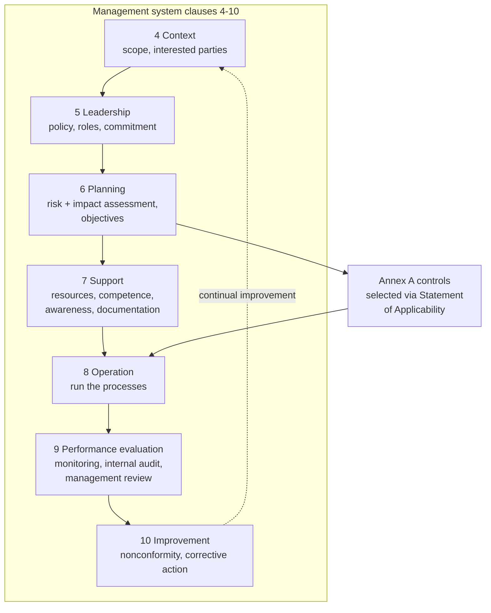

# Compliance Guide - ISO/IEC 42001

## Overview

ISO/IEC 42001:2023 is the international standard for an **AI Management System (AIMS)**. Published in December 2023, it is the first certifiable AI governance standard, which is what distinguishes it from frameworks like NIST AI RMF: an accredited body can audit you and issue a certificate that a customer or regulator can read.

If you already hold ISO/IEC 27001, the shape will be familiar. 42001 uses the same Harmonized Structure (clauses 4 to 10), the same Annex A control-set pattern, and the same plan-do-check-act rhythm. Organizations with a working ISMS typically extend it rather than building a parallel system.

**[📖 ISO/IEC 42001:2023](https://www.iso.org/standard/42001)** - the standard (purchase required)
**[📖 ISO/IEC 23894:2023](https://www.iso.org/standard/77304.html)** - AI risk management guidance, the companion to 42001
**[📖 ISO/IEC 22989:2022](https://www.iso.org/standard/74296.html)** - AI concepts and terminology

---

## Structure

The management system clauses are mandatory. Annex A controls are selected based on your risk assessment and justified in a Statement of Applicability, which is the document auditors spend the most time on.

### Clause by clause, in practice

| Clause | What an auditor wants to see |
|---|---|
| **4 Context** | Defined AIMS scope, list of interested parties (users, affected persons, regulators, customers), and the internal and external issues relevant to your AI |
| **5 Leadership** | A signed AI policy, an accountable senior owner, defined roles and authorities, evidence leadership actually reviews AI risk |
| **6 Planning** | An AI risk assessment method and its results, an **AI system impact assessment** covering effects on individuals and society, measurable AI objectives, and the Statement of Applicability |
| **7 Support** | Competence records and training, awareness activity, documented information under version control |
| **8 Operation** | The lifecycle actually operating: requirements, design, data handling, verification, deployment, and monitoring processes, with records |
| **9 Performance evaluation** | Monitoring and measurement results, an internal audit program, and minuted management reviews |
| **10 Improvement** | Nonconformities logged, root causes analyzed, corrective actions closed |

The **AI system impact assessment** in clause 6 is the requirement with no direct 27001 equivalent. It asks about consequences for individuals and groups, not just for the organization, which is a genuinely different lens for a security team to adopt.

---

## Annex A control themes

Annex A groups roughly 38 controls across nine themes. The exact clause numbering should be read from the standard itself; what follows is the shape of what is covered.

| Theme | Representative controls |
|---|---|
| **Policies for AI** | AI policy exists, is aligned with other policies, and is reviewed |
| **Internal organization** | Roles, responsibilities, and reporting of concerns |
| **Resources for AI systems** | Documented data, tooling, compute, and human resources the system depends on |
| **Impact assessment** | Process for assessing impacts on individuals and society, and using the results |
| **AI system lifecycle** | Objectives, responsible design, verification and validation, deployment, operation and monitoring, documentation, event logging |
| **Data for AI systems** | Data governance, acquisition, quality, provenance, and preparation |
| **Information for interested parties** | Documentation for users, incident reporting channels, and information about the system's purpose and limits |
| **Use of AI systems** | Responsible use, and objectives for the systems you deploy but do not build |
| **Third-party relationships** | Allocating responsibility across suppliers, customers, and partners |

The data and lifecycle themes map almost one-to-one onto engineering practice you may already have: dataset versioning, model registries, eval gates, audit logging, and the [AI-BOM](../ai-security/model-supply-chain.md#ai-bill-of-materials-ai-bom).

---

## Roles the standard recognizes

42001 expects you to state which roles you occupy, because obligations differ.

- **AI provider** - develops or supplies AI systems or platforms.
- **AI producer** - designs, develops, tests, and deploys.
- **AI customer / user** - uses AI systems, including systems built by others.
- **AI partner** - supports the lifecycle, for example data providers or evaluators.
- **AI subject** - the individual affected by the system's output.
- **Relevant authority** - regulators and oversight bodies.

Most organizations are simultaneously a customer of foundation models and a producer of the applications built on them. Say so explicitly in the scope; ambiguity here creates findings.

---

## Getting certified

**Typical timeline: 6 to 12 months from a standing start, 3 to 6 months if you already hold 27001.**

1. **Scope.** Which entities, locations, and AI systems are in scope. A narrow first scope that you can defend beats a broad one you cannot evidence.
2. **Gap analysis.** Current state against clauses 4 to 10 and Annex A.
3. **Build the AIMS.** Policy, roles, risk method, impact assessment method, lifecycle procedures, documentation control.
4. **Operate it.** Auditors need records, and records need elapsed time. Run the system for at least a few months before Stage 2.
5. **Internal audit and management review.** Both are mandatory inputs to certification, and both are commonly the reason a first attempt is deferred.
6. **Stage 1 audit.** Documentation review, readiness check.
7. **Stage 2 audit.** Implementation and effectiveness. Nonconformities are raised, then closed.
8. **Certificate**, valid three years, with annual surveillance audits and recertification at year three.

Choose an accredited certification body. An unaccredited certificate is worth little in enterprise procurement, which is usually the reason to certify in the first place.

---

## How it maps to everything else

| Framework | Relationship |
|---|---|
| **[ISO/IEC 27001](./soc2.md)** | Shared structure. Extend the ISMS: reuse document control, internal audit, management review, and supplier processes. Add AI-specific risk, impact assessment, and lifecycle controls |
| **[NIST AI RMF](./nist-ai-rmf.md)** | Complementary. AI RMF is the risk method; 42001 is the management system it runs inside. Govern maps to clauses 5 and 6; Map and Measure map to clause 8 and 9; Manage maps to clauses 8 and 10 |
| **[EU AI Act](./eu-ai-act.md)** | 42001 certification is not conformity with the Act, but the AIMS satisfies much of Article 17's quality management system requirement and produces evidence for Articles 9, 10, and 11 |
| **[SOC 2](./soc2.md)** | Different mechanism (attestation report vs certificate) and different scope. Enterprise buyers increasingly ask for SOC 2 plus 42001 |
| **[GDPR](./gdpr.md)** | The AI impact assessment and a DPIA overlap but are not the same. Run them together, keep them as distinct records |

---

## Is it worth it?

**Certify if:** you sell AI capability to enterprises or the public sector, you face EU AI Act exposure and want a defensible governance spine, you already hold 27001 so the marginal cost is moderate, or procurement questionnaires are already asking.

**Do not certify yet if:** your AI use is internal and low-risk, you have no AI inventory (fix that first), or you would be building the management system purely for the certificate. An AIMS that exists only for the audit generates findings at surveillance and costs more than it returns.

A reasonable middle path: build against 42001's structure, run [NIST AI RMF](./nist-ai-rmf.md) as the risk method, and defer certification until a customer asks. You get the governance benefit immediately and the certificate when it has commercial value.

---

## Documentation links

**[📖 ISO/IEC 42001:2023](https://www.iso.org/standard/42001)** - AI management system requirements
**[📖 ISO/IEC 23894:2023](https://www.iso.org/standard/77304.html)** - guidance on AI risk management
**[📖 ISO/IEC 22989:2022](https://www.iso.org/standard/74296.html)** - AI concepts and terminology
**[📖 ISO/IEC 27001:2022](https://www.iso.org/standard/27001)** - information security management, the sibling standard
**[📖 AWS ISO/IEC 42001 certification](https://aws.amazon.com/compliance/iso-42001-faqs/)** - provider certification scope and shared responsibility
**[📖 Microsoft compliance offerings](https://learn.microsoft.com/en-us/compliance/regulatory/offering-home)** - certification scope per service
**[📖 Google Cloud compliance resource center](https://cloud.google.com/security/compliance)** - certifications and audit reports
