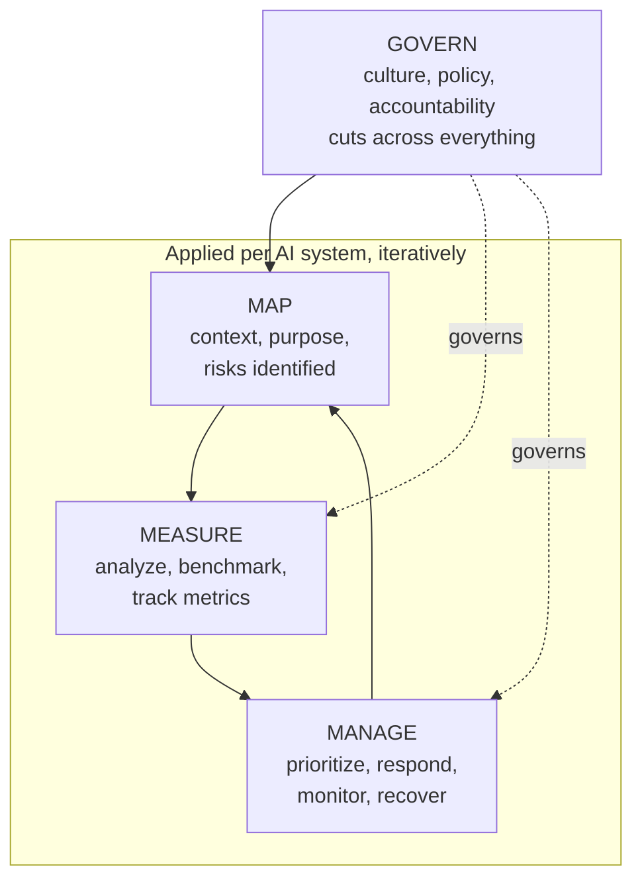

# Compliance Guide - NIST AI Risk Management Framework

## Overview

The NIST AI Risk Management Framework (AI RMF 1.0, released January 2023) is a voluntary, sector-agnostic framework for managing risks in the design, development, deployment, and use of AI systems. It is the US counterpart to the EU's regulatory approach: nobody fines you for ignoring it, but it has become the default vocabulary for AI governance in US enterprise procurement, and federal agency guidance increasingly references it.

Its practical value is that it is **implementable**. It gives you four functions, a set of trustworthiness characteristics to measure against, and a companion playbook of concrete actions, without prescribing a specific technology or control set.

**[📖 NIST AI Risk Management Framework](https://www.nist.gov/itl/ai-risk-management-framework)** - the framework hub, playbook, and companion resources
**[📖 AI RMF 1.0 (NIST AI 100-1)](https://nvlpubs.nist.gov/nistpubs/ai/NIST.AI.100-1.pdf)** - the framework document
**[📖 Generative AI Profile (NIST AI 600-1)](https://www.nist.gov/publications/artificial-intelligence-risk-management-framework-generative-artificial-intelligence)** - GenAI-specific risks and suggested actions

---

## The four functions

Govern is continuous and organizational. Map, Measure, and Manage repeat per system and per material change.

### Govern

The organizational layer: policies, roles, accountability, culture, and workforce competence.

Typical evidence: an AI policy, an AI use inventory, a named accountable owner per system, a review board or approval gate, third-party and supply chain requirements, incident response procedures that cover AI failure modes, and documented staff training.

If you only do one thing from AI RMF, do the inventory. Almost every governance gap traces back to an organization not knowing which AI systems it operates.

### Map

Establish context and identify risks before building. What is the system for, who is affected, what does success mean, what happens when it fails, and what are the alternatives to building it at all.

Typical evidence: intended purpose and out-of-scope uses, affected stakeholder analysis, data provenance and lineage, documented assumptions and limitations, third-party component inventory, and a recorded decision that AI is an appropriate solution.

### Measure

Quantify. Test, evaluate, verify, and validate against the trustworthiness characteristics, then keep measuring in production.

Typical evidence: an eval suite with baselines, fairness and bias metrics across relevant subgroups, robustness and adversarial testing results, explainability assessments, human factors testing, drift monitoring, and a documented method for what is measured, how often, and by whom.

This is where the framework meets engineering practice most directly. See [Evals for LLMs](../../learn/concepts/evals-for-llms.md) and [LLM red teaming](../ai-security/llm-red-teaming.md).

### Manage

Act on what you measured: prioritize risks, allocate resources, apply treatments, monitor, and plan for recovery and decommissioning.

Typical evidence: a risk register with treatment decisions and residual risk sign-off, deployment gates tied to measured thresholds, monitoring and alerting, an incident response runbook covering model failures, a rollback and model version pinning strategy, and a decommissioning plan.

---

## Trustworthiness characteristics

The framework defines what "trustworthy" means, so that Measure has targets.

| Characteristic | Question it answers | How you evidence it |
|---|---|---|
| **Valid and reliable** | Does it work, consistently, for the intended purpose? | Accuracy metrics on representative holdout data, reliability under load, drift monitoring |
| **Safe** | Can it cause physical, psychological, or financial harm? | Hazard analysis, fail-safe design, human oversight, harmful-content evaluation |
| **Secure and resilient** | Can it be attacked or degraded? | Adversarial testing, [supply chain controls](../ai-security/model-supply-chain.md), access control, red teaming |
| **Accountable and transparent** | Can you say who is responsible and what the system did? | Named owners, model cards, audit logs, decision traceability |
| **Explainable and interpretable** | Can you explain an output to an affected person? | Feature attribution, citation-grounded answers, documented model behavior |
| **Privacy-enhanced** | Is personal data protected? | Minimization, redaction before indexing, retention limits, PETs where appropriate |
| **Fair, with harmful bias managed** | Does it perform equitably across groups? | Subgroup performance metrics, bias testing, documented mitigations and trade-offs |

These trade off against one another. Explainability may cost accuracy; privacy techniques may cost utility. The framework expects you to document the trade-off rather than pretend it does not exist.

---

## The Generative AI Profile

NIST AI 600-1 is a companion that applies the four functions to generative AI specifically. It identifies risks that are unique to or amplified by GenAI, including confabulation (hallucination), dangerous or violent content, data privacy leakage, environmental impact, harmful bias, human-AI configuration problems, information integrity, information security, intellectual property, obscene content, and value chain integration risk.

For each, it proposes suggested actions mapped to Govern, Map, Measure, and Manage. In practice this is the most directly usable NIST artifact for a team building on foundation models, because it names the failure modes engineers actually encounter.

Companion resources worth knowing: the **AI RMF Playbook** (concrete suggested actions per subcategory), **NIST AI 100-2** on adversarial machine learning taxonomy, and the **Secure Software Development Practices for Generative AI** community profile.

---

## Implementing it

A realistic sequence for an organization starting from nothing.

**Phase 1 - Govern the basics (weeks 1 to 6)**
1. Build the AI system inventory. Include shadow AI: the team using a chat product with company data is in scope.
2. Write a one-page AI policy: what requires review, what is prohibited, who approves.
3. Name an accountable owner per system.
4. Define risk tiers using your own criteria, and align them with [EU AI Act](./eu-ai-act.md) classification if you have EU exposure. One classification exercise, two outputs.

**Phase 2 - Map and Measure the highest-tier systems (weeks 6 to 16)**
5. For each high-tier system: document purpose, stakeholders, data provenance, limitations, and out-of-scope uses.
6. Stand up an eval suite with baselines. Include safety and injection tests, not just accuracy.
7. Run bias and robustness testing; record results and the subgroups examined.

**Phase 3 - Manage and operationalize (ongoing)**
8. Risk register with treatments and residual risk acceptance signed by the accountable owner.
9. Deploy gates: no release if the safety suite regresses.
10. Production monitoring for drift, cost, refusal rate, and incident signals.
11. Incident runbook and a decommissioning plan.
12. Annual review, and re-assessment whenever purpose, model, or data changes materially.

---

## Cloud provider mapping

| RMF function | AWS | Azure | GCP |
|---|---|---|---|
| Govern | AWS Audit Manager, Organizations SCPs, Service Catalog | Azure Policy, Purview Compliance Manager | Organization Policy, Assured Workloads |
| Map | SageMaker Model Cards, Lineage Tracking, AI Service Cards | Azure ML datasets and lineage, Transparency Notes | Vertex Model Registry, Dataplex, Model Cards |
| Measure | SageMaker Clarify, Model Monitor, Bedrock evaluations | Responsible AI dashboard, AI Foundry evaluations | Vertex Model Evaluation, Vertex Explainable AI |
| Manage | CloudWatch, Bedrock Guardrails, Security Hub | Azure Monitor, Content Safety, Defender for Cloud | Cloud Monitoring, Model Armor, Security Command Center |

---

## Relationship to other frameworks

| Framework | Relationship |
|---|---|
| **[ISO/IEC 42001](./iso-42001.md)** | 42001 is the certifiable management system; AI RMF is the risk method you can run inside it. They map cleanly and are commonly used together |
| **[EU AI Act](./eu-ai-act.md)** | AI RMF is voluntary and US-origin; the Act is binding law. Running AI RMF produces much of the evidence Articles 9 to 15 require, but is not itself conformity |
| **[SOC 2](./soc2.md)** | SOC 2 covers the service controls around the system. AI-specific risks are largely out of scope, so enterprise buyers increasingly ask for both |
| **NIST CSF 2.0** | Same structural style (Govern plus functions). If you already run CSF, AI RMF will feel familiar and can share governance plumbing |
| **NIST SP 800-53** | Control catalog for the underlying cloud and application controls the AI system inherits |

---

## Documentation links

**[📖 NIST AI RMF hub](https://www.nist.gov/itl/ai-risk-management-framework)** - framework, playbook, crosswalks, and profiles
**[📖 AI RMF 1.0 (AI 100-1)](https://nvlpubs.nist.gov/nistpubs/ai/NIST.AI.100-1.pdf)** - the framework document
**[📖 Generative AI Profile (AI 600-1)](https://www.nist.gov/publications/artificial-intelligence-risk-management-framework-generative-artificial-intelligence)** - GenAI risks and suggested actions
**[📖 Adversarial Machine Learning taxonomy (AI 100-2)](https://csrc.nist.gov/pubs/ai/100/2/e2023/final)** - attack and mitigation taxonomy
**[📖 NIST Trustworthy and Responsible AI Resource Center](https://airc.nist.gov/)** - playbook and crosswalk tooling
