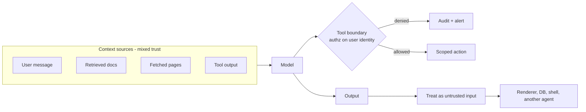

# AI security

Securing systems with a language model in the request path. Classic appsec still applies; what is new is a component that reads untrusted natural language, decides what to do at inference time, and can be talked into doing something else.

The two boxes that carry the weight: the context window, where untrusted text mixes with your instructions, and the tool boundary, the last non-model control that can refuse.

---

## Learn

- [Prompt injection explained](../learn/concepts/prompt-injection-explained.md) - why it exists, why filters do not fix it
- [AI threat modeling](../learn/concepts/ai-threat-modeling.md) - three questions that surface most of the risk
- [Guardrails and safety](../learn/concepts/guardrails-and-safety.md) - the control layer around the model
- [Tool use and function calling](../learn/concepts/tool-use-and-function-calling.md) - the mechanism agents act through
- [Agentic loops](../learn/concepts/agentic-loops.md) - why autonomy multiplies blast radius
- [Evals for LLMs](../learn/concepts/evals-for-llms.md) - measuring safety regressions, not just accuracy

---

## Reference

- [AI security hub](../resources/ai-security/) - the full engineering-depth set
- [OWASP Top 10 for LLM Applications](../resources/ai-security/owasp-llm-top-10.md) - the risk taxonomy, entry by entry
- [Prompt injection defense](../resources/ai-security/prompt-injection-defense.md) - direct and indirect injection, what actually works
- [Agent and tool security](../resources/ai-security/agent-security.md) - least privilege for agents, sandboxing, audit
- [Model supply chain security](../resources/ai-security/model-supply-chain.md) - provenance, weight integrity, AI-BOM
- [LLM red teaming](../resources/ai-security/llm-red-teaming.md) - adversarial testing method and metrics

---

## Govern

- [EU AI Act](../resources/compliance-guides/eu-ai-act.md) - risk tiers, provider vs deployer, timelines
- [NIST AI RMF](../resources/compliance-guides/nist-ai-rmf.md) - Govern, Map, Measure, Manage
- [ISO/IEC 42001](../resources/compliance-guides/iso-42001.md) - the certifiable AI management system
- [GDPR](../resources/compliance-guides/gdpr.md) - applies independently to any personal data in the pipeline
- [SOC 2](../resources/compliance-guides/soc2.md) - the service controls an AI feature inherits

---

## Build

- [Set up an eval harness](../resources/hands-on-projects/set-up-eval-harness.md) - including injection and safety regression tests
- [Build a RAG pipeline](../resources/hands-on-projects/build-rag-pipeline.md) - the retrieval layer indirect injection targets
- [Build a Claude agent with MCP](../resources/hands-on-projects/build-claude-agent-with-mcp.md) - tool boundaries in practice
- [Implement zero trust](../resources/hands-on-projects/implement-zero-trust.md) - the identity model agents belong inside

---

## Certify

No certification covers this end to end yet. Closest coverage, in rough order of relevance:

**AI-specific**
- [AWS GenAI Developer Professional (AIP-C01)](../exams/aws/professional/genai-developer-aip-c01/) - dedicated AI safety, security, and governance domain
- [AWS AI Practitioner (AIF-C01)](../exams/aws/foundational/ai-practitioner-aif-c01/) - responsible AI at foundational depth
- [Azure AI Engineer (AI-102)](../exams/azure/ai-102/) - Content Safety and responsible AI tooling
- [NVIDIA GenAI and LLMs Associate](../exams/nvidia/genai-llms-associate/) - ethics and responsible AI domain
- [Oracle OCI Generative AI Professional](../exams/oracle/oci-generative-ai-professional/) - securing GenAI workloads on OCI

**Cloud security foundations the AI controls sit on**
- [Microsoft Cybersecurity Architect (SC-100)](../exams/azure/sc-100/) - designing the security strategy AI systems live inside
- [Microsoft Information Security Administrator (SC-401)](../exams/azure/sc-401/) - Purview DSPM for AI, data protection for Copilot
- [Cloud Security Alliance CCSK](../exams/cloud-security-alliance/ccsk/) - cloud governance
- [ISC2 CCSP](../exams/isc2/ccsp/) - cloud security architecture at depth
- [AWS Security Specialty (SCS-C02)](../exams/aws/specialty/security-scs-c02/) - IAM and detection controls agents inherit

**Offensive method**
- [OSCP (PEN-200)](../exams/offensive-security/oscp-pen-200/) - the testing mindset red teaming borrows

---

## Roadmap

Security path: **[Security Engineer roadmap](../resources/certification-roadmap-security-engineer.md)**. AI path: **[AI/ML Engineer roadmap](../resources/certification-roadmap-ai-ml-engineer.md)**. This topic sits at the intersection, and no single roadmap owns it yet.
