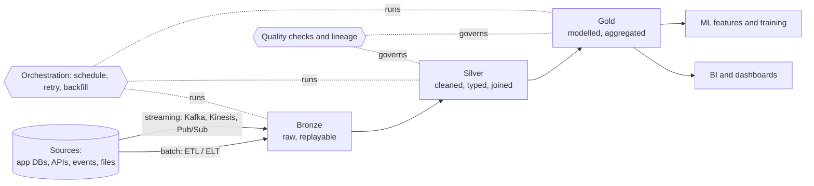

# Data engineering

Getting data from where it is produced to where it can be asked questions of, reliably and at a cost somebody approved. The databases topic covers where data *rests*; this one covers how it *moves*, what shape it arrives in, and how anyone knows it is right.

The shape nearly every data platform ends up with, whatever the vendor names. The dotted boxes are the two things that decide whether it is trusted: something that runs the steps in order, and something that checks the result.

---

## Learn

- [Warehouses, lakes, and lakehouses](../learn/concepts/warehouses-lakes-lakehouses.md) - the three storage answers, and what a table format adds
- [ETL vs ELT](../learn/concepts/etl-vs-elt.md) - why the transform moved after the load, and when it should not
- [Batch vs streaming](../learn/concepts/batch-vs-streaming.md) - event time, watermarks, and when streaming is not worth it
- [Data modeling for analytics](../learn/concepts/data-modeling-for-analytics.md) - star schemas, grain, slowly changing dimensions
- [File formats and partitioning](../learn/concepts/file-formats-and-partitioning.md) - Parquet, pruning, small files, and the bill
- [Data pipelines and orchestration](../learn/concepts/data-pipelines-and-orchestration.md) - DAGs, retries, backfills, the silent zero
- [Data quality and lineage](../learn/concepts/data-quality-and-lineage.md) - the assertions that catch a wrong number before a dashboard does
- [SQL vs NoSQL](../learn/concepts/sql-vs-nosql.md) - the operational stores most of this data is copied from
- [Queues vs streams](../learn/concepts/queues-vs-streams.md) - the transport underneath streaming pipelines
- [Eventual consistency](../learn/concepts/eventual-consistency.md) - why a replica read can disagree with the source
- [Idempotency explained](../learn/concepts/idempotency-explained.md) - the property that makes a retry or a backfill safe

---

## Compare

- [Databases (cloud-native)](../resources/service-comparison-databases.md) - BigQuery vs Redshift vs Synapse, and the operational stores
- [Messaging and queues](../resources/service-comparison-messaging-queues.md) - Kafka, Kinesis, Pub/Sub, Event Hubs, SQS
- [Vector databases](../resources/service-comparison-vector-databases.md) - the analytical store for embeddings
- [AI and ML services](../resources/service-comparison-ai-ml.md) - where the feature pipelines end up

---

## Reference

- [Architecture pattern: data pipeline / ETL](../resources/architecture-patterns/data-pipeline-etl.md)
- [Architecture pattern: lakehouse](../resources/architecture-patterns/lakehouse-architecture.md)
- [Architecture pattern: data mesh](../resources/architecture-patterns/data-mesh.md) - decentralized ownership, domain data products
- [Architecture pattern: CQRS and event sourcing](../resources/architecture-patterns/cqrs-event-sourcing.md)
- [Architecture pattern: event-driven architecture](../resources/architecture-patterns/event-driven-architecture.md)
- [Architecture pattern: AI/ML pipeline](../resources/architecture-patterns/ai-ml-pipeline.md)
- [Migration: database](../resources/migration-guides/database-migration.md)
- [Compliance guides](../resources/compliance-guides/) - GDPR and the rest, where lineage stops being optional

---

## Build

- [Build a data pipeline](../resources/hands-on-projects/build-data-pipeline.md) - ingestion through to a queryable table
- [Build a RAG pipeline](../resources/hands-on-projects/build-rag-pipeline.md) - the embedding-and-retrieval variant
- [Set up a monitoring stack](../resources/hands-on-projects/setup-monitoring-stack.md) - the observability half of the argument

---

## Certify

**Cloud data engineering**

- [AWS Data Engineer Associate (DEA-C01)](../exams/aws/associate/data-engineer-dea-c01/)
- [Azure Data Engineer (DP-203)](../exams/azure/dp-203/)
- [Azure Fabric Data Engineer (DP-700)](../exams/azure/dp-700/)
- [Azure Fabric Analytics Engineer (DP-600)](../exams/azure/dp-600/)
- [GCP Professional Data Engineer](../exams/gcp/data-engineer/)
- [AWS Data Analytics Specialty (DAS-C01)](../exams/aws/specialty/data-analytics-das-c01/) - retired, retained for credential holders

**Platform-specific**

- [Databricks Data Engineer Associate](../exams/databricks/data-engineer-associate/)
- [Databricks Data Engineer Professional](../exams/databricks/data-engineer-professional/)
- [Databricks Lakehouse Platform Administrator](../exams/databricks/lakehouse-platform-administrator/)
- [Snowflake SnowPro Core (COF-C02)](../exams/snowflake/snowpro-core/)
- [Snowflake SnowPro Advanced Data Engineer](../exams/snowflake/snowpro-advanced-data-engineer/)
- [Snowflake SnowPro Advanced Architect](../exams/snowflake/snowpro-advanced-architect/)
- [Confluent Certified Developer for Apache Kafka](../exams/confluent/certified-developer/)
- [Confluent Certified Administrator for Apache Kafka](../exams/confluent/certified-administrator/)

**Entry points and adjacent**

- [Azure Data Fundamentals (DP-900)](../exams/azure/dp-900/) - the cheapest way to check the vocabulary has landed
- [Power BI Data Analyst (PL-300)](../exams/azure/pl-300/) - the consumption end
- [Azure Database Administrator (DP-300)](../exams/azure/dp-300/)
- [GCP Cloud Database Engineer](../exams/gcp/cloud-database-engineer/)
- [NVIDIA Accelerated Data Science (NCP-ADS)](../exams/nvidia/accelerated-data-science-professional/)

---

## Roadmap

The ordered path through these is the **[Data Engineer roadmap](../resources/certification-roadmap-data-engineer.md)**. For the storage-administration side, see the **[Database Specialist roadmap](../resources/certification-roadmap-database-specialist.md)**; for cost control over the warehouse bill, **[FinOps](./finops.md)**.

Related topics: **[Databases](./databases.md)** for choosing a store per workload, **[AI/ML systems](./ai-ml-systems.md)** for what consumes the feature tables, and **[Observability](./observability.md)** for the monitoring discipline the quality checks borrow from.
