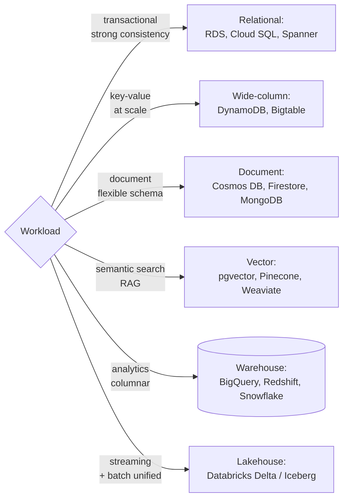

# Databases

SQL, NoSQL, vector databases, data warehouses, lakehouses. The choice is rarely "which database" - it's "which database for which workload."

---

## Learn

- [Eventual consistency](../learn/concepts/eventual-consistency.md) - CAP, when EC is fine, when it bites
- [Idempotency explained](../learn/concepts/idempotency-explained.md) - retries, idempotency keys, common patterns
- [Queues vs streams](../learn/concepts/queues-vs-streams.md) - SQS vs Kinesis (and equivalents), ordering, replay
- [Embeddings and vector search](../learn/concepts/embeddings-and-vector-search.md) - vector DB basics
- [Warehouses, lakes, and lakehouses](../learn/concepts/warehouses-lakes-lakehouses.md) - the analytical stores
- [Data modeling for analytics](../learn/concepts/data-modeling-for-analytics.md) - star schemas, grain, SCD types

For how data gets into these stores - pipelines, ETL/ELT, batch vs streaming, partitioning, quality - see the [Data engineering topic](./data-engineering.md).

---

## Compare

- [Databases (cloud-native)](../resources/service-comparison-databases.md) - RDS vs Cloud SQL vs SQL Database, DynamoDB vs Cosmos DB vs Firestore, BigQuery vs Redshift vs Synapse
- [Vector databases](../resources/service-comparison-vector-databases.md) - Pinecone, Weaviate, Qdrant, Milvus, pgvector, OpenSearch, Vertex Vector Search

---

## Reference

- [Architecture pattern: Data Pipeline / ETL](../resources/architecture-patterns/data-pipeline-etl.md)
- [Architecture pattern: Lakehouse](../resources/architecture-patterns/lakehouse-architecture.md)
- [Architecture pattern: Data Mesh](../resources/architecture-patterns/data-mesh.md)
- [Architecture pattern: CQRS / Event Sourcing](../resources/architecture-patterns/cqrs-event-sourcing.md)
- [Migration: database](../resources/migration-guides/database-migration.md)

---

## Build

- [Build a data pipeline](../resources/hands-on-projects/build-data-pipeline.md)
- [Build a RAG pipeline](../resources/hands-on-projects/build-rag-pipeline.md) - exercises pgvector

---

## Certify

**Cloud-side data certs**
- [AWS Data Engineer Associate (DEA-C01)](../exams/aws/associate/data-engineer-dea-c01/)
- [AWS Database Specialty (DBS-C01)](../exams/aws/specialty/database-dbs-c01/) - retired, retained for credential holders
- [AWS Data Analytics Specialty (DAS-C01)](../exams/aws/specialty/data-analytics-das-c01/) - retired, retained
- [Azure Data Engineer (DP-203)](../exams/azure/dp-203/)
- [Azure Database Administrator (DP-300)](../exams/azure/dp-300/)
- [Azure Cosmos DB Developer (DP-420)](../exams/azure/dp-420/)
- [Azure Fabric Analytics Engineer (DP-600)](../exams/azure/dp-600/)
- [Azure Fabric Data Engineer (DP-700)](../exams/azure/dp-700/)
- [GCP Data Engineer](../exams/gcp/data-engineer/)
- [GCP Cloud Database Engineer](../exams/gcp/cloud-database-engineer/)

**Vendor-specific**
- [Databricks Data Engineer Associate](../exams/databricks/data-engineer-associate/)
- [Databricks Data Engineer Professional](../exams/databricks/data-engineer-professional/)
- [Snowflake SnowPro Core](../exams/snowflake/snowpro-core/)
- [Snowflake SnowPro Advanced Architect](../exams/snowflake/snowpro-advanced-architect/)
- [Snowflake SnowPro Advanced Data Engineer](../exams/snowflake/snowpro-advanced-data-engineer/)
- [Snowflake SnowPro Advanced Administrator](../exams/snowflake/snowpro-advanced-administrator/)
- [MongoDB Associate Developer](../exams/mongodb/associate-developer/)
- [MongoDB Associate DBA](../exams/mongodb/associate-dba/)
- [MongoDB Associate Atlas Administrator](../exams/mongodb/associate-atlas-administrator/)
- [Confluent Certified Developer for Apache Kafka](../exams/confluent/certified-developer/)
- [Confluent Certified Administrator for Apache Kafka](../exams/confluent/certified-administrator/)

---

## Roadmap

Career paths live in the **[Data Engineer roadmap](../resources/certification-roadmap-data-engineer.md)** and **[Database Specialist roadmap](../resources/certification-roadmap-database-specialist.md)**.
