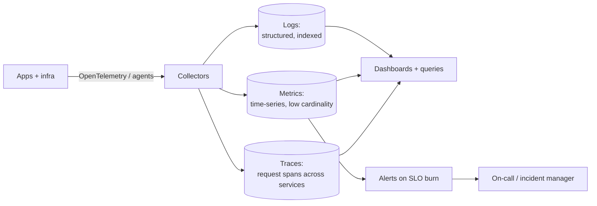

# Observability

Logs, metrics, traces. The three pillars that turn "production is broken" into "production is broken because the order-service p99 spiked at 14:32 after the deploy at 14:30."

---

## Learn

- [Observability basics](../learn/concepts/observability-basics.md) - the three pillars, golden signals, when to use which
- [Eventual consistency](../learn/concepts/eventual-consistency.md) - the failure modes you'll see in dashboards

---

## Compare

- [Observability and monitoring services](../resources/service-comparison-observability-monitoring.md) - CloudWatch vs Azure Monitor vs Cloud Operations, Datadog, New Relic
- [LLM observability](../resources/service-comparison-llm-observability.md) - LangSmith, Langfuse, Helicone, Phoenix, Braintrust

---

## Reference

- [Architecture pattern: Chaos engineering](../resources/architecture-patterns/chaos-engineering-patterns.md)
- [Troubleshooting: AWS](../resources/troubleshooting/aws-troubleshooting.md)
- [Troubleshooting: Azure](../resources/troubleshooting/azure-troubleshooting.md)
- [Troubleshooting: GCP](../resources/troubleshooting/gcp-troubleshooting.md)
- [Troubleshooting: Kubernetes](../resources/troubleshooting/kubernetes-troubleshooting.md)

---

## Build

- [Set up a monitoring stack](../resources/hands-on-projects/setup-monitoring-stack.md) - Prometheus, Grafana, alerting end-to-end
- [Set up an eval harness](../resources/hands-on-projects/set-up-eval-harness.md) - LLM-side observability and regression detection

---

## Certify

**Operations and SRE**
- [AWS CloudOps Engineer (SOA-C03)](../exams/aws/associate/cloudops-engineer-soa-c03/)
- [AWS DevOps Engineer Professional (DOP-C02)](../exams/aws/professional/devops-engineer-pro-dop-c02/)
- [Azure DevOps Engineer Expert (AZ-400)](../exams/azure/az-400/)
- [GCP Cloud DevOps Engineer](../exams/gcp/cloud-devops-engineer/)
- [IBM Cloud Site Reliability Engineer](../exams/ibm/cloud-site-reliability-engineer/)

**Kubernetes ops**
- [Prometheus Certified Associate (PCA)](../exams/kubernetes/pca/)
- [CKA - Certified Kubernetes Administrator](../exams/kubernetes/cka/)

**Platform / Linux**
- [Linux Foundation LFCS](../exams/linux-foundation/lfcs/)
- [Red Hat RHCSA (EX200)](../exams/redhat/rhcsa-ex200/)

**LLM observability** appears in:
- [Anthropic Claude Developer Foundations cert](../exams/anthropic/claude-certified-developer-foundations/)
- [NVIDIA AI Operations Professional](../exams/nvidia/ai-operations-professional/)

---

## Roadmap

The operational view lives in **[DevOps/SRE roadmap](../resources/certification-roadmap-devops-sre.md)** and **[Platform Engineer roadmap](../resources/certification-roadmap-platform-engineer.md)**.
