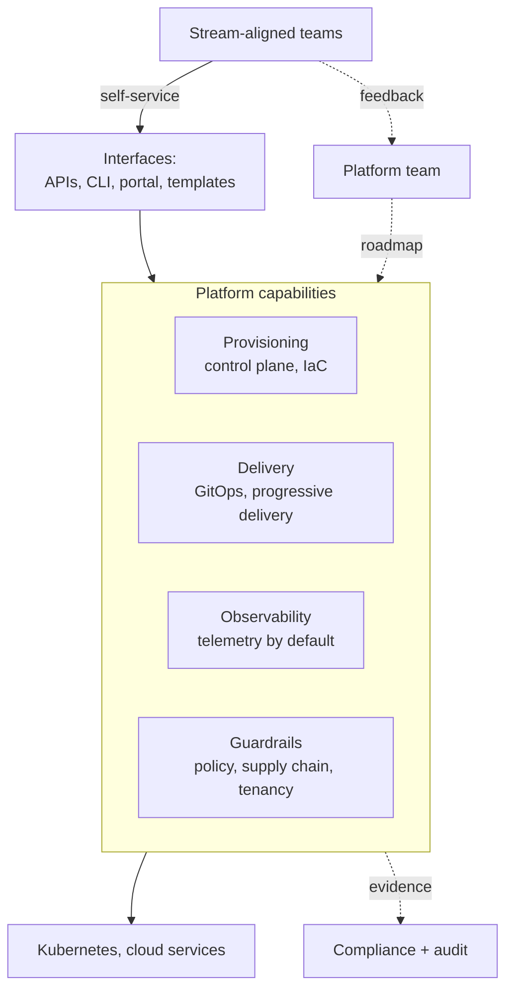

# Platform engineering

Building an internal platform as a product: golden paths, self-service APIs, guardrails, and the measurement that tells you whether any of it helped. The point is not more capability, it is **less cognitive load** for the teams using it.

The feedback arrow is the one that matters. A platform nobody adopts voluntarily has failed, whatever its technical quality.

---

## Learn

- [CI/CD explained](../learn/concepts/cicd-explained.md) - the delivery layer platforms automate
- [Terraform explained](../learn/concepts/terraform-explained.md) - infrastructure as code
- [Kubernetes in 10 minutes](../learn/concepts/kubernetes-in-10-minutes.md) - the substrate most platforms build on
- [Deployment strategies](../learn/concepts/deployment-strategies.md) - rolling, blue-green, canary
- [Autoscaling explained](../learn/concepts/autoscaling-explained.md) - capacity as a platform capability
- [Observability basics](../learn/concepts/observability-basics.md) - what the platform should provide by default
- [Secrets management](../learn/concepts/secrets-management.md) - a capability every platform must solve once

---

## Reference

- [Architecture patterns](../resources/architecture-patterns/) - the designs platforms encode as golden paths
- [Zero trust architecture](../resources/architecture-patterns/zero-trust-architecture.md) - the identity model tenants sit inside
- [Cell-based architecture](../resources/architecture-patterns/cell-based-architecture.md) - blast radius reduction at scale
- [Service comparison: DevOps and CI/CD](../resources/service-comparison-devops-cicd.md)
- [Kubernetes troubleshooting](../resources/troubleshooting/kubernetes-troubleshooting.md)
- [AI security](../resources/ai-security/) - the guardrails an AI-era platform now needs

---

## Build

- [Build a CI/CD pipeline](../resources/hands-on-projects/build-ci-cd-pipeline.md)
- [Set up a Kubernetes cluster](../resources/hands-on-projects/kubernetes-cluster-setup.md)
- [Build infrastructure with Terraform](../resources/hands-on-projects/terraform-infrastructure.md)
- [Set up a monitoring stack](../resources/hands-on-projects/setup-monitoring-stack.md)
- [Implement zero trust](../resources/hands-on-projects/implement-zero-trust.md)

---

## Certify

**The platform discipline itself**
- [CNPA - Cloud Native Platform Engineering Associate](../exams/kubernetes/cnpa/) - the vendor-neutral certification for this role

**The layers a platform assembles**
- [CGOA - Certified GitOps Associate](../exams/kubernetes/cgoa/) - the delivery model
- [CAPA - Certified Argo Project Associate](../exams/kubernetes/capa/) - Argo CD, Workflows, Rollouts, Events
- [OTCA - OpenTelemetry Certified Associate](../exams/kubernetes/otca/) - observability as a capability
- [CCA - Cilium Certified Associate](../exams/kubernetes/cca/) - the networking and policy datapath
- [CKA](../exams/kubernetes/cka/) and [CKS](../exams/kubernetes/cks/) - operating and securing the substrate
- [HashiCorp Terraform Associate](../exams/hashicorp/terraform-associate/) - infrastructure as code
- [GitHub Actions](../exams/github/actions/) - pipeline automation

**Cloud-specific platform work**
- [AWS DevOps Engineer Professional](../exams/aws/professional/devops-engineer-pro-dop-c02/)
- [Azure DevOps Engineer Expert (AZ-400)](../exams/azure/az-400/)
- [GCP Cloud DevOps Engineer](../exams/gcp/cloud-devops-engineer/)

---

## Roadmap

The full path is in **[Platform Engineer roadmap](../resources/certification-roadmap-platform-engineer.md)**. The adjacent view is **[DevOps/SRE roadmap](../resources/certification-roadmap-devops-sre.md)**.
